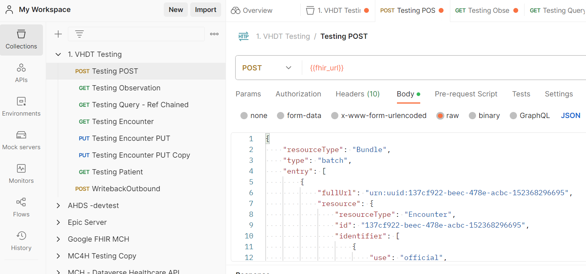
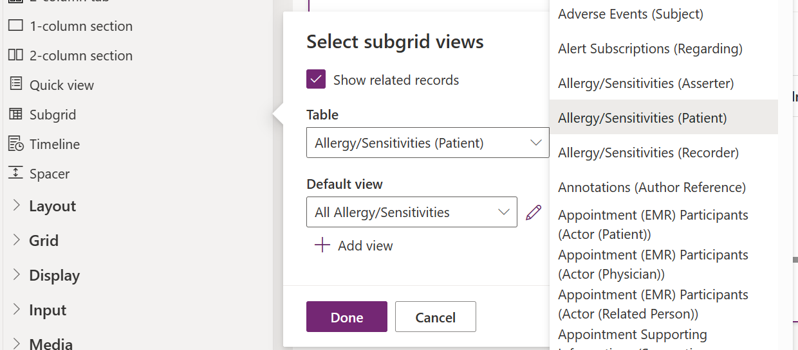
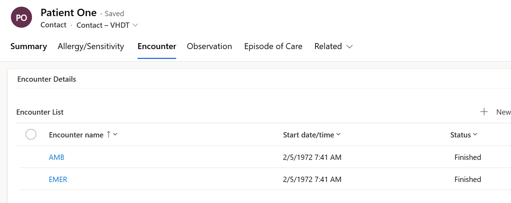
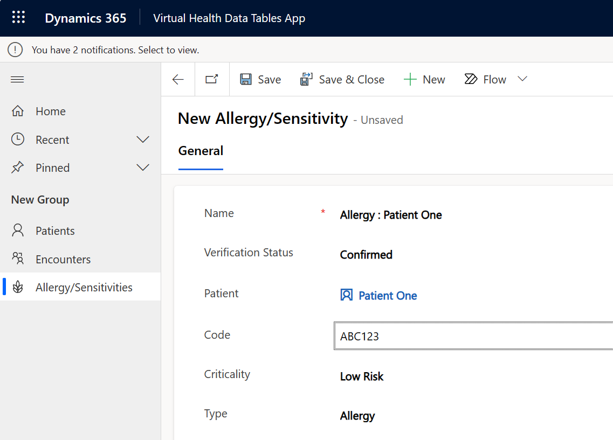
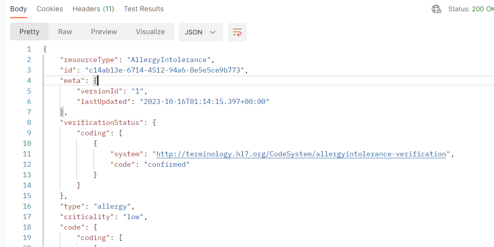
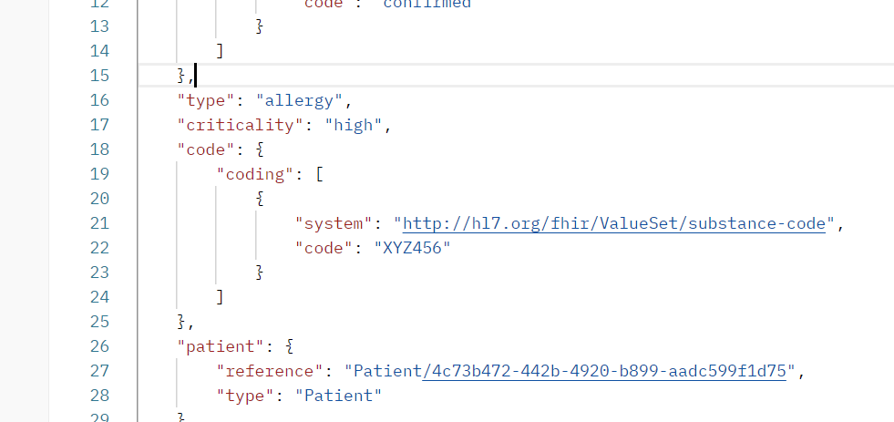
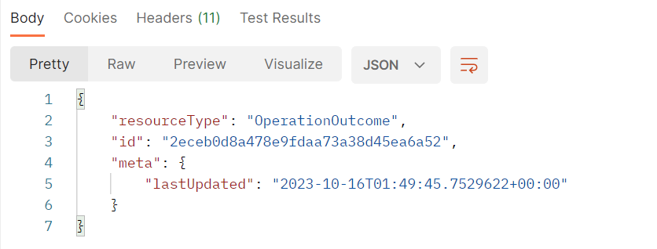

Your patient record is saved in Dataverse and connected to a record in the Azure Health Data Services FHIR service. Connecting your record demonstrates how you can use your new application to manage persisted data in Dataverse and remote FHIR services.

In this exercise, you post FHIR data for encounters and observations that's related to your patient directly to the FHIR services. As a result, you can demonstrate that the data is accessible through Dataverse in your new model-driven application. After the data is linked to the patient, you also demonstrate how to modify remote FHIR services data from within your Dataverse model-driven application.

## Prerequisites
To complete the steps in this exercise, you need to meet the following prerequisites:

-   Microsoft Cloud for Healthcare Trial with Data integration toolkit installed

    For more information, see [Microsoft Cloud for Healthcare training environment preparation](/training/modules/training-environment-preparation-healthcare/?azure-portal=true).

-   System Administrator rights are granted for the user on a Microsoft Power Platform environment

-   Azure Health Data Services FHIR service is set up and accessible

-   Azure Logic Apps is set up with the corresponding Microsoft Azure Blob Storage account container

-   The following FHIR bundle samples are downloaded:

    -   [Exercise-Patient-Pract-Location-VHDT_APIs.json](https://github.com/MicrosoftDocs/mslearn-developer-tools-power-platform/tree/master/healthcare-cloud)

    -   [Exercise-Enc-Obs-FHIRServerOnly.json](https://github.com/MicrosoftDocs/mslearn-developer-tools-power-platform/tree/master/healthcare-cloud)

## Post new encounter and observation records to the FHIR server

To demonstrate that data isn't being persisted in Dataverse and only on the FHIR server, you can send FHIR bundles directly to the FHIR server.

### Validate only patient data in Dataverse

After you post a new patient, validate that no related records are added to Dataverse.

1.  Go to your model-driven app and open the patient record for **Patient One**.

1.  Change the form to the new form that you created in the [previous exercise](/training/modules/healthcare-interoperability-build-application/exercise-main-form): **Contact - VHDT**. Complete this task by using the selector beneath the name in the header.

1.  Switch tabs to **Encounter** in the upper part of the form. Because the patient has no related **Encounters**, your subgrid should be empty.

1.  Switch to the **Observation** tab. Notice that the same result shows.

### Post new encounter and observation FHIR data

The patient record that you posted to Dataverse includes the related FHIR identifier. You can post the **Observation** and **Encounter** records that are related to the **Patient One** FHIR resource.

1.  Use Postman to post a new FHIR bundle that contains **Encounter** and **Observation**.

	> [!NOTE]
	> This step assumes that you've already completed the setup of Postman and have validated connectivity by following the steps in the [previous exercise](/training/modules/healthcare-interoperability-build-application/exercise-prerequisites-settings).

1.  Open a new request in the workspace that you created in the [previous exercise](/training/modules/healthcare-interoperability-build-application/exercise-prerequisites-settings).

1.  Set the request type to **POST**, and then set the URL to the base URL of your **FHIR service**.
   
    >[!NOTE]
    > Don't include other parameters to ensure that the **Bundle** resource is processed.

1.  In the **Body** section, set the type to **raw** and set **JSON** as the format.

1.  In the text box, add the JSON of the bundle from the **Exercise-8-Enc-Obs-FHIRServerOnly.json** sample.

	> [!div class="mx-imgBorder"]
	> 

1.  Acquire a new token and then select it. Select **Send**.

1.  Go to your model-driven app and open the new patient record for **Patient One**.

1.  In the **Encounters** tab, select **Refresh** from the **Encounters** subgrid. A message displays stating that **No Encounter data for the Patient One record is available**.

1.  Switch to the **Observation** tab, which shows the same message, that no **Observation** records are available for **Patient One**.

### Edit the encounter and observation data routes

Now, you can change the data route records to route the data for virtual tables to source data from the **FHIR server**.

1.  Go to the **Data Integration Toolkit** application.

1.  Select the **Data Routes** section from the left navigation pane.

1.  Open the **Data Route** for **Encounter**, whose **Routing Entity** is listed as *msemr_ve_encounter*.

1.  Update the **Data Provider to Use** value as **Virtual**.

1.  At the **Data Provider Change Confirmation**, select **Confirm Change**.

	> [!div class="mx-imgBorder"]
	> 

	> [!NOTE]
	> The **Data Provider Change Confirmation** message informs the administrator user that the movement of data between the FHIR service and/or Dataverse is left to the customer. Microsoft Cloud for Healthcare doesn't automatically update or delete data in either system.

1.  For the **Entity Map to Use** field, select the **Entity Map** for **Encounter**, named *msemr_encounter <-\> Encounter*.

1.  Select **Save & Close**.

1.  Complete the previous steps for the **Data Route** for **Observation**. For the **Entity Map to Use** field value, select *msemr_observation <-\> Observation*.

1.  Select **Save & Close**.

1. Complete the same steps for the **Data Route** for **Allergy Intolerance**. For the **Entity Map to Use** field value, select *msemr_allergyintolerance <-\> AllergyIntolerance*.

1. Select **Save & Close**.

### View the encounter and observation records

The **Data Route** records are changed to pull data from the FHIR service. Now, you can view the data from within your new **Patient** form.

1.  Go to your model-driven app and open the new patient record for **Patient One**.

1.  View the **Encounters** tab and then select **Refresh** from the **Encounters** subgrid.

1.  Refresh the **Encounter** subgrid. The **Encounter** data that's sent by Postman for the **Patient One** record is now available.

	> [!div class="mx-imgBorder"]
	> 

1.  Open the **Observations** tab and refresh the grid. The **Observation** data that's sent by Postman for the **Patient One** record is now available.

## Perform create and update operations for allergy/sensitivity

Virtual health data tables supports create, update, and delete operations. As a result, you can perform operations from within Dataverse that are posted directly to the FHIR service.

### Create a new allergy/sensitivity record
To create a new allergy/sensitivity record, follow these steps:

1.  Go to your model-driven app and select **Allergy/Sensitivities** in the left navigation pane.

1.  From the available tools in the **Allergy/Sensitivities** grid, select **New**.

1.  In the new **Allergy/Sensitivities** form, enter values from the following table.

	|     Field                  |     Value                    |
	|----------------------------|------------------------------|
	|     Name                   |     Allergy: Patient One    |
	|     Verification Status    |     Confirmed                |
	|     Patient                |     Patient One              |
	|     Code                   |     ABC123                   |
	|     Criticality            |     Low Risk                 |
	|     Type                   |     Allergy                  |

1.  Select **Save**.

	> [!div class="mx-imgBorder"]
	> 

1.  After the record saves, copy the new record ID from the browser URL.

1.  From the address bar, copy the GUID value following the ID parameter in the URL, for example, the trailing portion of the URL: **&etn=msemr_ve_allergyintolerance&ID=*c14ab13e-6714-4512-94a6-8e5e5ce9b773**

### Use Postman to view the new record on the FHIR server
In this task, you use Postman to view the new record on the FHIR server by following these steps:

1.  While using Postman, retrieve the new **Allergy/Sensitivity** record on the **FHIR service**.

1.  Open a new request in the workspace that you created in the [previous exercise](/training/modules/healthcare-interoperability-build-application/exercise-prerequisites-settings).

1.  Set the request type to **GET**, and then set the URL to the base URL of your **FHIR service**.

1.  After the base FHIR URL, include the name of the FHIR resource and the new ID, for example **/AllergyIntolerance/c14ab13e-6714-4512-94a6-8e5e5ce9b773**.

1.  Acquire a new token and then select it. Select **Send**.

The results pane should show the FHIR resource that represents the new **Allergy/Sensitivity** record that you created in the Dataverse form.

> [!div class="mx-imgBorder"]
> 

The **FHIR ID** value should be the same as the ID that you copied from the Dataverse URL.

The **meta** field for **versionId** should be **1**, and the **lastUpdated** value should be the date and time that you created the **Allergy/Sensitivity** record in Dataverse in UTC time.

### Update or delete the **Allergy/Sensitivity** record in Dataverse and then validate in Postman
In this task, you'll update or delete the **Allergy/Sensitivity** record in Dataverse, and then you'll validate in Postman.

1.  Go to your model-driven app to the new **Allergy/Sensitivity** record that you created.

1.  Update the **Code** field value to **XYZ456**, and then change **Criticality** to **High Risk**.

1.  Select **Save**.

1.  In the previous Postman request, select **Send** again.

    In the results pane, the updated FHIR resource displays.

    The meta fields for **versionId** and **lastUpdated** should also show as updated.

    The **Allergy/Sensitivity** field values for code and criticality should also be updated to reflect the new values that you entered in Dataverse.

	> [!div class="mx-imgBorder"]
	> 

1.  In the model-driven app, go to the new **Allergy/Sensitivity** record that you updated.

1. Select **Delete**.

1. In the previous Postman request, select **Send** again.

   The results pane should show only an **OpertionOutcome** resource and no **Allergy/Sensitivity** record.

	> [!div class="mx-imgBorder"]
	> 

You can repeat these steps and use your own bundles of FHIR data for the available virtual tables, as listed in the **Data Routes** feature.

In this exercise, you observed the virtual health data tables in action in your new model-driven application. You created a new patient record in the FHIR server and Dataverse, and you also displayed related records that are only persisted on the FHIR service. Additionally, with virtual health data tables, you updated the record to remote data from within the Dataverse application.
