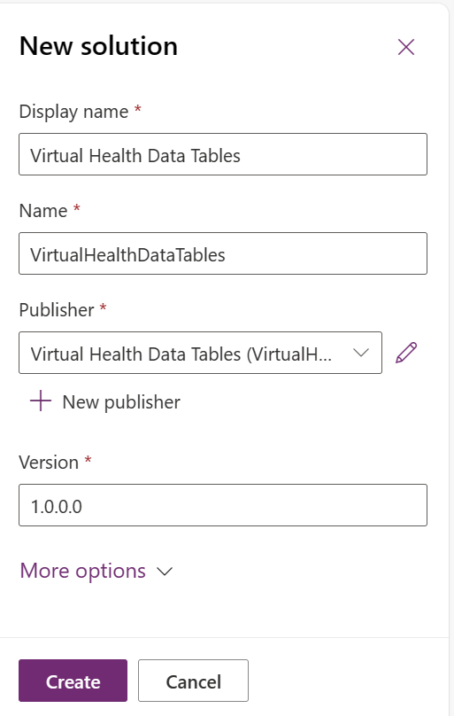

In this exercise, you'll create a new solution in the Power Apps maker portal and add the relevant Dataverse objects. This solution provides you with the workspace and objects needed to create a new model-driven app with virtual health data tables.

## Prerequisites
To complete the steps in this exercise, you need to meet the following prerequisites:

-   Microsoft Cloud for Healthcare Trial with the Data integration toolkit installed

    For more information, see [Microsoft Cloud for Healthcare training environment preparation](/training/modules/training-environment-preparation-healthcare/?azure-portal=true).

-   System Administrator rights are granted for the user on a Microsoft Power Platform environment

## Create the publisher

In this task, you'll create your own publisher, which helps you uniquely identify your application and new components that you create.

1.  Go to [Power Apps](https://make.powerapps.com/?azure-portal=true).

1.  Select the environment.

	> [!div class="mx-imgBorder"]
	> 

1.  Select **Solutions** on the left navigation pane and then select **+ New solution**.

	> [!div class="mx-imgBorder"]
	> 

1.  Select **New publisher** and then enter the publisher details as follows:

	-   **Display name** - Virtual Health Data Tables
	
	-   **Name** - VirtualHealthDataTables
	
	-   **Description** - Sample application using Virtual Health Data Tables
	
	-   **Prefix** - vhdt

	> [!div class="mx-imgBorder"]
	> 

1.  Select **Save**.

## Create the solution 

The solution provides you with a collection of the components that you use when creating your new model-driven application. The solution also provides a method for versioning and deployment between environments.

1.  In the **New solution** panel, select the **New solution** and then enter details as follows:

	-   **Display name** - Virtual Health Data Tables
	
	-   **Name** - VirtualHealthDataTables
	
	-   **Publisher** - Virtual Health Data Tables(VirtualHealthDataTables)
	
	> [!div class="mx-imgBorder"]
	> 

1.  Select **Create**.

## Add tables to the solution

In this task, you'll add tables to the solution that you can use and update as part of the application.

1.  From the upper toolbar, select **Add existing** and then select **Table**.

	> [!div class="mx-imgBorder"]
	> 

1.  In the **Add existing tables** panel, search for and select the **Contact** table. Select **Next**.

	> [!div class="mx-imgBorder"]
	> 

1.  In the **Selected tables** panel, select **Include all objects**. This step selects **Include table metadata** and turns off the option.

	> [!div class="mx-imgBorder"]
	> 

1.  Select **Add** to complete the step.

1.  Select **Add existing** and then select **Table**. 

1. In the **Add existing tables** panel, search for the **msemr_ve_encounter** table. Select **all available** tables and then select **Next**.

	> [!div class="mx-imgBorder"]
	> 

1.  In the **Selected tables** panel, select **Include all objects** for all tables in the list.

1.  Select **Add**.

1.  Repeat the previous steps for the following search values:    

	-   msemr_ve_observation
	
	-   msemr_ve_allergy
	
	-   msemr_ve_episode

The solution should contain the Contact table, which represents the patient in the system. Additionally, it should contain several virtual tables that represent data that's related to the patient, all aligning to corresponding FHIR resources.

Virtualized tables that you use in virtual health data tables mirror their standard table counterparts. Also, the logical names follow a naming convention of including **\_ve\_** as part of the prefix. For example, the virtual version of Encounter has the logical name of **msemr_encounter**, while the virtual version is named **msemr_ve_encounter**. Each related expansion table follows the same naming convention.

Now that the tables are added to the solution, you can start to build the model-driven app.
