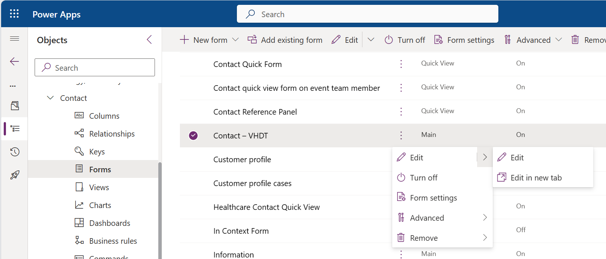
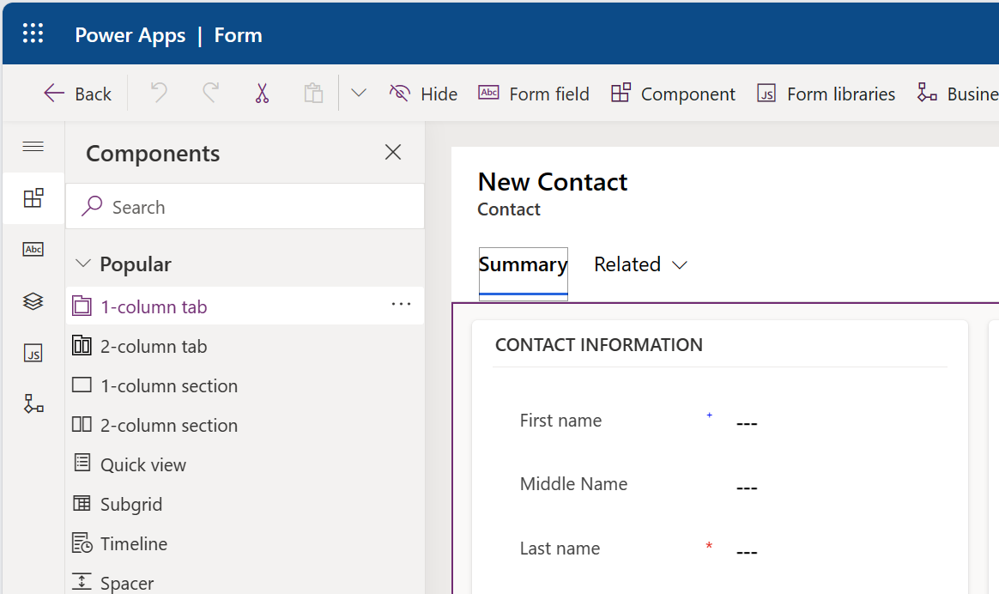
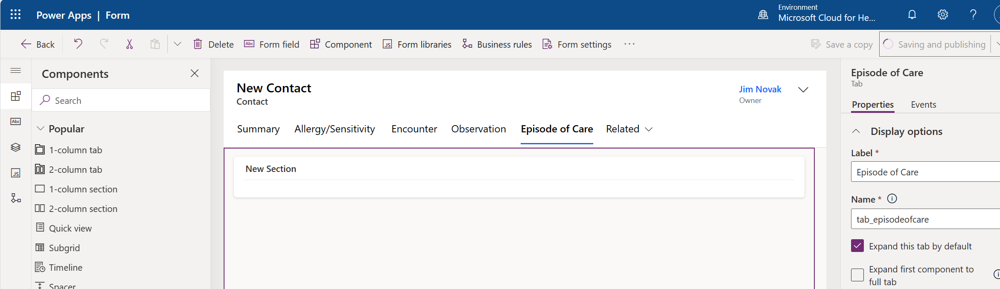
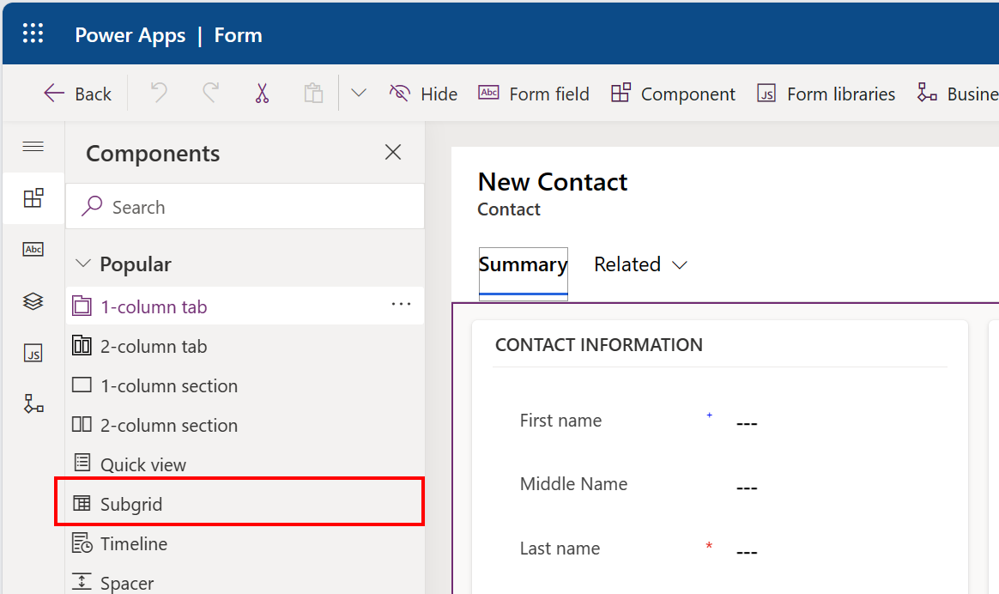
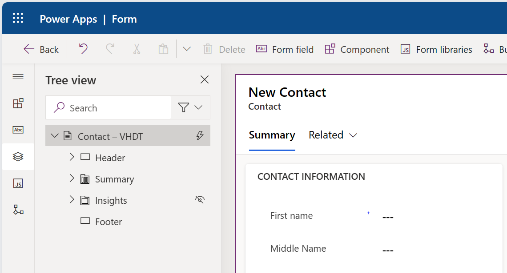
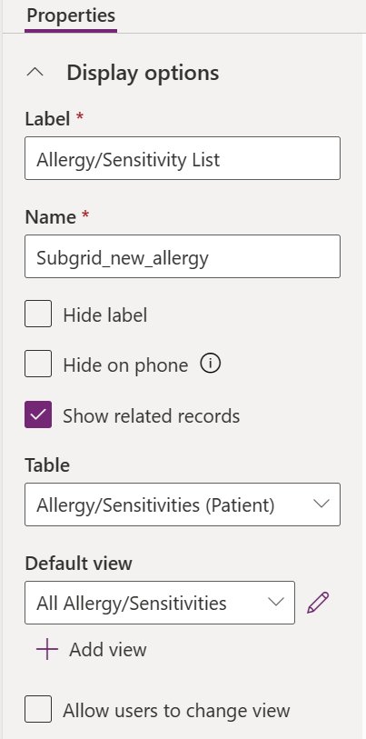
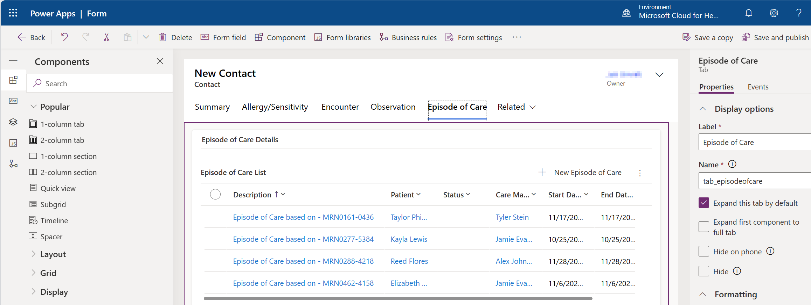

After you have a new Main form for the Contact table, you can add a new tab for each virtual table in your solution. On this tab, you can display data that's related to a contact that resides in Dataverse while all related data resides in the FHIR service.

## Prerequisites
To complete the steps in this exercise, you need to meet the following prerequisites:

-   Microsoft Cloud for Healthcare Trial with Data integration toolkit installed

    For more information, see [Microsoft Cloud for Healthcare training environment preparation](/training/modules/training-environment-preparation-healthcare/?azure-portal=true).

-   System Administrator rights are granted for the user on a Microsoft Power Platform environment

## Add new tabs
Your first task in this exercise is to add the new tabs by following these steps:

1.  Open the **Virtual Health Data Tables (VirtualHealthDataTables)** solution.

1.  In the left navigation pane, go to the **Tables** section and then select the **Contact** table.

1.  Expand the **Contact** options and then select **Form** to view the available forms.

1.  Select the new **Contact - VHDT** form that you created in the previous exercise [Add a new Main form for the Patient table](/training/modules/healthcare-interoperability-build-application/exercise-main-form).

1.  Select the ellipsis (**...**) menu next to the form name and then select **Edit in new tab**.

	> [!div class="mx-imgBorder"]
	> 

1.  From the Forms designer tools, select **Component** to view the list of available components to add.

1.  From the **Components** list, select **1-column tab**.

	> [!div class="mx-imgBorder"]
	> 

1.  On the **New Tab** pane on the right, enter the details about the tab. For this first new tab, enter the following values.

	|     Label                  |     Name           |
	|----------------------------|--------------------|
	|     Allergy/Sensitivity    |     tab_allergy    |

1.  Repeat the previous steps to enter the following sets of values for the remaining tabs:

	|     Label                |     Name                  |
	|--------------------------|---------------------------|
	|     Encounter            |     tab_encounter         |
	|     Observation          |     tab_   observation    |
	|     Episode   of Care    |     tab_episodeofcare     |

1. Update the default section for each tab to match the tab contents.

1. Select the **Allergy/Sensitivity** tab and then select the default section.

1. In the **Section** details pane, update the details with the following information:

	|     Label                            |     Name                        |
	|--------------------------------------|---------------------------------|
	|     Allergy/Sensitivity   Details    |     tab_allergy_section_main    |

1. Repeat the previous steps to enter the following default section for the remaining tabs:

	|     Label                        |     Name                               |
	|----------------------------------|----------------------------------------|
	|     Encounter   Details          |     tab_encounter_section_main         |
	|     Observation   Details        |     tab_   observation_section_main    |
	|     Episode   of Care Details    |     tab_episodeofcare_section_main     |

   Your updated form should now contain the new tabs with unique labels and names, each with a default section.

	> [!div class="mx-imgBorder"]
	> 

1. Select **Save and publish** on the Forms designer tools.

## Add the subgrids to each tab

Your next task is to update the tabs and display the virtual data.

1.  Select the **Allergy/Sensitivity** tab and then select the default section.

1.  From the Forms designer tools, select **Component** to view the list of available components to add.

1.  Select **Subgrid** from the **Components** list.

	> [!div class="mx-imgBorder"]
	> 

1.  In the **Select subgrid views** dialog, select **Show related records**.

1.  In the **Tables selector**, expand the list and then select **Allergy/Sensitivities (Patient)** from the list. Select **All Allergy/Sensitivities** for the **Default view**.

	> [!div class="mx-imgBorder"]
	> 

1.  After the subgrid is added, verify the settings. For **Allergy/Sensitivity**, the following values should display. Notice that **Show related records** is selected and that the table shows the name of the relationship between **Allergy/Sensitivity** and **Patient**.

	> [!div class="mx-imgBorder"]
	> 

1.  In the **New Subgrid** pane to the right, enter details about the newly added subgrid. For this first new tab, enter the following values.

	|     Label                         |     Name                   |     View                         |
	|-----------------------------------|----------------------------|----------------------------------|
	|     Allergy/Sensitivity   List    |     Subgrid_new_allergy    |     All Allergy/Sensitivities    |

1.  Repeat the previous steps with the following set of values for the remaining subgrids:

	|     Table                                    |     Label                     |     Name                         |     View                  |
	|----------------------------------------------|-------------------------------|----------------------------------|---------------------------|
	|     Encounters   (msemr_ve_encounter)        |     Encounter   List          |     Subgrid_new_encounter        |     All   Encounters      |
	|     Observations   (msemr_ve_observation)    |     Observation   List        |     Subgrid_new_observation      |     All   Observations    |
	|     Episodes   of Care                       |     Episode of   Care List    |     Subgrid_new_episodeofcare    |     Episodes of   Care    |

    The updated form contains the tabs with a single section and subgrid that displays a distinct set of data.

    > [!div class="mx-imgBorder"]
    > 

1.  Select **Save and publish** from the Forms designer tools.

The new **Contact** form for **Patient** now displays patient record data that resides in Dataverse. Additionally, it includes tabs for related records that show virtual tables where you can store the data in a remote FHIR server.
