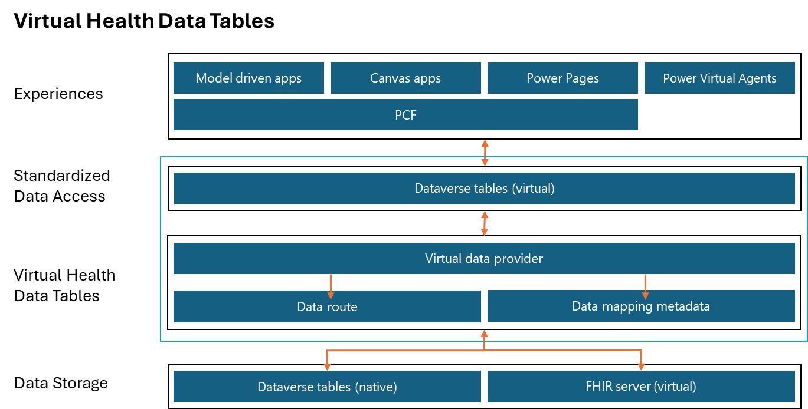

Microsoft Dataverse is a key element of Microsoft Power Platform, helping professional and citizen developers create data-centric, line-of-business applications. In the Microsoft Power Apps maker portal for model-driven apps, builders can start with data first, build their relational data model, and then connect business processes for their users.

Dataverse offers a built-in data store for persisting system records, but it might not be the only place where customers want to persist and access their data. For example, customers might want to access data from a SQL server from within their application because mapping and syncing this data can be complicated. To connect these technologies for customers, Dataverse offers virtual data tables.

In healthcare, enterprise systems often require integration with various systems, and Health Level Seven (HL7) Fast Healthcare Interoperability Resources (FHIR) offers a standard for data structures and exchange. Microsoft offers virtual health data tables, an extension of the virtual tables feature, so that healthcare customers can connect directly to FHIR services from within Dataverse.

## Virtual health data tables

Virtual health data tables in Microsoft Cloud for Healthcare help you virtualize your clinical reference data and other healthcare data when you're using model-driven apps and other engagement solutions. With this feature, you can virtualize your data, removing the need for building expensive integrations that visualize the same data-intensive tables multiple times across Microsoft and other applications, such as electronic health record (EHR) systems. Virtual health data tables take the best of the [Microsoft Dataverse virtual tables (entities)](/power-apps/developer/data-platform/virtual-entities/get-started-ve/?azure-portal=true) solution and layer it on top of a data routing concept so that you can establish data routes for your tables or entities.

Dataverse virtual tables have limitations. One limitation is that you can't convert an existing physical table to a virtual one or vice versa. This scenario results in the creation of new tables and requires you to reconstruct Dataverse applications to use the new table structure when you're switching between virtual and physical tables. Another challenge is that, after you virtualize a table, users have two tables to choose from when they're creating saved views and advanced finds.

To solve this challenge, you can use virtual health data tables to establish data routes for your tables or entities.

> [!div class="mx-imgBorder"]
> 

The architecture in the preceding diagram illustrates the working of virtual health data tables. The lower part of the stack contains the data storage system, such as the Dataverse entities, which are native to Microsoft Cloud for Healthcare solutions. It also includes the FHIR server, which is virtual. Virtual health data tables use the Data route and Data mapping metadata components of the virtual data provider to switch between Dataverse and the FHIR server as data storage. The virtual entities in Dataverse use the Virtual data provider infrastructure to show information on the apps.

For more information, see [Overview of virtual health data tables](/dynamics365/industry/healthcare/virtual-health-data-tables-overview/?azure-portal=true).

## Scenario

For the scenario in this module, you turn on and then use virtual health data tables to build hybrid applications around FHIR data. Additionally, you plan to persist some data in Dataverse while keeping other related information on the FHIR server.

In this module, you practice the process of building a model-driven app that displays patient records in Dataverse that show related data, in real time, from the connected FHIR service. Additionally, with virtual health data tables, you can update the FHIR records directly from within your new Dataverse application.

## Personas

The following personas complete the exercises in this module:

- **Microsoft Power Platform makers** - These personas are familiar with Microsoft Power Platform and Dataverse.

   -   **Citizen developers** - Power users who can set up and customize Microsoft Power Platform solutions by using Microsoft Power Platform tooling.

   -   **Professional developers** - Personas who can extend Microsoft Power Platform solutions by code, past customizations that were completed by using Microsoft Power Platform tooling.

- **Healthcare administrators** - Personas who might own FHIR services and want to build applications that connect.

## Prerequisites
Before beginning this module, make sure that you meet the following prerequisites:

-   **Provision Microsoft Azure Health Data Services** - You need to provision and make Azure Health Data Services available as mentioned in the *Explore integration and interoperability in Microsoft Cloud for Healthcare - Set up Azure Health Data Services* module.

-   **Set up patients to flow into Dataverse by using the Data integration toolkit** - By using the Healthcare APIs, you should sync a patient or two.

    -   Deploy Microsoft Azure Logic Apps by using the Data Ingestion ARM template.

    -   Set up the managed identity in Data integration toolkit.

-   **Switch the data routes to virtual** - Select the virtual tables to turn on.

-   **Post some sample data** - FHIR bundles (sample date) are provided. 

For more information, see *Explore integration and interoperability in Microsoft Cloud for Healthcare - Introduction*.

## Required tools and solutions

The following tools and solutions are required for virtual health data tables: 

-   **Microsoft Power Platform** - Microsoft Cloud for Healthcare trial with Data integration toolkit installed

-   **Azure Health Data Services** - Instance of FHIR services

-   **Postman (or similar)** - Tools for directly posting data to FHIR services

For more information, see the following documentation:

- [Supported features](/dynamics365/industry/healthcare/virtual-health-data-tables-overview?toc=%2Findustry%2Fhealthcare%2Ftoc.json&bc=%2Findustry%2Fbreadcrumb%2Ftoc.json#supported-features)

- [Virtual health data table events](/dynamics365/industry/healthcare/virtual-health-data-tables-overview?azure-portal=true#virtual-health-data-table-events)

- [Virtualized tables](/dynamics365/industry/healthcare/virtual-health-data-tables-overview?azure-portal=true#virtualized-tables)

