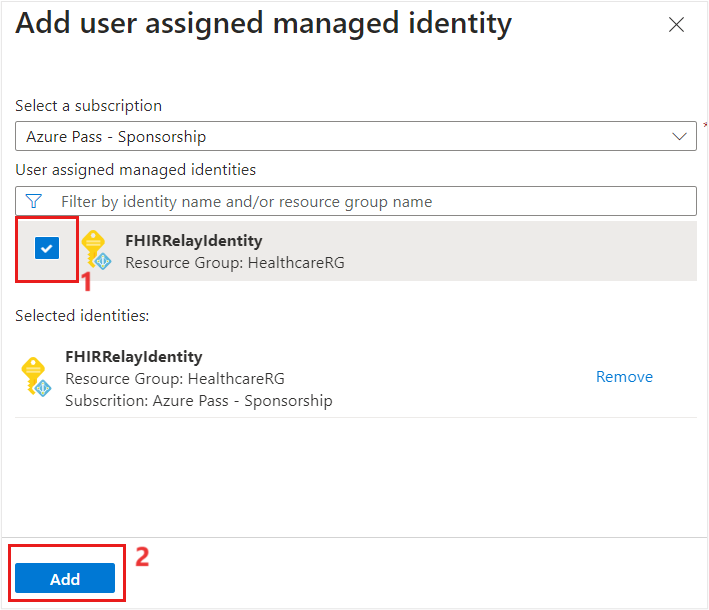
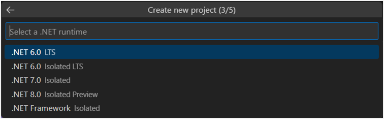
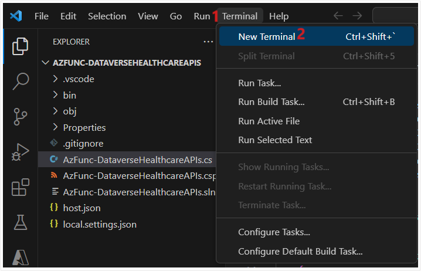
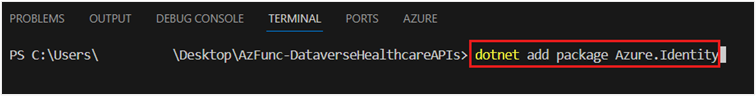

In this exercise, you create a function from Microsoft Azure Functions by using .NET 6 as runtime to call Dataverse Healthcare APIs to create a new patient record in Dataverse.

## Prerequisites
Make sure that you meet the following prerequisites before starting this exercise:

- Good understanding of .NET development.

- [Visual Studio Code](https://code.visualstudio.com/download/?azure-portal=true) is downloaded and installed.

- [Azure Functions Core Tools](https://github.com/Azure/azure-functions-core-tools/?azure-portal=true) is downloaded and installed.

> [!NOTE]
> For this exercise, all Azure resources are provisioned in the East US region.

> [!TIP]
> To complete this exercise, make sure that you create all Azure resources in the same subscription and resource group unless otherwise stated.

## Create a function from Azure Functions

In this task, you create a function from Azure Functions to call Dataverse Healthcare API to post the FHIR bundle to create a patient resource (**Contact**) in Dataverse.

1.  While you're signed in to your Microsoft 365 tenant, open a new tab, and then go to the [Azure portal](https://portal.azure.com/?azure-portal=true).

1.  Search for the string **Function App** in the search box.

1.  Select **Function App** under the **Services** section.

	> [!div class="mx-imgBorder"]
	> [](../media/function-app.png#lightbox)

1.  On the **Function App** page, select **Create**.

	> [!div class="mx-imgBorder"]
	> [](../media/create-button.png#lightbox)

1.  On the **Create Function App** page, enter the following settings:

    - **Subscription** - Select the subscription that you chose in the previous unit.

    - **Resource Group** - Select the resource group that you chose in the previous unit.

    - **Function App name** - AzFunc-DataverseHealthcareAPIs (If the name isn't available, append it with a number)

    - **Do you want to deploy code or container image?** - Code

    - **Runtime stack** - .NET

    - **Version** - 6

    - **Region** - East US

    - **Operating System** - Windows

    - **Plan type** - Consumption (Serverless)

	> [!div class="mx-imgBorder"]
	> [](../media/function-app-details.png#lightbox)

	> [!div class="mx-imgBorder"]
	> [](../media/function-app-operating-details.png#lightbox)

1.  Leave the rest of the settings to their default values. Select **Review + create**.

1.  In the **Summary** section of the **Create Function App** page, select **Create**.

	> [!div class="mx-imgBorder"]
	> [](../media/review-create-page.png#lightbox)

1.  On the deployment status page, select **Go to resource**.

	> [!div class="mx-imgBorder"]
	> [](../media/deployment-status.png#lightbox)

## Add the user assigned managed identity

In this task, you add the **FHIRRelayIdentity** user-assigned managed identity that you previously created to the **AzFunc-DataverseHealthareAPIs** Azure Functions app.

1.  On the **Function App** page, select **Settings** > **Identity** on the left pane.

1.  On the right pane, select **User assigned** and then select **+ Add**.

	> [!div class="mx-imgBorder"]
	> [](../media/add-user.png#lightbox)

1.  On the **Add user assigned managed identity** panel, select the **FHIRRelayIdentity** identity that you created in the previous unit.

1.  Select **Add**.

	> [!div class="mx-imgBorder"]
	> [](../media/user-add.png#lightbox)

1.  Verify if the **FHIRRelayIdentity** user assigned managed identity is added successfully to the Azure Functions app.

## Write Azure Functions code in Visual Studio Code

In this task, you use Visual Studio Code to write the logic to authenticate the function from Azure Functions, and then you call the Dataverse Healthcare APIs to post a **Patient** FHIR resource bundle to Dataverse.

1.  Launch Visual Studio Code.

1.  Install the **Azure Functions** and **C#** extensions for Visual Studio Code.

    1. Select the **Extensions** icon on the left pane.

    1. Use the search box to search for **Azure Functions**.

    1. Select **Azure Functions** from the search result.

    1. On the right pane, select **Install**, as shown in the following screenshot.

	> [!div class="mx-imgBorder"]
	> [](../media/install.png#lightbox)

    v. Follow the previous steps to install the **C#** extension, as shown in the following screenshot.

	> [!div class="mx-imgBorder"]
	> [](../media/extension.png#lightbox)

1.  Select the **Azure** icon on the left navigation pane.

1.  Select **Sign in to Azure**.

	> [!div class="mx-imgBorder"]
	> [](../media/azure-sign-in.png#lightbox)

1.  On the sign-in prompt, enter your Azure credentials.

1.  After successful sign-in, your Azure subscription and underlying resources will display.

1.  Expand **Function App** to view the **AzFunc-DataverseHealthcareAPIs** function app that you created in the previous task.

1.  Select the **Create Function** icon under the **Workspace Local** section.

1.  Select a folder location on your machine to scaffold the function from Azure Functions. Name the folder **AzFunc-DataverseHealthcareAPIs**.

1. To create a new project, when you're prompted, select a language. Select **C#**.

	> [!div class="mx-imgBorder"]
	> [](../media/language.png#lightbox)

1. Select **.Net 6.0 LTS** as .NET runtime.

	> [!div class="mx-imgBorder"]
	> [](../media/runtime.png#lightbox)

1. Select **HTTP trigger** as a template for your project's first function.

	> [!div class="mx-imgBorder"]
	> [](../media/template.png#lightbox)

1. Provide **AzFunc-DataverseHealthcareAPIs** as the function name and then press the **Enter** key.

	> [!div class="mx-imgBorder"]
	> [](../media/function-name.png#lightbox)

1. Provide **MCH.DataverseHealthcareAPIs** as the namespace and then press the **Enter** key.

	> [!div class="mx-imgBorder"]
	> [](../media/namespace.png#lightbox)

1. Select **Function** as a value for **AccessRights**.

	> [!div class="mx-imgBorder"]
	> [](../media/access-rights.png#lightbox)

1. On the **Select how you would like to open your project** prompt, select **Open in current window**.

	> [!div class="mx-imgBorder"]
	> [](../media/open.png#lightbox)

1. You're directed to project scaffolding. Select **Terminal > New Terminal** in the menu bar.

	> [!div class="mx-imgBorder"]
	> [](../media/new-terminal.png#lightbox)

1. Run the following code on the terminal to add **Azure.Identity** library in the project.

	```dotnet add package Azure.Identity```

	> [!div class="mx-imgBorder"]
	> [](../media/code.png#lightbox)

1. Replace the code block for **public static async Task\<IActionResult\> Run** with the following code. In the following code, set the value of the following variables as they're set up in your environment:

	-   **userAssignedClientId** - Set this value as the client ID of the **FHIRRelayIdentity** user-assigned managed identity.
	
	-   **dataverseURL** - Set this value as the URL of your Dataverse environment.

	```.NET
	log.LogInformation("HTTP trigger function initiated");
	
	// When deployed to an azure host, the default azure credential will authenticate the specified user assigned managed identity.
	string userAssignedClientId = "5f527cf3-af7a-4e39-acda-ec861002bb03";
	string dataverseURL = "https://lamnahealth.crm.dynamics.com";
	var credential = new DefaultAzureCredential(new DefaultAzureCredentialOptions { ManagedIdentityClientId = userAssignedClientId });
	log.LogInformation("Invoked DefaultAzureCredential");
	var token = credential.GetToken(new TokenRequestContext(new []{$"{dataverseURL}/.default"})).Token;
	log.LogInformation("Invoked GetTokenAsync");
	   
	string requestBody = await new StreamReader(req.Body).ReadToEndAsync();
	log.LogInformation($"Request Body as read by Stream Reader: {requestBody}");
	
	// Creating HTTP Client object to call the Dataverse Healthcare API
	using HttpClient client = new HttpClient();
	HttpRequestHeaders headers = client.DefaultRequestHeaders;
	headers.Authorization = new AuthenticationHeaderValue("Bearer", token);
	headers.Add("OData-Version", "4.0");
	headers.Accept.Add(new MediaTypeWithQualityHeaderValue("application/json"));
	
	var request = new HttpRequestMessage{
	Method = HttpMethod.Post,
	RequestUri = new Uri($"{dataverseURL}/api/data/v9.1/msind_UpsertBundle"),
	Content = new StringContent(requestBody, Encoding.UTF8, "application/json")
	};
	
	var response = await client.SendAsync(request);
	log.LogInformation("HTTP Post Method executed successfully");
	var content = await response.Content.ReadAsStringAsync();
	
	return new OkObjectResult($"Response from Dataverse: {content}");
	```

	> [!NOTE]
	> You can use the **/api/data/v9.1/msind_UpsertBundle** or the **/api/data/v9.2/msind_UpsertBundle** endpoint in your API call.

1. Replace the **using** statements with the following text:

    ```.NET
	using System;
	using System.IO;
	using System.Threading.Tasks;
	using Microsoft.AspNetCore.Mvc;
	using Microsoft.Azure.WebJobs;
	using Microsoft.Azure.WebJobs.Extensions.Http;
	using Microsoft.AspNetCore.Http;
	using Microsoft.Extensions.Logging;
	using Azure.Core;
	using Azure. Identity;
	using System.Net.Http;
	using System.Net.Http.Headers;
	using System.Text;

1. The complete code for the **AzFunc-DataverseHealthcareAPIs** function resembles the following example:

	```.NET
	using System;
	using System.IO;
	using System.Threading.Tasks;
	using Microsoft.AspNetCore.Mvc;
	using Microsoft.Azure.WebJobs;
	using Microsoft.Azure.WebJobs.Extensions.Http;
	using Microsoft.AspNetCore.Http;
	using Microsoft.Extensions.Logging;
	using Azure.Core;
	using Azure.Identity;
	using System.Net.Http;
	using System.Net.Http.Headers;
	using System.Text;
	
	
	namespace MCH.DataverseHealthcareAPIs
	{
	    public static class AzFunc_DataverseHealthcareAPIs
	    {
	        [FunctionName("AzFunc_DataverseHealthcareAPIs")]
	        public static async Task<IActionResult> Run(
	            [HttpTrigger(AuthorizationLevel.Function, "get", "post", Route = null)] HttpRequest req,
	            ILogger log)
	        {
	                        log.LogInformation("HTTP trigger function initiated");
	
	            // When deployed to an azure host, the default azure credential will authenticate the specified user assigned managed identity.
	            string userAssignedClientId = "5f527cf3-af7a-4e39-acda-ec861002bb03";
	            string dataverseURL = "https://lamnahealth.crm.dynamics.com";
	            var credential = new DefaultAzureCredential(new DefaultAzureCredentialOptions { ManagedIdentityClientId = userAssignedClientId });
	            log.LogInformation("Invoked DefaultAzureCredential");
	            var token = credential.GetToken(new TokenRequestContext(new []{$"{dataverseURL}/.default"})).Token;
	            log.LogInformation("Invoked GetTokenAsync");
	           
	            string requestBody = await new StreamReader(req.Body).ReadToEndAsync();
	            log.LogInformation($"Request Body as read by Stream Reader: {requestBody}");
	            
	            // Creating HTTP Client object to call the Dataverse Healthcare API
	            using HttpClient client = new HttpClient();
	            HttpRequestHeaders headers = client.DefaultRequestHeaders;
	            headers.Authorization = new AuthenticationHeaderValue("Bearer", token);
	            headers.Add("OData-Version", "4.0");
	            headers.Accept.Add(new MediaTypeWithQualityHeaderValue("application/json"));
	
	            var request = new HttpRequestMessage{
	                Method = HttpMethod.Post,
	                RequestUri = new Uri($"{dataverseURL}/api/data/v9.1/msind_UpsertBundle"),
	                Content = new StringContent(requestBody, Encoding.UTF8, "application/json")
	            };
	
	            var response = await client.SendAsync(request);
	            log.LogInformation("HTTP Post Method executed successfully");
	            var content = await response.Content.ReadAsStringAsync();
	
	            return new OkObjectResult($"Response from Dataverse: {content}");
	        }
	    }
	}
	```

1. On the terminal, run the following code to build the function code.

	```dotnet build```

	> [!div class="mx-imgBorder"]
	> [](../media/build-code.png#lightbox)

1. To deploy the function code to the Azure Functions app, select the **Azure** icon on the left side bar.

1. Under **Resources**, expand **Function App**.

1. Right-click the **AzFunc-DataverseHealthcareAPIs** function under the **Function App** category and then select **Deploy to Function App**.

	> [!div class="mx-imgBorder"]
	> [](../media/deploy.png#lightbox)

1. On the **Visual Studio Code** prompt, select **Deploy**.

	> [!div class="mx-imgBorder"]
	> [](../media/deploy-function.png#lightbox)

1. Verify if the function code is successfully deployed. You see the confirmation pop-up on the lower right corner of the Visual Studio page.

1. Select **Function App > AzFunc-DataverseHealthcareAPIs > Functions Read-only**. The following screenshot confirms that the **AzFunc_DataverseHealthcareAPIs HTTP** is deployed.

	> [!div class="mx-imgBorder"]
	> [](../media/function-deployed.png#lightbox)

## Test the Azure Functions app code

In this task, you used the Azure portal to test the function code that you published to the **AzFunc-DataverseHealthcareAPIs** Azure Functions app.

1. While you're signed in to your Microsoft 365 tenant, open a new tab, and then go to the [Azure portal](https://portal.azure.com/?azure-portal=true).

1. Go to your resource group and select the **AzFunc-DataverseHealthcareAPIs** function app.

1. Select the **Functions** tab and  then select **AzFunc_DataverseHealthcareAPIs**.

	> [!div class="mx-imgBorder"]
	> [](../media/functions.png#lightbox)

1. Select **Code + Test** on the left pane and then select **Test/Run** on the right pane.

	> [!div class="mx-imgBorder"]
	> [](../media/test-run.png#lightbox)

1. Select **Filesystem Logs** as the log-streaming service.

1. Select **Ok**.

1. Select **POST** as the **HTTP method**.

1. Select **master (Host key)** as the key to invoke the Azure Functions app.

1. Pass the following JSON as the Request body.

	```json
	{
	    "msind_BundleTag": "PatientDatatest",
	    "msind_JSON": "{\"resourceType\":\"Bundle\",\"type\":\"batch\",\"entry\":[{\"resource\":{\"resourceType\":\"Patient\",\"id\":\"b7777777-b777-b777-b777-b77777777777\",\"text\":{\"status\":\"generated\"},\"identifier\":[{\"system\":\"https://github.com/synthetichealth/synthea\",\"value\":\"51978986-f824-43da-b69a-d2d17f49df70\"}],\"name\":[{\"use\":\"official\",\"family\":\"Contoso\",\"given\":[\"Allen\"],\"prefix\":[\"Ms.\"]}],\"telecom\":[{\"system\":\"phone\",\"value\":\"555-664-6121\",\"use\":\"home\"}],\"gender\":\"female\",\"birthDate\":\"1965-11-04\",\"address\":[{\"extension\":[{\"url\":\"http://hl7.org/fhir/StructureDefinition/geolocation\",\"extension\":[{\"url\":\"latitude\",\"valueDecimal\":42.605887766784662},{\"url\":\"longitude\",\"valueDecimal\":-71.0695322588603}]}],\"line\":[\"165 Shanahan View\"],\"city\":\"North Reading\",\"state\":\"Massachusetts\",\"country\":\"US\"}],\"multipleBirthBoolean\":false},\"request\":{\"method\":\"POST\",\"url\":\"Patient\"}}]}"
	}
	```

	> [!div class="mx-imgBorder"]
	> [](../media/code-run.png#lightbox)

1.  Select **Run**.

1. After successful implementation of the function, Dataverse will respond with **HTTP response code 200 OK**, as shown in the following screenshot.

	> [!div class="mx-imgBorder"]
	> [](../media/response-code.png#lightbox)

1. Go to the **Contacts** table in Dataverse to verify the newly added patient record.

You successfully completed this exercise by creating the Azure Functions app, writing .NET code for the HTTP function trigger, deploying the function to the Azure Functions app, and then testing the published function on Azure portal to create a new patient record in Dataverse by using the **msind_UpsertBundle** Dataverse Healthcare API.
