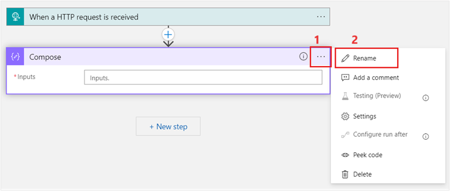
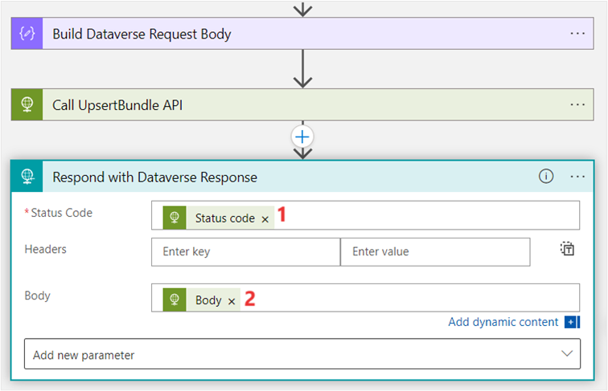
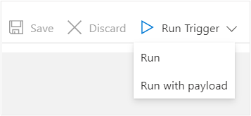

In this exercise, you learn how to call Dataverse Healthcare APIs within Microsoft Azure Logic Apps to write the FHIR resource bundle to Dataverse and then retrieve the newly created record from Dataverse.

> [!NOTE]
> For this exercise, all Azure resources are provisioned in the East US region.

> [!TIP]
> To complete this exercise, create all Azure resources in the same subscription and resource group unless otherwise stated.

## Task: Create a user-assigned, managed identity in Azure

In this task, you create a user-assigned, managed identity in Azure.

1.  While signed in to your Microsoft 365 tenant as global administrator, open a new browser tab and then go to the [Azure portal](https://portal.azure.com/?azure-portal=true).

1.  Search for the string **user assigned** in the search box.

1.  Select **User Assigned Managed Identity** under the **Marketplace** section.

	> [!div class="mx-imgBorder"]
	> [](../media/user-assigned-managed-identity.png#lightbox)

1.  On the **Create User Assigned Managed Identity** page, select your subscription. Then, select a resource group if you already have one; if not, select **Create new** to create a new resource group. In the **Region** dropdown menu, select **East US**, and then enter **FHIRRelayIdentity** in the **Name** field.

	> [!div class="mx-imgBorder"]
	> [](../media/name.png#lightbox)

1.  Select **Review + create**.

1.  On the **Review + create** page, select **Create**.

	> [!div class="mx-imgBorder"]
	> [](../media/review-create.png#lightbox)

1.  After the deployment is complete, select **Go to resource**.

	> [!div class="mx-imgBorder"]
	> [](../media/resource.png#lightbox)

1.  Copy the **Client ID** of **FHIRRelayIdentity** and then save it in a notepad to use in the subsequent tasks.

	> [!div class="mx-imgBorder"]
	> [](../media/client-id.png#lightbox)

## Task: Create an app from Azure Logic Apps

In this task, you create an app from Azure Logic Apps.

1.  Search for the string **logic** in the search box.

1.  Select **Logic apps** under the **Services** section.

	> [!div class="mx-imgBorder"]
	> [](../media/logic-apps.png#lightbox)

1.  On the **Logic apps** page, select **Add**.

	> [!div class="mx-imgBorder"]
	> [](../media/add.png#lightbox)

1.  On the **Create Logic App** page, enter the following details:

	-   **Subscription** - Select your desired subscription
	
	-   **Resource Group** - Select your resource group name
	
	-   **Logic App name** - FHIRRelayApp
	
	-   **Region** - East US (default)
	
	-   **Enable log analytics** - No (default)
	
	-   **Plan type** - Consumption
	
	-   **Zone redundancy** - Disabled (default)

	> [!div class="mx-imgBorder"]
	> [](../media/logic-app-details.png#lightbox)

    > [!div class="mx-imgBorder"]
	> [](../media/managed-identity.png#lightbox)


1.  Select **Review + create**.

1.  On the **Review + create** page, select **Create**.

	> [!div class="mx-imgBorder"]
	> [](../media/create.png#lightbox)

1.  Select **Go to resource**.

	> [!div class="mx-imgBorder"]
	> [](../media/deployment-complete.png#lightbox)

The **Logic Apps Designer** page opens. Select **X** to close the page.

## Add the user-assigned managed identity as an identity to the logic app

In this task, you add the previously created user-assigned managed identity **FHIRRelayIdentity** as an identity to the **FHIRRelayApp** logic app. This task is a continuation of the previous task.

1.  On the **Logic app** main page you created in the previous task, select **Identity** on the left pane.

	> [!div class="mx-imgBorder"]
	> [](../media/identity.png#lightbox)

1.  On the right pane, select **User assigned**.

1.  Select **Add**.

1.  On the **Add user assigned managed identity** panel, select the subscription in which you created the **FHIRRelayIdentity** user-assigned managed identity.

1.  Select **FHIRRelayIdentity** as the user-assigned managed identity, as shown in the following image.

1.  Select **Add**.

	> [!div class="mx-imgBorder"]
	> [](../media/add-identity.png#lightbox)

    **FHIRRelayIdentity** is added to **FHIRRelayApp** as the user-assigned managed identity.

	> [!div class="mx-imgBorder"]
	> [](../media/identity-added.png#lightbox)

## Add the user assigned managed identity as an application user in Dataverse

In this task, you add the **FHIRRelayIdentity** user-assigned managed identity as an application user in Dataverse and then you assign the **Sync admin for FHIR App Reg** user security role.

1.  While signed in to your Microsoft 365 tenant as global administrator, open a new tab and then go to [Microsoft Power Platform admin center](https://admin.powerplatform.microsoft.com/?azure-portal=true).

1.  On the left navigation, select **Environments**.

1.  On the right pane, select the **Lamna Healthcare** environment.

1.  On the upper command bar, select **Settings**, as shown in the following screenshot.

	> [!div class="mx-imgBorder"]
	> [](../media/environment-settings.png#lightbox)

1.  On the **Settings** page, select **Users + permissions > Application users**.

	> [!div class="mx-imgBorder"]
	> [](../media/application-users.png#lightbox)

1.  Select **+ New app user**.

1.  In the **Create a new app user** panel, select **+ Add an app**.

	> [!div class="mx-imgBorder"]
	> [](../media/add-app.png#lightbox)

1.  In the **Add an app from Microsoft Entra ID** panel, use the search box to search for the **FHIRRelayIdentity** by using its client ID that you copied in a previous step.

1.  Select **FHIRRelayIdentity** and then select **Add**.

	> [!div class="mx-imgBorder"]
	> [](../media/identity-add.png#lightbox)

1. After adding the Microsoft Entra ID app, you'll be redirected to the **Create a new app user** panel. In the **Business unit** dropdown menu, select the client ID and then select the edit icon beside the **Security roles** option.

	> [!div class="mx-imgBorder"]
	> [](../media/edit.png#lightbox)

1. On the **Add security roles** pane, select **Sync admin for FHIR App Reg User** and then select **Save**.

	> [!div class="mx-imgBorder"]
	> [](../media/sync-admin.png#lightbox)

1. You're redirected to the **Create a new app user** panel, which should appear as shown in the following screenshot. Select **Create** to add **FHIRRelayIdentity** as an application user and then assign it the **Sync admin for FHIR App Reg User** security role.

After you successfully added **FHIRRelayIdentity** as an application user in the Dataverse environment, it should appear as shown in the following screenshot.

## Use the Dataverse Healthcare API upsert bundle with Azure Logic Apps

In this task, you modify the Azure Logic Apps application named **FHIRRelayApp** to add the steps to call Dataverse Healthcare APIs to send the Patient FHIR resource bundle to Dataverse and then retrieve the newly added record from Dataverse. Dataverse Healthcare APIs expose only two endpoints: **msind_UpsertBundle** and **msind_RetrieveBundle**. You can call both endpoints in Azure Logic Apps. In this task, you create a Patient FHIR bundle, which uses elements of other FHIR resource types. In this case, it's mandatory that you enable entity maps of all dependent entities in Data Integration Toolkit. If the dependent entities aren't enabled, then **msind_UpsertBundle** responds with a warning or an error regarding expanding the resource, though it will successfully create the patient record without including the elements with error or warning.

> [!IMPORTANT]
> Don't create new patients in Dataverse. Always add new patients in your FHIR servers and then let the Dataverse Healthcare API ingestion pipeline create the corresponding Dataverse records.
>
> Patients are the core resource (entity) in FHIR. Every other resource (entity) in FHIR relates to the Patient resource or entity. FHIR servers automatically assign a unique ID when you add a new patient. That ID attribute is read-only. If you try to create a new patient record in Dataverse, Dataverse can't assign a value to the patient ID attribute in FHIR. Therefore, the Dataverse Healthcare Writeback feature can't write the data changes to your FHIR system.
>
> When you add a new patient in your EMR system, the data change will flow to the Azure FHIR server and then to Dataverse. Then, you can add related records, such as encounters, appointments, and observations.

1.  Switch back to the [Azure portal](https://portal.azure.com/?azure-portal=true).

1.  Search and select **Resource Groups**.

	> [!div class="mx-imgBorder"]
	> [](../media/resource-groups.png#lightbox)

1.  On the **Resource groups** page, select the resource group in which you created **FHIRRelayApp**.

	> [!div class="mx-imgBorder"]
	> [](../media/resource-group.png#lightbox)

1.  Select the **FHIRRelayApp** logic app.

	> [!div class="mx-imgBorder"]
	> [](../media/logic-app.png#lightbox)

1.  Under **Development tools**, select **Logic app designer** on the left navigation pane. You're redirected to the Logic Apps Designer page on the right panel.

1. Select the **When a HTTP request is received** trigger.

	> [!div class="mx-imgBorder"]
	> [](../media/trigger.png#lightbox)

1.  On the **Logic Apps Designer** canvas, select **Save**.

	> [!div class="mx-imgBorder"]
	> [](../media/save.png#lightbox)

	> [!NOTE]
	> The Request Body JSON Schema is left empty because the FHIR bundle in each incoming request can be unique.

1.  Select **Parameters** and then select **Add Parameter**.

	> [!div class="mx-imgBorder"]
	> [](../media/add-parameter.png#lightbox)

1.  Add a new parameter by using the following values:

	**Name** - DataverseURL
	
	**Type** - String
	
	**Default Value** - (Your Dataverse environment URL)

1.  Select **Save** and then select **X** to close the page.

	> [!div class="mx-imgBorder"]
	> [](../media/close.png#lightbox)

1. On the **Logic Apps Designer** canvas, select **+ New step**.

	> [!div class="mx-imgBorder"]
	> [](../media/new-step.png#lightbox)

1. Use the search box in the **Choose an operation** card to search for the **compose** string.

1. Select the **Compose** action.

	> [!div class="mx-imgBorder"]
	> [](../media/compose.png#lightbox)

1. Select the ellipsis (**...**) on the **Compose** step and then select **Rename**.

	> [!div class="mx-imgBorder"]
	> [](../media/rename.png#lightbox)

1. Rename the **Compose** step to **Build Dataverse Request Body**.

1. In the **Inputs** field, add the following JSON snippet:

	```json
	
	{
	  "msind_BundleTag": "",
	  "msind_JSON": ""
	}
	```

1. In the empty quotes for the **msind_JSON** node, add the dynamic content for the **When a HTTP request is received** trigger **Body** value.

	> [!div class="mx-imgBorder"]
	> [](../media/body-value.png#lightbox)

1. Select **+ New step** to add an HTTP action.

1. In the **Choose an operation** card, enter **HTTP**. Select HTTP action as show in the below image.

	> [!div class="mx-imgBorder"]
	> [](../media/http.png#lightbox)

	> [!div class="mx-imgBorder"]
	> [](../media/http-action.png#lightbox)

1. Rename the **HTTP** action to **Call UpsertBundle API**. Use the following values to set up the UpsertBundle API call:

    - **Method** - POST
	
    - **URI** - Set to the expression **concat(parameters('DataverseURL'),'/api/data/v9.1/msind_UpsertBundle')**
	
    - **Headers** 
    
        - **Content-Type** - Application:JSON
	
	    - **OData-Version** - 4
	
    - **Body** - Set to dynamic content **Outputs** (output of the Build Dataverse Request Body action)

	> [!div class="mx-imgBorder"]
	> [](../media/outputs-expression.png#lightbox)

	> [!div class="mx-imgBorder"]
	> [](../media/outputs.png#lightbox)

	> [!NOTE]
	> You can use the **/api/data/v9.1/msind_UpsertBundle** or the **/api/data/v9.2/msind_UpsertBundle** endpoint in your API call.

1. From the **Add new parameter** dropdown menu, select **Authentication**.

	> [!div class="mx-imgBorder"]
	> [](../media/authentication.png#lightbox)

1. Select **Managed identity** as the **Authentication type**.

	> [!div class="mx-imgBorder"]
	> [](../media/managed-identity-authentication.png#lightbox)

1. Under the **Authentication** section, select **FHIRRelayIdentity** from the **Managed identity** dropdown menu.

1. Select the **DataverseURL** parameter from dynamic content as the value for **Audience**.

	> [!div class="mx-imgBorder"]
	> [](../media/audience.png#lightbox)

1. Select **+ New step** to add a **Response** action.

1. Use the search box in the **Choose an operation** card to search for the **response** string.

1. Select the **Response** action from the search result.

	> [!div class="mx-imgBorder"]
	> [](../media/response.png#lightbox)

1. Rename the **Response** action card to **Respond with Dataverse Response**.

1. Fill in the **Respond with Dataverse Response** card with the following values:

    - **Status Code** - Set this value to **Status code** from **Call UpsertBudle API** dynamic content.
	
    - **Body** - Set it to **Body** from the **Call UpsertBundle API** dynamic content.

	> [!div class="mx-imgBorder"]
	> [](../media/card-values.png#lightbox)

1. Select **Save** on the **Logic Apps Designer** canvas.

## Test Dataverse Healthcare APIs in Azure Logic Apps

In this task, you test the **FHIRRelayApp** logic app that you created in the previous task by using the **Run Trigger** feature. In this test, you provide a **Patient** FHIR resource bundle with the **Batch** type as an input to the **FHIRRelayApp**, which in turn calls the **msind_UpsertBundle** Dataverse Healthcare API endpoint. This endpoint uses the FHIR bundle JSON payload to create a record in the corresponding Dataverse entity.

1.  After saving the **FHIRRelayApp** logic app in the previous task, select the dropdown menu next to **Run Trigger** and then select **Run with payload**.

	> [!div class="mx-imgBorder"]
	> [](../media/run-with-payload.png#lightbox)

1.  On the **Run with payload** panel, add the **OData-Version** header and then enter **4.0** as its value.

1.  Enter the following Patient FHIR bundle JSON payload as the value for **Body**. This FHIR bundle contains only one **Patient** FHIR resource, which is mapped to the **Contact** entity in Dataverse.

	> [!NOTE]
	> The FHIR bundle that's used in this illustration is from [Synthea](https://github.com/synthetichealth/synthea/?azure-portal=true), the synthetic healthcare record generator; hence, it contains the FHIR resource ID.

	```json
	{
	    "resourceType": "Bundle",
	    "type": "batch",
	    "entry": [
	        {
				"resource": {
				"resourceType": "Patient",
				"id": "d0000000-c7e2-408f-9652-c8c2bdd9d2bf",
				"text": {
				  "status": "generated"
				},
				"identifier": [
				  {
					"system": "https://github.com/synthetichealth/synthea",
					"value": "51978986-f824-43da-b69a-d2d17f49df70"
				  }
				],
				"name": [
				  {
					"use": "official",
					"family": "Contoso",
					"given": [
					  "Allen007"
					],
					"prefix": [
					  "Ms."
					]
				  }
				],
				"telecom": [
				  {
					"system": "phone",
					"value": "555-664-6121",
					"use": "home"
				  }
				],
				"gender": "female",
				"birthDate": "1965-11-04",
				"address": [
				  {
					"line": [
					  "165 Shanahan View"
					],
					"city": "North Reading",
					"state": "Massachusetts",
					"country": "US"
				  }
				],
				"multipleBirthBoolean": false
			  },
			  "request": {
				"method": "POST",
				"url": "Patient"
			  }
			}
		]
	}
	```

1.  Select **Run** to trigger the logic app.

	> [!div class="mx-imgBorder"]
	> [](../media/run.png#lightbox)

    After successful implementation of the **msind_UpsertBundle** endpoint, the response from Dataverse will be **Status Code 200**.

	> [!NOTE]
	> Status Code 200 indicates that the Dataverse Healthcare API has successfully created a new record for the FHIR resource in the corresponding Dataverse entity. In this example, a successful implementation of the logic app should create a new entry in the **Contact** entity in Dataverse.

	> [!div class="mx-imgBorder"]
	> [](../media/output.png#lightbox)

	> [!NOTE]
	> The preceding output shows **Status Code 200** and warnings about errors that have occurred in records. This behavior is expected according to the configuration that you've done in Data Integration Toolkit. 

    The **Response Body** is as follows:

	```json
	{
	    "@odata.context": "https://lamnahealth.crm.dynamics.com/api/data/v9.1/$metadata#Microsoft.Dynamics.CRM.msind_UpsertBundleResponse",
	    "msind_StatusDetail": "Warning: There were records that encountered errors. Inspect the individual records error details.",
	    "msind_Status": false,
	    "msind_Results": [
	        {
	            "@odata.type": "#Microsoft.Dynamics.CRM.msind_upsertfhirbundleresult",
	            "msind_fhirresourceid": "d0000000-c7e2-408f-9652-c8c2bdd9d2bf",
	            "msind_fhirresourcetype": "Patient",
	            "msind_resultingrecordid": "b6fe91ee-5b9a-ed11-aad0-6045bd026d52",
	            "msind_resultingrecordtype": "contact",
	            "msind_requestactionperformed": 935000000,
	            "msind_requeststatus": 935000002,
	            "msind_requeststatusdetail": "The record was created successfully.\r\nError: The expansion for this resource failed. Expand Detail: Error: Expand failed. Resource Type: Patient, Resource Id: d0000000-c7e2-408f-9652-c8c2bdd9d2bf, Resource Element: link, Expand Table Name: msemr_contactlink, Expand Detail: The entity map look up on attribute map 5dc39e81-98d0-eb11-bacc-000d3a3ad182 either does not exist or has not been enabled.\r\nError: The expansion for this resource failed. Expand Detail: Error: Expand failed. Resource Type: Patient, Resource Id: d0000000-c7e2-408f-9652-c8c2bdd9d2bf, Resource Element: identifier, Expand Table Name: msemr_medicalidentifier, Expand Detail: The entity map look up on attribute map a8584750-98d0-eb11-bacc-000d3a3ad182 either does not exist or has not been enabled."
	        },
	        {
	            "@odata.type": "#Microsoft.Dynamics.CRM.msind_upsertfhirbundleresult",
	            "msind_requestactionperformed": 935000002,
	            "msind_resultingrecordtype": "msemr_contactlink",
	            "msind_fhirresourceid": "d0000000-c7e2-408f-9652-c8c2bdd9d2bf",
	            "msind_fhirresourcetype": "Patient",
	            "msind_requeststatus": 935000002,
	            "msind_requeststatusdetail": "Error: Expand failed. Resource Type: Patient, Resource Id: d0000000-c7e2-408f-9652-c8c2bdd9d2bf, Resource Element: link, Expand Table Name: msemr_contactlink, Expand Detail: The entity map look up on attribute map 5dc39e81-98d0-eb11-bacc-000d3a3ad182 either does not exist or has not been enabled."
	        },
	        {
	            "@odata.type": "#Microsoft.Dynamics.CRM.msind_upsertfhirbundleresult",
	            "msind_requestactionperformed": 935000002,
	            "msind_resultingrecordtype": "msemr_medicalidentifier",
	            "msind_fhirresourceid": "d0000000-c7e2-408f-9652-c8c2bdd9d2bf",
	            "msind_fhirresourcetype": "Patient",
	            "msind_requeststatus": 935000002,
	            "msind_requeststatusdetail": "Error: Expand failed. Resource Type: Patient, Resource Id: d0000000-c7e2-408f-9652-c8c2bdd9d2bf, Resource Element: identifier, Expand Table Name: msemr_medicalidentifier, Expand Detail: The entity map look up on attribute map a8584750-98d0-eb11-bacc-000d3a3ad182 either does not exist or has not been enabled."
	        }
	    ]
	}
	```

The following information explains the response sent by the **msind_UpsertBundle** API:

	```
	"msind_Status": "A Boolean (true/false) indicating whether the bundle was successfully processed and all valid resources were upserted into Dataverse. If there is any warning or error in upserting any of the dependent resources, then the value will be false.",
	    "msind_StatusDetail": "It provides information about the msind_Status.",
	    "msind_Results": 
	{
	            "msind_fhirresourceid": "The FHIR ID of the resource in the bundle. If an entry in the result pertains to an expanded record, the value will be the FHIR ID of the root resource.",
	            "msind_fhirresourcetype": "The FHIR resource type of the resource in the bundle. If an entry in the result pertains to an expanded record, the value will be the FHIR resource type of the root resource.",
	            "msind_resultingrecordid": "The Dataverse ID after the record has been upserted. If an entry in the result pertains to an expanded record, the value will be the Dataverse ID of the root resource.",
	            "msind_resultingrecordtype": "The name of the Dataverse entity that the record was upserted into. If an entry in the result pertains to an expanded record, the value will be the name of the Dataverse entity of the     expanded record.",
	            "msind_requestactionperformed": "The type of action performed. Below block shows expected values and their description.",
	{
		  935000000: “A root resource has been created”,
		  935000001: “A root resource already existing in Dataverse has been updated”,
		  935000002: “The action was performed on an expanded entity”
	}
	            "msind_requeststatus": "The status of the request. Below block shows expected values and their description.",
	      {
	935000000: “The resource upsert resulted in a success”,
	935000001: “The resource upsert resulted in a warning”,
	935000002: “The resource upsert resulted in an error”
	      }
	            "msind_requeststatusdetail": "The detailed information about the msind_requeststatus."
	        }
	```

5.  Go to your [Power Apps](https://make.preview.powerapps.com/?azure-portal=true) environment and select **Tables** on the left navigation pane.

6.  Under the **Recommended** section on the right pane, select **Contact**.

7.  Select **Edit**.

	> [!div class="mx-imgBorder"]
	> [](../media/edit-menu.png#lightbox)

Patient **Allen007 Contoso** shows 
as recorded in Dataverse.

> [!div class="mx-imgBorder"]
> [](../media/patient.png#lightbox)

## Task: Use the retrieve bundle Dataverse Healthcare API with Azure Logic Apps

In this task, you modify the **FHIRRelayApp** logic app to invoke the **msind_RetrieveBundle** Dataverse Healthcare API.

1.  Open the **FHIRRelayApp** logic app that you created in the previous task.

1.  Select the plus (**+**) sign (Insert a new step) between the **Call UpsertBundle API** and **Respond with Dataverse Response** steps.

1.  Select **Add an action**.

	> [!div class="mx-imgBorder"]
	> [](../media/add-action.png#lightbox)

1.  Select the **Compose** action.

1.  Rename the **Compose** action card to **Build RetrieveBundle Request Body**.

1.  Add the following expression to the **Inputs** field for the **Build RetrieveBundle Request Body** card.

	```json
	{
	  "msind_FHIRQuery": "@{outputs('Call_UpsertBundle_API')?['body']['msind_Results'][0]['msind_fhirresourcetype']}/@{outputs('Call_UpsertBundle_API')?['body']['msind_Results'][0]['msind_fhirresourceid']}"
	}
	```

	> [!div class="mx-imgBorder"]
	> [](../media/inputs.png#lightbox)

1.  Select the **+** (Insert a new step) icon between the **Build RetrieveBundle Request Body** and **Respond with Dataverse Response** steps.

1.  Select **Add an action**.

1.  Select the **HTTP** action.

1. Rename the **HTTP** action card to **Call RetrieveBundle API**.

1. Populate the **Call RetrieveBundle API** card by using the following values:

	-   **Method** - POST
	
	-   **URI** - @{concat(parameters('DataverseURL'),'/api/data/v9.1/msind_RetrieveBundle')}
	
	-   **Headers** - Content-Type: application/json; OData-Version: 4.0
	
	-   **Body** - Set it to the dynamic content of the **Build RetrieveBundle Request Body** action
	
	-   **Authentication type** - Managed identity
	
	-   **Managed identity** - FHIRRelayIdentity (This value is the user-assigned managed identity that you created in the previous task)
	
	-   **Audience** - DataverseURL (This value is the logic app parameter that you created in the previous task)

	> [!div class="mx-imgBorder"]
	> [](../media/values.png#lightbox)

	> [!NOTE]
	> You can use the **/api/data/v9.1/msind_RetrieveBundle** or the **/api/data/v9.2/msind_RetrieveBundle** endpoint in your API call.

1. Modify the **Respond with Dataverse Response** card with the following values:

	-   **Status Code** - Set it to the **Status code** dynamic content of the **Call RetrieveBundle API** action.
	
	-   **Body** - Set it to the **Body** dynamic content of the **Call RetrieveBundle API** action.

	> [!div class="mx-imgBorder"]
	> [](../media/response-values.png#lightbox)

1. Select **Save**.

1. Follow the steps outlined in the **Test Dataverse Healthcare APIs in Azure Logic Apps** task to test the modified logic app that calls the **msind_UpsertBundle** and **msind_RetrieveBundle** Dataverse Healthcare APIs.

1. Verify that the output appears as follows:

	```json
	{
	    "@odata.context": "https://lamnahealth.crm.dynamics.com/api/data/v9.1/$metadata#Microsoft.Dynamics.CRM.msind_RetrieveBundleResponse",
	    "msind_Status": true,
	    "msind_StatusDetail": "{\r\n  \"Message\": \"Request processed successfully with the following warning/information.\",\r\n  \"Warning\": [\r\n    {\r\n      \"Time Stamp\": \"2/2/2023 2:57:20 PM\",\r\n      \"Message\": \"Unable locate entity map for FHIR Resource identifier. Ensure you have enabled the map for this resource. Once fixed resubmit the bundle to re - process this record.\"\r\n    },\r\n    {\r\n      \"Time Stamp\": \"2/2/2023 2:57:20 PM\",\r\n      \"Message\": \"Unable locate entity map for FHIR Resource link. Ensure you have enabled the map for this resource. Once fixed resubmit the bundle to re - process this record.\"\r\n    }\r\n  ]\r\n}",
	    "msind_JSON": "{\r\n  \"resourceType\": \"Patient\",\r\n  \"name\": [\r\n    {\r\n      \"use\": \"official\",\r\n      \"family\": \"Contoso\",\r\n      \"given\": [\r\n        \"Allen007\"\r\n      ]\r\n    }\r\n  ],\r\n  \"id\": \"d0000000-c7e2-408f-9652-c8c2bdd9d2bf\",\r\n  \"telecom\": [\r\n    {\r\n      \"use\": \"home\",\r\n      \"system\": \"phone\",\r\n      \"value\": \"555-664-6121\"\r\n    }\r\n  ],\r\n  \"gender\": \"female\",\r\n  \"birthDate\": \"1965-11-04T00:00:00+00:00\",\r\n  \"address\": [\r\n    {\r\n      \"line\": [\r\n        \"165 Shanahan View\"\r\n      ],\r\n      \"city\": \"North Reading\",\r\n      \"state\": \"Massachusetts\",\r\n      \"postalCode\": \"x\",\r\n      \"country\": \"US\"\r\n    }\r\n  ]\r\n}"
	}
	```

The response sent by the **msind_RetrieveBundle** API is as follows:

- **msind_Status** - A Boolean indicating whether the action was successfully processed or not.
- **msind_StatusDetail** - Provides detailed information about **msind_Status**.
- **msind_JSON** - Shows the retrieved FHIR resource data as JSON.

You successfully set up a logic app from Azure Logic Apps to call Dataverse Healthcare APIs to create a record in Dataverse and then retrieve the same record from Dataverse.
