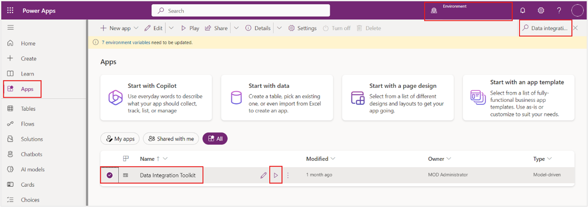
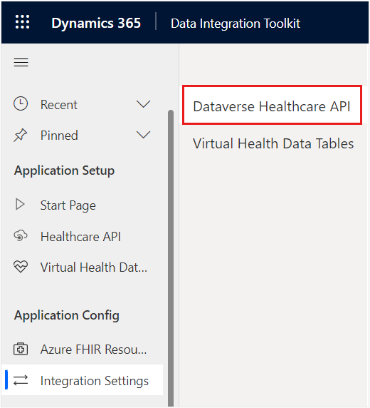
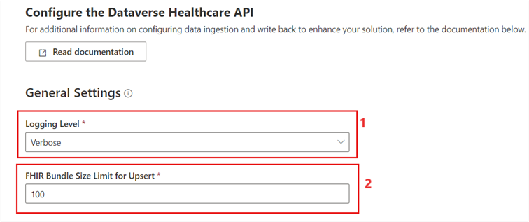
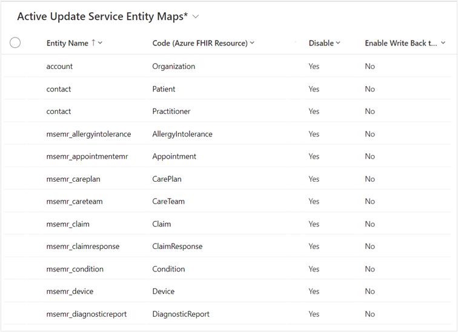
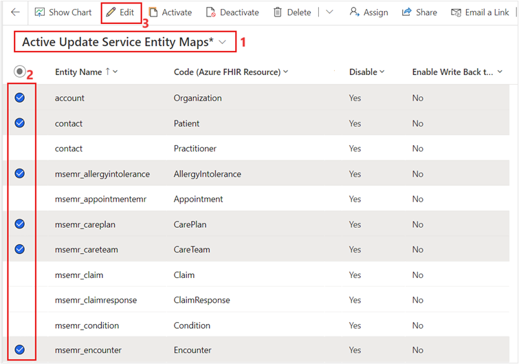
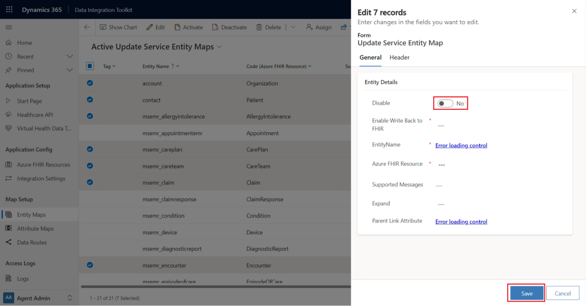
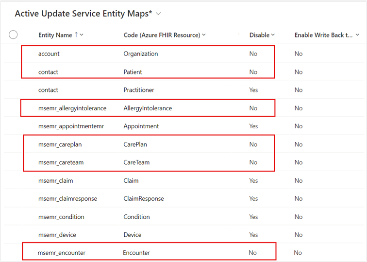

In this exercise, you use the Data Integration Toolkit to set up the integration settings for the Dataverse Healthcare API. You enable the out-of-the-box entity map for FHIR resources, such as Patient, Organization, CarePlan, CareTeam, AllergyIntolerance, Encounter, and Claim. Enabling these FHIR resources in entity maps allow you to use Dataverse Healthcare API to post the respective FHIR resource bundle to Dataverse.

## Set up Dataverse Healthcare API

Follow these steps to set up Dataverse Healthcare API by using Data Integration Toolkit:

1.  While signed in to your Microsoft 365 tenant, open a new tab and then go to [Microsoft Power Apps](https://make.powerapps.com/?azure-portal=true).

1.  Select the **Lamna Healthcare** environment.

1.  Select **Apps** on the left navigation pane.

1.  Search and select the **Data Integration Toolkit** app on the right navigation pane. Select the play button to launch the app.

	> [!div class="mx-imgBorder"]
	> 

1.  In the **Data Integration Toolkit** app, while **Agent Admin** is selected in the **Change** area, select **Integration Settings** on the left navigation pane.

1.  Select **Dataverse Healthcare API** on the right pane.

	> [!div class="mx-imgBorder"]
	> 

1.  On the **Configure the Dataverse Healthcare API** page, set the following general settings:

    -   **Logging Level** - Verbose

    -   **FHIR Bundle Size Limit for Upsert** - 100 (default)

	> [!div class="mx-imgBorder"]
	> 

	> [!NOTE]
	> Set the **Logging Level** to **Verbose** to ensure that all operations that are performed through the Dataverse Healthcare APIs are logged. Setting this level of logging will generate large data; hence, we recommend that, after completing this module, you set the **Logging Level** to **Exception Only**.

	> [!NOTE]
	> **FHIR Bundle Size Limit for Upsert** settings dictates the maximum number of resource entries that can be passed as a single FHIR bundle. The default value is 100 and max supported value is 500.

1.  Select **Save**.

	> [!NOTE]
	> In this exercise, you won't work with **Write Back Configuration** for Dataverse Healthcare API. That setting enables you to update the data changes from Dataverse back to Azure Health Data Services.

## Enable entity maps

In this task, you enable the entity maps for FHIR resources named Patient, Organization, CarePlan, CareTeam, AllergyIntolerance, Encounter, and Claim. In the subsequent exercises, you send the Patient FHIR bundle to the Dataverse Healthcare API. Then, you work with other FHIR resources in the advanced hands-on exercises.

1.  Select **Entity Maps** on the left navigation pane under **Map Setup**.

	> [!TIP]
	> By default, the **Disable** column values are set to **Yes** and **Enable Write Back to FHIR** column values are set to **No** for all entity maps.

	> [!div class="mx-imgBorder"]
	> 

1.  On the right pane, select **Active Update Service Entity Maps** and then select the following FHIR resources: **Patient**, **Organization**, **AllergyIntolerance**, **CarePlan**, **CareTeam**, **Claim**, and **Encounter**.

	> [!div class="mx-imgBorder"]
	> 

1.  Select **Edit**.

1.  On the **Edit** panel, set **Disable** to **No**.

	> [!div class="mx-imgBorder"]
	> 

1.  Select **Save** to enable the FHIR resources and their corresponding Dataverse entities mapping to facilitate data synchronization.

	> [!div class="mx-imgBorder"]
	> 

You successfully set up the integration settings for Dataverse Healthcare API and enabled entity maps for the selected FHIR resources.
