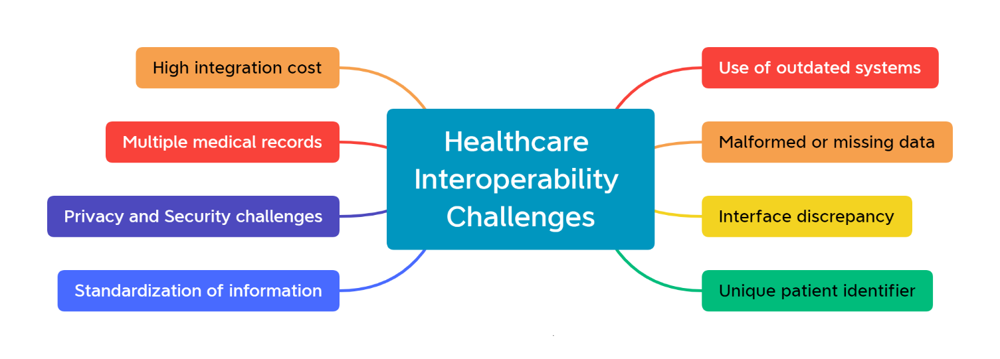
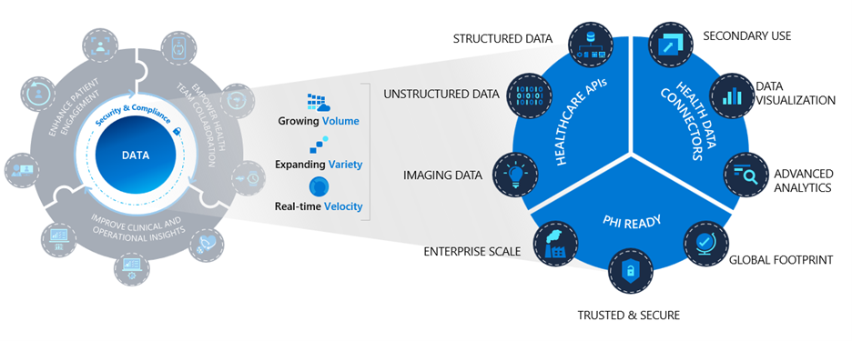
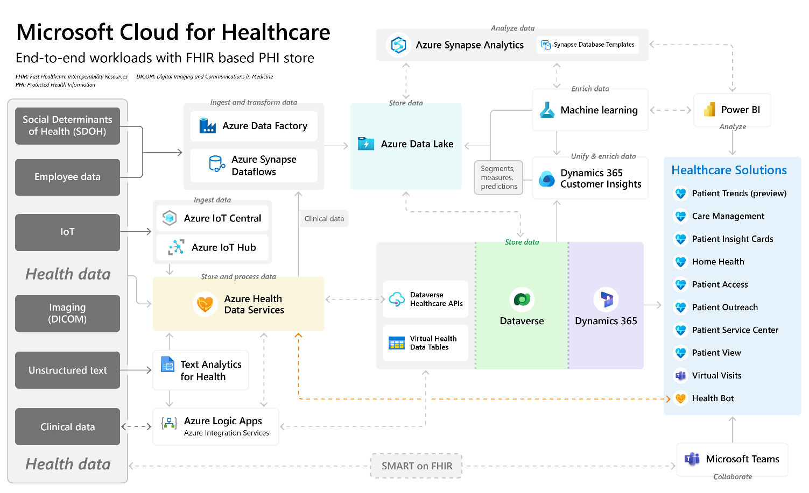

Integration and interoperability are key concepts in the healthcare and life sciences industries. Integration refers to the process of bringing together different systems, technologies, data sources, and processes to create a cohesive experience for patients, healthcare providers, and other stakeholders. Interoperability is the ability of different systems, technologies, and data sources to work together and exchange information.

The healthcare and life sciences industries are complex and dynamic environments that require a high degree of integration and interoperability to function effectively. One main challenge with the healthcare industry is that it's traditionally siloed, with different providers and organizations that use different systems and technologies. The absence of integration and interoperability between these systems and technologies led to inefficiencies, errors, and a lack of continuity in care for patients. However, with an increase in the use of electronic health records (EHRs), health information exchanges (HIEs), clinical decision support systems, telemedicine, and other digital technologies, such as smart wearables, integration and interoperability is an important need today.

> [!NOTE]
> Electronic health records (EHRs) are electronic versions of a patient's paper-based medical chart. They provide a centralized location for patient data, such as lab results and imaging studies, and allow healthcare providers to access and share complete patient information across different organizations and care settings. For more information, see [HIMSS Electronic Health Record Definitional Model](http://www.hl7.org/documentcenter/public/wg/ehr/workingdocs/EHRAttributes.pdf).

> [!NOTE]
> Health information exchanges (HIEs) are networks that connect different EHR systems and allow for the exchange of patient data between healthcare providers and organizations. HIEs can help to improve care coordination and reduce costs by reducing the need for duplicate tests and procedures.

An important area where integration and interoperability are required is patient data. When patients receive care from multiple providers, their medical records are often scattered across different systems and technologies. As a result, it's difficult for providers to access important patient information, which can lead to errors and inefficiencies. To address this challenge, healthcare organizations need to invest in solutions that allow for sharing of patient data across multiple systems and technologies.

Integration and interoperability are required in clinical decision support. The increased use of AI and machine learning has resulted in a growing need for systems and technologies to help providers make more informed decisions. To address this challenge, healthcare organizations must invest in solutions that allow for the integration of clinical decision support tools with different systems and technologies.

In the healthcare industry, an attempt is being made to solve integration and interoperability challenges by using electronic health records (EHRs) and health information exchanges (HIEs). Likewise, in the life sciences industry, integration and interoperability are also crucial. For example, pharmaceutical organizations can use these solutions, such as EHRs or HIEs, to integrate data from different sources, such as clinical trial data and real-world evidence, to improve drug development and bring new treatments to market faster. Interoperability uses international standards and protocols for exchange, management, and integration of electronic health information, such as: 

- Health Level Seven International (HL7) v2 and HL7 v3
- Clinical Document Architecture (CDA)
- Consolidated Clinical Document Architecture (C-CDA)
- Fast Healthcare Interoperability Resources (FHIR)

## Challenges with healthcare and life sciences

The following challenges can greatly hinder the ability to provide efficient and effective health care:

- **Data silos** - The lack of data sharing between different systems leads to data silos. Healthcare providers have difficulty accessing and sharing patient data, which can lead to a lack of continuity of care.

- **Lack of standardization** - Healthcare organizations and life sciences companies use different systems and technologies, making it difficult to communicate and exchange data seamlessly. The lack of standardization is a challenge to achieve interoperability.

- **Security and privacy concerns** - The security and privacy of patient data is critical to healthcare providers and life sciences companies. Sharing data across different systems can increase the risk of data breaches and compromise patient privacy.

- **Complexity of systems** - Healthcare and life sciences systems are increasingly complex and a challenge to integrate and interoperate data effectively, which leads to increased costs and delays in care delivery.

- **Lack of resources** - Budget constraints and a lack of resources to invest in integration and interoperability solutions make it difficult for organizations to share data to improve the continuity of care.

> [!div class="mx-imgBorder"]
> 

## Microsoft Cloud for Healthcare solutions

Microsoft Cloud for Healthcare offers various capabilities to help solve these integration and interoperability challenges. However, Microsoft Cloud for Healthcare isn't an EHR system or a replacement for EHR systems; rather, it augments the existing EHR and EMR systems to provide better and effective patient care.

The capabilities of Microsoft Cloud for Healthcare that can help resolve these challenges are:

-   **Azure Health Data Services** - A managed platform-as-a service (PaaS), which is a set of tools and connectors that enable organizations to ingest health data to the Microsoft Cloud for improved health through insights. Healthcare organizations can benefit from using a set of application programming interface (API) services and frameworks that are dedicated to the healthcare industry because health data can be fragmented across multiple systems, device types, and data formats. To improve the overall wellness, from population health to personalized care, healthcare industries require a centralized platform for collecting insights from health data. By using Azure Health Data Services as a compliant solution where different types of health data are harmonized together, organizations can de-identify protected health information (PHI) and can connect to the machine learning and data analytics resources in the greater Microsoft Azure ecosystem. Azure Health Data Services focuses on several internationally adopted data standards, including Fast Healthcare Interoperability Resources (FHIR) and Digital Imaging and Communications in Medicine (DICOM). For more information, see [Get started with Azure Health Data Services](/training/paths/azure-health-data-services/?azure-portal=true).

-   **Data Integration Toolkit** - The Sync admin for FHIR application is rebranded as Data Integration Toolkit. It includes ready-to-use and customizable entity maps, attribute maps, and management tools, enabling healthcare administrators to control data that flows between EHRs, FHIR servers, and [Microsoft Dataverse](/power-apps/maker/data-platform/data-platform-intro/?azure-portal=true). Protected patient data is directly available in your Microsoft Cloud for Healthcare solution while it remains in its original system when at rest. You can work with selected protected patient data without bringing it into Dataverse through virtual health data tables. Alternatively, you can also ingest your health information data into Dataverse if needed.

-   **Data Ingestion ARM Template** - Sets up an Azure Storage and Microsoft Azure Logic Apps service that provide relay and eventing between Dataverse Healthcare APIs and FHIR server to synchronize FHIR standard clinical data between FHIR server and Dataverse.

-   **Dataverse Healthcare APIs** - A full product offering from Microsoft Cloud for Healthcare, which enables you to interact with Microsoft Dataverse by using the FHIR standard. The APIs continue to use the Data Integration Toolkit maps to transform the bundles between FHIR and Dataverse. Currently, the Dataverse Healthcare API set has two endpoints: **Upsert bundle API** and **Retrieve bundle API**.

> [!div class="mx-imgBorder"]
> 

## Interoperability using FHIR

The discussion about interoperability in the context of the modern world healthcare system is incomplete without mentioning Fast Healthcare Interoperability Resources [(FHIR)](https://www.hl7.org/fhir/index.html/?azure-portal=true), which is a standard for healthcare data exchange and is published by Health Level Seven International (HL7®). It enables a robust, extensible data model with standardized semantics and data exchange that allows all systems that use FHIR to work together. By transforming data to FHIR, you can quickly connect together the existing data sources, such as electronic health record systems or research databases. It provides an alternative to document-centric approaches by directly exposing discrete data elements as resources. For example, you can retrieve and manipulate basic elements within health records, such as patients, admissions, practitioners, diagnostic reports, medications, health procedures, list of allergies, and family history, through their own resource URLs.

Currently, HL7 designates 145 types of FHIR resources. A FHIR resource is a piece of data that you can collect across the internet. It has a physical location that you can locate through a URL address that's submitted in a browser. This feature, combined with canonized terms and extensions of those terms, makes FHIR a key aspect of improving interoperability. While FHIR, as a standard, enables interoperability for better patient outcomes, it's not a replacement IT system for payors, providers, or for research or pharmaceutical organizations. FHIR doesn't replace electronic health record (EHR) systems or provider billing systems. FHIR enables the data that needs to be exchanged by these systems by calling the FHIR service.

Substitutable Medical Application, Reusable Technologies (SMART) on FHIR, which is an extension of the base FHIR standard, enables the rapid exchange of data in modern implementations of mobile and web development. By using the SMART on FHIR standard, application developers can better apply harmonized health datasets and exchange those datasets between systems. Additionally, FHIR can simplify data ingestion and accelerate development with analytics and machine learning tools.

The following reference architecture for Microsoft Cloud for Healthcare is a comprehensive logical diagram that explains integration and interoperability in five stages of the health data life cycle:

- Ingestion

- Persistence

- Integration

- Intelligence

- Analytics

This architecture diagram illustrates how the data from disparate systems, such as social determinants of health (SDOH), employee data, Medical IoT data, imaging data (DICOM), clinical data, or any unstructured data, can be integrated into the Microsoft Cloud for Healthcare platform through various ingestion pipelines, such as Microsoft Azure Logic Apps, Azure Data Factory, Azure IoT Central, and Azure IoT Hub, which also support data transformation for interoperability. Post ingestion, you can persist the data in various systems, such as Azure Data Lake and Azure Health Data Services (FHIR, DICOM, and Internet of Medical Things (IoMT) data).   

> [!div class="mx-imgBorder"]
> 

Dataverse Healthcare APIs play a significant role in the architecture to facilitate integration between FHIR data sources, such as Azure Health Data Services and Dataverse, while providing another level of data standardization. The **msind_UpsertBundle** endpoint and **writeback** capability in Dataverse Healthcare API ensures bidirectional FHIR data synchronization between Dataverse and Azure Health Data Services. This integration makes healthcare solutions, such as Care Management, Patient Access, Patient Service Center, more robust and effective by providing diverse sets of data in a more standardized format. Additionally, other components can consume this standardized data, such as Microsoft Azure Machine Learning, Azure Synapse Analytics, and Microsoft Power BI to provide intelligent insights, which healthcare providers can use to deliver effective patient care. 

You can also integrate Microsoft Cloud for Healthcare solutions with Microsoft Teams through out-of-the-box connectors, such as Microsoft Power Apps. Furthermore, Microsoft Teams also provides out-of-the-box connectors for the most popular electronic health record systems, such as Epic and Cerner, to facilitate virtual consultation. For more information, see the [Cerner connector in Microsoft Teams](/microsoft-365/frontline/ehr-admin-cerner?view=o365-worldwide/?azure-portal=true&preserve-view=true) and [Epic connector in Microsoft Teams](/microsoft-365/frontline/ehr-admin-epic?view=o365-worldwide/?azure-portal=true&preserve-view=true) documentation. 

