In this exercise, you set up Postman to call Dataverse Healthcare APIs to send a **Patient** FHIR resource bundle to Dataverse and then retrieve data from Dataverse. To complete this exercise, you need to have Postman installed locally.

> [!NOTE]
> Postman introduces the workspace concept to enable you and your team to share APIs, collections, environments, and other components. You can use the default **My workspace** or **Team workspace**, or you can create a new workspace for you or your team. In this exercise, you'll create an environment and collection in the default **My workspace**. For more information, see the [Postman documentation](https://learning.postman.com/docs/getting-started/introduction/?azure-portal=true).

## Task: Register a Microsoft Entra ID app

In this task, you register a Microsoft Entra ID app to authenticate Postman with Dataverse. Grant the **Sync Admin for FHIR App Reg User** security role to this app so that it can call the Dataverse Healthcare APIs to write to and read from Dataverse. This app uses the **implicit grant** flow to obtain an access token from Microsoft Entra ID to authenticate Postman; hence, you don't need to create a secret for this app. For more information, see [Token grant flows](/azure/active-directory/develop/v2-oauth2-client-creds-grant-flow/?azure-portal=true).

1.  Follow the steps from [Microsoft Cloud for Healthcare training environment preparation](/training/modules/training-environment-preparation-healthcare/4a-azure-trial/?azure-portal=true) to register a Microsoft Entra ID app.

1.  Set up the Microsoft Entra ID app by using the following details:

    -   **Name** - Lamna Healthcare Integration App

    -   **Supported account types** - Accounts in this organizational directory only

1.  After registering the Microsoft Entra ID app, copy its **Client ID** and then provide the following API permission:

    -   **API Name** - Dynamics CRM

    -   **Permissions type** - Delegated permissions

    -   **Permission** - user_impersonation

1.  Select **Authentication** on the left pane.

1.  Select **+ Add a platform** on the right pane. Select **Web**. 

1.  On the **Configure Web** panel, use the following values and then select **Configure**:

    -   **Redirect URIs** - `https://www.getpostman.com/oauth2/callback`

    -   **Select the tokens you would like to be issued by the authorization endpoint** - Access tokens (used for implicit flows)

	> [!div class="mx-imgBorder"]
	> [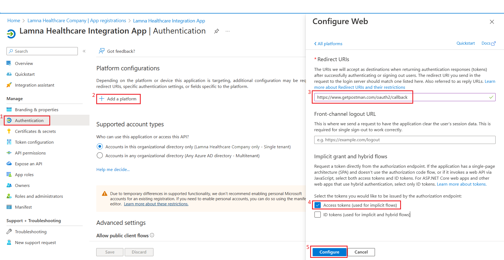](../media/authentication-details.png#lightbox)

1.  Select **Manifest** on the left pane to update the **allowPublicClient** to **true** in the manifest file.

	> [!div class="mx-imgBorder"]
	> [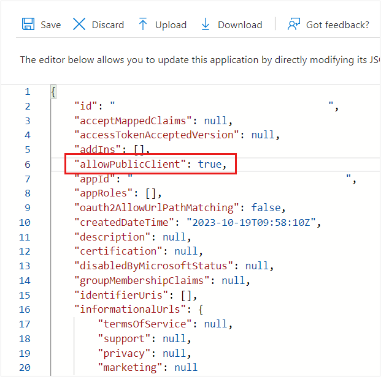](../media/manifest.png#lightbox)

1.  Select **Save**.

## Task: Grant Microsoft Entra ID app permission on Dataverse

In this task, you grant permission to the registered Microsoft Entra ID app on Dataverse.

1.  While signed in to your Microsoft 365 tenant as global administrator, open a new tab and then go to [Microsoft Power Platform admin center](https://admin.powerplatform.microsoft.com/?azure-portal=true).

1.  On the left navigation pane, select **Environments**.

1.  On the right pane, select **Lamna Healthcare** environment.

1.  Select **Settings** from the command bar.

1.  On the **Settings** page, select **Users + permissions > Application users**.

1.  Select **+ New app user**.

1.  On the **Create a new app user** panel, select **+ Add an app**.

1.  On the **Add an app from Microsoft Entra ID** panel, use the search box to search for **Lamna Healthcare Integration App** by using its client ID that you copied in a previous step.

1.  Select **Lamna Healthcare Integration App** and then select **Add**.

1. After adding the Microsoft Entra ID app, you'll be redirected to the **Create a new app user** panel. Select the ID from the **Business unit** dropdown menu, and then select the **edit** icon beside the **Security role** option.

1. In the **Add security roles** pane, select **Sync admin for FHIR App Reg User** and then select **Save**.

1. You are redirected to the **Create a new app user** panel. Select **Create** to add **Lamna Healthcare Integration App** as an application user and then assign it the **Sync admin for FHIR App Reg User** security role.

## Task: Get a Dataverse access token by using the Implicit grant type

In this task, you set up Postman to use Dataverse Healthcare API.

1.  Open Postman.

1.  Select **Environments** on the left pane and then select the plus (**+**) icon to create a new environment.

	> [!div class="mx-imgBorder"]
	> [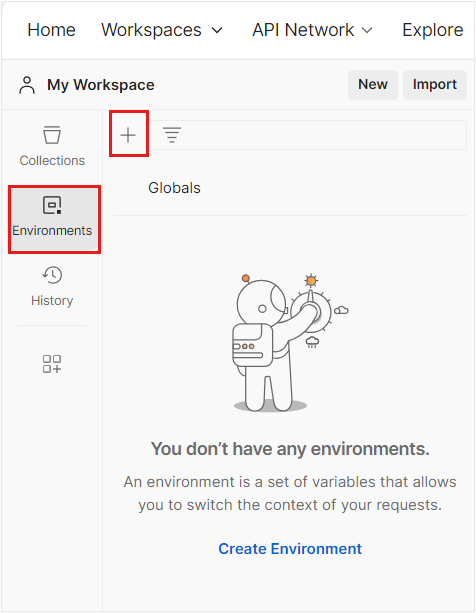](../media/add-environment.png#lightbox)

1.  Enter the name for the new environment as **Dataverse-Healthcare-APIs**.

1.  Add the following variables in the **Dataverse-Healthcare-APIs** environment and then select **Save**.

	-   **client_id** - Enter the client ID of the **Lamna Healthcare Integration App** that you copied previously
	
	-   **url** - `https://<Dataverse-environment-name>.api.crm.dynamics.com`
	
	-   **callback** - `https://www.getpostman.com/oauth2/callback`
	
	-   **authurl:** `https://login.microsoftonline.com/common/oauth2/authorize?resource={{url}}`

	> [!div class="mx-imgBorder"]
	> [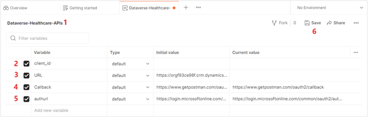](../media/variables.png#lightbox)

1.  Select **Collections** on the left pane and then select the plus (**+**) icon to create a new collection.

	> [!div class="mx-imgBorder"]
	> [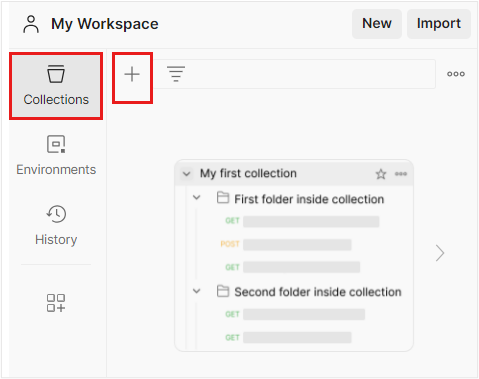](../media/new-collection.png#lightbox)

1. Select **Blank collection**.

1. Enter **Dataverse-Healthcare-APIs** as a name for the collection.

1.  Select **Add a request** to create a new API call.

1.  Name the request to **GetDataverseAccessToken**.

1.  Select **Authorization** tab and then set up authentication by using the following values:

	-   **Type** - OAuth 2.0
	
	-   **Add authorization data to** - Request Headers
	
	> [!div class="mx-imgBorder"]
	> [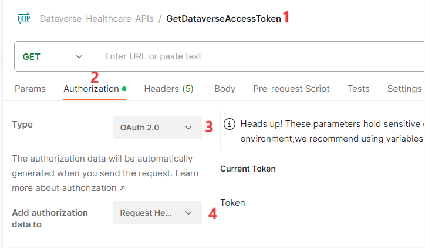](../media/add-request.png#lightbox)

1. Select the environment that you created on the top right corner of the Token page.

1. On the right pane, in the **Configure New Token** section, fill in the following details:

	- **Token Name** - DataverseAccessToken
	
	- **Grant Type** - Implicit
	
	- **Callback URL** - Copy and set to the variable {{**callback**}}
	
	- **Auth URL** - Copy and set to the variable {{**authurl**}}
	
	- **Client ID** - Copy and set to the variable {{**client_id**}}
	
	> [!div class="mx-imgBorder"]
	> [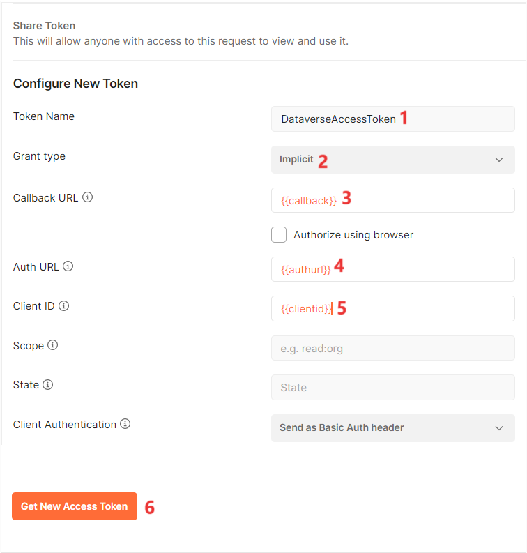](../media/token-details.png#lightbox)

1. Select **Get New Access Token** and then select **Save**.

1. You're prompted to sign in to your account. Sign in with the global administrator account that you've been using thus far.

1. On the **Permissions requested** prompt, select **Accept**. The Authentication is complete. 

1. Select **Proceed**. 

1. On successful authentication, the access token is returned. Select **Use Token**.

	> [!div class="mx-imgBorder"]
	> [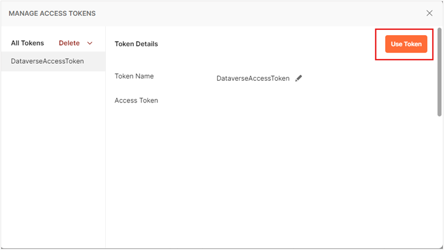](../media/use-token.png#lightbox)

> [!IMPORTANT]
> You can also use the **Client Credential grant** flow to obtain an access token from Microsoft Entra ID to authenticate Postman. To do so, follow these steps:
>
>1. Register a Microsoft Entra ID app.
>
>1. Create a client secret for the app.
>
>1. Grant the Microsoft Entra ID app with the **Sync admin for FHIR APP Reg User** permission on Dataverse.
>
>1. In Postman, under the **Configure New Token** section, use the following values:
>
>    - **Grant Type** - Client Credentials
>
>    - **Access Token URL** - `https://login.microsoftonline.com/{{tenant_id}}/oauth2/v2.0/token`
>
>    - **Client ID** - Client ID of the registered Microsoft Entra ID app
>
>    - **Client Secret** - Client Secret of the registered Microsoft Entra ID app
>
>    - **Scope** - `https://<Dataverse-env>.crm.dynamics.com/.default`

## Use the msind_UpsertBundle API

In this task, you use the **msind_UpsertBundle** API to create a record in the **Contact** entity of Dataverse. You use the Patient FHIR resource bundle as JSON payload.

1. In the **Dataverse-Healthcare-APIs** on the left navigation pane, select on the  three dots and select **Add a request**.

1.  Name the new request to **msind_UpsertBundle_Patient** as you're posting the Patient FHIR bundle to the endpoint.

1.  Select **POST** as the HTTP operation type.

1.  Set the request URL to `https://<Dataverse-environment-name>.crm.dynamics.com/api/data/v9.1/msind_UpsertBundle`.

1.  Under the **Authorization** tab, 

    - Select **Type** - Oauth 2.0
    
    - Add Authorization data to – Request Headers
    
    - Select **DataverseAccessToken** from the **Token** dropdown menu.

	> [!div class="mx-imgBorder"]
	> [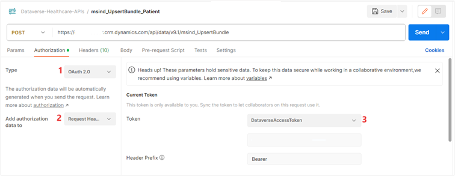](../media/token.png#lightbox)

    > [!NOTE]
    > You can use the **/api/data/v9.1/msind_UpsertBundle** or the **/api/data/v9.2/msind_UpsertBundle** endpoint in your API call.

1.  Select the **Headers** tab and then add the following two request headers:

	-   **Content-Type** - application/json; charset=utf-8
	
	-   **OData-Version** - 4.0

1.  Select the **Body** tab.

1.  Select **raw** and then select **JSON**.

1.  Use the following FHIR bundle as JSON payload.

	```json
	{
	    "msind_BundleTag": "PatientDatatest",
	    "msind_JSON": "{\"resourceType\":\"Bundle\",\"type\":\"batch\",\"entry\":[{\"resource\":{\"resourceType\":\"Patient\",\"id\":\"b7777777-b777-b777-b777-b77777777777\",\"text\":{\"status\":\"generated\"},\"identifier\":[{\"system\":\"https://github.com/synthetichealth/synthea\",\"value\":\"51978986-f824-43da-b69a-d2d17f49df70\"}],\"name\":[{\"use\":\"official\",\"family\":\"Contoso\",\"given\":[\"Allen\"],\"prefix\":[\"Ms.\"]}],\"telecom\":[{\"system\":\"phone\",\"value\":\"555-664-6121\",\"use\":\"home\"}],\"gender\":\"female\",\"birthDate\":\"1965-11-04\",\"address\":[{\"extension\":[{\"url\":\"http://hl7.org/fhir/StructureDefinition/geolocation\",\"extension\":[{\"url\":\"latitude\",\"valueDecimal\":42.605887766784662},{\"url\":\"longitude\",\"valueDecimal\":-71.0695322588603}]}],\"line\":[\"165 Shanahan View\"],\"city\":\"North Reading\",\"state\":\"Massachusetts\",\"country\":\"US\"}],\"multipleBirthBoolean\":false},\"request\":{\"method\":\"POST\",\"url\":\"Patient\"}}]}"
	}
	```

	> [!div class="mx-imgBorder"]
	> [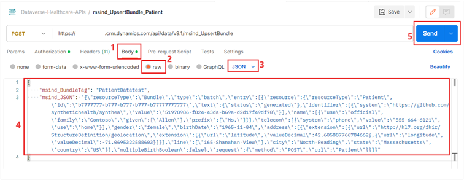](../media/bundle.png#lightbox)

1. Select **Send**.

   After successful implementation of the API request, Dataverse will respond with the HTTP Status code **200 OK**.

	> [!div class="mx-imgBorder"]
	> [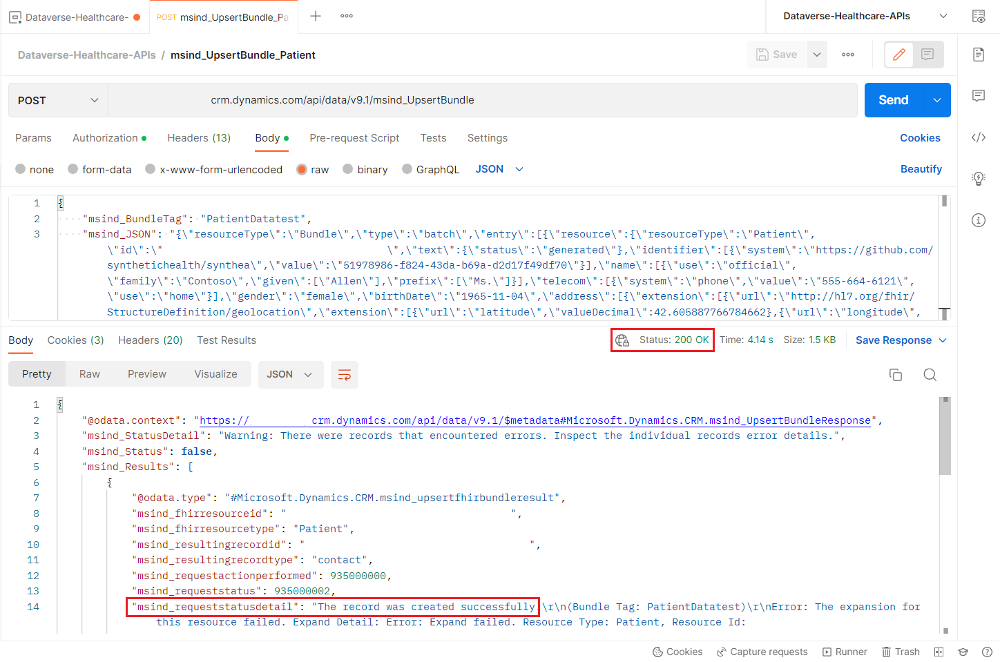](../media/status.png#lightbox)

1. Verify the new patient record in Dataverse, go to [Microsoft Power Apps portal](https://make.preview.powerapps.com/?azure-portal=true), and then select your environment.

1. Select **Dataverse > Tables > Contact** entity to find the newly created patient record.

	> [!div class="mx-imgBorder"]
	> [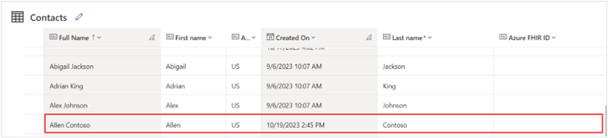](../media/contact-patient.png#lightbox)

## Use the msind_RetrieveBundle API

In this task, you use Postman to call the **msind_RetrieveBundle** Dataverse Healthcare API. This API accepts FHIRResource/ID to look for the respective FHIR resource in Dataverse, and if it's found, then it returns the resource with HTTP Status code 200.

1. On the **Dataverse-Healthcare-APIs** on the left navigation pane, select the three dots and select **Add a request**.

1. Name the new request to **msind_RetrieveBundle_Patient** because you're fetching the Patient FHIR resource from Dataverse.

1. Select **POST** as the HTTP operation type.

1. Set the request URL to `https://<Dataverse-environment-name>.crm.dynamics.com/api/data/v9.1/msind_RetrieveBundle`.

1. Under the **Authorization** tab, 

    - Select **Type** - Oauth 2.0
    
    - Add **Authorization data to** – Request Headers
     
    - Select **DataverseAccessToken** from the **Token** dropdown menu.

	> [!div class="mx-imgBorder"]
	> [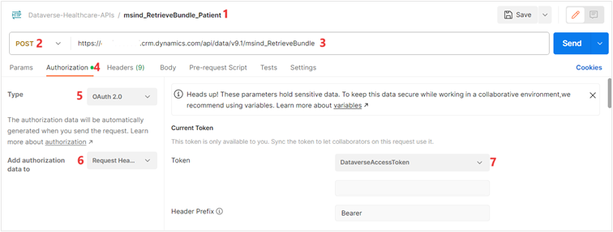](../media/access-token.png#lightbox)

	> [!NOTE]
	> You can use the **/api/data/v9.1/msind_RetrieveBundle** or the **/api/data/v9.2/msind_RetrieveBundle** endpoint in your API call.

1. Select the **Headers** tab and then add the following two request headers:

	-   **Content-Type** - application/json; charset=utf-8
	
	-   **OData-Version** - 4.0

1.  Select the **Body** tab.

1.  Select **raw** and then select **JSON**.

1.  Use the following FHIR bundle as JSON payload.

	```json
	{
	    "msind_FHIRQuery": "Patient/b7777777-b777-b777-b777-b77777777777"
	}
	```

	> [!div class="mx-imgBorder"]
	> [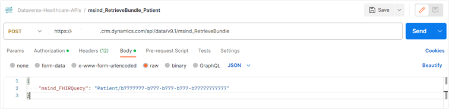](../media/body-code.png#lightbox)

1. Select **Send**.

On successful implementation of the API request, Dataverse responds with the HTTP Status code **200 OK**.

> [!div class="mx-imgBorder"]
> [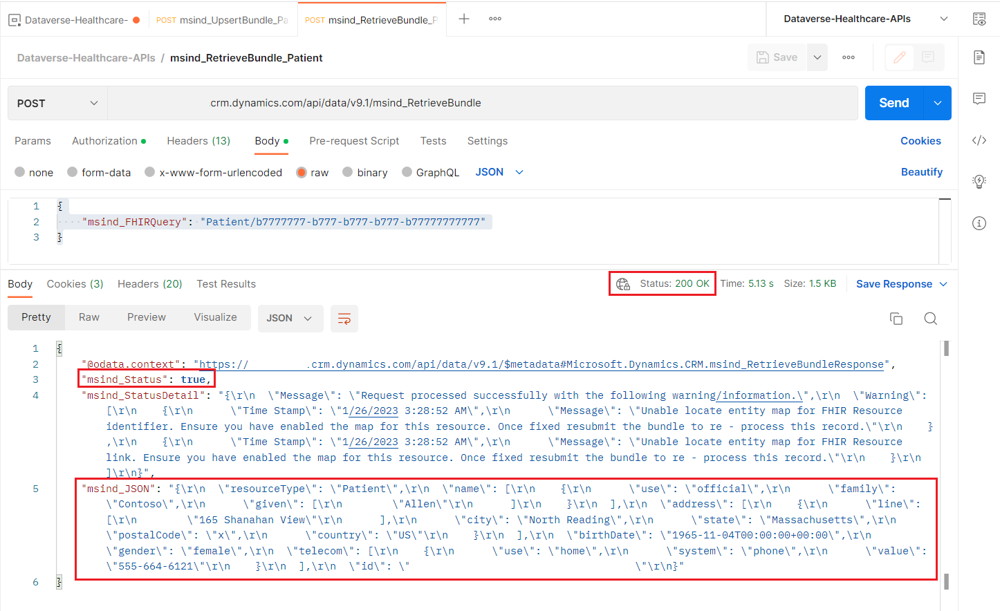](../media/success.png#lightbox)

You successfully used the Dataverse Healthcare APIs by using Postman to create a new record in the **Contact** entity in Dataverse, and then you retrieved the newly created entity from Dataverse.
