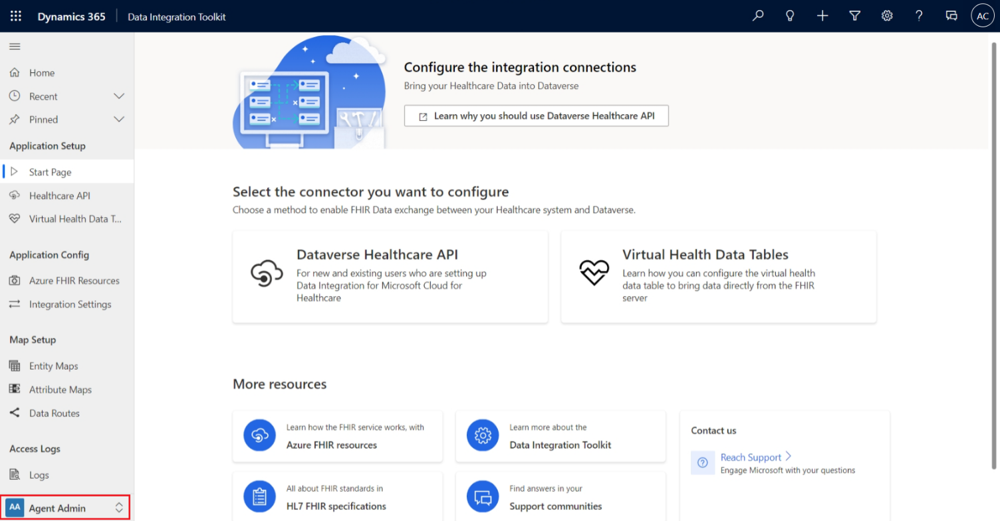
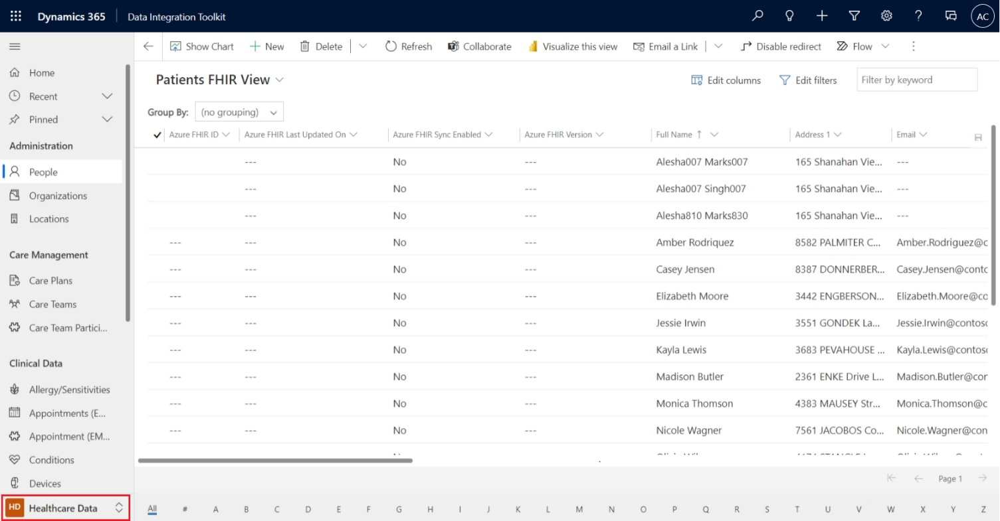

**Data Integration Toolkit** is a collection of tools for administering the integration and interoperability services that are provided with Microsoft Cloud for Healthcare. It enables syncing of patient's health information between EHRs, FHIR servers, and Microsoft Dataverse in a more secure manner. It offers ready-to-use, customizable entity maps, attribute maps, and management tools, enabling healthcare admins to control data flow between FHIR servers and Dataverse. 

This tool offers you two capabilities to work with the protected patient data from within Microsoft Cloud for Healthcare solutions: 

- Bring the protected patient data to Dataverse to access it from Microsoft Cloud for Healthcare solutions. 

- Work directly with the protected patient data from within the Microsoft Cloud for Healthcare solutions by using the virtual health data tables without bringing them into Dataverse, ensuring that the data remains in the original system at rest.

The entity and attribute mapping features offered by the Data Integration Toolkit are essential in supporting interoperability because the Fast Healthcare Interoperability Resources ([FHIR](https://hl7.org/fhir/?azure-portal=true)) standards framework is intricate and allows healthcare providers to share highly sensitive electronic health records (EHRs) and electronic medical records (EMRs) on a range of devices, from computers to tablets to cell phones, with patients' consent. Hence, integrating this data across this digital ecosystem needs careful data mapping. The FHIR framework makes data mapping possible by defining a common standard for exchanging patient data in a more secure and compliant way.

> [!NOTE]
> Effective October 2022, **Azure FHIR Sync Agent** is deprecated and won't be included in the Data Integration Toolkit. Existing users can continue to use it, and it will be fully supported until its retirement in April 2023. We recommend that you use the **Data Ingestion ARM Template** to sync data between FHIR servers and Dataverse.

> [!NOTE]
> **Sync Admin for FHIR** has been rebranded as **Data Integration Toolkit**.

## Entity maps

Entity maps have the following features:

-   They map FHIR resources to Dataverse entities as tables.

-   They're the highest level in the mapping process.

-   You can map one entity to multiple FHIR resources.

-   They help data integration services translate data between two systems and help Dataverse send the correct data to the ingestion pipeline.

-   You can disable or deactivate entity maps that you don't need.

-   You can create a new entity map for custom Dataverse tables.

> [!IMPORTANT]
> You can't delete an entity map that's part of Data Integration Toolkit because they're solution aware. To delete it, you'll need to delete the managed solution from your Dataverse environment. We recommend that you disable or archive the map instead of deleting it.

The following table lists the entity maps that are included with Data Integration Toolkit.

|     Azure FHIR resource    |     Dataverse entity                 |
|----------------------------|--------------------------------------|
|     Patient                |     msemr_medicalidentifier          |
|     Patient                |     msemr_contactlink                |
|     Encounter              |     msemr_encounter                  |
|     Device                 |     msemr_device                     |
|     Observation            |     msemr_observation                |
|     Appointment            |     msemr_appointmentemr             |
|     MedicationRequest      |     msemr_medicationrequest          |
|     AllergyIntolerance     |     msemr_allergyintolerance         |
|     Procedure              |     msemr_procedure                  |
|     Organization           |     Account                          |
|     Location               |     msemr_location                   |
|     Appointment            |     msemr_appointmentemrslot         |
|     RelatedPerson          |     msemr_relatedperson              |
|     Claim                  |     msemr_claim                      |
|     DiagnosticReport       |     msemr_diagnosticreport           |
|     Condition              |     msemr_condition                  |
|     Medication             |     msemr_medication                 |
|     CarePlan               |     msemr_careplan                   |
|     Slot                   |     msemr_slot                       |
|     Schedule               |     msemr_schedule                   |
|     CareTeam               |     msemr_careteam                   |
|     Patient                |     Contact                          |
|     Practitioner           |     Contact                          |
|     CareTeam               |     msemr_careteamparticipant        |
|     Participant            |     msemr_careteamparticipantrole    |

## Attribute maps

Attribute maps have the following features:

-   They refer to mapping of FHIR resource fields to Dataverse attributes as columns.

-   In an entity, one attribute maps to one element in the FHIR resource.

-   You can export the mapping information to a Microsoft Excel file.

-   If you don't need an attribute map for an entity that's included in the Data Integration Toolkit, then you can disable or deactivate the attribute map.

-   Disabled attribute maps continue to appear in the **Active Update Service Attribute Maps** view.

-   To remove the attribute map from the **Active Update Service Attribute Maps** view, you can archive the attribute map.

Data Integration Toolkit helps make the healthcare data administrator's tasks less complicated with the following capabilities:

-   **Entity maps** and **attribute maps** - Out-of-the-box entity maps and attribute maps for FHIR data simplifies integration between Azure-based FHIR servers and FHIR-enabled endpoints with Dataverse. These mappings are extensible and configurable, so the admin can tailor maps to fit their exact FHIR data needs.

-   **Transaction logs** - The **Logs** option in Data Integration Toolkit enables the administrator to view and sort these logs, so they can validate the data maps and identify issues that affect EHR and EMR data.

> [!NOTE]
> **Data Integration Toolkit** is deployed automatically when you deploy any Microsoft Cloud for Healthcare solution through the Microsoft Solutions Center.

> [!NOTE]
> We recommend that you keep your patient, physician, managed clinical data, and referenced clinical data synced with Microsoft Cloud for Healthcare.

Consider the following factors while working with Data Integration Toolkit:

-   Values of unique, unmapped attributes in either entity don't sync. For example, an entity map for **FHIR Patient - Dataverse Contact** might have unique attributes in either entity. As such, you can't map those attributes, so the values of those attributes won't sync. For example, if you install Data Integration Toolkit through Microsoft Solutions Center without installing other Microsoft Cloud for Healthcare solutions, then the entities in Dataverse, such as **Contact**, will have only out-of-the-box fields that are specific to Microsoft Power Platform that don't exist in the FHIR specification. Therefore, these fields won't be mapped, and data synchronization won't happen.

-   Patient consent is mandatory to sync a **Patient** resource (**Contact** in Dataverse) with Dataverse.

-   Data Integration Toolkit assumes that patient data originates from Azure Health Data Services. However, after a user or patient activates the account by consenting, the user, clinicians, and administrators can create new entity records in Dataverse, such as new appointments.

-   You can turn off or turn on the desired entity and attributes to sync.

-   By default, all entity maps are disabled in the Data Integration Toolkit. Enable only the required entity maps that are required for your system to operate.

-   Don't sync the data that you don't need. This approach reduces the data consumption in Dataverse, thereby reducing the overall cost.

The following table describes the three security roles that are available when you're working with Data Integration Toolkit.

|     Security roles                                |     Personas                                                                                                |     Role description                                                                                                                                                                                 |
|---------------------------------------------------|-------------------------------------------------------------------------------------------------------------|------------------------------------------------------------------------------------------------------------------------------------------------------------------------------------------------------|
|     Sync Admin for FHIR App   Reg User            |     Dataverse app user account                                                                              |     This role allows a sync   agent, such as a Microsoft Entra ID registered app or user, to access Dataverse to sync   the data with Azure FHIR server.                                                         |
|     Sync Admin for FHIR   Config Administrator    |     Healthcare data admins                                                                                  |     This role allows the data   admins to work with the entity and attribute maps and to set up the   integration settings for Dataverse Healthcare APIs and virtual health data   tables.    |
|     Sync Admin for FHIR   Healthcare User         |     All Microsoft Cloud for   Healthcare users who need to access the Data Integration Toolkit features    |     This role enables people   to use Microsoft Cloud for Healthcare while the data sync is in progress.                                                                                          |

All features in the Data Integration Toolkit are grouped under two categories: **Agent Admin** and **Healthcare Data**. The left navigation in the following screenshot shows the features targeted to sync agent admins.

> [!div class="mx-imgBorder"]
> 

The options that are available in the **Agent Admin** category include:

-   **Application Setup** - The options in this section, such as **Healthcare API** and **Virtual Health Data Tables**, provide tutorials to help you set up the respective component.

-   **Azure FHIR Resources** - This option lists all FHIR resources with their descriptions.

-   **Integration Settings** - This option lets you edit the settings that pertain to the **Dataverse Healthcare API** and **Virtual Health Data Tables** connectors.

-   **Entity Maps** - This option lets you complete operations, such as enable/disable entity, enable/disable writeback to FHIR for the out-of-the-box mapped entity, and create a new update service entity map record.

-   **Attribute Maps** - This option lets you complete operations, such as enable/disable on the out-of-the-box mapped attributes and create a new update service attribute map record.

-   **Data Routes** - This option allows you to set up the route definition for an entity to decide whether the FHIR data should be synced with Dataverse or virtual health data tables. The data routing configuration allows the health data administrators change the provider for the data for the selected Dataverse entity, which enables dynamic routing of the data to the virtual table or the native table.

-   **Logs** - This option lets you access the FHIR data synchronization logs to sort and identify synchronization-related issues.

The following screenshot illustrates that a healthcare data administrator can use the Data Integration Toolkit to work with different types of healthcare data, such as administrative, care management, clinical data, and financial data, all in one place. This data appears only after patients give their consent to share their healthcare data, and this process is called *consent flow*. The consent flow for healthcare data is a way to protect patient information. Only the patient’s FHIR resource and the **Contacts** entity in Dataverse will have this consent flow. No other information in Dataverse works this way. For example, when the patient consents in Patient Portal to have their information brought into the Microsoft Cloud for Healthcare system, then this consent flow is initiated and then the patient's data begin flowing into the Microsoft Cloud for Healthcare system.

> [!div class="mx-imgBorder"]
> 

