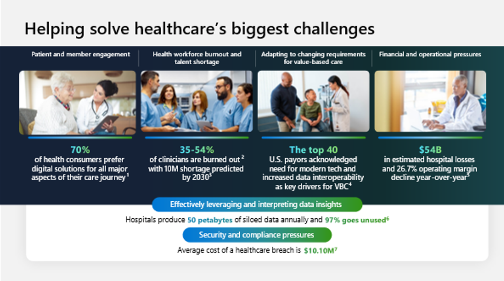
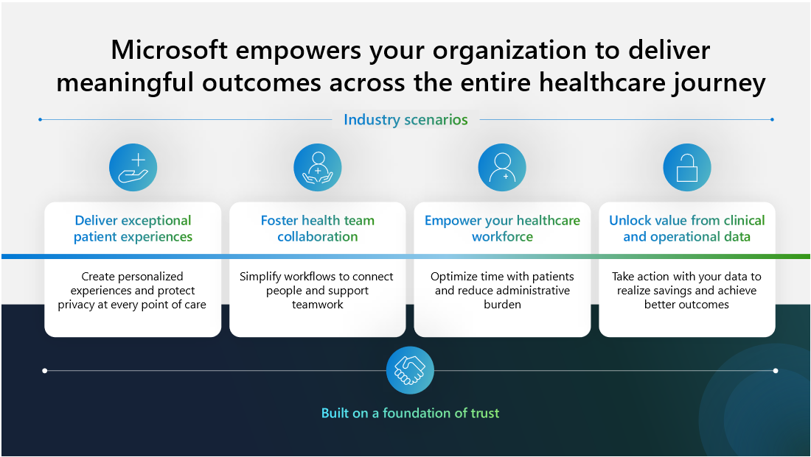
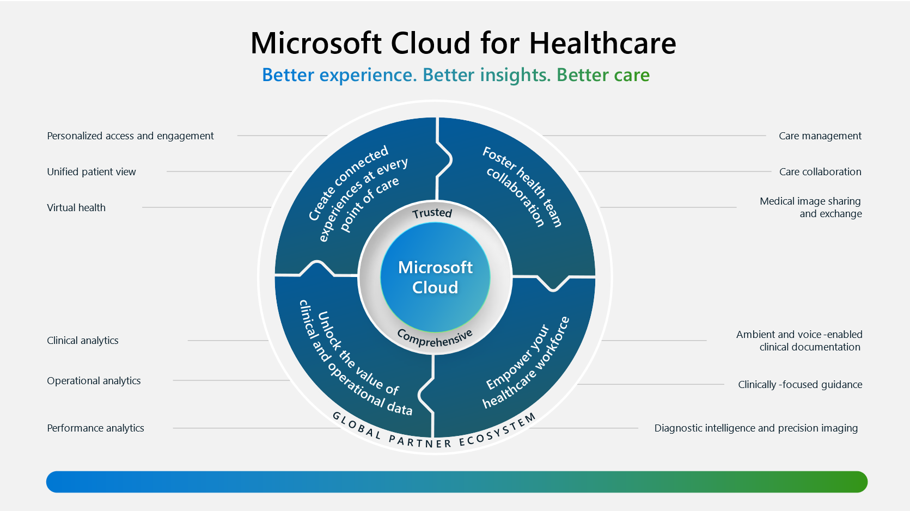

In the era of AI, Microsoft Cloud for Healthcare helps healthcare organizations and partners accelerate their data and AI journey by augmenting the Microsoft Cloud with industry-relevant capabilities, solution templates, and components. 

Microsoft helps make it easier for your organization to:

- Create connected experiences at every point of care.

- Provide tools that foster collaboration.

- Empower your healthcare workforce.

- Unlock the value from clinical and operational data.

Microsoft uses the data standards that are important to healthcare. Every organization needs to safeguard their business, customers, and data, particularly in this era of AI. Microsoft Cloud for Healthcare functions with trust in mind, helping every organization build safety and responsibility into their AI journey from the beginning.

The following sections discuss how healthcare is currently in transition and how Microsoft Cloud for Healthcare helps transform the healthcare journey.

## Key healthcare challenges in an AI era

Over the last two years, healthcare organizations confront the burden of an unprecedented volume of challenging moments that forced many to rethink established norms and operational best practices. In the rapidly evolving landscape of healthcare, several key challenges emerged that require careful consideration and innovative solutions. For these challenges, ranging from workforce shortage issues to data management complexities, healthcare organizations seek to adapt and thrive in the modern era.

Burnout has reached crisis levels, and burnout among health workers has harmful consequences for patient care and safety. Some consequences include decreased time spent between providers and patients, increased medical errors, and a shortage of workers when clinicians leave the profession. Surveys show that between 35-54% of clinicians are suffering burnout.

A current projection shows a possible worldwide shortage of 10 million frontline healthcare workers by 2030. This projection emphasizes the importance for healthcare organizations, people, and technology to adapt and find a new purpose in unpredictable contexts.

Modern healthcare organizations have data coming from multiple sources. In fact, up to 80% of the time that providers spend analyzing data is wasted on ingestion and unification. Currently, the amount of data that's being created, shared, and stored is growing exponentially. Moreover, the requirements to keep this data secure, private, and compliant are more complex.

Healthcare systems need to connect the physical and digital experiences so that they can better serve patients in new and more personalized ways. As a result, patients can receive specialized care where, when, and how they need it.

Reimagining the next healthcare era involves continued agility in responding rapidly and predicting what’s next. This reimagining requires a new approach to healthcare solutions, one that harnesses data as a resource and turns its potential into power.

> [!div class="mx-imgBorder"]
> 

## Microsoft Cloud for Healthcare

Microsoft Cloud for Healthcare helps healthcare organizations and our partners accelerate their data and AI journey by augmenting the Microsoft Cloud with industry-relevant data solutions, capabilities, and solution templates. As a result, organizations can create connected patient experiences, improve clinician experiences, and adopt data standards that are important to healthcare. By using AI that combines multiple sources, healthcare organizations can give full visibility into data, relieve administrative burden, and improve process and workflow efficiency. As a result, the organizations create actionable insights that deliver better care faster and at a lower cost. 

Microsoft solutions are uniquely positioned to amplify an organization’s ability to help others. By using trusted AI, organizations can address their biggest challenges and transform the future of work in healthcare.

The following sections explain how Microsoft Cloud for Healthcare provides a foundation that supports these principles.

## Priority healthcare scenarios

Microsoft Cloud for Healthcare provides integrated and trusted capabilities. These capabilities unify structured and unstructured data to reveal actionable insights from intelligent data analytics and drive efficiency by automating high-value workflows.

> [!div class="mx-imgBorder"]
> 

These capabilities support four priority scenarios of Microsoft Cloud for Healthcare:

- **Create exceptional patient experiences** - Connect your data and use AI to unlock better patient experiences.
	
- **Foster health team collaboration** - Help your team make more data-driven decisions by using AI to streamline workflows and automate redundant tasks.

- **Empower your healthcare workforce** – Focus your clinicians on high-value work with AI-enabled tools that enhance productivity. 

- **Unlock value from clinical and operational data** - Take action with your data to realize savings and achieve better outcomes.

Microsoft Cloud for Healthcare is built on a foundation of trust and Microsoft’s Responsible AI principles. Through these innovations, Microsoft helps make it easier for healthcare organizations to support evolving security and privacy standards, manage evolving compliance regulations, and continually improve data governance.

## Featured healthcare capabilities

This section discusses the capabilities around the value chain and how Microsoft and Nuance can further transform their patient experiences and enhance clinician experiences.

You can deploy each capability one at a time or in groups. Additionally, you can use your existing investments in Microsoft Cloud technologies by applying these capabilities to solutions that are already deployed in their environment.

These capabilities are built with the desired outcome of delivering better patient experiences, delivering better insights that drive positive change, and providing better care across the entire care continuum.

> [!div class="mx-imgBorder"]
> 
