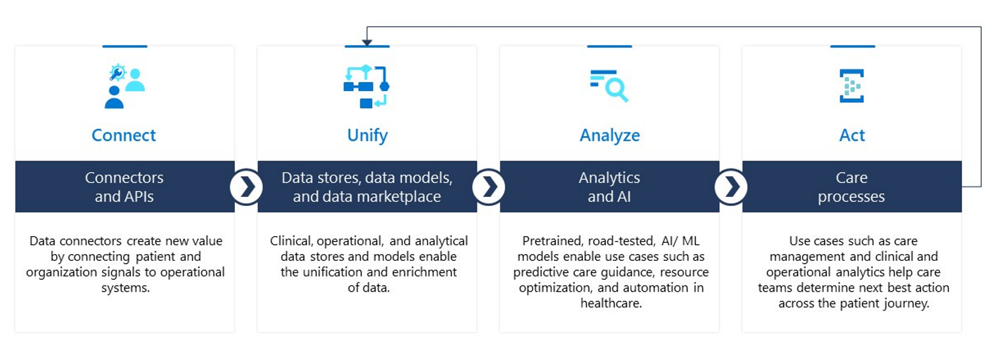
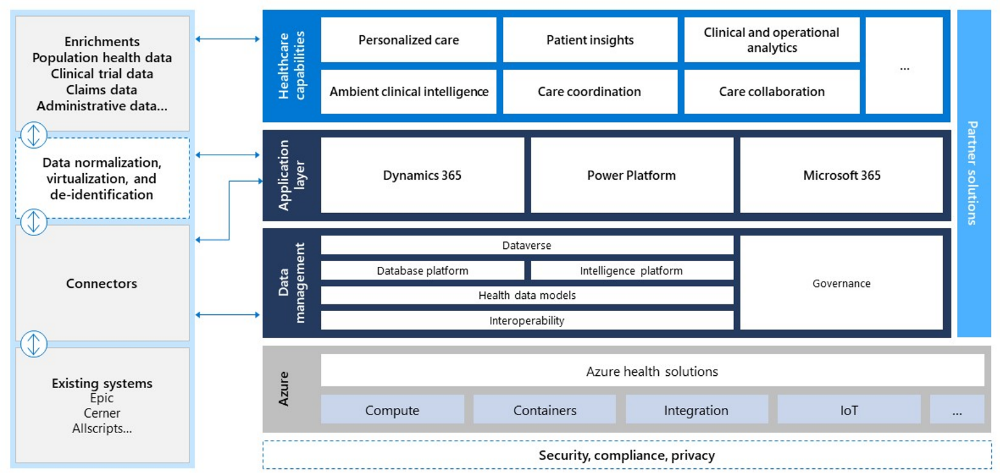
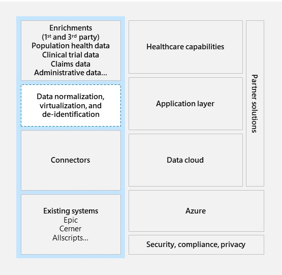
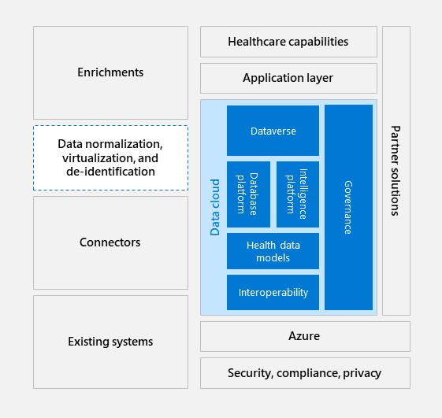
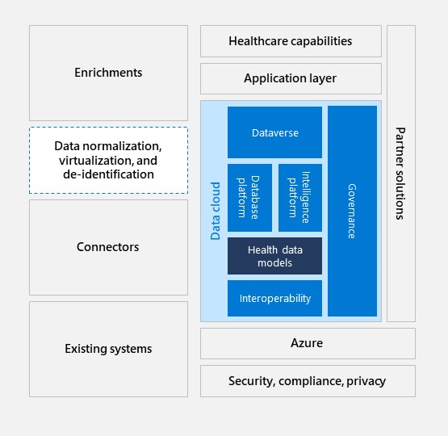
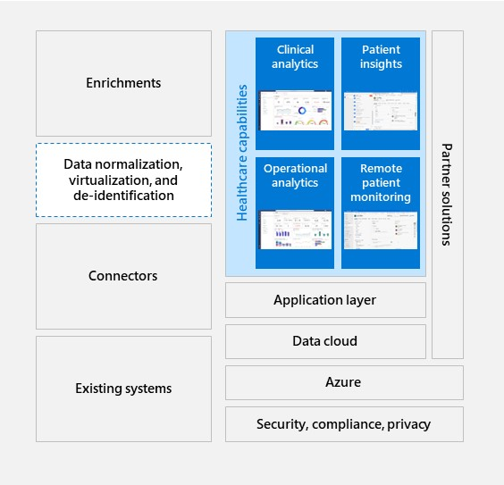

With Microsoft Cloud for Healthcare, you can connect data from across systems, creating insights that help healthcare providers predict risk and help improve patient care, quality assurance, and operational efficiencies.

Additionally, Microsoft Cloud for Healthcare helps you:

- **Drive workflow efficiency** - Help your clinicians spend more time with patients rather than using their personal time to catch up on necessary tasks.

- **Decrease administrative burden and reduce operational challenges** - Help improve clinicians’ performance by creating a more productive and satisfying work environment. This approach helps clinicians feel more valued, in control of their schedule, and better able to prioritize patient care.

- **Improve the quality of documentation to translate into higher revenues** - Capturing documentation accurately and completely helps ease authorization processes, reduce denials, promote proper reimbursements, and assist the care team in supporting higher patient volumes.

The following sections describe key features of Microsoft Cloud for Healthcare that can help empower your healthcare workforce.

## Ambient and voice-enabled documentation
**Ambient and voice-enabled documentation** is an AI-powered, voice-enabled solution that automatically documents patient encounters accurately and efficiently at the point of care. For use in office and telehealth settings, Nuance DAX enhances the quality of care and patient experience, increases provider efficiency and satisfaction, and improves financial outcomes.

## Clinically focused guidance
With the **Clinically focused guidance** solution, you can capture the patient story more naturally and efficiently so that providers spend less time on documentation and more time improving the quality of care.

## Diagnostic intelligence and precision imaging
The **Diagnostic intelligence and precision imaging** solution is a cloud-based medical image sharing and exchange platform that helps accelerate patient care delivery and reduces costs that are associated with inefficient image sharing. Additionally, it offers new opportunities for revenue growth and expansion.

## Unlock value from clinical and operational data
Beyond the patient view, Microsoft Cloud for Healthcare also helps maximize the value of data at a clinical and operational level.

At the clinical level, Microsoft Cloud for Healthcare helps customers and partners build use cases that allow organizations to:

   - Harness analytics and machine learning to give providers insights into their patients’ health and identify promising treatments and interventions.

   - Process patient data to identify patterns and correlations in symptoms that accelerate diagnostics, identify population trends for precision medicine, and use modeling to manage population health.

   - Reduce readmissions for high-risk patients by providing timely escalations of care and preventative interventions based on real-time patient telemetry.

At the operational level, use cases can include:

   - Integrating patient medical record results and using predictive analytics, managing surges in demands and improving care team response processes, and using operational data from equipment, EHRs, and staffing systems.

   - Automating duplicative tasks, preventing costly downtime from equipment failures and inventory shortages, and using AI to manage data efficiently and to better allocate expensive resources through processes like predictive maintenance.

   - Replacing data silos with centralized, analytics-driven platforms, identifying future markets and areas for new investments, driving strategic pricing models, and helping facilities reach sustainability goals.

## How the data flow works

The following screenshot shows a high-level framework of the flow of data in Microsoft Cloud for Healthcare.
 
   > [!div class="mx-imgBorder"]
   > 

The data flow starts with connectors and APIs that help connect data, which sets the stage for new values by connecting healthcare-specific signals to operational systems. Then, analytical and operational data stores, data models, and a data marketplace provide the unification and enrichment of data. Next, pretrained, road-tested, AI/ machine-learning models allow use cases, such as predictive care guidance, resource optimization, and automation. The process comes together under the **Act** phase when employees and providers at every level of the organization are empowered to make data-driven decisions. Dashboards streamline use cases, such as clinical and operational insights that help determine the next best action across the patient journey.

Consider this framework, not as a series of discrete buckets, but as a process or cycle. Each step informs the next, and the data travels in both directions. The following sections closely examine the technology that allows this flow.

   > [!div class="mx-imgBorder"]
   > 
 
The preceding diagram shows a more detailed view of the data flow. The left side of the diagram shows the flow of data from existing systems into connectors and enrichments. The right side of the diagram shows the Microsoft product stack that implements Microsoft Cloud for Healthcare. 

Next, you can explore this process step-by-step, starting at the beginning with how you connect business data to set the stage for a new value.

## Step 1: Connect

The data flow process starts with the Connect step, where data is stored on separate legacy systems that don’t speak the same language. Some of that data is in operational or clinical data stores or it comes from apps. On its own, this raw data doesn't have the proper context to provide meaningful insights. Because that data isn’t connected across all data sources, one patient might appear as three separate patients with three distinct behaviors. Therefore, the first step in the process is: Bidirectional connectors enable the import and export of data from existing systems, such as applications and clinical and operational data.

   > [!div class="mx-imgBorder"]
   > 
 
## Step 2: Unify
The next step is to unify data with operational data stores and healthcare-specific data models. 
 
   > [!div class="mx-imgBorder"]
   > 

Clinical, operational, and analytical data stores, such as Microsoft Dataverse and Microsoft Azure Data Lake, provide access to IoT data, edge activation, and scalability. This access helps healthcare workers with industry-specific tasks.

Database and intelligence platform capabilities, such as ingestion pipelines, data harmonization, and orchestration that are tuned to healthcare needs can improve ease of use and time to value (examples include the Dataverse Health Data Exchange API and Azure Health Data Services).

Health data models and database templates organize data into commonly understood shapes and break down data silos across Microsoft and partner datasets. 

Health data models are key components of data flow and interoperability because they: 

- Unify data in a well-known schema with semantic consistency across domains and industry verticals.

- Implement machine understanding of data semantics.

- Manage critical data required for compliance and other regulatory requirements.

- Help ISVs build solutions at scale with proven health data models and accelerators.

   > [!div class="mx-imgBorder"]
   > 

Now that you learned about the benefits of using health data models, your next step is to analyze the data.

## Step 3: Analyze

Most healthcare organizations don’t have access to the data science expertise needed to take advantage of innovative AI and machine-learning technology. So this module prioritizes pretrained and road-tested AI/machine-learning models that solve for healthcare’s most pressing needs. With Microsoft Cloud for Healthcare, customers can rapidly deploy powerful analytics and machine-learning models.

By developing health data models, partners and companies can quickly deploy analytics systems that work regardless of the underlying data sources. Healthcare intelligence applications, such as Microsoft Dynamics 365 Customer Insights, Microsoft Azure Synapse Analytics, Microsoft Power BI, and Microsoft Azure Cognitive Services, help users maximize the value of user data and discover insights that provide better experiences for patients, faster and at scale.

   > [!div class="mx-imgBorder"]
   > 

These technologies create powerful use cases, such as clinical analytics, patient insights, operational analytics, and remote patient monitoring.

