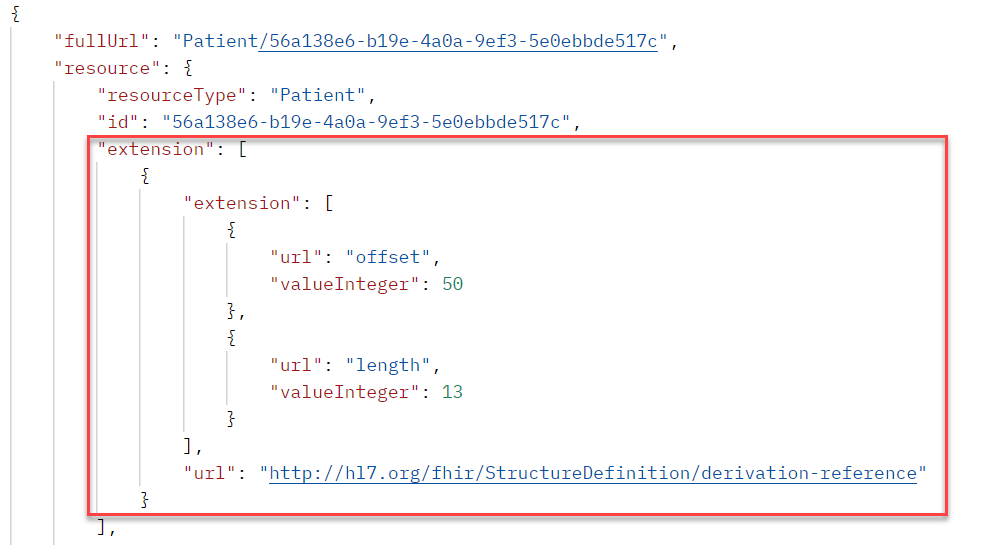
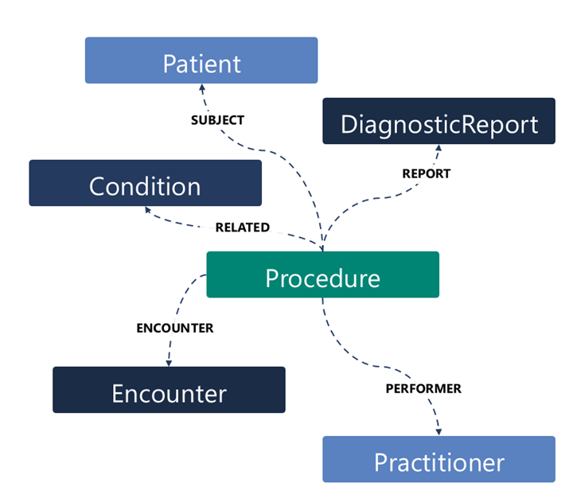
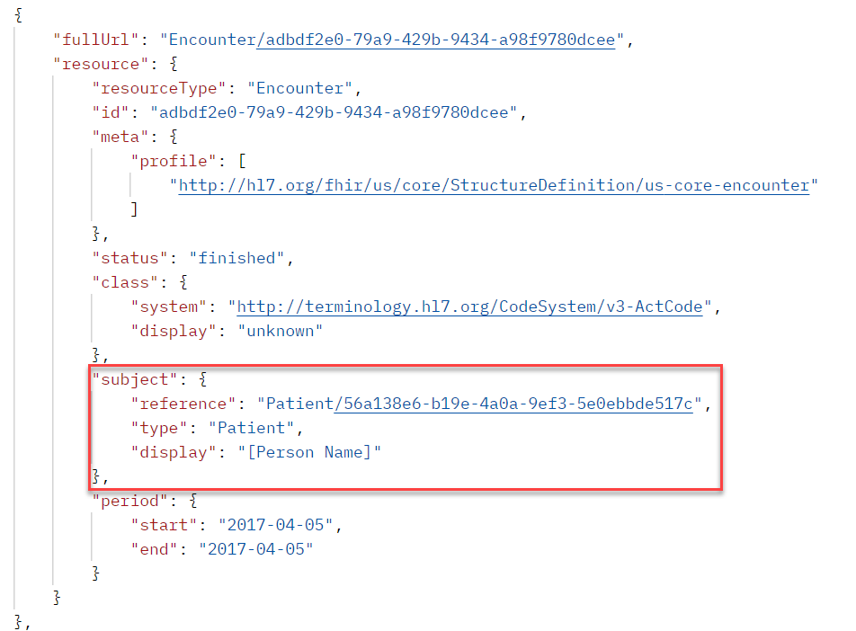

In this unit, you'll explore the Fast Healthcare Interoperability Resources (FHIR®) data structures to understand the format of the data included in the response from Text Analytics for health.

The most fundamental building block of FHIR data is a FHIR resource. A FHIR resource is a discrete piece of data that represents an entity in a healthcare interaction. The following are some common examples of FHIR resources:

-   Patient

-   Practitioner

-   Procedure

-   Medication

-   Condition

All resources have some common data properties that are always present, making them easy to use.

-   A canonical URL, where the structure of the resource type is defined (for example, `http://hl7.org/fhir/StructureDefinition/Patient`).

-   Four data elements: ID, metadata, implicitRules, and language.

-   Elements within metadata, including versionId, lastUpdated, source, profile, security, and tag

Common resource types also have a set of defined data elements that are specific to the domain of those resources. For example, a patient resource must always have a patient identifier, patient name, and gender. For usage where compliance with United States core requirements is desired, the [US Core Implementation Guide](https://build.fhir.org/ig/HL7/US-Core/?azure-portal=true#us-core-profiles) details the requirements for the common resources as part of the [US Core Profiles.](https://build.fhir.org/ig/HL7/US-Core/?azure-portal=true#us-core-profiles).

As part of the data standard, an extensibility framework allows support for extensions to the resource data. Text Analytics for health takes advantage of this extensibility to store the reference to where data was derived from in the original unstructured data. This framework stores the offset and the length of the derived data.

> [!div class="mx-imgBorder"]
> 

## Referencing other resources 

Resources commonly reference other resources to fully describe the data. For example, the following image is an example of a patient procedure.

> [!div class="mx-imgBorder"]
> 

In this example, the procedure connects to many resources that help tell the complete story. The following image shows how the encounter contains a reference to the patient resource.

> [!div class="mx-imgBorder"]
> 

## FHIR resource bundle

A FHIR resource bundle is a container for a collection of resources. The bundle is an exchangeable and persistable collection with clinical integrity. A resource bundle is included in the output from Text Analytics for health when you ask for it as part of the request. Having a bundle as part of the response from the service is helpful to allow sending a set of resources to downstream processing of the data. For example, the [Azure FHIR Importer function](https://github.com/microsoft/fhir-server-samples/tree/master/src/FhirImporter/?azure-portal=true) can import FHIR bundles into Azure Health Data Services.

