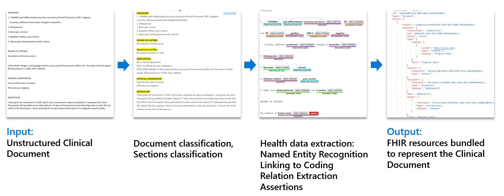

The Fast Healthcare Interoperability Resources (FHIR®, pronounced fire) data standard enables health data storage, querying, and exchange. Using Text Analytics for health, a feature of Azure Cognitive Services, you can convert unstructured health data into a FHIR resource bundle. Having your unstructured data in a FHIR resource bundle enables interoperability with FHIR-compliant systems. For example, after using Text Analytics for health to create a FHIR resource bundle for a patient visit summary, Azure Health Data Services could be used to add the data to the patient's health record. 

The following process helps convert the unstructured data to a FHIR resource bundle.

> [!div class="mx-imgBorder"]
> 

The [FHIR standard](https://hl7.org/fhir/?azure-portal=true) created by Health Level Seven International (HL7), a global non-profit health data organization. FHIR differs from traditional document-based data storage by structuring healthcare data around the people, places, and other entities that are connected with healthcare interactions. These people, places, and other entities are referred to as resources in FHIR. A collection of these resources is a bundle and can contain references between the included resources.

Text Analytics for health can be configured to output a FHIR resource bundle in addition to its normal output from processing an unstructured document.

Watch the following video, which explores clinical document structuring to FHIR.

> [!VIDEO https://www.microsoft.com/videoplayer/embed/RW1fDSN]

