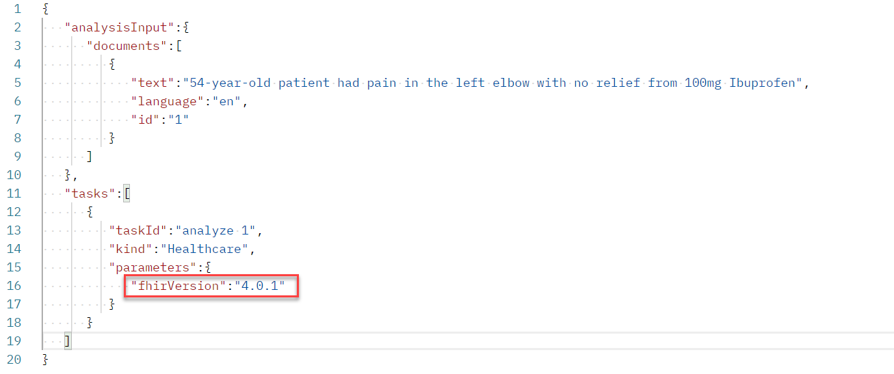
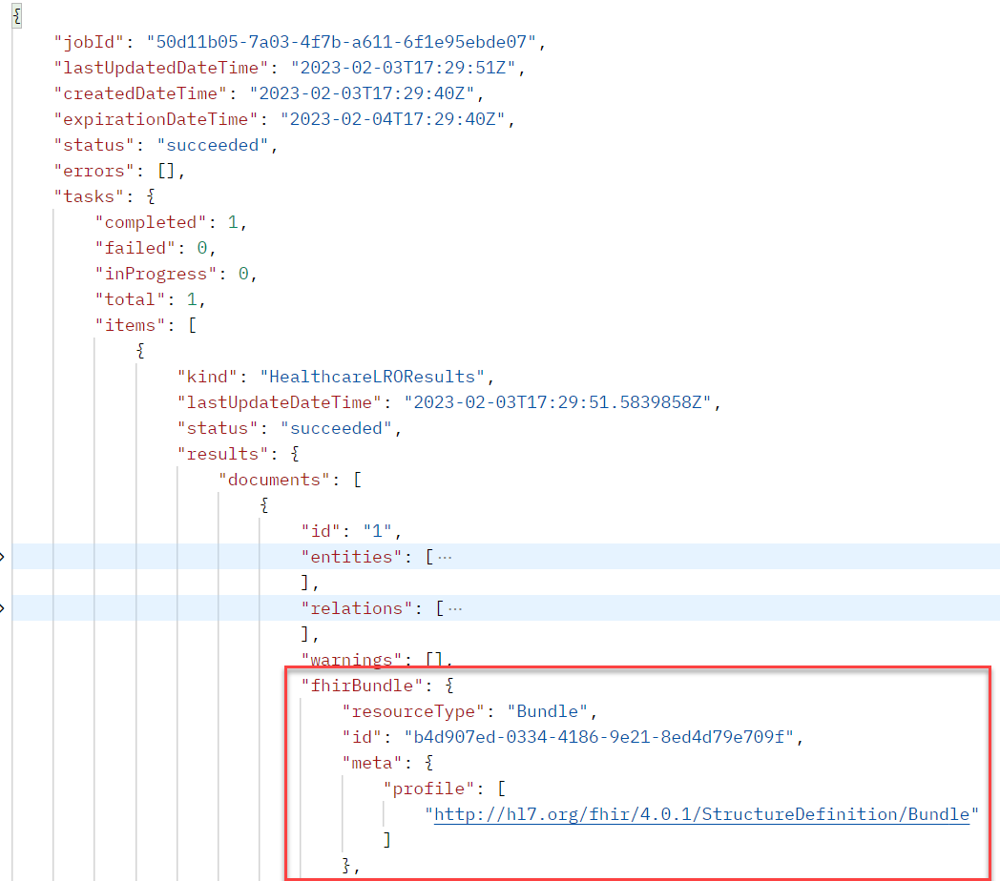
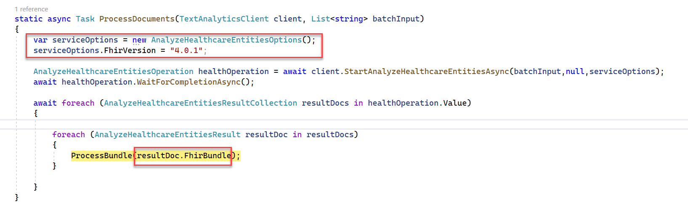

When you process unstructured data using Text Analytics for health, you can request that the output response includes a Fast Healthcare Interoperability Resources (FHIR) resource bundle. The FHIR resource bundle output is enabled by passing the FHIR version as part of the options in each request. How you pass the FHIR version differs depending on whether you're using the SDK or the REST API.

## Use the REST API

When you use the REST API as part of building the request payload, you include a Tasks object. Each of the Tasks can have parameters. One of the options for parameters is fhirVersion. By including the fhirVersion parameter in the Task object parameters, you're requesting the output to include a FHIR resource bundle in addition to the normal Text Analytics for health output. The following example shows the inclusion of fhirVersion in the request parameters.

> [!div class="mx-imgBorder"]
> 

Once the request has completed processing by Text Analytics for health and you pull the response from the REST API, you'll find the FHIR resource bundle in the output. You can locate the FHIR resource bundle inside each document processed using the property name fhirBundle. The following example is output highlighting the fhirBundle.

> [!div class="mx-imgBorder"]
> 

## Use the SDK

You can also use the SDK to make the request for Text Analytics for health to include the FHIR resource bundle in the output. To accomplish this request with the SDK, you would create an instance of **AnalyzeHealthcareEntitiesOptions** and populate the FhirVersion property with the FHIR version. This options object is then passed to each **StartAnalyzeHealthcareEntitiesAsync** method call to configure the request to include a FHIR resource bundle in the output. The following example shows using the option in the request and processing the FHIR resource bundle in the response output.

> [!div class="mx-imgBorder"]
> 

In the above example, you'll notice that the **healthOperation.Value** contains a collection of results, one for each unstructured document processed. On each document result, you'll find a **FhirBundle** property that gives you access to the FHIR resource bundle created by Text Analytics for Health.

> [!NOTE]
> Using the FHIR resource bundle with the SDK is currently in preview and requires using the preview version of the NuGet package.
