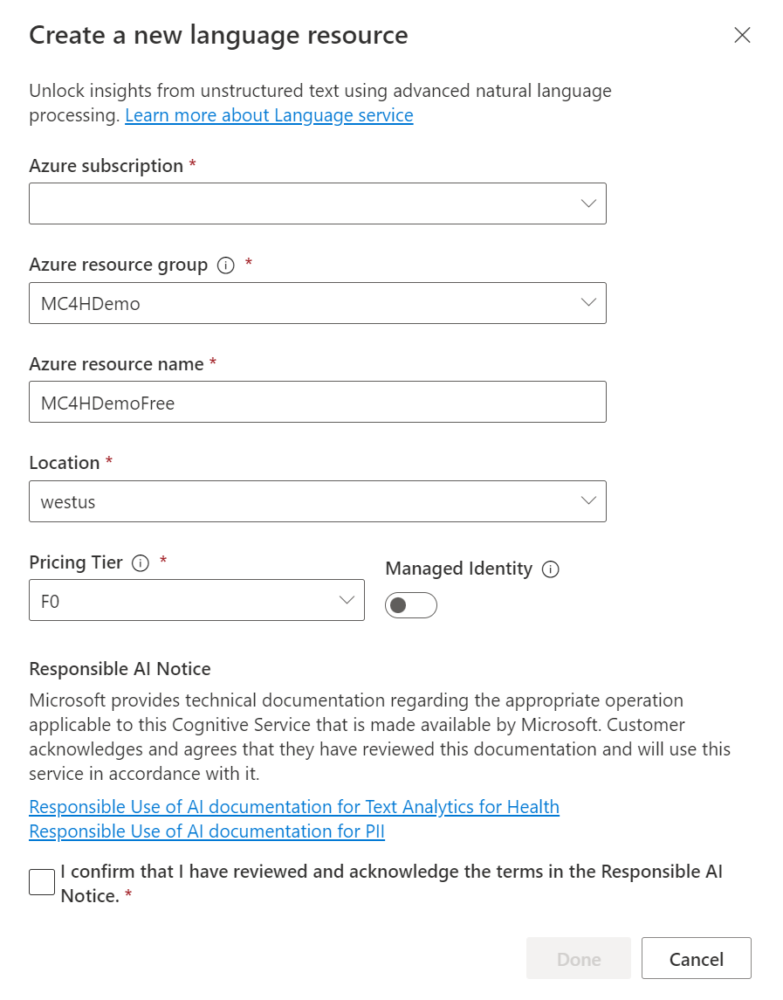
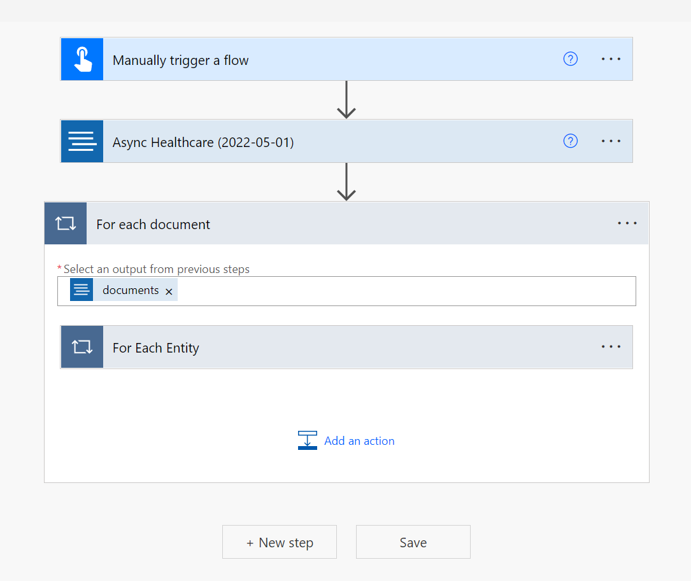
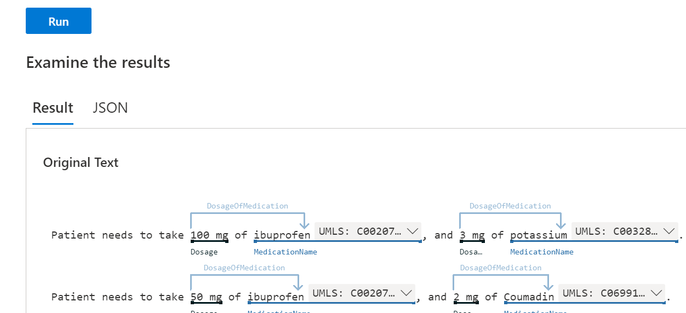

Text Analytics for health is a preconfigured feature of Microsoft Azure Cognitive Service for Language, which provides natural language processing (NLP) features for understanding and analyzing text. Azure Cognitive Service for Language has unified the previously standalone Text Analytics, QnA Maker, and LUIS services into a single service.

The Text Analytics for health AI model is trained on health-specific data. By using Text Analytics for health, you can perform named entity recognition, relation extraction, entity linking, and assertion detection with a single API call. The following functions are essential in processing unstructured health text:

-   **Named entity recognition** - Extracts words and phrases that are mentioned in the text, such as diagnosis, symptoms, or medication names.

-   **Relation extraction** - Identifies connections between entities that are mentioned in the text. For example, the time of condition relation would be identified as 6:30 this morning for the symptom of a sore throat.

-   **Entity linking** - Identifies entities in text and then links the entity to well-known clinical ontologies based on the [Unified Medical Language System (UMLS) Metathesaurus](https://www.nlm.nih.gov/research/umls/sourcereleasedocs/?azure-portal=true).

-   **Assertion** - Results include assertion modifiers that are assigned to medical concepts to provide a deeper understanding of the concept in the text. For example, an assertion could indicate if the text that's contained in a statement is about the patient not being short of breath. The assertion would indicate that the patient was negative for the symptom.

You'll further explore each feature later in this module. These features are essential for structuring the text that's entered into a structure that can be useful.

## Provision Text Analytics for health

You can use Text Analytics for health as a cloud service, or you can deploy it by using Docker containers. By using the cloud service, you can use the API immediately after provisioning. Conversely, the container option allows you to bring the service closer to your data for compliance, security, and other operational reasons.

The first step in using Text Analytics for health is to create a new language resource that's associated with your Azure subscription. During creation, you'll specify a resource group, resource name, and location that's typically best to be close to your usage location.

> [!div class="mx-imgBorder"]
> [](../media/language-resource.png#lightbox)

A key selection when you create a language resource is the [Pricing Tier](https://azure.microsoft.com/pricing/details/cognitive-services/language-service/?azure-portal=true), which is free or standard. Selecting **Free** will allow you a limited number of requests each month, and it's limited from some of the service's full capabilities. We recommend that you select the **Standard** service level for most production usage. For example, using Microsoft Azure Language Studio or containers for deployment are examples that require the standard service. You can change the pricing tier after you've created the language resource, if necessary.

## Use Text Analytics for health

With a language resource deployment completed, you can now use Text Analytics for health. Depending on your needs, multiple options are available regarding how you can use the service:

-   REST API

-   SDKs - Available for .NET, Python, Java, and Node.js

-   Microsoft Azure Logic Apps

-   Microsoft Power Automate

-   Language Studio

In all these options, you're interacting with the endpoint from your provisioned language resource or your deployed container.

The REST API provides the lowest level access and can work with any coding language that's capable of using REST APIs. The SDKs provide the benefit of having a more structured interaction and objects that represent the return data. The following example uses the .NET SDK to call the service and then list the found entities.

```dotnetcli
AnalyzeHealthcareEntitiesOperation healthOperation = await client.StartAnalyzeHealthcareEntitiesAsync(batchInput);
            await healthOperation.WaitForCompletionAsync();
            await foreach (AnalyzeHealthcareEntitiesResultCollection documentsInPage in healthOperation.Value)
            {
                Console.WriteLine($"Results of Azure Text Analytics for health async model, version: \"{documentsInPage.ModelVersion}\"");
                Console.WriteLine("");

                foreach (AnalyzeHealthcareEntitiesResult entitiesInDoc in documentsInPage)
                {
                    if (!entitiesInDoc.HasError)
                    {
                        foreach (var entity in entitiesInDoc.Entities)
                        {
                            // view recognized healthcare entities
                            Console.WriteLine($"  Entity: {entity.Text}");
                        }
  
                }
            }
```

Azure Logic Apps and Power Automate provide a declarative option for creating workflows that include Text Analytics for health. By using the Azure Cognitive Service for Language connector, you can create flows that process unstructured health text as part of their logic. The following example is of a Power Automate cloud flow looping through each entity that's returned from the Async Healthcare operation.

> [!div class="mx-imgBorder"]
> [](../media/flow.png#lightbox)

## Use Language Studio

The quickest way to use the feature is to use Language Studio, which allows you to explore how Text Analytics for health works without writing code. You can provide the text that you want to process or a file that contains the text. Language Studio makes the request and then displays the results. A helpful visual tool in Language Studio shows the results, allowing you to view the result of processing the data and identifying entities and relationships. The following example shows the results of a request.

> [!div class="mx-imgBorder"]
> [](../media/result.png#lightbox)

Language Studio is a great way to prototype your application and understand how Text Analytics for health would process your data. The **JSON** tab shows full details of the response that's represented in JSON. The **JSON** tab contains the same data that your application would make available to you to process the response. 

## Data privacy, security, and transparency

Data is temporarily stored by Azure Cognitive Service for Language for up to 48 hours and then it's purged. The data is encrypted, and only authorized, on-call engineers can access the encrypted data for debugging purposes when a catastrophic failure occurs and a service support request is raised. You can prevent temporary storage of data by using the **LoggingOptOut** query parameter. The **LoggingOptOut** parameter is **true** by default for the health feature endpoints. When you're using the container option, no request data will be sent to the cloud, only telemetry data will be sent for billing purposes.

For more information, see [Azure Cognitive Service for Language data privacy and security](/legal/cognitive-services/language-service/data-privacy?context=%2Fazure%2Fcognitive-services%2Flanguage-service%2Fcontext%2Fcontext/?azure-portal=true).

Transparency notes are part of a broader effort at Microsoft to put its [AI principles](https://www.microsoft.com/ai/responsible-ai/?azure-portal=true) into practice. Transparency notes can help you understand how the AI technology works. An AI system includes the technology, the people who use it and who will be affected by it, and the environment where it's deployed. You can review the transparency note for [Azure Cognitive Service for Language](/legal/cognitive-services/language-service/transparency-note/?azure-portal=true) and the one for [Text Analytics for health](/legal/cognitive-services/language-service/transparency-note-health/?azure-portal=true). Both transparency notes offer valuable information that can help you build solutions by using the service.
