In this exercise, you'll create an Azure subscription, Azure resource group, and a language resource. Then, you'll use the sample text to practice using Language Studio.

## Task: Create an Azure subscription and a resource group
Your first task is to create an Azure subscription and a resource group:

1. If you already have an Azure subscription, you can skip to step 5; otherwise, go to [Discover AI services with an Azure free account](https://azure.microsoft.com/free/ai/?azure-portal=true) and select **Sign in**.

1. Select **Start free**.

1. Fill out the form and then select **Next**.

1. Provide payment information and then select **Sign up**.

1. After creating the Azure subscription, select **Resource groups**.

	> [!div class="mx-imgBorder"]
	> [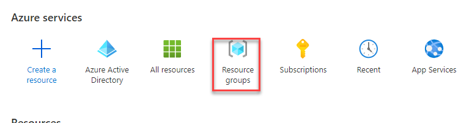](../media/resource-groups.png#lightbox)

1. Select **+ Create**.

	> [!div class="mx-imgBorder"]
	> [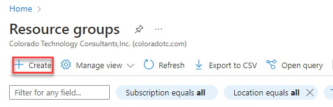](../media/create.png#lightbox)

1. Select the subscription that you created and then enter **DemoLanguageGroup** in the **Resource group** field. Select your **Region** and then select **Review + create**.

	> [!div class="mx-imgBorder"]
	> [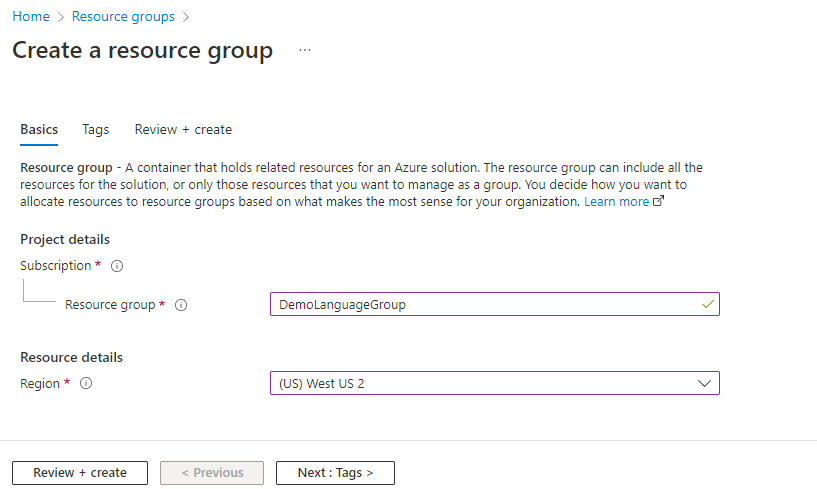](../media/new-resource.png#lightbox)

1. Select **Create**.

## Task: Create a language resource
Next, you'll create a language resource by following these steps:

1. Go to [Language Studio](https://aka.ms/languageStudio/?azure-portal=true) and select **Sign in**.

1. Select your directory from the **Azure directory** dropdown menu, and then select your subscription from the **Azure subscription** dropdown menu. Select **Create a new language resource**.

	> [!div class="mx-imgBorder"]
	> [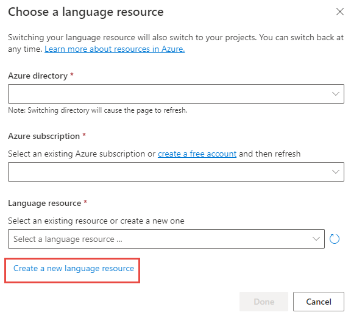](../media/new-language-resource.png#lightbox)

1. Select the Azure subscription and the Azure resource group that you created. Enter **DemoLanguageResourceFL** (replace **FL** with your initials) in the **Azure resource name** field, select your **Location**, and then select **S** from the **Pricing Tier** dropdown menu. Select **Done**.

	> [!div class="mx-imgBorder"]
	> [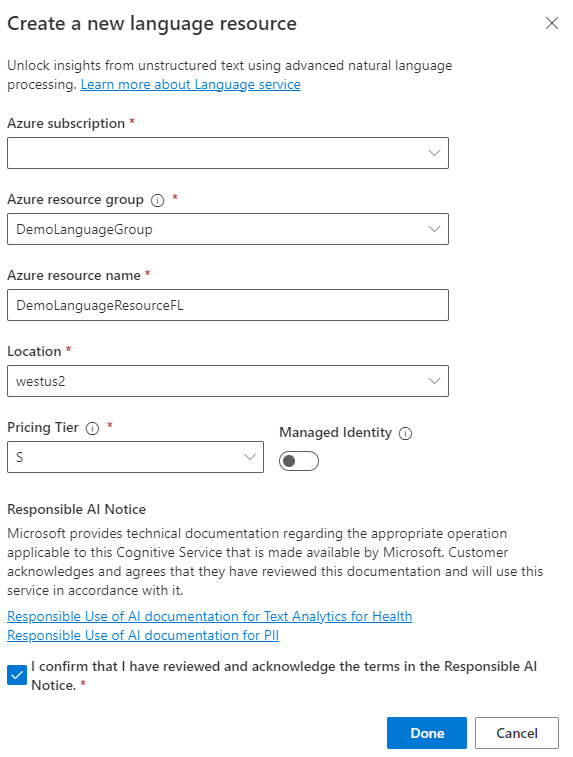](../media/language-resource-dialog.png#lightbox)

1. Wait for the language resource to be created and then select **Done**.

	> [!div class="mx-imgBorder"]
	> [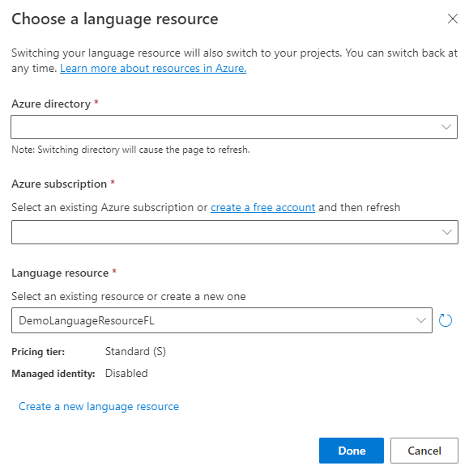](../media/choose-lanaguage-resource.png#lightbox)

1. Make sure that you have the language resource that you created.

	> [!div class="mx-imgBorder"]
	> [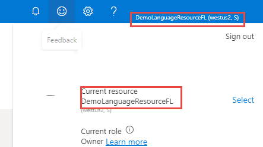](../media/selected-resource-language.png#lightbox)

## Task: Use Language Studio
In this task, you'll use the provided sample text to practice using the Language Studio, and then you'll provide your own text.

1. Go to [https://language.cognitive.azure.com/](https://language.cognitive.azure.com/?azure-portal=true) and select the language resource that you created.

1. Select the **Extract information** tab.

	> [!div class="mx-imgBorder"]
	> [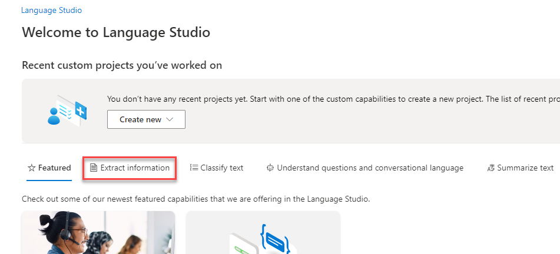](../media/extract-information.png#lightbox)

1. Select **Extract health information**.

	> [!div class="mx-imgBorder"]
	> [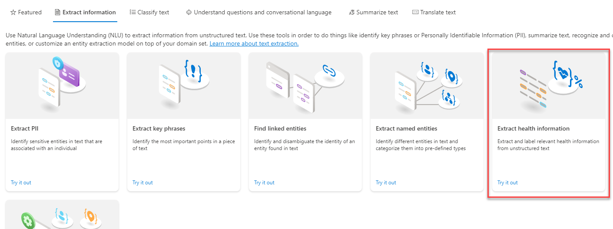](../media/extract-health-information.png#lightbox)

1. Select **Short Prescription**.

	> [!div class="mx-imgBorder"]
	> [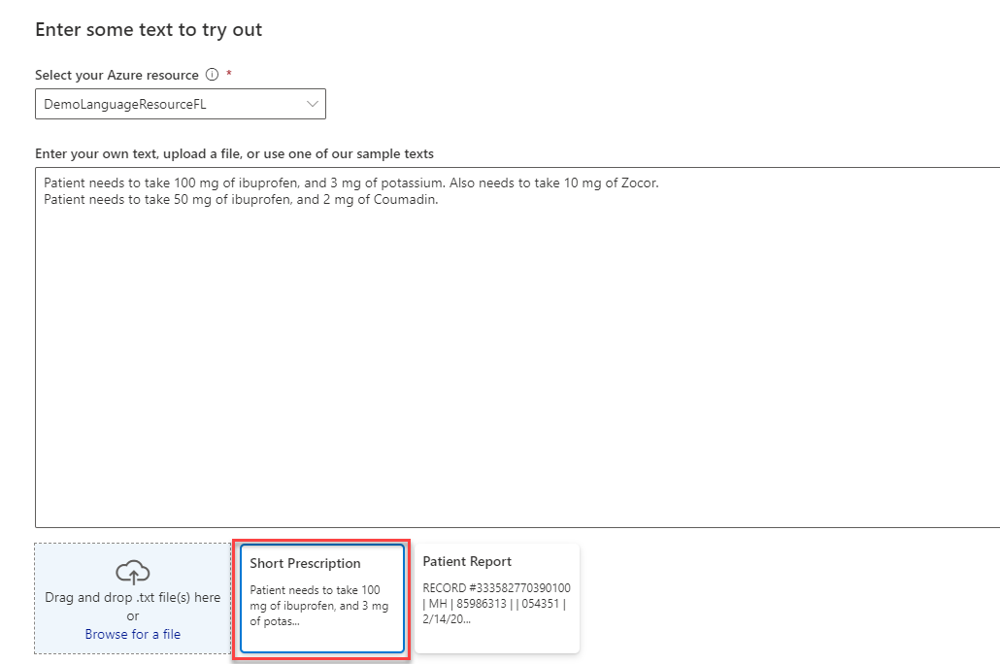](../media/short-prescription.png#lightbox)

1. Select the acknowledgment checkbox and then select **Run**.

	> [!div class="mx-imgBorder"]
	> [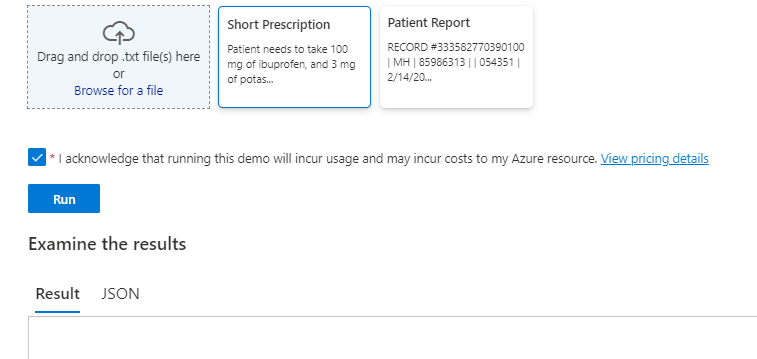](../media/run.png#lightbox)

1. Review the result. Notice how it identifies the relation between the dosage and the medication as a **DosageOfMedication** relation.

	> [!div class="mx-imgBorder"]
	> [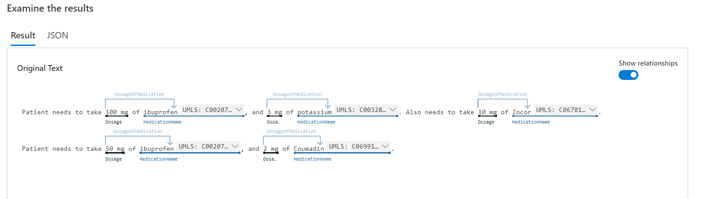](../media/result-tab.png#lightbox)

1. Select the **JSON** tab and review. This raw data is available from the API response.

1. Select **Patient Report** and then select **Run**.

	> [!div class="mx-imgBorder"]
	> [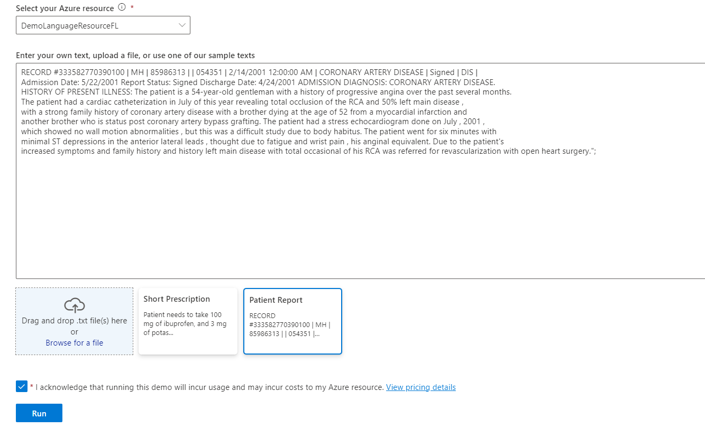](../media/patient-report.png#lightbox)

1. Select the **Result** tab and review the different identified entities.

	> [!div class="mx-imgBorder"]
	> [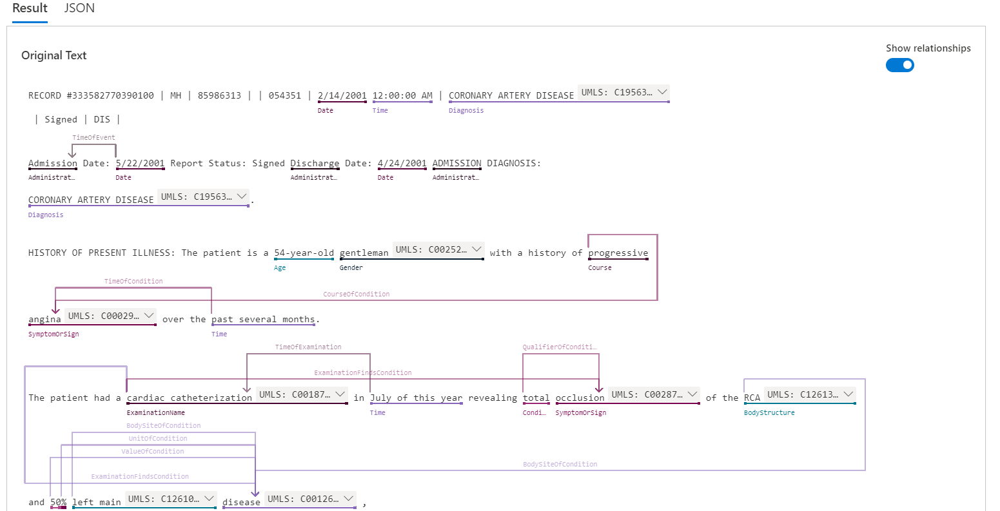](../media/result-entities.png#lightbox)

1. Select **Clear text box**.

	> [!div class="mx-imgBorder"]
	> [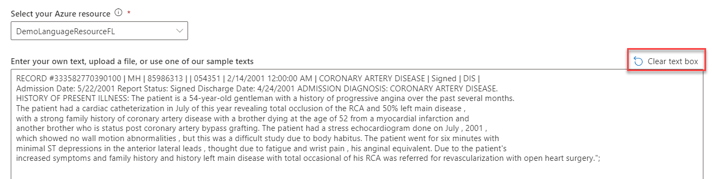](../media/clear-text-box.png#lightbox)

1. Provide your own text. In the **Enter your own text** box, type ***62 year-old gentleman with a history of progressive angina over the past several months. The Patient experienced SOB last night at 8:30pm and called PCPB*** and then select **Run** again.

	> [!div class="mx-imgBorder"]
	> [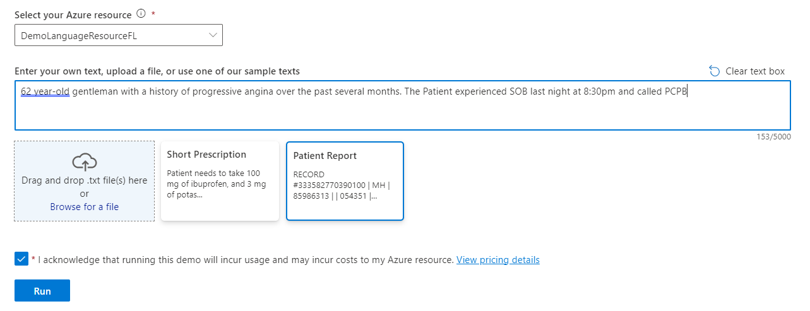](../media/user-provided-text.png#lightbox)

1. Select the **Result** tab to review the result.

The symptom is identified as **angina** and entity linking is to **Unified Medical Language System (UMLS) Metathesaurus**.

> [!div class="mx-imgBorder"]
> [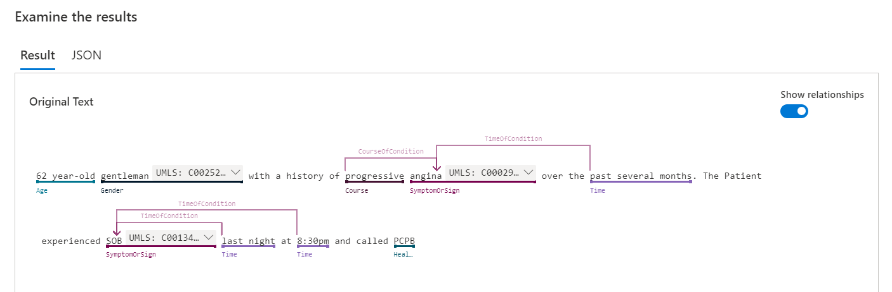](../media/examine-results.png#lightbox)

Now, you can try composing your own test of unstructured medical text data.

