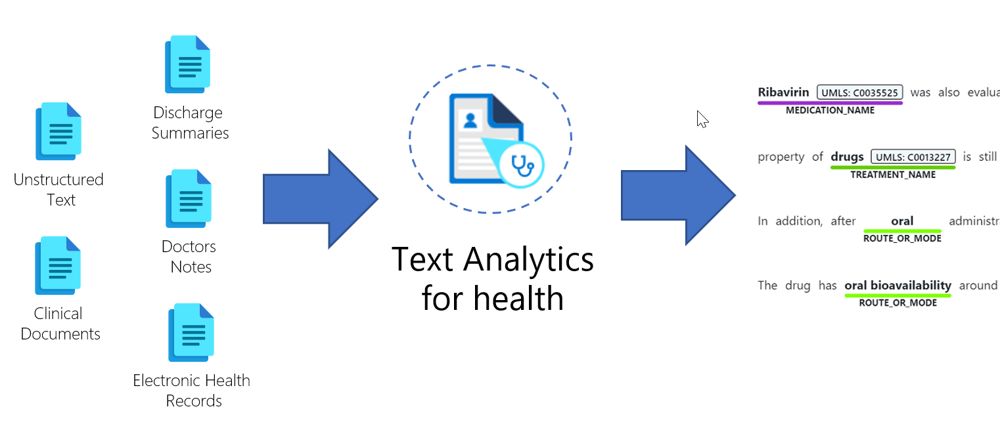

You might broadly classify health data as structured and unstructured health information. With the known format, it's simpler to process structured data, such as telemetry from a medical device or a digital image capture (such as DICOM). Conversely, unstructured data is challenging to work with for processing. For example, a doctor's notes from a patient visit can have insightful information in an unpredictable format. By using Text Analytics for health, a feature of Microsoft Azure Cognitive Services, you can convert unstructured health data into structured health data to enable further processing. The service can write the structured data in the format of a JSON file or as a FHIR bundle of interconnected hierarchical resources.

> [!div class="mx-imgBorder"]
> 

## Health information processed by Text Analytics

Text Analytics for health is trained on and can help structure the following common types of unstructured health information:

-   Clinical trial protocols

-   Clinical notes, such as progress notes, discharge summaries, consultation notes

-   Medical publications and literature

-   Healthcare guidelines

-   Medical encounter transcripts

## Unlock valuable data

By processing unstructured health information with Text Analytics for health, you can use the displayed structured data to derive valuable insights. Using structured data can help researchers, data analysts, medical professionals, and partners unlock a wide range of healthcare scenarios. The following scenarios are real-world examples of what you can accomplish with Text Analytics for health.

### Diagnosis of rare diseases

The first step in identifying rare diseases is symptom identification. Medical notes are often captured and contain symptoms that are intermixed with other general observations in the text. By using Text Analytics for health, you can extract information from clinical notes and cross-reference symptoms with rare disease datasets for analysis. This analysis can help support the physician with relevant insights and help the physician decide on the correct diagnosis and treatment.

### Clinical trial matching

Clinical trials are essential in helping to develop new medical treatments. Quickly matching candidates for the trials can be challenging because the eligibility criteria  of clinical trials is written in an unstructured format. Text Analytics for health can extract the relevant data from the eligibility criteria of clinical trials and then use this information to enable healthcare organizations to match patient data against trial criteria and to identify candidates quicker. Additionally, this capability can empower patients to match their data against potential trials by using information that their physician has already recorded to help identify relevant clinical trials.

### Doctor notes analysis

You can use Text Analytics for health to extract valuable information from clinical notes such as identifying entity categories, including patient diagnoses, condition qualifiers (such as the phase of illness), symptoms, body parts, measurement values, time, and more. Text Analytics for health can also identify which values are negated, such as symptoms that the patient reports as no longer having. Having this information available can enable various follow-up processing options.

### Nurse empowerment

The nurse empowerment solution is an example that uses Text Analytics for health in combination with other capabilities, such as Microsoft Teams, Microsoft Power Apps, Microsoft Power BI, and Nuance to build a complete solution. The solution uses Nuance for speech-to-text to process dictation. Text Analytics for health then processes the text and provides the data's medical structuring. Then, the FHIR API persists the structured data. The combined solution that's created in this example helps nurses with their daily tasks and patient care. For more information, see [Nurse Empowerment](https://github.com/microsoft/NurseEmpowerment/?azure-portal=true).

These examples are only a few of the use cases that are unlocked by Text Analytics for health. You could use it in many different ways, including registry automation, patient intake, symptom matching, and population insights. As you go through the rest of this module, take a few minutes to think about how it could apply to your organization's challenges.
