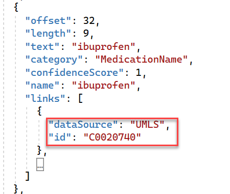

Text Analytics for health processes unstructured health text data and then displays structured data objects that you can use for other processing. In this unit, you'll explore the key outputs, including:

-   Entities and entity linking

-   Relations

-   Assertions

## Entities and entity links

Named entity recognition extracts words and phrases from text. The data is in the entities collection in the output. Each entity object contains the text that was extracted and a category and confidence score. The following example is an entity object in the response JSON:

```json
AnalyzeHealthcareEntitiesOperation healthOperation = await client.StartAnalyzeHealthcareEntitiesAsync(batchInput);
            await healthOperation.WaitForCompletionAsync();
            await foreach (AnalyzeHealthcareEntitiesResultCollection documentsInPage in healthOperation.Value)
            {
                Console.WriteLine($"Results of Azure Text Analytics for health async model, version: \"{documentsInPage.ModelVersion}\"");
                Console.WriteLine("");

                foreach (AnalyzeHealthcareEntitiesResult entitiesInDoc in documentsInPage)
                {
                    if (!entitiesInDoc.HasError)
                    {
                        foreach (var entity in entitiesInDoc.Entities)
                        {
                            // view recognized healthcare entities
                            Console.WriteLine($"  Entity: {entity.Text}");
                        }
  
                }
            }
```

Watch the following video, which explores entity categorization. 

> [!VIDEO https://www.microsoft.com/videoplayer/embed/RWXppI]

For more information on the entity categories, see [Entity categories](/azure/ai-services/language-service/text-analytics-for-health/concepts/health-entity-categories).

The confidence score in the entity object indicates how confident the service is with the entity identification. You can use the confidence score to help decide how to use the data. The [Transparency note for Azure Cognitive Service for Language](/legal/cognitive-services/language-service/transparency-note?azure-portal=true#understand-confidence-scores-for-sentiment-analysis-named-entity-recognition-language-detection-and-health-functions) includes more details on evaluating confidence scores. 

Entity linking will link the extracted text with preferred names and codes from the clinical ontologies that are supported by [Unified Medical Language System (UMLS) Metathesaurus](https://www.nlm.nih.gov/research/umls/sourcereleasedocs/index.html), including ICD9, ICD10, SNOMED-CT, LOINC, and RXNORM. Text Analytics for health looks for the concept in the unstructured data (with more manipulation to catch similar words), according to the relevant language, and then links it to all relevant ontologies. The link contains the data source and the identifier. 

The following example shows the links that are identified for a MedicationName entity.

> [!div class="mx-imgBorder"]
> [](../media/output.png#lightbox)

## Relations

Relations identify connections between entities in the output, similar to relationships in a database between records in tables. The relation is in the output as a collection of relation objects. Each relation object contains the entity reference and the role for that side of the relation. Text Analytics for health can identify over 30 types of relations between entities, such as time of event or medication dosage. The following example shows the relations collection in the result JSON document:

```json
{
  "documents": [
    {
      "id": "id__400",
      "entities": [],
      "relations": [
        {
          "relationType": "DosageOfMedication",
          "entities": [
            {
              "ref": "#/results/documents/0/entities/0",
              "role": "Dosage"
            },
            {
              "ref": "#/results/documents/0/entities/1",
              "role": "Medication"
            }
          ]
        }    
      ],
      "warnings": []
    }
  ],
  "errors": [],
  "modelVersion": "2022-03-01"
}
```

The following video explores examples of identifying relations in unstructured health text data.

> [!VIDEO https://www.microsoft.com/videoplayer/embed/RWXmJo]

## Assertions

The response from Text Analytics for health can include assertion modifiers. The assertions help clarify the context of the concept (or entity) within the text. Text Analytics for health includes assertion modifiers in the response only when they aren't the default value. Each category of assertions has a default value.

The four categories of modifiers are:

-   **Certainty** - Indicates the concept's presence (presence versus absence) and how certain the text is regarding its presence (definite versus possible). The default value for this assertion category is **Positive**.

-   **Conditional** - Indicates if the concept depends on conditions. For example, if the patient has this symptom, prescribe this medication. The doctor prescribes the medication conditionally if the symptom exists. The default value for this assertion category is **None**, meaning that it doesn't depend on a condition.

-   **Association** - Indicates if the text is associated with the subject or someone else. For example, if the text is about a patient, it would be the subject. If the text included something about the patient's father, it would be an association with someone else. The default value for this assertion category is **Subject**, meaning that this assertion modifier will show only if it indicates someone else.

-   **Temporal** - Indicates additional information for a concept detailing whether it is an occurrence related to the past, present, or future. The default value for this assertion category is **Current**, meaning that the concept is related to conditions or events that belong to the current encounter. 

For more information on the assertion categories, see [Assertion modifiers](/azure/ai-services/language-service/text-analytics-for-health/concepts/assertion-detection). 

You can only include one assertion modifier for each assertion category. You can have multiple assertions for different assertion categories.

The following example is an assertion in the output JSON. The example indicates that the patient is negative for short of breath (SOB).

```json
{
    "offset": 381,
    "length": 3,
    "text": "SOB",
    "category": "SymptomOrSign",
    "confidenceScore": 0.98,
    "assertion": {
        "certainty": "negative"
    }
}
```

The following video explores examples of assertion modifiers in the output from Text Analytics for health.

> [!VIDEO https://www.microsoft.com/videoplayer/embed/RWXmJn]

By using the output JSON contents that include entities, entity links, relations, and assertions, you can navigate the output to complete further processing on the processed health text.

