In this exercise, you'll learn how to create a bookable resource that you can use for scheduling a Home Health work order. A bookable resource in Microsoft Cloud for Healthcare is anything that needs to be scheduled. Often, a bookable resource includes people, equipment, and physical spaces (facilities). You'll need to create a bookable resource before scheduling a Home Health work order.

Each resource can have different attributes that distinguish it from others, including:

- Characteristics (such as Accounting)
	
- Categories (such as Manager)
	
- Territories (such as Washington State)
	
- Organizational Unit (such as Seattle Service Delivery)
	
- Location (such as Location Agnostic)
	
- Resource Type (such as User)

## Task: Create a bookable resource

To create a bookable resource in the Home Health application, follow these steps:

1. While signed into your Microsoft 365 tenant, open a new tab, and go to [Microsoft Power Apps](https://make.powerapps.com/?azure-portal=true).

1. Select **Apps** on the left navigation pane.

1. Select **Field Service** app in the right pane. Select the play button.
 
    > [!div class="mx-imgBorder"]
	> [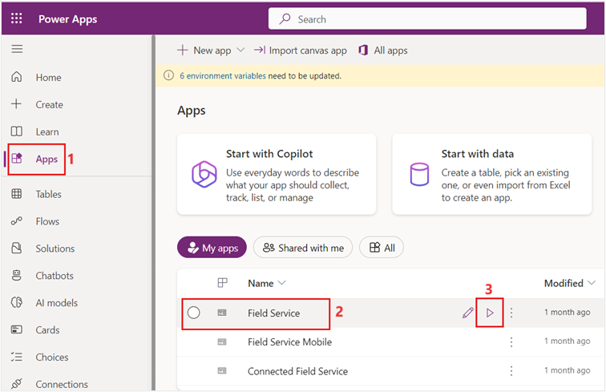](../media/field-service.png#lightbox)

1. Select **Resources** from the lower-left **Change area** menu.
 
    > [!div class="mx-imgBorder"]
	> [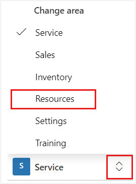](../media/resources.png#lightbox)

1. On the resources page, select **+ New** on the command bar to create a new bookable resource.

 	> [!div class="mx-imgBorder"]
	> [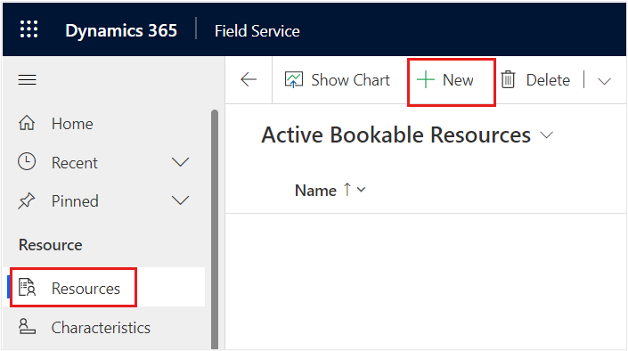](../media/new-bookable-resource.png#lightbox) 
 
1. Select **Resource Type** as **User**, who is a person and a member of your organization that needs access to the **Field Service Mobile** app.

	> [!div class="mx-imgBorder"]
	> [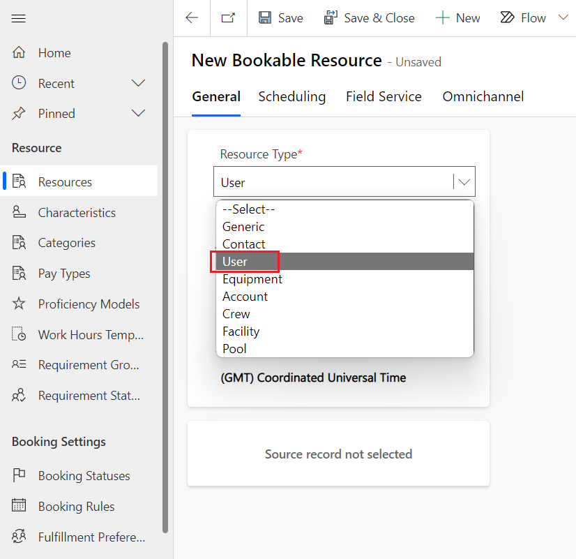](../media/user.png#lightbox)

    > [!NOTE] 
    > Resource Type is a classification that describes the resource and how it relates to your organization.

1. Pick a **User** and then select their **Time Zone**.

	> [!div class="mx-imgBorder"]
	> [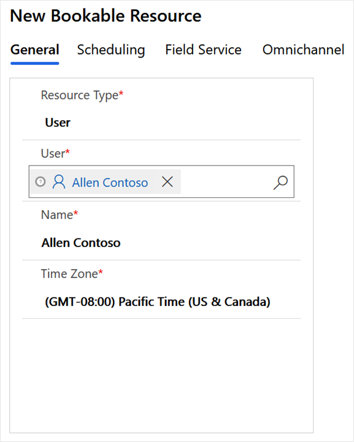](../media/user-resource-type.png#lightbox)

1. Select **Scheduling** tab and then select **Location Agnostic** as value for **Start Location** and **End Location** fields.

	> [!div class="mx-imgBorder"]
	> [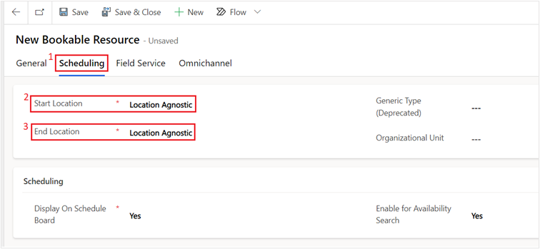](../media/location-agnostic.png#lightbox)

    Scheduling is used to decide the location where a bookable resource starts and ends their workday. Select from the following three start or end location options available:

    - **Location Agnostic** - Select this option if the location of this resource isn't required for the business need and doesn’t need to be considered during the scheduling process. If the work location of the requirement is set to **on site**, location agnostic resources won't return in results.

    - **Resource Address** - Select this option if the resource starts and ends their day at a unique location. The exact location is derived from the latitude and longitude values on the related user, account, or contact records, depending on the resource type.

    - **Organizational Unit** - Select this option if the resource starts and ends the day at an organizational unit, which typically represents a company location.

1.  Select the **Field Service** tab to optionally configure other aspects of the bookable resource. **Save** the record.

	> [!div class="mx-imgBorder"]
	> 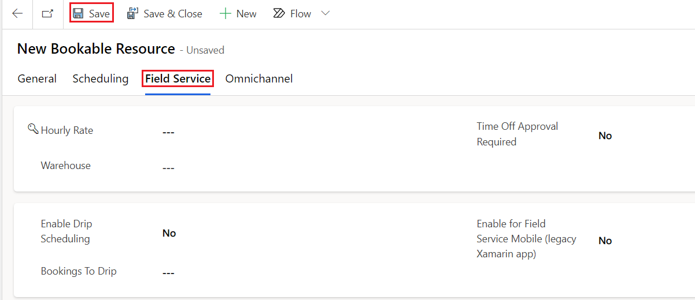

## Task: Set working hours for bookable resource

After you've saved the bookable resource, you can set the working hours of the resource. Working hours are considered by the following entities:

- The schedule board, by displaying working and nonworking hours as different colors.

- The schedule assistant, by only displaying resources that are working in the result.

- Resource Scheduling Optimization, which automatically books requirements to resources that are working.

1. Select the **Work Hours** tab.

1. Select **+New > Working hours**.

	> [!div class="mx-imgBorder"]
	> [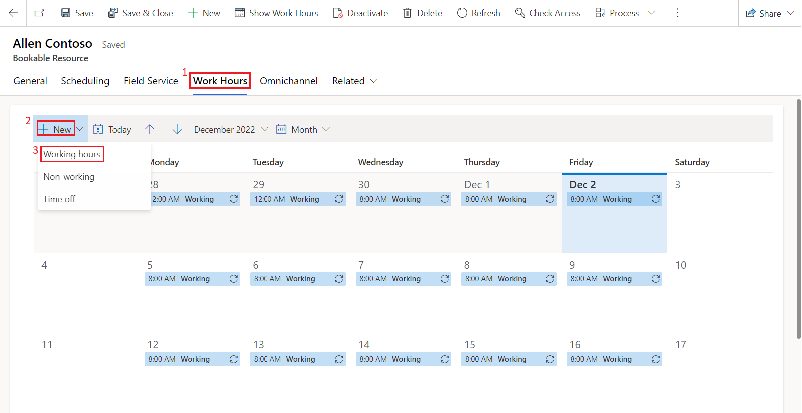](../media/working-hours.png#lightbox)

1. Choose the date that you want the working schedule to begin on, the beginning and end time of working hours (such as 8:00 AM to 5:00 PM), along with a **Repeat** option (such as Every week), and then clear the **Sunday** and **Saturday** options. Select **Save**. 
On the working hours panel, use the following values to set the working hours of a bookable resource:

    - **Schedule start date** - any future date.

    - **Repeat** - Every week

    - **Working days** - Mo, Tu, We, Th, Fr

    - **Choose an end date** - Select when this schedule ends (optional)

    - **Time Range** - Any suitable time range (Like 8:00 AM – 5:00 PM)

    - **Time Zone** - (GMT) UTC or any suitable time zone

    - **Observe Business Closure** - Toggle right (optional)

	> [!div class="mx-imgBorder"]
	> [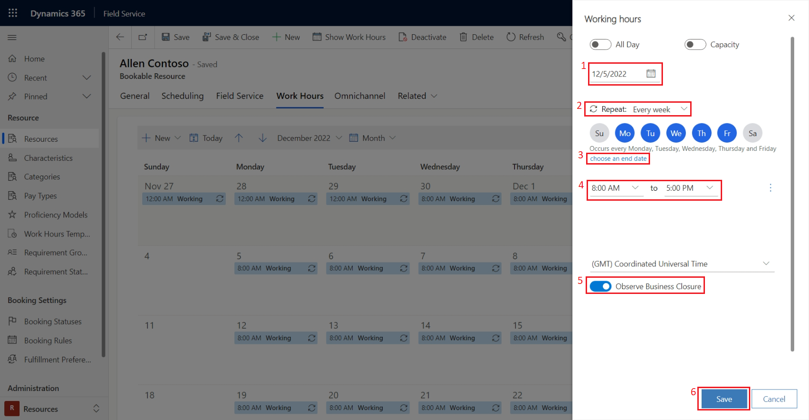](../media/work-hour-details.png#lightbox)

## Task: Create resource characteristic

Characteristics represent a resource’s skills and certifications. These characteristics could be: 

- Concrete like a CPR certification. 

- More general, like accounting or web development experience. 

- Simple as security clearance for a specific building or fluency in any language such as Spanish or French.

1. Select the **General** tab and then select the ellipsis (⋮) next to **Resource Characteristics** to select **+ New Bookable Resource Characteristic** option from the pop-up menu.

	> [!div class="mx-imgBorder"]
	> [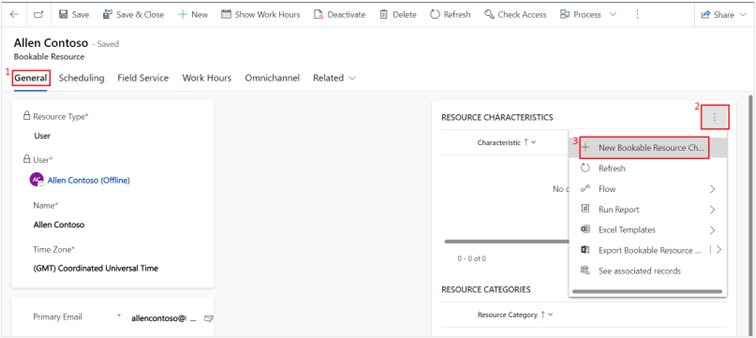](../media/new-bookable-resource-characteristic.png#lightbox)

1. In the **Skill Name** field, select the magnifying glass and then select **+ New Characteristic**.

	> [!div class="mx-imgBorder"]
	> [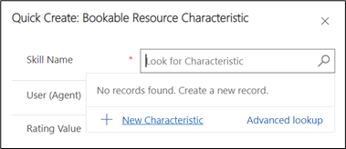](../media/new-characteristic.png#lightbox)

1. A quick create form for Characteristic will appear. You need to assign a characteristic to the bookable resource. In this case, the user can speak Spanish fluently. Type "**Spanish fluency**" for the **Name** and select **Save and Close.**

	> [!div class="mx-imgBorder"]
	> [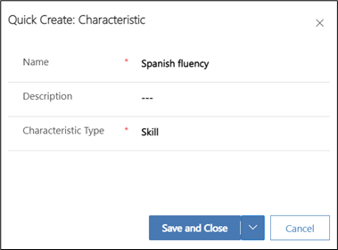](../media/characteristic-spanish.png#lightbox)

1. Back on the Bookable Resource Characteristics quick create form, the Skill Name should be populated with the new Spanish fluency characteristic. Select **Save and Close**.

	> [!div class="mx-imgBorder"]
	> [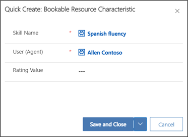](../media/save-close.png#lightbox)

1. Your bookable resource (user) now has the proper characteristics applied.

	> [!div class="mx-imgBorder"]
	> [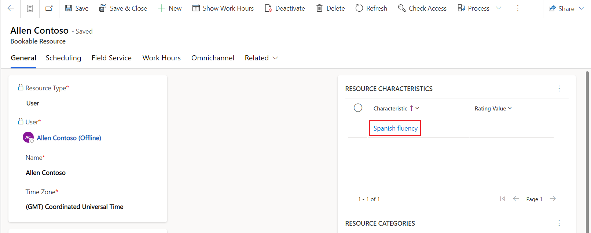](../media/bookable-resource-hours.png#lightbox)

1. For more data in the system, create two more bookable resources following the same process. For each of them, select **Contact** as the **Resource Type** and select any **Contact** in the system. Select **Location Agnostic** as before and select **Save**. Set up the **Work Hours** the same as the previous bookable resource. Add characteristics as you see fit and select **Save & Close**.

You've created a bookable resource. In the next exercise, you'll use this bookable resource to help configure the schedule board.

