In this exercise, you'll configure the schedule board for the bookable resource that you created in the previous exercise. The schedule board provides an overview of resource and booking availability. Before you use the schedule board, you need to set up the views and filters to your preference. To use the schedule board booking functionality, geocoding, and location services, you need to turn on the **Maps** feature.

The following screenshot shows an example of a configured schedule board.

> [!div class="mx-imgBorder"]
> [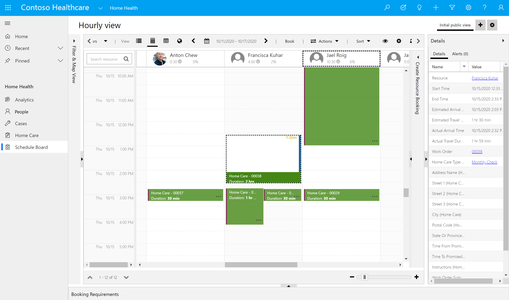](../media/schedule-board.png#lightbox)

## Task: Set up Resource Scheduling app

In this task, you'll enable connect to maps feature in the **Resource Scheduling** app. The connect to maps feature allows an external mapping provider to represent locations on a map and to calculate distances and travel time.

1. While signed into your Microsoft 365 tenant, open a new tab, and go to [Power Apps](https://make.powerapps.com/).

1. Select **Apps** on the left navigation pane.

1. Select **Resource Scheduling** app on the right pane. Select     the play button.

	> [!div class="mx-imgBorder"]
	> [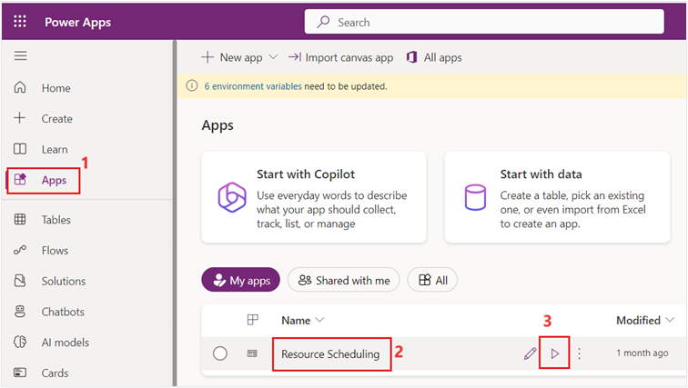](../media/resource-scheduling.png#lightbox)

1. Select **Settings** from the lower-left **Change area** menu.

	> [!div class="mx-imgBorder"]
	> [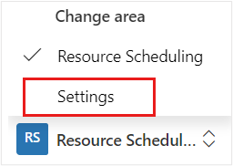](../media/settings.png#lightbox)

1.  Select **Administration** on the left navigation pane and then select **Scheduling Parameters** on the right pane.

	> [!div class="mx-imgBorder"]
	> [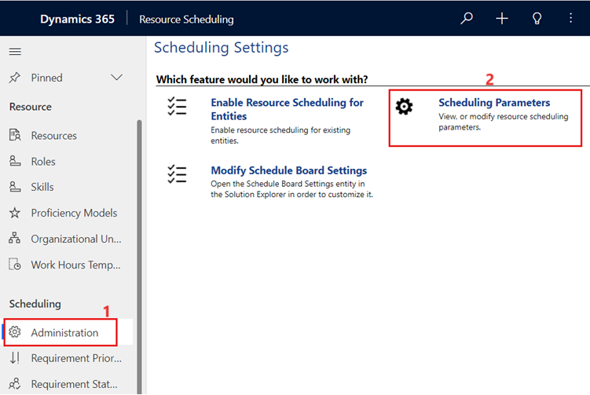](../media/administration.png#lightbox)

1. Verify the **Connect to Maps** option to **Yes**, if not change it to Yes and then select **OK** to accept the terms. Select **Save & Close**.

	> [!div class="mx-imgBorder"]
	> [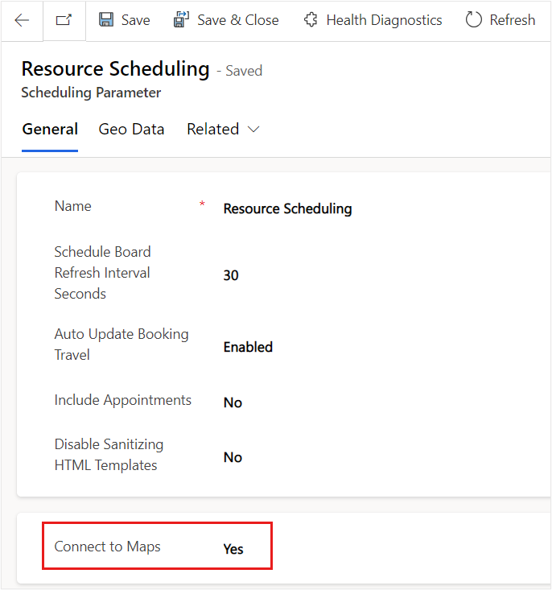](../media/scheduling-parameters.png#lightbox)

## Task: Set up Home Health app

In this task, you’ll associate the Thomson Household home care work order with the Spanish fluency characteristic, so they match Monica with someone who is fluent in Spanish. You've already applied this characteristic to the practitioner. You also want to set the estimated duration for the home visit.

1. Go to [Power Apps](https://make.powerapps.com/).

1. Select **Apps** on the left navigation pane.

1. Select **Home Health** app on the right pane. Select the play button.

1. In the **Home Health** app, select **Home Care** on the left navigation pane. On the right pane, select the Work Order number **00034** associated with the **Thomson Household**. Then, select **Edit**.
 
    > [!div class="mx-imgBorder"]
	> [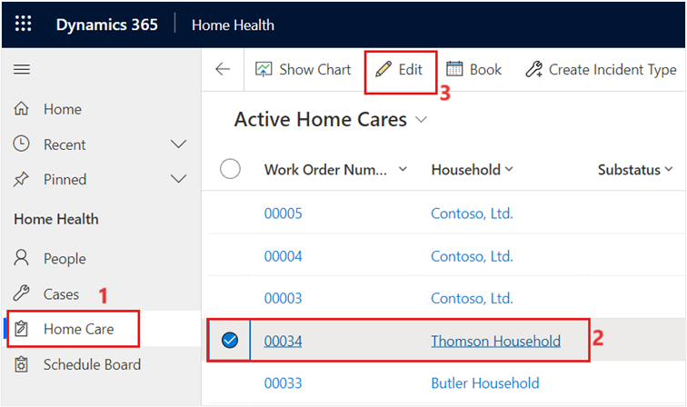](../media/home-care-record.png#lightbox)

1. On the **Summary** tab, scroll down to the Primary Incident section and set the **Primary Incident Estimated Duration** to 1 hour (this setting will ensure that the work order takes up time on the Resource’s calendar).

	> [!div class="mx-imgBorder"]
	> 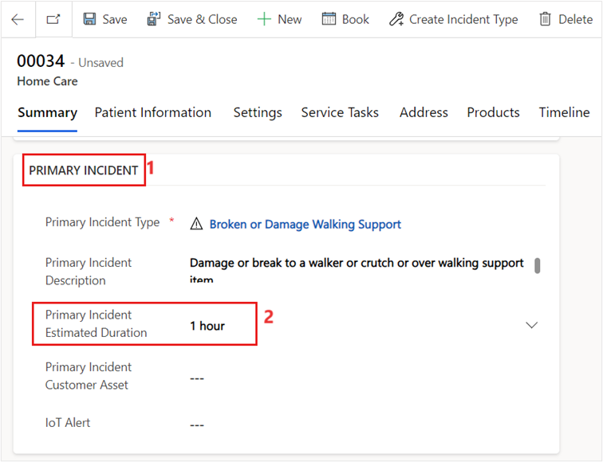

1. Select **Related** and then select **Characteristics**.

	> [!div class="mx-imgBorder"]
	> [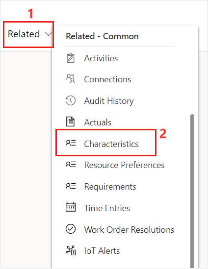](../media/characteristics.png#lightbox)

1. Select **+ New Requirement Characteristic**.

	> [!div class="mx-imgBorder"]
	> [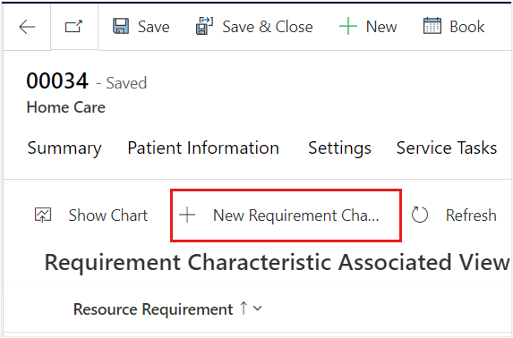](../media/new-requirement-characteristic-button.png#lightbox)

1. Select **Spanish fluency** for the **Characteristic** and work order **00034** for the **Resource Requirement**.

	> [!div class="mx-imgBorder"]
	> [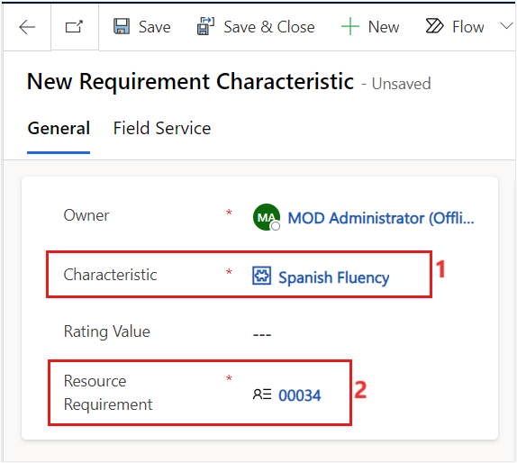](../media/spanish-fluency-characteristic.png#lightbox)

1. Make sure that the **Work Order Number 00034** that is populated in the **Resource Requirement** field matches the **Work Order Number** on the **Field Service** tab. Select **Save & Close**. 

	> [!div class="mx-imgBorder"]
	> 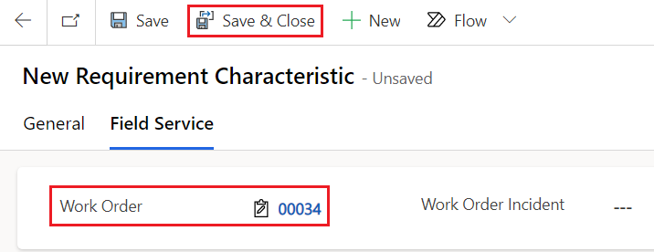
	
1. You'll now see the new characteristic requirement in the **Requirement Characteristic Associated View**.

	> [!div class="mx-imgBorder"]
	> 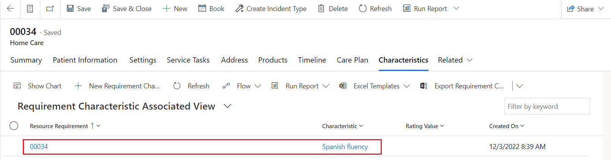

## Task: Create schedule board

In this task, you’ll create a schedule board and schedule a home work order.

1. Switch back to **Resource Scheduling** app and select **Schedule Board** on the left navigation under **Tools**.

1. Select the plus (**+**) button next to the **Initial public view**.

	> [!div class="mx-imgBorder"]
	> [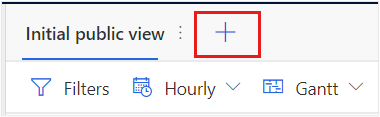](../media/plus-button.png#lightbox)

1. Name the new schedule board tab **My Schedule Board Tab**. Leave all defaults and then select **Add**.

	> [!div class="mx-imgBorder"]
	> [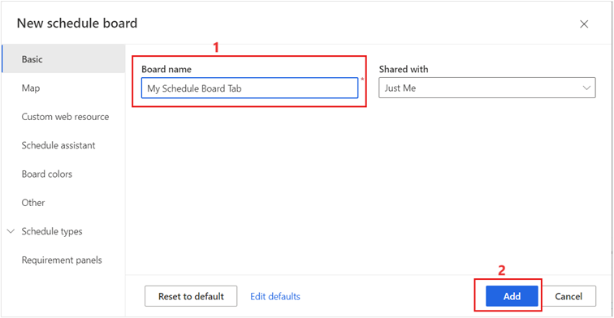](../media/my-schedule-board-tab.png#lightbox)

1. Select three vertical dots and select **Scheduler settings**.

	> [!div class="mx-imgBorder"]
	> [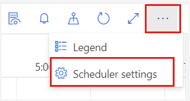](../media/gear.png#lightbox)

1. Change the start and end working time to match typical working hours, such as 6:00 AM to 6:00 PM. Close the **Settings** page. 

	> [!div class="mx-imgBorder"]
	> [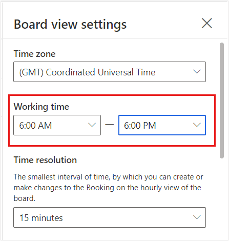](../media/time-zone.png#lightbox)

1.	Select the **Unscheduled Work Orders** tab at the lower part of the screen.

	> [!div class="mx-imgBorder"]
	> [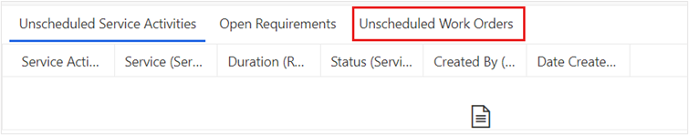](../media/arrow.png#lightbox)

1.  Find work order 00034 where you added the **Spanish fluency** characteristic and select the grid to highlight it. Select **Find Availability** to open the **Schedule Assistant** filter.

	> [!div class="mx-imgBorder"]
	> [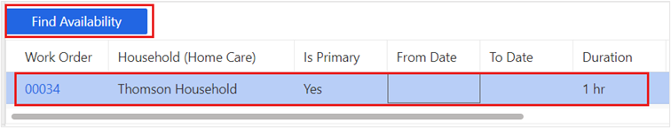](../media/find-availability.png#lightbox)

1. Notice that the two other bookable resources that you created, which don't have the **Spanish fluency** characteristic set, are dropped from the search. Select the timings. Select the **Book** button on the bookable resource's schedule to schedule the work order.

	> [!div class="mx-imgBorder"]
	> [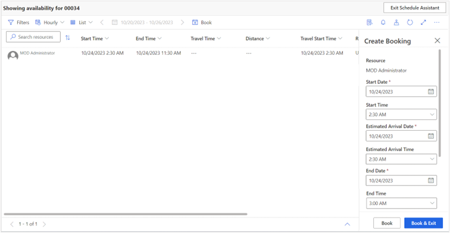](../media/book.png#lightbox)

1. When you click on Initial public view, you can view the booked schedule.

	> [!div class="mx-imgBorder"]
	> [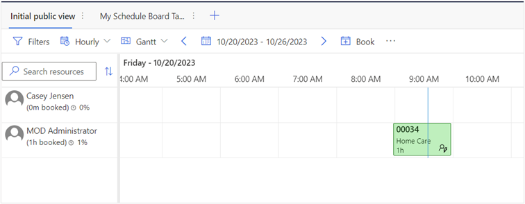](../media/exit-search.png#lightbox)

You've configured a schedule board tab and scheduled a Home Health visit by using the bookable resource that you created in the previous exercise. For more information on schedule boards, see [Use and configure the schedule board (Dynamics 365 Field Service)](/dynamics365/field-service/configure-schedule-board/?azure-portal=true).

