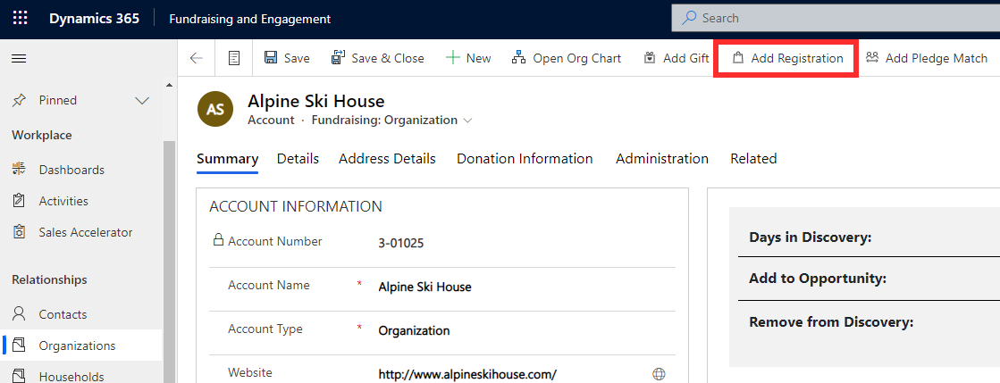
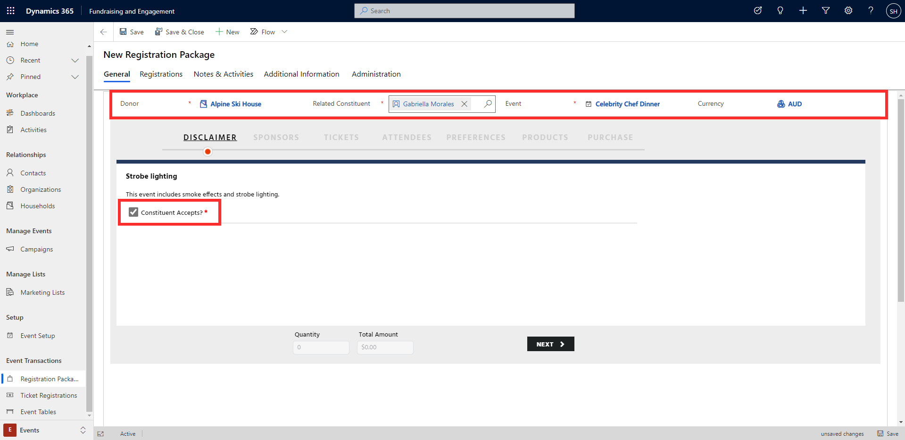
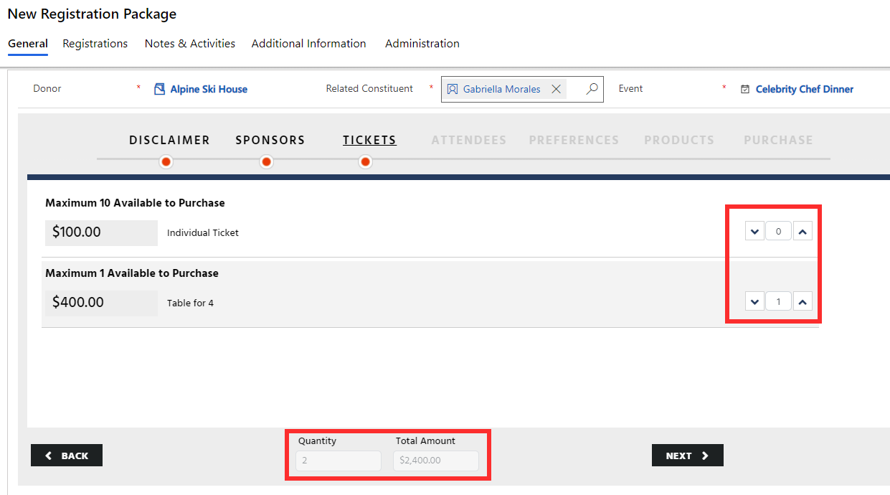
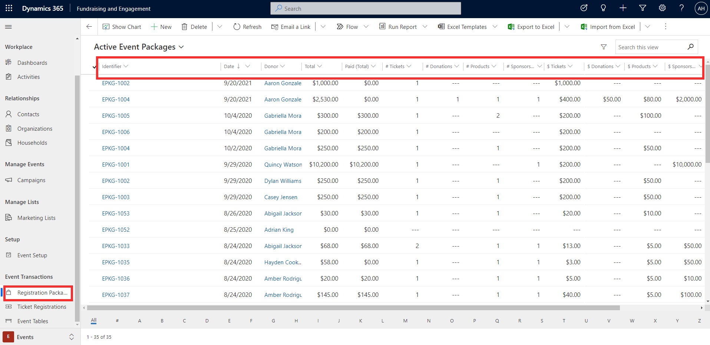

Once the event setup is complete, you can start taking registrations. A registration package represents a purchase of one or more ticket registrations and includes any other components (sponsorships, products, donations) purchased. Registration packages can be created for either a contact or an organization.

You can create a new event registration via the event record, or directly from a constituent's record. The **Add Registration** button located in the taskbar at the top of a contact or organization record will launch a New Registration Package form.

> [!div class="mx-imgBorder"]
> 

In the example shown, a registration package will be created for the organization Alpine Ski House. To create the event registration package, complete each step in the registration process, working through the event components set up for the event. The number and type of steps in the process will depend on which components you set up for the event.

The **Donor** column will autopopulate if the registration has been created directly from a constituent's record. If it is an organization, you will need to specify the main contact person from the organization in the **Related Constituent** column. If you have set up any disclaimers for the event, you will need to mark acceptance by the donor before proceeding to the next step in the event registration process.

> [!div class="mx-imgBorder"]
> 

If the event offers sponsorships, they will appear in the next step. If the donor purchases a sponsorship option, the **Quantity** and **Total Amount** columns at the bottom of the record will display the total sponsorship added. As you progress through the steps, the quantity and total amount columns will update depending on the components added to the registration.

> [!div class="mx-imgBorder"]
> 

From the **Tickets** step, select the quantity and type of tickets for the registration. Selecting a table ticket will add the number of tickets set up for the table. In this example, a Table for 4 was set up to include a total of four tickets.

> [!div class="mx-imgBorder"]
> 

You will then need to enter the details of each event attendee against the tickets. The first ticket will be automatically allocated to the related constituent or donor selected earlier, but this can be edited if necessary. These attendee details will link the tickets to existing contacts (if the email entered matches the email of an existing contact), or create a new contact if that person doesn't already exist in the system, based on email address.

> [!div class="mx-imgBorder"]
> 

At the **Preferences** step, enter any preferences for the attendee, such as dietary or accessibility requirements. For example, as shown below, Vegetarian has been selected for Gabriella. Selected preferences only apply to the current event registration, they are not kept on the contact profile.

> [!div class="mx-imgBorder"]
> 

If you have set up products for purchase with the event, that will also appear as a step where the event registrant can purchase them.

> [!div class="mx-imgBorder"]
> 

The last step in the event registration process is **Purchase**. **Paying Today** allows for partial payments. **Invoice Me** will not immediately charge the constituent and the payment will be placed on hold. Click **Purchase** to complete the event registration process.

> [!div class="mx-imgBorder"]
> 

If you select Invoice Me as in the example above, you will see a warning message reminding you that the event package has not been paid in full.

> [!div class="mx-imgBorder"]
> 

## Registration packages 

To see a list of all registration packages, go to **Registration Packages** on the left navigation menu of Fundraising and Engagement. Here you will see a view displaying all created event registration packages with details such as the related donor, included components, registration total, and total already paid.

> [!div class="mx-imgBorder"]
> 

## Receipting

The **Generate Receipt** button in the toolbar at the top of a registration package record allows you to generate a receipt for the registration.

> [!div class="mx-imgBorder"]
> 

To learn about printing receipts and thank-you letters, see module [Manage Gift Batches Receipts and Refunds](/training/modules/manage-gift-batches-receipts-refunds/).
