Gift batching in Fundraising and Engagement allows you to enter multiple gifts efficiently in one grouping or batch. Gift batch capabilities are accessed via the Gifts area of Fundraising and Engagement.

The two scenarios where you would process multiple gifts at once include:

- To process **multiple payments** in a gift batch

- To process multiple gifts under a **single payment**

These two types of gift batches are explored in further detail below.

## Processing multiple payments in a gift batch

A nonprofit organization had a direct mail campaign and now multiple checks have been received in the mail. In this scenario, you would want to be able to enter and process them all at once. This can be handled in Fundraising and Engagement by processing multiple payments in a gift batch, making the processing and data entry more efficient. You can set up a batch linked to a campaign and designation and then just enter the individual transaction details rather than needing to find and enter the campaign and designation details multiple times.

Gift batches of type Multiple Payments allow donations to be grouped by date, campaign, or event. This simplifies data entry and processing.

The screenshot below shows the creation of a new gift batch record in Fundraising and Engagement.

> [!div class="mx-imgBorder"]
> [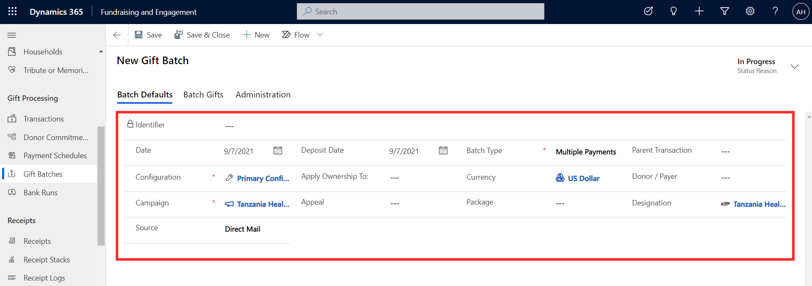](../media/1-gift-batch-record.png#lightbox)

The mandatory columns batch type, configuration, and campaign must be completed before saving the gift batch. For this scenario, **Multiple Payments** should be selected as the batch type, because in this case we are processing a batch that contains multiple individual donations received from our campaign.

For more information about campaigns, appeals, packages, and designations, see [Manage designations and campaigns in fundraising and engagement](../../nonprofit-designations/index.yml).

Once the gift batch is saved, individual donations can be entered in from the **Batch Gifts** tab.

> [!div class="mx-imgBorder"]
> [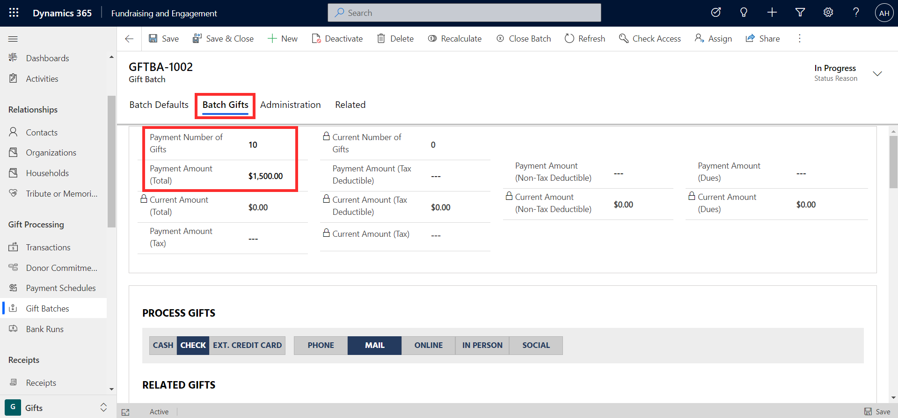](../media/2-gift-batch-tab.png#lightbox)

**Payment number of gifts** and **Payment amount (total)** are optional columns. If you have already counted the number of gifts received and calculated their total amount, that can be manually entered on the record here. Thus, when adding individual gifts to the batch, the value can be reconciled against the total.

The **Process Gifts** section is where individual gifts can be added to the batch. The payment method can be specified as either cash, check or ext. credit card. The source will be automatically selected based on the value specified earlier on the gift batch record. In this case, it is mail.

With the + and--buttons, you can either add or remove a gift entry respectively.

> [!div class="mx-imgBorder"]
> [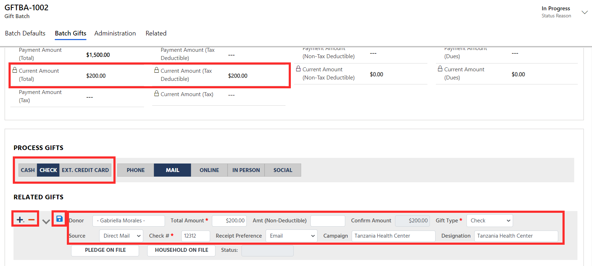](../media/3-plus-minus-buttons.png#lightbox)

For each related gift entry, donor is a lookup column to select the contact or organization responsible for the donation. You can enter in the total amount of the donation and the non-deductible amount if applicable. Gift type, source, receipt preference, campaign, and designation columns are autopopulated based on the settings specified when creating the gift batch.

Once a gift entry is complete, it is important to click on the individual save icon to save the line item. As related gifts are added, the total value will be displayed in the read-only **current amount (total)** column and the number of gifts in the **current number of gifts** column. Until the batch is closed, the status of the gift batch will display as **in progress** in the top right of the screen.

> [!div class="mx-imgBorder"]
> 

If you previously specified payment number of gifts and payment amount (total), the gift batch cannot be closed until these values are reached. Once all the gift entries have been added, the **Close Batch** button will save all the related gift records, the transactions will all be processed, and the status of the gift batch will be **completed**.

> [!div class="mx-imgBorder"]
> [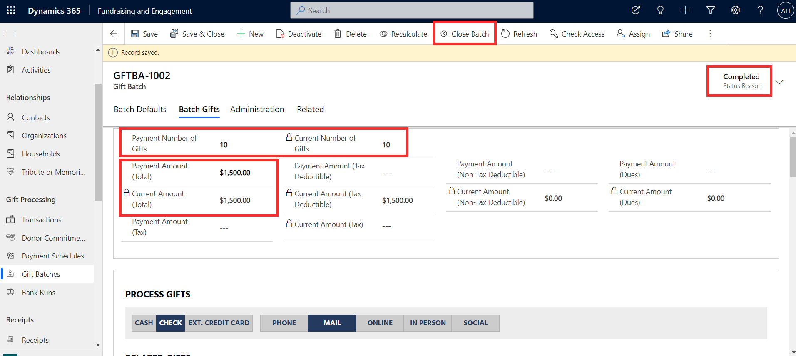](../media/5-completed.png#lightbox)

A list of all the related gift records will now also appear in the Transactions area of Fundraising and Engagement.

> [!div class="mx-imgBorder"]
> [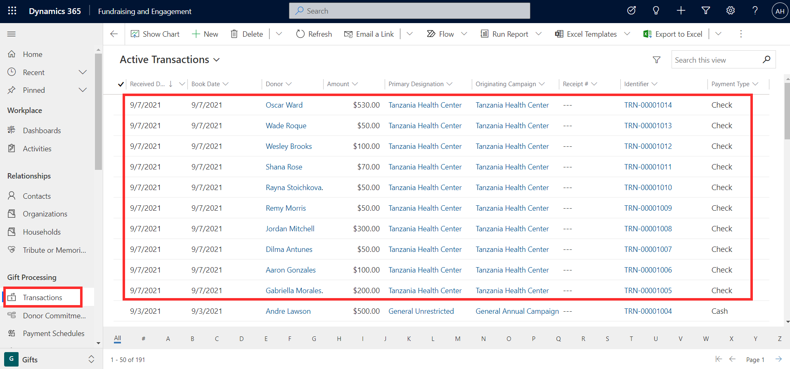](../media/6-related-gift-records.png#lightbox)

Gift batches are an efficient way to process multiple payments. Each record in the screenshot above is a completed transaction.

## Processing multiple gifts under a single payment

The option to process multiple gifts under a single payment is used when an organization raises funds and submits one payment for the total donation. The donation includes a list of all the individual donors, and the amount of their contribution. For example, let's say an organization sets up workplace giving. The donation from the organization totals \$1000, which was 10 employees donating \$100 each. Thus, the donation is linked to the organization and the organization would be receipted. Each employee contributor will be soft credited.

To process multiple gifts under a single payment, the **batch type** of **Single Payment Multiple Gifts** should be specified when creating a new gift batch record. This will prompt the new column **payment amount (total)** to appear on the form. For this example, the total amount of \$1000 raised by the organization will be entered here. The donating organization should be specified in the **donor/payer** column.

> [!div class="mx-imgBorder"]
> [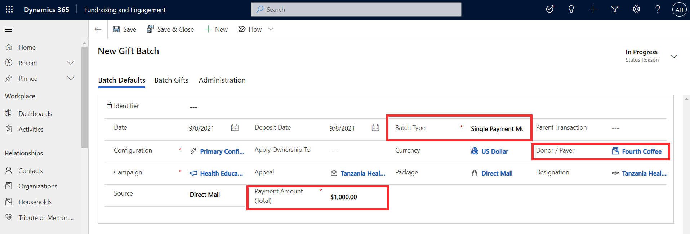](../media/7-donor-payer-column.png#lightbox)

Once the gift batch is saved, the **Batch Gifts** tab of the record will allow you to enter in the contribution of each employee. Adding each line item is a similar process to the multiple payments option shown previously, however processing this gift batch will create each line item as a soft credit transaction.

> [!div class="mx-imgBorder"]
> [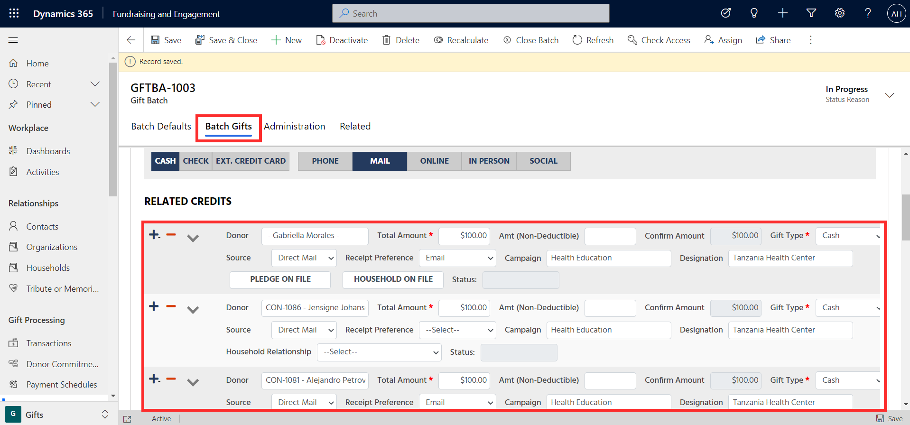](../media/8-batch-gift-line-items.png#lightbox)

Once the payment amount (total) and current amount (total) values match, the related credits can be processed by clicking **Close Batch.**

> [!div class="mx-imgBorder"]
> [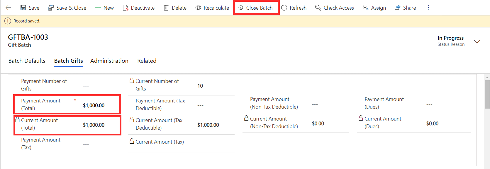](../media/9-close-batch.png#lightbox)

As a result, a donation transaction record of \$1000 will be created for the organization. The contribution of each employee will also appear as a transaction but will be attributed as a soft credit rather than a donation.

> [!div class="mx-imgBorder"]
> [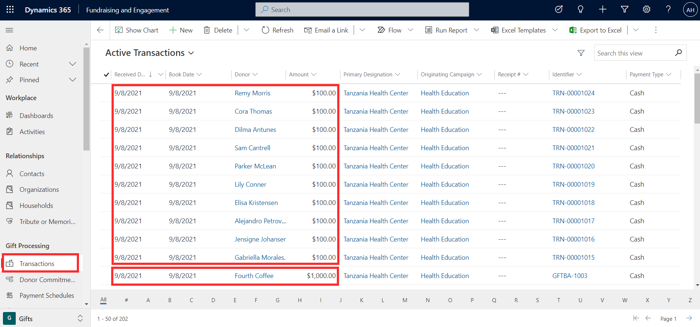](../media/10-transactions.png#lightbox)

The screenshot below shows the transaction for the organization Fourth Coffee.

> [!div class="mx-imgBorder"]
> [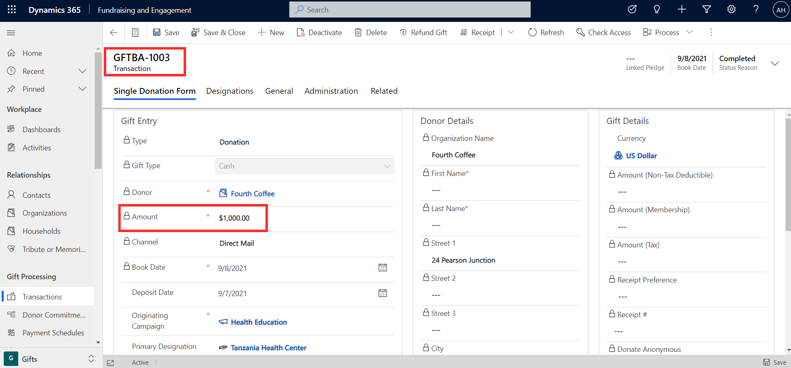](../media/11-fourth-coffee.png#lightbox)

Below is a screenshot of the soft credit transaction processed for employee Gabriella Morales.

> [!div class="mx-imgBorder"]
> [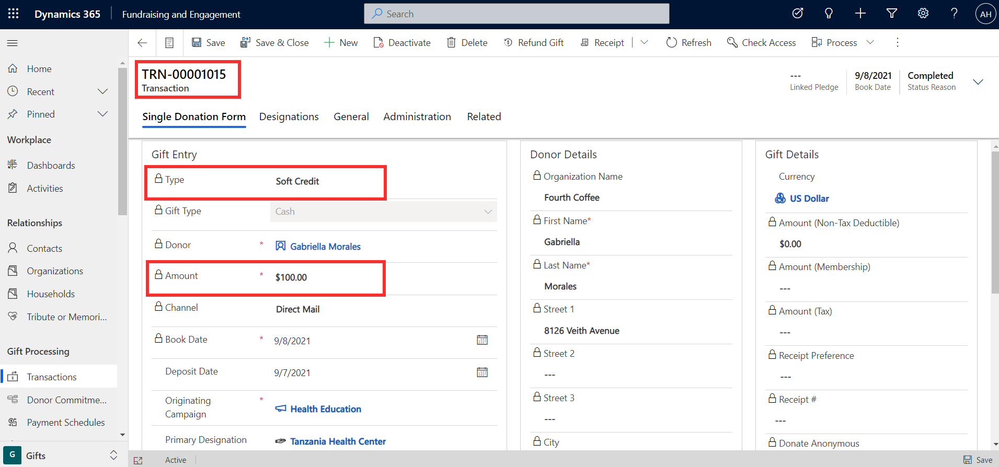](../media/12-soft-credit.png#lightbox)
