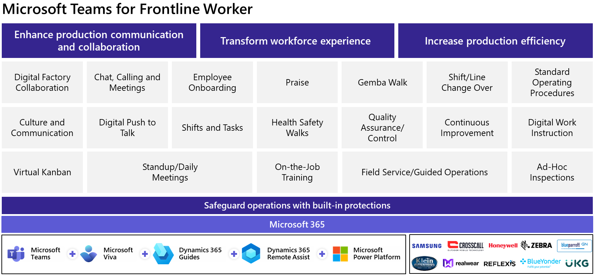
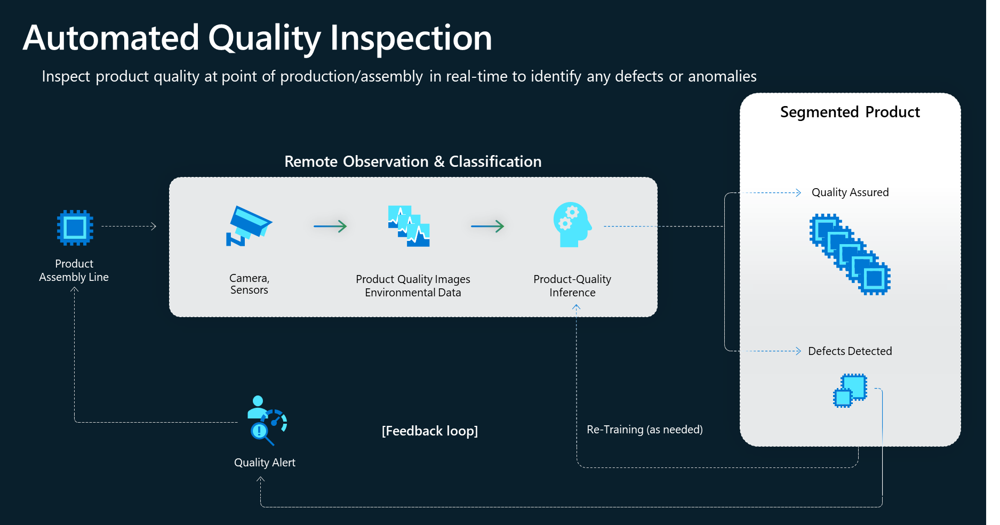

Microsoft Cloud for Manufacturing facilitates the intelligent factory of the future. It uses industrial Internet of Things (IIoT), data analytics, AI, and cloud connectivity to extract critical data from across operational technology (OT) and information technology (IT) to drive improvements in overall equipment efficiency (OEE), operations visibility, and sustainability. Manufacturers can seamlessly share real-time production insights from the data with the design and engineering teams. The insights facilitate collaboration and improve manufacturing processes based on real-world feedback and lead to continuous improvements and innovation.

Machine-learning models enhance product quality within the intelligent factory by helping manufacturers detect and address defects in real time, ensuring the production of high-quality products. The Microsoft Cloud for Manufacturing solution provides communication and collaboration tools that help frontline workers connect and collaborate. This solution facilitates faster onboarding processes, enables efficient up-skilling of workers, and ensures that they have the necessary knowledge and expertise to operate within the intelligent factory environment.

> [!VIDEO https://www.microsoft.com/en-us/videoplayer/embed/RW17evA]

Microsoft supports manufacturing customers in implementing intelligent factories by focusing on these core scenarios. 

## Connected and enabled workers

Microsoft provides frontline workers with a unified platform that facilitates streamlined communication, enhances employee experiences, promotes agile operations, and offers comprehensive, enterprise-grade security capabilities. This platform helps you consolidate your technology investment. It enables the centralization of your organization’s communications and business processes across manufacturing environments into one app that helps you create a comprehensive view for the frontline workforce.

The following diagram shows the different scenarios of how Microsoft Teams supports frontline workers.

   > [!div class="mx-imgBorder"]
   > 

The top connected and enabled worker use cases that Microsoft supports include:

- **Enhance production communication and collaboration** - Scale up expertise and reduce downtime by connecting workers with the correct people, tools, and knowledge so they can get their job done.

- **Transform workforce experiences** - Empower new hire onboarding, build skills, and engage in an inclusive company culture.

- **Increase production efficiency** - Automate task and OT processes with digital workflows and connect to systems of record.

- **Safeguard operations with built-in protections** - Help make your business more secure with built-in security and compliance across endpoints and devices.

The key Microsoft technologies that support connected and enabled workers are: 

- [Microsoft Teams for Frontline Workers](/industry/manufacturing/appendix/microsoft-technology#microsoft-teams-for-frontline-workers)

- [Microsoft Viva](/industry/manufacturing/appendix/microsoft-technology#microsoft-viva)

- [Microsoft HoloLens 2](/industry/manufacturing/appendix/microsoft-technology#microsoft-hololens-2)

- [Microsoft Power Apps](/industry/manufacturing/appendix/microsoft-technology#microsoft-power-apps)

- [Dynamics 365 Guides](/industry/manufacturing/appendix/microsoft-technology#dynamics-365-guides)

- [Dynamics 365 Remote Assist](/industry/manufacturing/appendix/microsoft-technology#dynamics-365-remote-assist)

In addition to the Microsoft technologies that support connected and enabled workers, you can learn more about Microsoft’s growing ecosystem of hardware partners, from ruggedized phones to wired or wireless headsets, at [Microsoft AppSource.](https://appsource.microsoft.com/en-US/marketplace/apps?search=%E2%80%9CMicrosoft%20Cloud%20for%20Manufacturing%20July%202023%20Launch%20Partner%E2%80%9D%20and%20MC4M&page=1&industry=manufacturing-resources)

Partner solutions that are certified for Microsoft Cloud for Manufacturing support the connected and enabled workers use cases previously described, and they're available on Microsoft AppSource. These solutions are certified with the Microsoft AI Cloud Partner Program and meet the Microsoft standards of data accessibility that are specific to the manufacturing industry. For more information, see [Appendix: Certified partner solutions for Microsoft Cloud for Manufacturing.](/industry/manufacturing/appendix/certified-partner-solutions-manufacturing#connected-and-enabled-worker-solutions)

## Production monitoring and optimization

Microsoft provides a comprehensive suite of solutions to help manufacturers harness the power of production data and drive intelligent decision making within their factories. Manufacturers can use data that's captured through the use of sensors, machines, programmable logic controllers (PLCs), factory systems, and enterprise systems (IT). As a result, they gain valuable insights across the factory floor that lead to optimized operations, reduced number of bottlenecks, and enhanced overall efficiency. 

The top production monitoring and optimization use cases that Microsoft supports include:

- **Factory digital twins** - Provides a structured, graphical digital data platform that can allow use cases from production monitoring to process optimization, simulation, and maintenance. 

- **Manufacturing execution system (MES) on Azure** - Offers manufacturers the agility, scalability, and cost-efficiency that's required for adapting to rapidly changing market conditions and for driving digital transformation in their manufacturing operations.

- **Edge and OT security** - Encompasses coverage and visibility of IoT or OT devices, risk analysis across all networks, behavioral analytics, and rapid identification and mitigation of multi-stage attacks across IT, IoT, or OT.

- **Sustainable operations through energy cost optimization** - Helps reduce energy costs by optimizing consumption and achieving sustainability goals by reducing the carbon footprint.

- **Autonomous and intelligent control systems** - Use AI and machine learning technologies to optimize processes, enable quality inspection, automate tasks, optimize machine performance, and facilitate access and summarization of data.

The following Microsoft technologies are key in supporting the production monitoring and optimization use cases:

- [Microsoft Defender for IoT](/industry/manufacturing/appendix/microsoft-technology#microsoft-defender-for-iot)

- [Azure AI Services](/industry/manufacturing/appendix/microsoft-technology#azure-ai-services)

- [Azure Machine Learning](/industry/manufacturing/appendix/microsoft-technology#azure-machine-learning)

- [Microsoft Fabric](/industry/manufacturing/appendix/microsoft-technology#microsoft-fabric)

Partner solutions that are certified for Microsoft Cloud for Manufacturing support the production monitoring and optimization use cases previously described, and they're available on Microsoft AppSource. These solutions are certified with the Microsoft AI Cloud Partner Program and meet the Microsoft standards of data accessibility that are specific to the manufacturing industry. For more information, see [Appendix: Certified partner solutions for Microsoft Cloud for Manufacturing.](/industry/manufacturing/appendix/certified-partner-solutions-manufacturing#production-monitoring-and-optimization-solutions)

## Maintenance and quality

Maintenance and quality refer to the use of applications and AI-based solutions to track materials within the factory, automate complex quality inspection processes, and launch predictive maintenance solutions.

Maintenance and quality involve the following scenarios:

-	Using intelligent systems to automate complex quality inspection processes

-	Rolling out computer vision models to detect defects

-	Analyzing machine data for root cause analysis

-	Sharing real-time production insights back into design and engineering to ensure that materials and final products meet predefined standards

Manufacturers can enhance operational efficiency and significantly reduce errors to ensure consistent product quality and enable a more streamlined manufacturing process.

The following diagram shows the use cases that Microsoft supports for maintenance and quality.

   > [!div class="mx-imgBorder"]
   > 

The top maintenance and quality use cases that Microsoft supports include:

- **Production quality** - Uses in-line, off-line, pre and post-build solutions to capture quality issues while they occur and to bring improved recovery. You can augment human quality inspection through AI and cognitive capabilities for scenarios, such as automated inspections and 100% inspection. 

- **Predictive maintenance** - Uses a combination of sensors, AI, and data science to optimize equipment maintenance, predict the equipment maintenance needs to minimize maintenance costs, and maximize uptime to provide significant value to manufacturers.

The following Microsoft technologies are key in supporting the maintenance and quality use cases:

- [Azure AI Services](/industry/manufacturing/appendix/microsoft-technology#azure-ai-services)

- [Azure Machine Learning](/industry/manufacturing/appendix/microsoft-technology#azure-machine-learning)

- [Azure IIoT](/industry/manufacturing/appendix/microsoft-technology#azure-iiot)

- [Dynamics 365 Supply Chain Management](/industry/manufacturing/appendix/microsoft-technology#dynamics-365-supply-chain-management)

Microsoft Cloud for Manufacturing certified independent software vendor (ISV) solutions support the previously described maintenance and quality use cases, and they're available on Microsoft AppSource. These solutions are certified with the Microsoft AI Cloud Partner Program and meet the Microsoft standards of data accessibility that are specific to the manufacturing industry. For more information, see [Appendix: Certified partner solutions for Microsoft Cloud for Manufacturing.](/industry/manufacturing/appendix/certified-partner-solutions-manufacturing#maintenance-and-quality-solutions)
