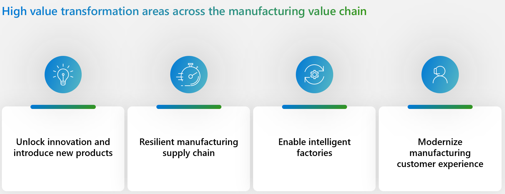
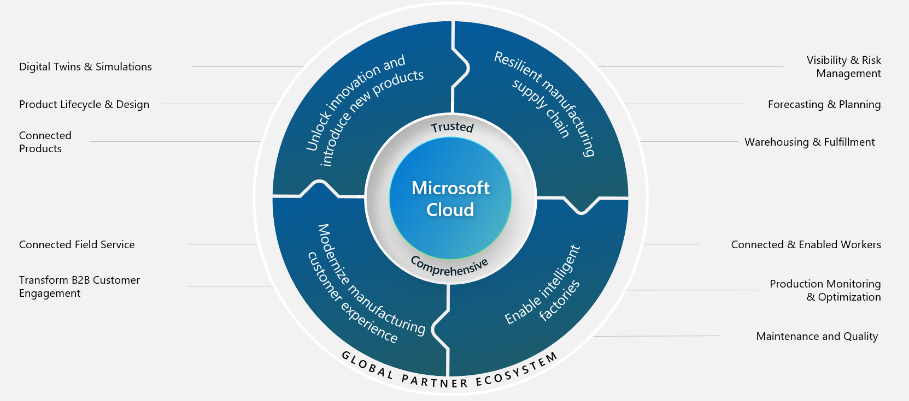

During the past decade, manufacturing companies have been on a deep, digital transformation journey. External changes, such as supply chain constraints, deglobalization, and energy shortages, influence the transformation. Additionally, new opportunities, such as new connected products and revenue streams, and new customers in emerging markets help drive this transformation.

Across sectors, manufacturers also continue to encounter pressures that the COVID-19 pandemic caused. These pressures cause lasting ripple effects, such as supply chain issues, economic instability, generational transition in labor markets, and social conflicts.

These challenges cause manufacturers to shift their digital transformation strategies to focus on resilience and cost optimization. Manufacturers need to balance these two priorities without sacrificing their sustainability commitments.

Currently, the manufacturing industry is observing the following trends:

-	Supply chain rebalancing

-	Efficient research and development with the industrial metaverse

-	Intelligent and cost-efficient factories

-	Digitally enabled workforce

-	Increasing services profitability

The following sections discuss the current transition of manufacturing and how Microsoft Cloud for Manufacturing helps transform the digital transformation journey.

## Digital transformation journey

Innovation is a mandate of any manufacturer who wants to stay ahead of the competition. Manufacturing is a fast-moving industry that modernizes at a rapid pace. To keep up, manufacturers are adopting technologies that help them unlock innovation and introduce new products. By using digital twins and simulations, high-performance computing is leading a paradigm shift in the way that manufacturers engineer their products. Manufacturers complete these computations on digital models and then store them in product life cycle and design applications in the cloud, where teams can collaborate across the globe. Extended product lifecycle management (PLC) and high-performance computing (HPC) capabilities allow new business models through connected products that open new and recurring revenue streams for manufacturers.

## Microsoft Cloud for Manufacturing

Microsoft Cloud for Manufacturing brings the best of Microsoft and our partners together to accelerate the digital transformation in manufacturing by:

-	Unlocking engineering and design innovation with cloud computing and AI.

-	Building a more resilient supply chain to anticipate risks.

-	Implementing intelligent factories.

-	Helping modernize the customer experience with the latest digital technologies.

Manufacturers rely on an ecosystem of different industry solutions from different vendors. Microsoft Cloud for Manufacturing orchestrates this complex ecosystem of solutions to deliver transparent, efficient, and interoperable processes. It also solves silo systems between information technology (IT), operational technology (OT), and engineering technology (ET) to democratize data insights and promote collaboration across the value chain.

The Covid-19 pandemic emphasized the importance of a resilient manufacturing supply chain. With Microsoft Cloud for Manufacturing, you can build more strength, security, and sustainability into your supply chain through visibility and risk management. As a result, you can anticipate and plan for the future with forecasting and planning capabilities from partner solutions that run on Microsoft Azure compute. These capabilities help you create more accurate and efficient warehousing and fulfillment.

Supply chain consistency and order fulfillment are components that help satisfy customers. Microsoft Cloud for Manufacturing helps you to further that satisfaction rate by delivering a modern manufacturing customer experience. It helps you transform B2B customer engagement by providing an omnichannel market and helps extend your brand value through connected field service that turns revenue drips into revenue streams.

Implementing intelligent factories means that you can transform how you manufacture by incorporating intelligence into your operations. This intelligence includes harnessing cloud scale analytics for production monitoring and optimization. Additionally, it tracks every asset as it moves through your factory through material handling and quality solutions. Connecting and providing your frontline workers with solutions that increase their productivity and engagement can lead to improved operations and increased innovation across your business.

## Priority manufacturing scenarios

Microsoft solutions help you with your digital transformation across the value chain by helping you drive toward the outcomes highlighted in the following diagram.

> [!div class="mx-imgBorder"]
> 

The four priority scenarios of Microsoft Cloud for Manufacturing are:

- **Unlock innovation and introduce new products** - Introduce new products more efficiently, reducing costs without sacrificing quality and function with cloud-based digital engineering, design, and software-defined product capabilities. 

- **Resilient manufacturing supply chain** - Analyze multitier supplier and market data with the AI capabilities that are embedded into Microsoft Dynamics 365 Supply Chain Management to increase visibility and manage risks.

- **Enable intelligent factories** - Use Internet of Things (IoT), data analytics, AI, and cloud connectivity to make faster business decisions and increase production efficiency.

- **Modernize customer experience** - Help your organization’s marketers, sellers, and service agents better understand customer needs with data, AI, and remote collaboration mixed reality tools.

## Featured manufacturing capabilities

The following diagram shows the manufacturing capabilities that are built with the four priority scenarios. The goals for these capabilities are: 

- Achieve the desired outcome of unlocking innovation and introducing new products.

- Create a resilient manufacturing supply chain.

- Enable intelligent factories.

- Modernize the customer experience.

> [!div class="mx-imgBorder"]
> 

## Data model and security

Microsoft Cloud for Manufacturing is supported with industry-specific data models, APIs, and an ecosystem of partners that are purpose-built for manufacturing scenarios. Microsoft Cloud for Manufacturing is built on a foundation of trust.

The approach to security, compliance, and privacy includes the following features:

- Protecting identities and endpoints

- Defending against threats

- Securing cloud infrastructure

- Protecting and governing sensitive data and Internet Protocol (IP)

- Using integrated regulatory compliance tools
