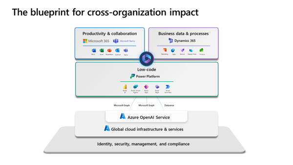
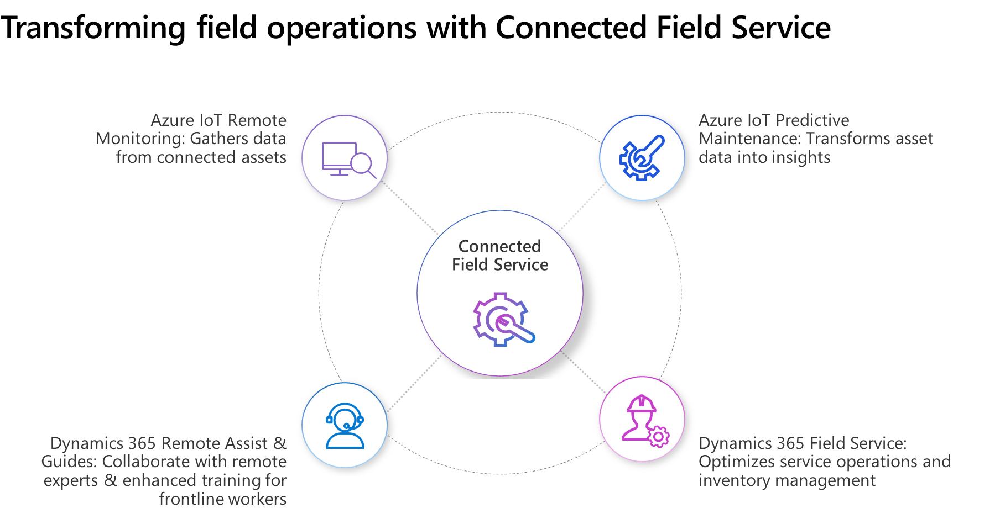
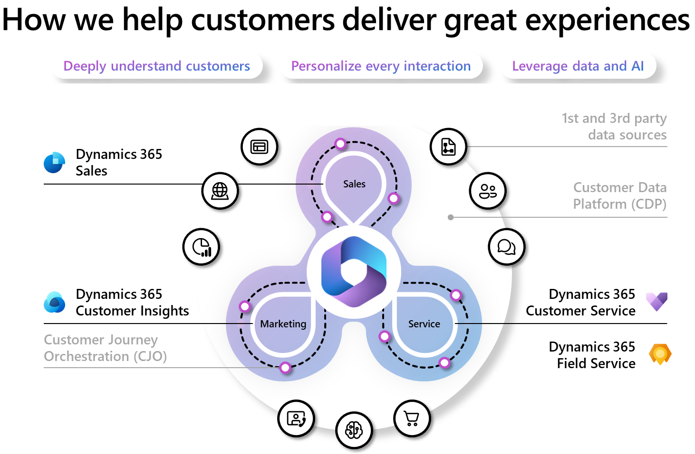

Microsoft Cloud for Manufacturing helps modernize the overall customer experience. It helps your organization’s marketers, sellers, and service agents better understand customer needs and create engaging digital experiences with data analytics, conversational AI, remote collaboration, and mixed reality. With a flexible and comprehensive cloud-based CRM platform, you can empower sales teams to close new and recurring revenue with speed and predictability. You can attract new customers, qualify high-value prospects, and build knowledge of your most impactful personas by gaining a 360-degree view of your customers. You can turn your service operations into a profit center and expand the reliability of your product lines with innovative mixed reality and remote collaboration capabilities.

> [!div class="mx-imgBorder"]
> 

Microsoft focuses on these core scenarios to help manufacturing customers modernize the manufacturing customer experience.

## Connected Field Service

In the manufacturing industry, equipment downtime and repair costs can significantly affect operational efficiency and customer satisfaction. With the Connected Field Service add-on from Microsoft Dynamics 365, manufacturers can address equipment issues before they become major problems. Connected Field Service uses IoT devices and advanced analytics to provide real-time equipment data that helps manufacturers act quickly to prevent downtime and reduce repair costs. By tracking and managing their field service operations more effectively, manufacturers can improve their service capabilities, optimize operational efficiency, and drive business growth and success. 

> [!div class="mx-imgBorder"]
> 

Connected Field Service provides service agents with the latest mixed reality tools to solve complex service use cases with live-remote assistance or step-by-step interactive instructions. Connected Field Service is essential for any manufacturer who wants to enhance their service capabilities, reduce costs, and increase customer satisfaction.

> [!VIDEO https://www.microsoft.com/en-us/videoplayer/embed/RW17evB]

The top Connected Field Service use cases that Microsoft supports include:

- **Product monitoring** - Allow teams to exceed service expectations with spare parts orchestration and proactive replacement.

- **Issue resolution** - Predict, detect, and resolve service issues before customers identify a problem.

- **Remote support** - Deliver value to customers quickly and efficiently with remote assistance, chatbots, and self-service tools.

The key Microsoft technologies that support Connected Field Service are:

- [Dynamics 365 Field Service](/industry/manufacturing/appendix/microsoft-technology#dynamics-365-field-service)

- [Dynamics 365 Guides](/industry/manufacturing/appendix/microsoft-technology#dynamics-365-guides)

- [Dynamics 365 Remote Assist](/industry/manufacturing/appendix/microsoft-technology#dynamics-365-remote-assist)

- [Dynamics 365 Customer Service](/industry/manufacturing/appendix/microsoft-technology#dynamics-365-customer-service)

Partner solutions that are certified for Microsoft Cloud for Manufacturing support the Connected Field Service use cases previously described, and they're available on Microsoft AppSource. These solutions are certified with the Microsoft AI Cloud Partner Program and meet the Microsoft standards of data accessibility that are specific to the manufacturing industry. For more information, see [Appendix: Certified partner solutions for Microsoft Cloud for Manufacturing](/industry/manufacturing/appendix/certified-partner-solutions-manufacturing#connected-field-service-solutions).

## B2B customer engagement

Customer engagement is critical in the competitive manufacturing industry for building brand loyalty and increasing sales. Manufacturers need to communicate effectively with their customers through various channels to provide a seamless experience. With omnichannel customer engagement solutions, manufacturers can engage with their customers on multiple platforms, such as social media, web, email, chat, and phone calls. By providing consistent customer experiences across all channels, manufacturers can build strong customer relationships and increase customer satisfaction. Additionally, omnichannel customer engagement solutions provide valuable insights into customer behavior, which can influence marketing strategies and product development decisions.

> [!div class="mx-imgBorder"]
> 

The top B2B customer engagement use cases that Microsoft supports include:

-	**Data estate management** - Unified customer and organization data help you gain insights from better account segmentation, predict customer behavior, and drive intelligent and hyper-personalized experiences.

-	**Omnichannel customer engagement** - Target potential customers across multiple channels and devices based on real-time insights with seamless and consistent experiences.

-	**Connected commerce** - Deliver unified, personalized, and seamless buying experiences (online and in store). Efficiently manage your business, meet changing needs, and support omnichannel purchasing.

The key Microsoft technologies that support B2B customer engagement are:

- [Dynamics 365 Sales](/industry/manufacturing/appendix/microsoft-technology#dynamics-365-sales)

- [Dynamics 365 Customer Insights](/industry/manufacturing/appendix/microsoft-technology#dynamics-365-customer-insights)

- [Microsoft Digital Contact Center Platform](/industry/manufacturing/appendix/microsoft-technology#microsoft-digital-contact-center-platform)

- [Microsoft Fabric](/industry/manufacturing/appendix/microsoft-technology#microsoft-fabric)

Partner solutions that are certified for Microsoft Cloud for Manufacturing support the B2B customer engagement use cases previously described, and they're available on Microsoft AppSource. These solutions are certified with the Microsoft AI Cloud Partner Program and meet the Microsoft standards of data accessibility that are specific to the manufacturing industry. For more information, see [Appendix: Certified partner solutions for Microsoft Cloud for Manufacturing](/industry/manufacturing/appendix/certified-partner-solutions-manufacturing#b2b-customer-engagement-solutions).
