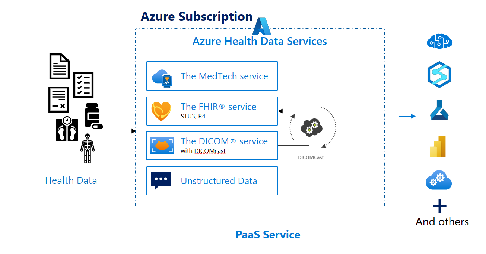
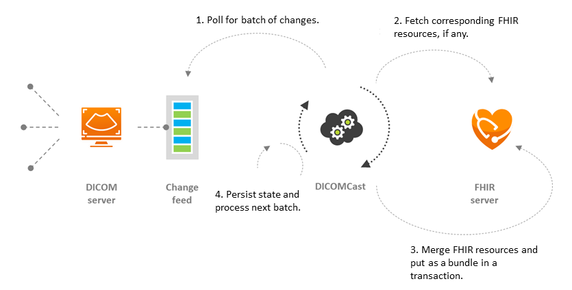

The DICOM® service within Azure Health Data Services enables imaging data to securely persist in the Microsoft cloud. The DICOM® service is a managed Azure service that allows standards-based communication with any DICOMweb™ enabled systems.

> [!div class="mx-imgBorder"]
> 

The service ingests and persists DICOM® objects from vendor neutral archives (VNA), picture archiving and communications system (PACS), and other medical imaging systems. Azure Health Data Services DICOM service enables you to store DICOM® images in the cloud, where you can query, retrieve, and share medical images with ease.

## The DICOM®  service features

The DICOM® service is a cloud-based solution that enables healthcare organizations to store, manage, and exchange medical imaging data securely and efficiently with any DICOMweb-enabled systems or applications. The DICOM service is part of Azure Health Data Services.

The DICOM service offers many benefits, including:

- Global availability. The DICOM service is available in any of the regions where Azure Health Data Services is available. Microsoft is continuously expanding availability of the DICOM service, so check regional availability for updates.

- PHI compliance. The DICOM service is designed for protected health information (PHI), meeting all regional compliance requirements.

- Scalability. The DICOM service scales to support everything from small imaging archives in a clinic to large imaging archives with petabytes of data and thousands of new studies added daily.

- Automatic data replication. The DICOM service uses Azure Locally Redundant Storage (LRS) within a region. If one copy of the data fails or becomes unavailable, your data can be accessed without interruption.

- Role-based access control (RBAC). RBAC enables you to manage how your organization's data is stored and accessed. You determine who has access to datasets based on roles you define for your environment.

## Connect the DICOM service with other tools, services, and products

You can connect the DICOM service with other tools, services, and products:

- **DICOMcast** DICOMcast is an open-source capability that can be self-hosted in Azure. DICOMcast enables a single source of truth for clinical data and imaging metadata. With DICOMcast, the DICOM service can inject DICOM® metadata into a FHIR service or FHIR server as an imaging study resource.

> [!div class="mx-imgBorder"]
> 

- **DICOM data anonymization** [Anonymize DICOM metadata](https://github.com/microsoft/Tools-for-Health-Data-Anonymization/blob/master/docs/DICOM-anonymization.md/?azure-portal=true) - A DICOM file contains a viewable image and a header with a large variety of data elements. These metadata elements include identifiable information about the patient, the study, and the institution. Sharing such sensitive data demands proper protection to ensure data safety and maintain patient privacy. DICOM Anonymization tool helps anonymize metadata in DICOM files for this purpose.

- **Access imaging study resources on Microsoft Power BI, Microsoft Power Apps, and Microsoft Dynamics 365 Customer Insights - Data** - [Connect to a FHIR service from Power Query Desktop](/power-query/connectors/fhir/fhir/?azure-portal=true). After provisioning the DICOM service and the FHIR service, and after synchronizing an imaging study for a given patient through DICOMcast, you can use the Power Query connector for FHIR® to import and shape data from the FHIR server, including imaging study resource.

- **Convert imaging study data to hierarchical parquet files** [FHIR® to Synapse Sync Agent](https://github.com/microsoft/FHIR-Analytics-Pipelines/blob/main/FhirToDataLake/docs/Deploy-DicomToDatalake.md/?azure-portal=true) - After you provision the DICOM service and the FHIR service, and after you've synchronized an imaging study for a given patient through DICOMcast, you can use FHIR® to Synapse Sync Agent to perform analytics and machine learning on imaging study data. Use it by moving FHIR® data to Microsoft Azure Data Lake Storage in near real time and making it available to a Microsoft Azure Synapse workspace.