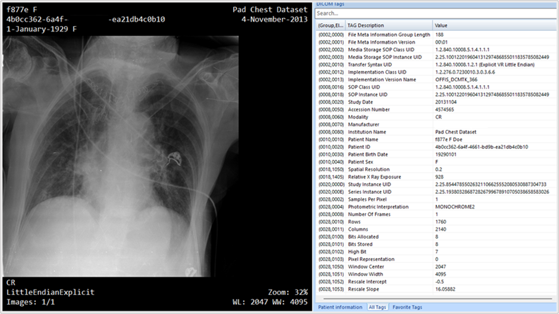

DICOM® (Digital Imaging and Communications in Medicine) is the international standard for medical images, imaging formats, and related information. It's the ISO 12052 standard that defines the data quality and exchange specifications for images to meet clinical use requirements. Digitization of medical imaging data by using the DICOM standard will enable health data interoperability. Microsoft cloud is equipped to ingest, persist, and connect DICOM® imaging data to help improve patient outcomes.

In this module, you'll:

- Learn why DICOM® standards are important.

- Explore the DICOM® standards and DICOM® service.

- Review the use case for radiology data in cancer treatment with examples, such as a DICOM® imaging query for cohort identification and an AI/machine learning model for cancer prediction.

## Why DICOM® is important

In the DICOM® standard, images can be stored and transmitted between DICOM-compatible devices, picture archiving and communications systems (PACS), vendor neutral archives (VNAs), and other systems. DICOM® data, also referred to as a DICOM® object, contains two types of data:

- Image data

- Metadata

DICOM® makes medical imaging data into useable structured data, opening data silos and allowing interoperability between different DICOM-compatible systems. The following screenshot is an example of imaging data that's been collected as a DICOM® study. A DICOM® study is the general term for the imaging procedure that's being performed. This study happened at a certain location (such as a hospital) and at a certain date and time. All structured, text-based information for the study is stored in the study's metadata.

> [!div class="mx-imgBorder"]
> 

DICOM® has revolutionized the way that radiologists and practitioners collect and share medical images through digitization of:

- X-rays

- CT scans

- Ultrasound

- MRI

- Mammography

- PET scans

- Digital pathology

Metadata in DICOM® is organized as a standardized series of tags. By extracting data from these tags, providers can access important information regarding patient demographics, study parameters, and more. Providers can set up custom query tags in the DICOM service in Microsoft Azure Health Data Services for advanced image search and classification. Additionally, providers can connect the DICOM service with the FHIR® service through Microsoft DICOMcast technology. As an image enters the DICOM service, DICOMcast detects changes in the image and extracts patient ID information for matching with records in the FHIR service. If a match is found, DICOMcast registers a connection between the image and the patient in FHIR. If no patient match is found, the provider can create a new patient resource in the FHIR service and then connect it to the DICOM® image.

## DICOM® data model

The following video describes the DICOM® data model and demonstrates how to share DICOM® images.

> [!VIDEO https://www.microsoft.com/videoplayer/embed/RE52QyV]
