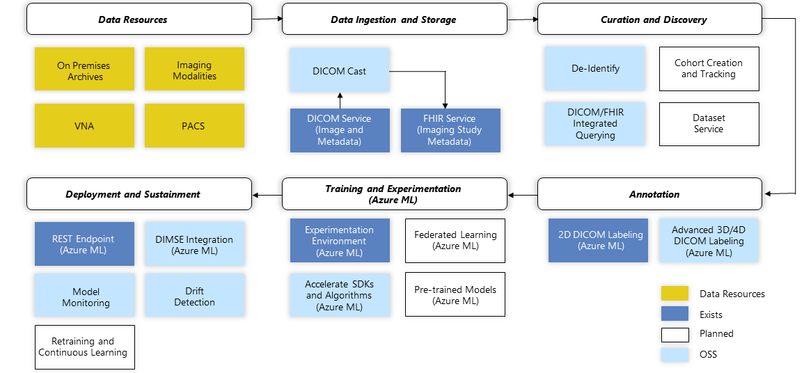

You can couple various building blocks within Microsoft with the DICOM® service to enable end-to-end solutions in medical imaging. The following reference architecture diagram demonstrates how to enable AI/machine learning model consumption in the field through Microsoft cloud capabilities.

> [!div class="mx-imgBorder"]
> 

These capabilities enable certain scenarios, such as when the provider:

- Requests that someone brings them all images with similar tumors, or if the provider needs someone to pull all related digital pathology images for those studies where they were found positive for the digital pathology result.

- Wants to join FHIR® records and imaging (radiology and digital pathology).

- Plans to create a model as a classifier and train the classifier to predict the outcome by looking at previous radiology images (to review first because they would be more likely to show cancer results).

## Radiology use cases

Cancer treatment is costly, financially and psychologically. Even with this expensive and tiring process, half of the patients aren't getting successful results from their treatments. Important roles of intelligent care exist in cancer detection, treatment, and proactive studies. These roles include finding similar patient records for clinical decision support, prioritizing cases based on cancer detection and growth cycles, and closing the feedback loop on false positives or model predictions.

The DICOM service in the Microsoft cloud plays a vital role in finding similar patient diagnostic images and treatment results that provide clinical decision support. The DICOM service prioritizes image review that reduces wasted time so that practitioners can act fast and connect initial diagnostic images to digital pathology images. This feature streamlines the process between abnormality detection and identifying the reality behind it.

This module will explore two scenarios:

- **USE CASE 1** - Medical imaging query and cohort

  "How can I select the best path of treatment for cancer patients by using longitudinal datasets?"

- **USE CASE 2** - Create a model as a classifier for cancer prediction

  "How can I prioritize the review of radiology and digital pathology images in the clinical workflow that have a higher likelihood of showing evidence for cancer?"

The next units will explore these use cases in depth.
