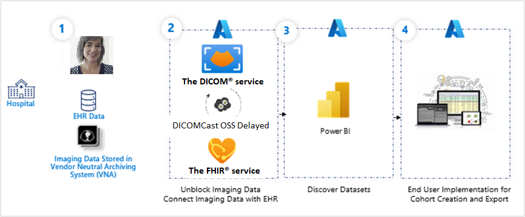
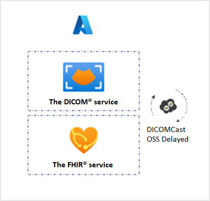
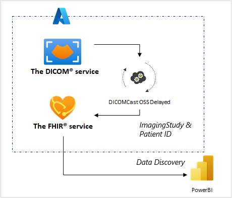
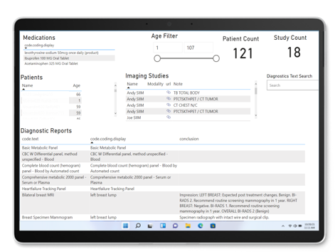

Consider the following scenario for a patient named Mary. 

Mary has recently had a cancer diagnosis confirmed from a biopsy following a CT scan. Mary's caregivers are reviewing treatment options and struggling to agree on the best approach. To aid in Mary's treatment protocol, the lead clinical informaticist at the hospital works with the team to use thousands of medical images and associated patient records to create a true picture of Mary's health journey and develop the best care plan.

The care team has intersected FHIR® and DICOM® data for query and cohort creation and tracking. Moreover, they've found imaging and treatment data for similarly diagnosed patients who had successful (or failed) outcomes on the treatment type chosen. As a result, Mary's care team can provide more viable options.

Mary's imaging and electronic health record data, and the data of thousands of other patients, is ingested into the DICOM service and FHIR® service. Digital pathology imaging data is converted and stored as DICOM® instance files and ingested into the DICOM service along with the patients' medical records in the FHIR service.

The following information is ingested:

- Mary's imaging and electronic health record data (EHR), and the data of thousands of other patients, is ingested into the DICOM service and FHIR service.

- Digital pathology image data is converted and stored as DICOM® files and ingested into the DICOM service and FHIR service.

The following diagram illustrates the process.

> [!div class="mx-imgBorder"]
> 

In the preceding diagram, the process is as follows:

1. The hospital uses electronic health record data and imaging data.

1. The process unblocks imaging data and connects imaging data with electronic health records.

1. Power BI helps discover datasets.

1. The end user implements cohort creation and export.

The following sections explore these steps in more detail.

The first step is importing electronic health records with related medical imaging of the patient in the Azure Health Data Services workspace. In this case, Mary's medical history is connected with her latest medical imaging data through DICOMcast and is ready for search and retrieval. Additionally, the de-identified records of all patients who had similar diagnosis (or were *false positive*) and received cancer treatment are ingested and ready for search and retrieval.

> [!div class="mx-imgBorder"]
> 

When a new DICOM® object is uploaded to DICOM service, DICOMcast will synchronize metadata within FHIR service to achieve end-to-end connected patient data within an Azure Health Data Services workspace (imaging data and text-based health data).

> [!div class="mx-imgBorder"]
> 

Then, after the data (imaging data and text-based health data) merge has completed, the care team can connect FHIR service to Power BI to discover available datasets for a specific cohort request.

> [!div class="mx-imgBorder"]
> 

Providers will use applications that can quickly identify cohorts and suggest real-world action based on real-world data.

> [!div class="mx-imgBorder"]
> 

Mary is able to benefit from the entire collection of available data as her team seeks to improve her cancer treatment outcome.
