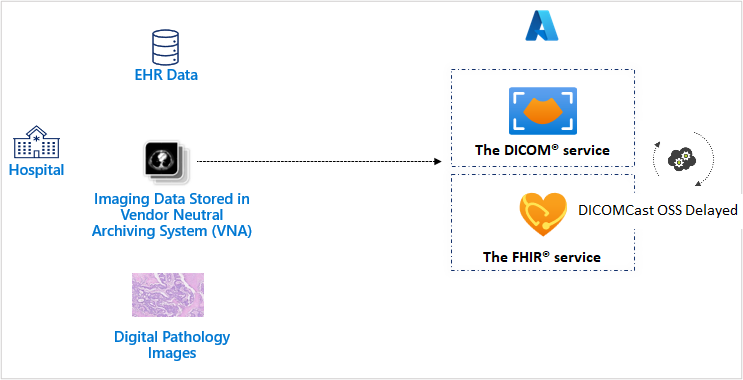
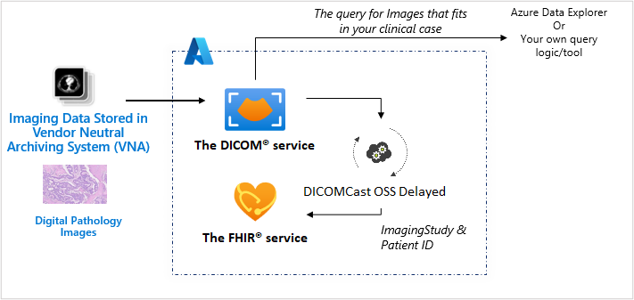
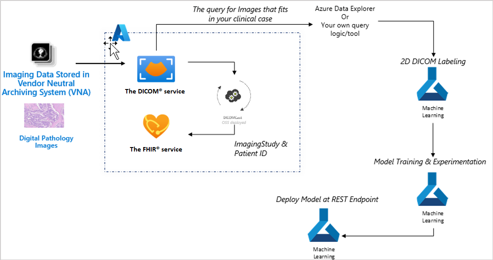

Using the clinical data from incoming radiology and digital pathology images, you can create an AI model for predicting cancer. By creating and training a classifier based on the imaging and treatment data for similarly diagnosed patients who had positive or negative test results, you can predict outcomes.

You can accomplish this goal if you have access to:

- Images with similar tumors.

- Connected datasets for each patient (FHIR® records + radiology images + digital pathology images).

- Related radiology and digital pathology images for those studies.

Then, you can create a model as a classifier and train the classifier to predict the outcome by looking at the previous radiology images.

## Build the model

Machine learning models do best when you can use real-world feedback to improve these models. The following image shows an example of the pipeline to build and train a radiology model.

> [!div class="mx-imgBorder"]
> 

The preceding diagram shows the components for building and training a radiology model, in the following order:

1. Text-based PHI health records in FHIR

1. Query image datasets that fit the clinical criteria

1. 2D DICOM® labeling

1. Model training and experimentation

1. Deploy the model at REST endpoint

1. End user implementation

In the preceding example, steps one, two, and three are an ongoing process. These steps are sending data to Azure Machine Learning for training the model so that it can continuously be improved. In step six, the implementation to end users might be for clinical workflows, operational workflows, and patient workflows.

The following sections evaluate the steps in greater detail. The series of diagrams build on one another and show how these steps become actions.

The first step involves unblocking imaging data and connecting the imaging data to text-based PHI. Imaging and electronic health records data, and the data of thousands of other patients, is ingested to the DICOM service and FHIR service. Digital pathology image data is converted and stored as a DICOM® file and ingested to the DICOM service and the FHIR service. When a new DICOM® object is uploaded to DICOM service, DICOMcast will synchronize the metadata within the FHIR service to achieve end-to-end connected patient data within the Azure Health Data Services workspace.

> [!div class="mx-imgBorder"]
> 

The second step is centered on identifying similar imaging studies to create a pool of data that you can use on model training. After the radiology images and digital pathology images have been ingested, you can query and feed images into Azure Machine Learning to train your clinical models or to run through existing models for predictive outcomes.

> [!div class="mx-imgBorder"]
> 

Step three is to perform annotation through 2D DICOM® labeling for images with similar tumors. You'll complete this step to prepare the images as model-training data.

> [!div class="mx-imgBorder"]
> 

The fourth step uses 2D labeled images with a complete set of text-based PHI data to train a prediction model in an Azure Machine Learning experimentation environment (for radiology images and digital pathology images). The model will be used as a classifier on high probable cancer images.

> [!div class="mx-imgBorder"]
> 

In step five, the classifier is deployed to triage images for their cancer probability (for providers to look at first because these images would be more likely to show evidence of cancer).

> [!div class="mx-imgBorder"]
> 

Step six involves highlighting images in the clinical workflow based on their urgency.

> [!div class="mx-imgBorder"]
> 

This example is only one of a flow of data that can transform real-world evidence to improve real-world outcomes.
