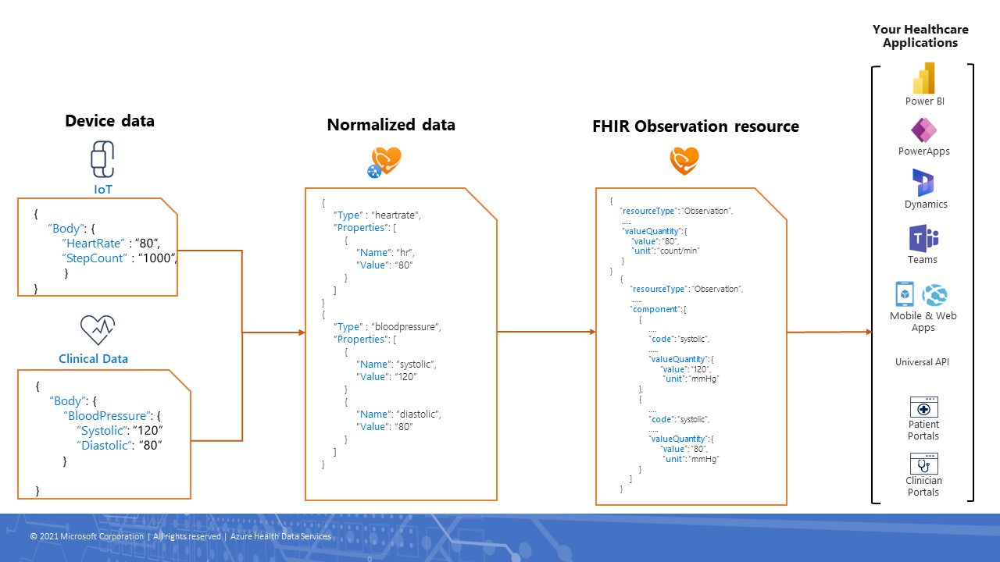

With all of this data being collected, you might wonder where the data goes. Other factors to consider include determining how medical staff will interact with and learn from the data, and how they can plan patient care by using the data. Another concern is determining whether practitioners will be able to ingest and use unstructured data and structured data.

Today, no clear standards have been established for IoT data models, so it's difficult to achieve uniformity and standardization of IoT data without the tools that are available from the MedTech service. Azure Health Data Services enables the ingestion and normalization of this data to ensure interoperability.

> [!div class="mx-imgBorder"]
> 

## IoT data normalization and transformation

Transforming data from any device (digital health device, wearables, sensors) to FHIR® is possible with the MedTech service from Azure Health Data Services. The following example shows the typical steps for data transfer from an IoT device to healthcare applications.

> [!div class="mx-imgBorder"]
> 

Starting from the left in the preceding image, you'll start with messages that might be generated by an IoT device, such as a smart watch or heart monitor. 

The organization that's requesting this IoT data requires only the heart rate measurement from the first message; but systolic and diastolic blood pressure information is requested from the second message.

The MedTech service transforms device data into a normalized schema. Using the preceding example, the role of the service would be to streamline data that was originally found written as "Heart Rate" (versus written as "HR") with associated values and that was associated with other clinical measures such as systolic and diastolic blood pressure information in the normalization process.

Then, normalized data will be grouped and transformed into a set of FHIR® *observation* resources, as shown in the third column. The first observation resource contains heart rate information, and the second observation contains two different components: one for systolic measurement and the other for diastolic measurement.

You can set up the MedTech service to work with any IoT device by building appropriate device and FHIR® mapping templates for them. Some examples of devices that have been used with this MedTech service include Fitbit, Apple Watch, Garmin, blood pressure cuffs, scales, glucometers, inhalers, and pulse oximeters.

## Sample reference architecture

The following sample reference architecture demonstrates the ingress and egress of data from an IoT device (like a smart watch or scale) into Azure Health Data Services through the MedTech service. After the data has been ingested, you can normalize it in FHIR® and transform it for a wide range of uses across the broader Microsoft cloud from scheduling, events, and analytics to machine learning and beyond. As shown in the following image, the IoT data from multiple device types will egress from Azure Health Data Services through connectors to these Microsoft and external services. 

> [!div class="mx-imgBorder"]
> 
