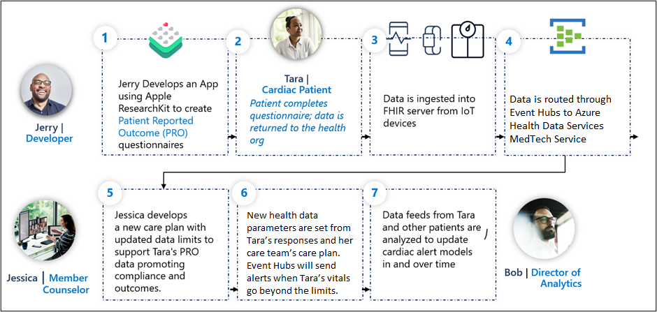
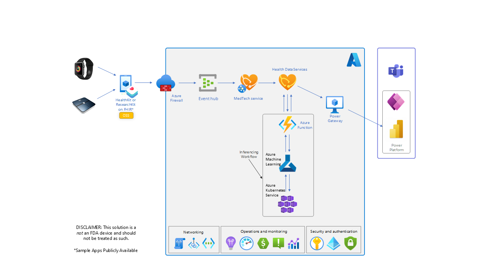

Another IoT use case involves the use of open-source frameworks, such as Apple ResearchKit, to create visual consent flows, real-time dynamic active tasks, and surveys by using customizable modules.

Partners and customers can build a patient-facing interface that's created and customized for Tara based on self-reported outcomes. This approach will enable Jessica to capture patient sentiment in a structured and near real-time way. The frequency and accuracy of the data enables Jessica to provide proactive versus reactive intervention and to support the aim of reducing the chance of another cardiac patient admission for Tara. The information is shared in compliance with HIPAA regulations, and after it's been de-identified, the data becomes part of larger, centralized datasets that can be used for clinical research.

The following diagram shows the process flow.

> [!div class="mx-imgBorder"]
> 

## Reference architecture

The following sample reference architecture demonstrates the flow of data that's specific to the Apple ResearchKit and HealthKit integration.

> [!div class="mx-imgBorder"]
> 
