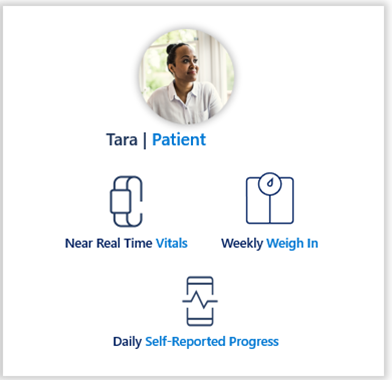
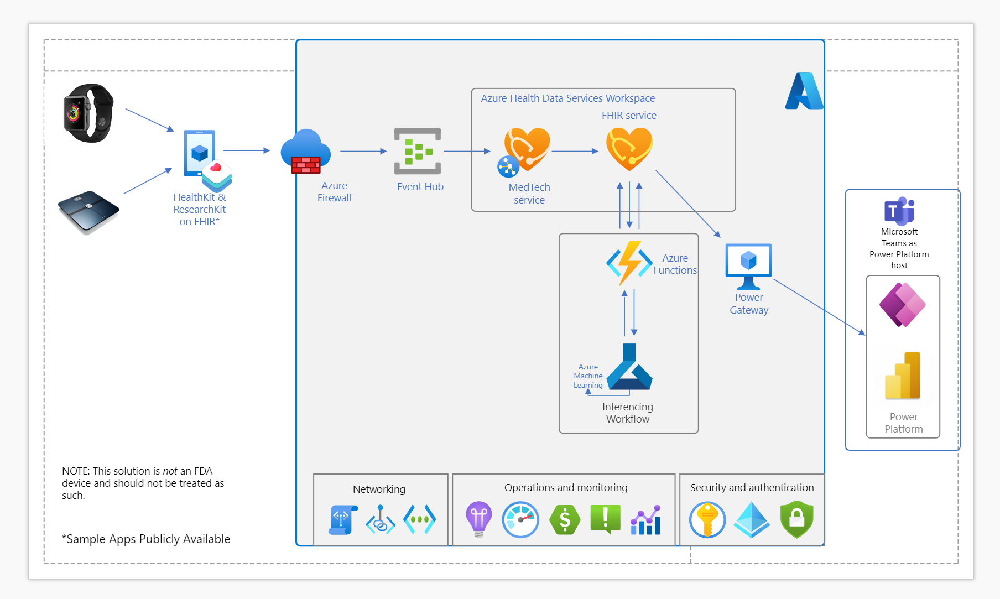

Consider a scenario where a patient with a chronic condition requires monitoring of contributing factors that influence their well-being while managing this chronic condition. Prior to IoT devices, the patient would be inconvenienced with scheduling multiple visits with an overworked provider, taking their own vitals (which is prone to human error), or managing their condition without the benefit of regular monitoring.

With devices such as smart scales, smart watches, and more, the patient can wear a device or step on a scale, and the data will be reported to whichever provider has been set up. Events, made possible by Azure Health Data Services, can enable the patient and their provider to spot trends early, or they can look for abnormalities and respond appropriately. By focusing on creating the tools that enable such reminders, or *nudges*, Azure Health Data Services can empower providers to improve patient outcomes.

> [!div class="mx-imgBorder"]
> 

In the DICOM section, the medical image querying and cohort identification are highlighted to help improve the case for a patient named Mary. In this scenario, the focus is on creating reminders or *nudges* for a cardiac patient named Tara. In this use case, the nudges are directed to a member counselor for Fabrikam Insurance, Jessica.

Microsoft provides the infrastructure for partners to build solutioning on the stack. To enable the sending of reminders or nudges to Jessica regarding Tara's wellness, the care team would determine the type of health information that should be monitored (such as, heart rate and weight), allowing the payor's team to decide what data from the FHIR® record will be pulled into the model.

| Data Architect  | Director of Analytics  | Chief Clinical Officer  |
|---|---|---|
| Decide what data from the FHIR® record will be pulled into the model  | Analyze patient records to build a machine learning-driven alert rule into Dr. Jerry’s workflow | Ensures that the appropriate alert thresholds are set up   |
| Structure and map data from IoT devices to FHIR® resources to enable data analytics in the Microsoft cloud  |   | Monitor metrics to reduce alert fatigue  |

After the IoT device data feed has been established, and when Microsoft Teams has been set up for notifications, Jessica can receive a nudge if Tara's wellness recovery trend changes. Then, Jessica can reach out to Tara for follow-up or to better understand disparities from FHIR® records. Tara knows that the recovery journey will be supported with advanced models that are looking for patterns in the monitored data.

The following sample reference architecture demonstrates the steps that are involved in taking data from IoT devices and disseminating the nudges that were previously described.

> [!div class="mx-imgBorder"]
> 
