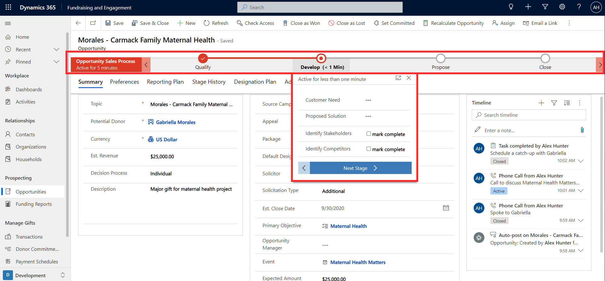
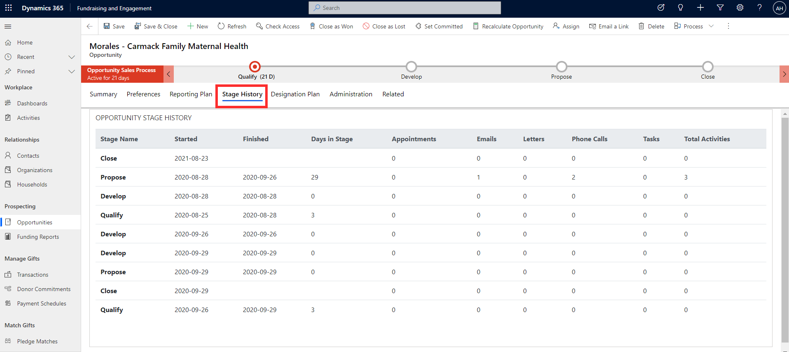
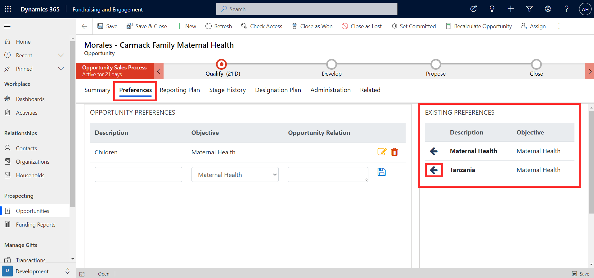

Opportunities in Fundraising and Engagement are used to manage the process of stewarding a solicitation from prospect to donor commitment. Throughout the process you can track the tasks, outcomes, details, and stages involved in the process.

You can access opportunities from the prospecting section of the main navigation menu. The screenshot below shows an example of an open opportunity for a major gift.

> [!div class="mx-imgBorder"]
> 

This form displays all the details of the opportunity. An opportunity can be linked to either a contact or an organization as the potential donor. You can record the estimated value and close date of the gift, which can be used for forecasting. You can also note whether the decision involves an individual or committee.

Linking the opportunity to the originating campaign allows you to track, report, and forecast on your pipeline in relation to your campaign and program goals. You can also link the opportunity to an appeal, package, designation, and event, for other tracking and reporting options.

You can connect an opportunity to the person who solicited the donation, using the solicitor column. The opportunity is also connected to an Opportunity Manager, the donor stewardship staff member responsible for managing the process, who may be different from the solicitor.

## Opportunity timeline

The timeline on an opportunity displays a history of activities, including appointments, emails, phone calls, and tasks. You can also add notes to record feedback, thoughts, or any other ongoing information that you might want to refer to.

You can search, filter, and change the sort order of the timeline. The timeline is natively integrated with Outlook, so you can automatically track and synchronize emails and appointments.

## Opportunity process

The business process flow at the top of the record guides you through the stages and steps to obtain the gift. You can configure it based on your organization's processes. It displays the current stage of the opportunity and the number of days it has remained in that stage.

> [!div class="mx-imgBorder"]
> 

Each stage has a series of steps that should be completed before progressing to the next stage of the process.

To learn more about Business Process Flows and how they work in opportunities, see [Opportunity management lifecycle](/training/modules/manage-opportunities-dynamics-365-sales/4-opportunity-management-lifecycle?ns-enrollment-type=LearningPath&ns-enrollment-id=learn-dynamics.dynamics-365-for-sales&azure-portal=true).

## Stage history

From the **Stage History** tab of an opportunity record, you can access further details on how the opportunity has progressed through the stages in the process. This is automatically updated, showing the number of days an opportunity has been at a particular stage and the number of activities that took place (appointments, emails, letters, phone calls, tasks).

> [!div class="mx-imgBorder"]
> 

## Preferences and objectives

Aligning preferences and objectives with the major move is an important part of personalizing the engagement plan. The primary objective associated with the opportunity can be linked from the summary page. You can associate other preferences from the donor, or add extra preferences, from the **Preferences** tab. Select the arrows to align specific preferences from the donor to this opportunity.

> [!div class="mx-imgBorder"]
> 
