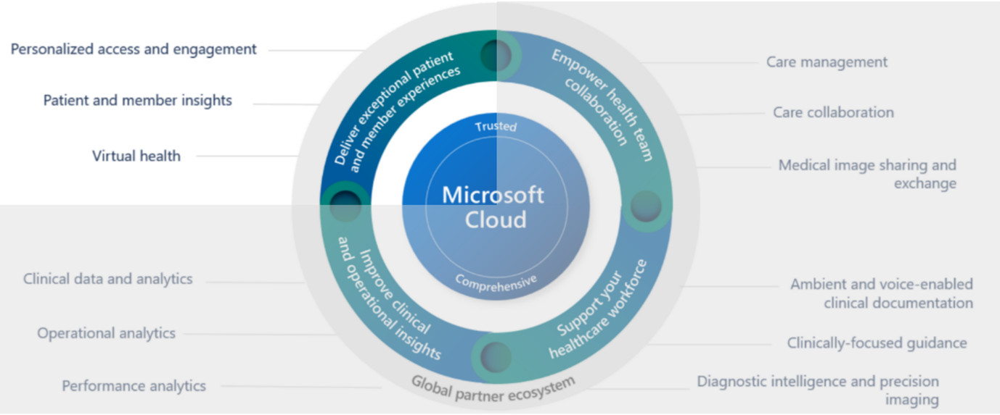
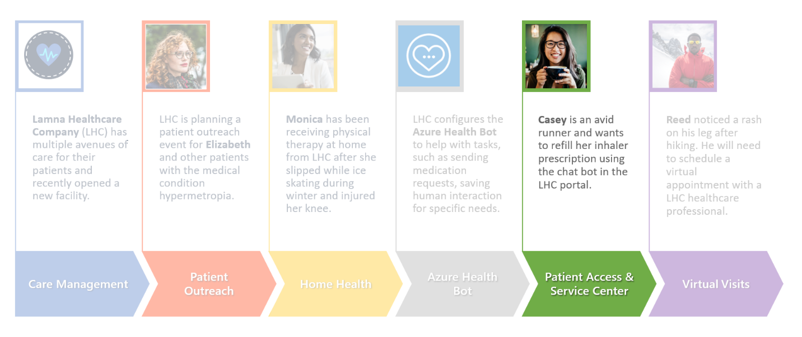

Microsoft Cloud for Healthcare includes Patient Access and Patient Service Center.

### Patient Access

You can provide patients with access to their health data, in-person and virtual appointment scheduling, and information through knowledge articles. Patient Access provides a portal that helps you give patients the ability to chat with a health bot, communicate with a caregiver, and view their clinical data.

Patient Access includes the following capabilities that you can provide to your patients:

- **Access** - Patients have a user-friendly portal to access their health information.

- **Direct engagement** - Patients can engage through automated chat conversations that hands off to your patient service center.

- **Scheduling and messaging** - Patients can schedule appointments and send messages to their providers.

### Patient Service Center

In the Patient Service Center, you can engage with your patients in the way that they want while monitoring automatic conversations through the Microsoft Azure Health Bot service. Additionally, service agents can help your patients with information and setting up appointments.

The Patient Service Center includes the following capabilities:

- **Patient conversation monitoring** - An ongoing conversations dashboard provides information on the conversations that are handled by the agents and integrated bots.

- **Agent scripts** - Use provider-specific agent scripts to address patient issues.

- **Effectiveness monitoring** - Conversation intelligence provides insights for service center managers on agent performance.

- **Follow-up** - Send follow-up surveys on patient satisfaction, reminders on appointments, and more.

- **Appointment scheduling** - Schedule or reschedule appointments during conversations with patients.

### Industry-prioritized scenarios

The Patient Access Portal and Patient Service Center modules focus on the **Enhance Patient Engagement** priority scenario by communicating effectively with patients with the prebuilt guidance and automated systems.

> [!div class="mx-imgBorder"]
> 

### Healthcare story

The lab for this module focuses on the healthcare story of Casey Jensen.

> [!div class="mx-imgBorder"]
> 

Casey is an avid runner but has exercise-induced asthma and requires an albuterol inhaler to help with breathing while running. Casey realized that their current albuterol inhaler is low on medication and decided that it's a good time to get a refill.

In this lab, you first play the role of a Lamna Healthcare system administrator, where you set up the Patient Access portal and various tools in the Patient Service Center application. Next, you play the role of Casey, who signs in to the portal and navigate the various options. Then, Casey interacts with the Azure Health Bot and escalates to a live agent in Patient Service Center. At the end, Casey realizes that that there are many care plan activities reflecting as overdue in the patient portal and updates the overdue activities as completed.
