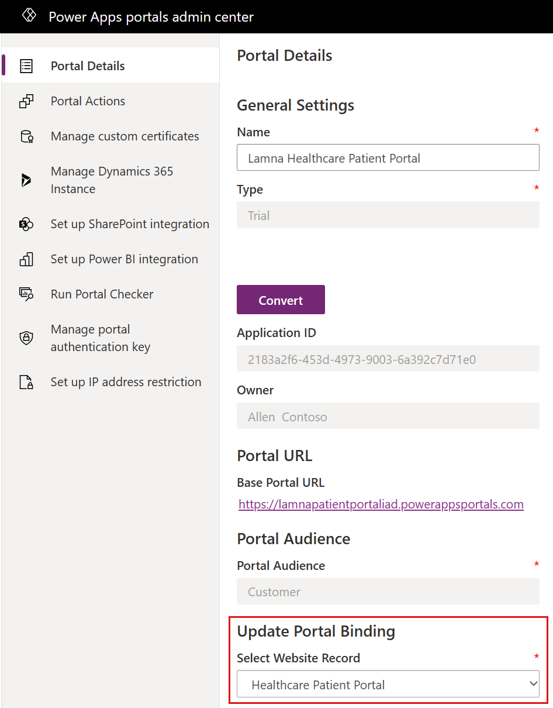

In this exercise, you complete the following tasks:

- Set up an external website to display the Lamna Healthcare Patient Portal template.

- Modify Lamna Healthcare Patient Portal to display the proper company name.

- Create a registration code and invite a patient to create an account for the website.

- Sign in as the patient to navigate the features of the healthcare portal.

**Healthcare Patient Portal** is a template that is installed in your environment by the Patient Access module in Microsoft Cloud Solution Center when Microsoft Cloud for Healthcare is deployed.

**Microsoft Power Pages** (previously Microsoft Power Apps portal) is an external website that allows communication between a company and its users. In this case, Lamna Healthcare Company wants an external website for their patients to access their medical histories and communicate effectively with the institution. The Healthcare Patient Portal template tailors the website's user interface (UI) for a healthcare company. It focuses on providing more secure communication, information access, and an overall improved patient experience.

The following image shows an example of the welcome page that displays after you set up and signed in to the Lamna Healthcare Patient Portal.

> [!div class="mx-imgBorder"]
> 

For more information, see [Microsoft Power Apps portals documentation](/power-apps/maker/portals/?azure-portal=true#).

### Task: Set up the Lamna Healthcare Patient Portal

Prior to deploying Microsoft Cloud for Healthcare, you created a portal in your environment by using the **Customer Self-Service** template. Creating this portal was a prerequisite for deploying the Patient Access module.

Lamna Healthcare wants to associate the previously installed Customer self-service template with the **Healthcare Patient Portal** template so that the correct website is displayed to the user. The following steps guide you through the process of binding your website to the proper template and restarting the portal for changes to apply.

First, open the portal to view the Customer Self-Service template that is currently bound. After you complete the configuration steps in this task, the new Lamna Healthcare Patient Portal UI will display.

1. While using an InPrivate or Incognito window, go to [Power Pages portal](https://powerpages.microsoft.com/en-in/).

1. From the **Active Sites** page, select **Lamna Healthcare Patient Portal** and then **Preview** > **Desktop.**

    > [!div class="mx-imgBorder"]
    > 

1.	The **Customer Self-Service** website template is displayed in the Lamna Healthcare Patient Portal. Close the website. You need to set it to the Healthcare Patient Portal template.

    > [!div class="mx-imgBorder"]
    > 

1. Go back to [Power Pages](https://powerpages.microsoft.com/en-in/) portal.

1. Select the three horizontal dots and then **Admin center**.

1. A new window opens with Microsoft Power Platform admin center, where you can complete administrative tasks. Select **Switch to Classic** in the upper command bar to use the classic UI to complete the template binding.

    > [!div class="mx-imgBorder"]
    > 

1. In the **Portal Details** area, scroll down to **Update Portal Binding** and select **Healthcare Patient Portal** from the **Select Website Record** dropdown menu. 

    > [!div class="mx-imgBorder"]
    > 

1. Select **Update** after you select the Healthcare Patient Portal.

1. Select **Portal Actions** on the left navigation pane and then select **Restart**.

    > [!div class="mx-imgBorder"]
    > 

1. Wait for 1 to 5 minutes for the portal to restart and then return to the website. The website should show the Healthcare Patient Portal template.

    > [!div class="mx-imgBorder"]
    > 

You completed the post deployment step to set up the Healthcare Patient Portal template that is deployed from Patient Access. After you updated the bindings and restarted the portal, the website will display as **Healthcare Patient Portal** template rather than **Customer Self-Service**.

### Task: Modify the company name in Lamna Healthcare Patient Portal

In this task, you edit the Lamna Healthcare Patient Portal website to align the name with Lamna Healthcare Company because the template uses a generic company name.

1. Go to [Power Pages](https://powerpages.microsoft.com/en-in/) where you have your Lamna Health care Patient Portal.

1. Select **Edit**.

    > [!div class="mx-imgBorder"]
    > 

1. After the page is loaded, **Contoso Healthcare** should show in the upper-left corner of the design screen. The name might overlap the logo, but it displays properly on the website.

    > [!div class="mx-imgBorder"]
    > 

1. Select the text box that reads **Contoso Healthcare** and then change it to **Lamna Healthcare**.

    > [!div class="mx-imgBorder"]
    > 

1. The page should automatically save the changes. Verify in the command bar that it says **Saved** and includes the green check mark. Then, hover the mouse cursor over **Saved** to ensure that it shows the correct saved time.

    > [!div class="mx-imgBorder"]
    > 

1. Select **Sync configuration** in the command bar to sync data to Microsoft Dataverse.

    > [!div class="mx-imgBorder"]
    > 

   It might take a moment to load the preview.

    > [!div class="mx-imgBorder"]
    > 

1. After the changes are completed syncing, select **Browse website** on the command bar.

    > [!div class="mx-imgBorder"]
    > 

   The Lamna Healthcare Patient Portal should open, showing the **Lamna Healthcare** company name in the upper-left corner.

    > [!div class="mx-imgBorder"]
    > 

You now completed modifying the Lamna Healthcare Patient Portal to display the correct company name.

### Task: Invite a patient to the portal

Now that the Lamna Healthcare Patient Portal is ready, you can allow Lamna Healthcare patients to create accounts.

In this task, you create an invitation code for patients to sign up and use the Lamna Healthcare Patient Portal. Additionally, you create an account for Casey Jensen, who will access the patient portal to refill medication in this lab.

1. Open the **Healthcare Administration** app in [Power Apps](https://make.powerapps.com/?azure-portal=true).

    > [!div class="mx-imgBorder"]
    > 

1. In the Lamna Healthcare environment, on the left navigation pane, under **Apps**, select the play button. 

1. In the **Administration** section on the left navigation pane, select **Patients**, which displays the **Active Patients** grid view. Open the **Casey Jensen** patient record so that you can obtain an invitation code for Casey to use.

    > [!div class="mx-imgBorder"]
    > 

1. On the Casey Jensen patient record, select the vertical ellipsis (**...**) on the command bar and then select **Create Invitation**.

    > [!div class="mx-imgBorder"]
    > 

1. A **New Invitation** form is displayed. Don't change anything; select **Save**. An invitation code is created for the patient.

    > [!div class="mx-imgBorder"]
    > 

1. To retrieve the patient code, go to the **Advanced** tab on the **Invitation** record. Copy and store the **Invitation Code** for accessing the Lamna Healthcare Patient Portal in the next task.

    > [!div class="mx-imgBorder"]
    > 

You successfully created an invitation code for Casey to register an account in the Lamna Healthcare Patient Portal.

### Task: Redeem the invitation code and sign in to Patient Portal

In this task, you transition personas and act as Casey, a patient who recently received an invitation code to the Lamna Healthcare Patient Portal. You use the code to register for the website and then navigate its features.

1. Return to [Power Pages](https://powerpages.microsoft.com/en-in/) and open the **Lamna Healthcare Patient Portal**.

1. In the Lamna Healthcare Patient Portal, select **Sign in**.

    > [!div class="mx-imgBorder"]
    > 

1. After the sign-in page loads, select the **Redeem invitation** tab.

1. Paste the invitation code that you stored for Casey Jensen. Select **Register**.

    > [!div class="mx-imgBorder"]
    > 

1. Register a new local account for Casey Jensen with the following recommended details:

    -  **Email** - Casey.Jensen\@contoso.com (should autofill)

    -  **Username** - CaseyJensen

    -  **Password** - Make up your own. Note the password to use for sign-in later.

1. Select **Register** and then you should be signed in to the Lamna Healthcare Patient Portal.

    > [!div class="mx-imgBorder"]
    > 

You successfully redeemed an invitation to register an account for Casey Jensen and you also signed in.

### Task: Navigate the Patient Access portal

In this task, you continue as Casey and navigate the features of the Lamna Healthcare Patient Portal.

1. You should be directed to the Lamna Healthcare Patient Portal home page. If not, select the logo in the upper-left corner to go to the home page anytime.

    > [!div class="mx-imgBorder"]
    > 

   The center of the home page shows shortcuts to **Schedule an appointment**, **View messages**, or **Find a doctor**.

    > [!div class="mx-imgBorder"]
    > 

   Under the shortcuts, a section shows current patient information, including **Unread messages**, **Upcoming appointments**, and **Medications**.

    > [!div class="mx-imgBorder"]
    > 

1. The left navigation pane contains all available options for navigation in the Lamna Healthcare Patient Portal. Select each option to discover what's available and to view each associated screen.

    > [!div class="mx-imgBorder"]
    > 

1. Select **Home** to return to the home page.

1. Select **Find a doctor** to view a list of practitioners with associated information.

    > [!div class="mx-imgBorder"]
    > 

1. Selecting **Messages** allows for a more secure method to send and receive messages to healthcare professionals. Expand **Messages** on the navigation bar to view the **Inbox** and **Sent** messages.

    > [!div class="mx-imgBorder"]
    > 

1. Expand **Appointments** to check upcoming appointments and to schedule new appointments. Scheduling new appointments allows for clinic or virtual appointments, including instant virtual appointments. The **Schedule a virtual visit**  exercise goes through the process of booking an instant virtual appointment.

    > [!div class="mx-imgBorder"]
    > 

1. Expand the Medical records section in the **Overview** section, review the medical records, including medications, allergies, conditions, visit summaries, care plans, and care team. You can view a full overview and filter by date and type.

    > [!div class="mx-imgBorder"]
    > 

1. In the **Personal information** section, review the emergency contacts and insurance coverages.

    > [!div class="mx-imgBorder"]
    > 

    > [!div class="mx-imgBorder"]
    > 

1. Locate the Azure Health Bot icon in the lower-right corner of the screen. You can start a conversation by selecting the **Let's Chat** button to open the virtual assistant.

    > [!div class="mx-imgBorder"]
    > 

   In the final exercise, you have a full conversation with the bot; for now, you can select **Close** and then continue with this exercise.

    > [!div class="mx-imgBorder"]
    > 

1. Access the patient profile page by selecting the patient's name in the dropdown menu in the upper-right corner and then selecting **Profile**.

    > [!div class="mx-imgBorder"]
    > 

1. On the patient profile page, you can customize the patient profile as needed. For now, keep it the same.

    > [!div class="mx-imgBorder"]
    > 

1. Sign out of the Lamna Healthcare Patient Portal by selecting the patient's name in the dropdown menu in the upper-right corner and then selecting **Sign out**.

    > [!div class="mx-imgBorder"]
    > 

   You should be redirected to the sign-in page.

    > [!div class="mx-imgBorder"]
    > 

## Task - Update the care plan activities in the Patient portal

1. On the home page, in the left navigation pane, under **Care plans**, select **Activities to do**.
 
    > [!div class="mx-imgBorder"]
    > 

1. On Activities to do page, select the **Overdue** tab. 
   You view a list of tasks that are overdue and require to be completed.

    > [!div class="mx-imgBorder"]
    > 

1. Select the checkbox for these overdue tasks. 
   The confirmation message appears that the tasks are marked as completed. 
 
You now navigated the Lamna Healthcare Patient Portal to discover the information and communication that are available to the patient.

In this exercise, you completed the following tasks of:

- Setting up the Patient Access portal to display as the Healthcare Patient Portal template.

- Modifying the portal to display the company name.

- Inviting a patient to register for the website.

- Navigating the Healthcare Patient Portal features. 

- Updating the care plan activities as completed. 
