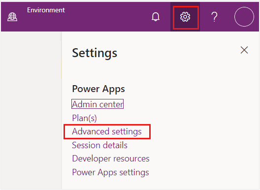

Lamna Healthcare Company wants to ensure that they have proper tools in place to provide the best service and guidance during patient interactions.

Patient Service Center has a **Productivity** pane, an auxiliary work area that contains tools that support or expedite an agent's tasks when they're engaging with patients. During a patient engagement, the pane is shown next to the patient record information, and the agent can collapse or expand it as needed. For more information, see [Productivity pane overview](/dynamics365/omnichannel/administrator/productivity-pane/?azure-portal=true#).

Agents can use the **Agent scripts** tool in the **Productivity** pane to help with patient care. Agent scripts provide guidance for a specific situation and can help organizations be unified, accurate, and effective while also being more efficient with patients. The scripts ensure that only company-endorsed information is being shared, help reduce error, and improve customer satisfaction.

In this exercise, you create and set up an agent script to appear in the **Productivity** pane in Patient Service Center. The following screen shows the **Productivity** pane, with the **Agent scripts** tab showing.

> [!div class="mx-imgBorder"]
> 

### Task: Assign the Productivity tools administrator role

In this task, you assign the necessary roles to your user to create and use agent scripts. Specifically, you add the **Productivity tools administrator** and **Productivity tools user** roles. The **Productivity tools administrator** can complete any action (create/read/write/append/delete) on the agent script, whereas the **Productivity tools user** role only has READ capabilities. Because you're creating the roles, you need the administrator role. For more information, see [Assign roles and enable users for Omnichannel for Customer Service](/dynamics365/omnichannel/administrator/add-users-assign-roles#understand-roles-and-their-privileges/?azure-portal=true#).

1. While using an InPrivate or Incognito window, go to [Power Apps](https://make.powerapps.com/?azure-portal=true).

1. Select the correct environment from the **Environment** dropdown menu in the upper-right corner. 

1. Select the **gear icon** in the upper-right corner and then select **Advanced settings**.

    > [!div class="mx-imgBorder"]
    > 

    A new window should open and direct you to Dynamics 365. If it takes a while to load, reload the page.

1. In **Dynamics 365**, select **Settings > Security**.

    > [!div class="mx-imgBorder"]
    > 

1. Under **Security**, select **Users**.

    > [!div class="mx-imgBorder"]
    > 

1. Switch the **System Views** dropdown menu from **Omnichannel Users** to **Enabled Users** for the grid view so that your user shows in the list.

    > [!div class="mx-imgBorder"]
    > 

1. While in the **Enabled Users** list, scroll down to find your user, or you can use the search option. Select your user and then select **Manage Roles** on the command bar.

    > [!div class="mx-imgBorder"]
    > 

1. Scroll down and select the following two roles for your user. Select **OK**.

    -  **Productivity tools administrator**

    -  **Productivity tools user**

    > [!div class="mx-imgBorder"]
    > 

> [!NOTE]
> You'll assign more roles in this exercise. We recommend that you leave the user screen open.

You successfully assigned the necessary **Productivity tools** user roles to set up and use agent scripts.

### Task: Create an agent script

In this task, you create an agent script in the Omnichannel Administration app. This script guides the agent to validate patient information when a conversation is initiated between a patient and an agent in Patient Service Center. The script has two steps: one to confirm phone number information and another to verify insurance information. This task guides you through the creation of this agent script and its steps.

1. In Power Apps, select **Apps** on the left navigation pane.  Open the **Customer Service admin center** application.

    > [!div class="mx-imgBorder"]
    > 

1. On the left navigation pane, under **Agent experience**, select **Productivity** and then select **Manage** next to **Agent scripts**.

    > [!div class="mx-imgBorder"]
    > 

1. Select **+ New** on the command bar to create a new agent script.

    > [!div class="mx-imgBorder"]
    > 

1. For the **New Agent script** record, specify the following information and then select **Save**.

    -  **Name** - Validate Patient Information

    -  **Unique Name** - msdyn_ValidatePatientInformation

    > [!div class="mx-imgBorder"]
    > 

1. The **New Agent script steps** subgrid should appear. Select **+ New Agent script step** to create a new step in the agent script.

    > [!div class="mx-imgBorder"]
    > 

1. Specify the following fields in the **New Agent script step** form:

    - **Name** - Confirm Phone Number

    - **Unique Name** - msdyn_ConfirmPhone

    - **Order** - 1

    - **Action type** - Text

    - **Text instructions** - Ask patient to confirm phone number.

1. Select **Save & Close**.

    > [!div class="mx-imgBorder"]
    > 

1. In the **Agent script steps** section, select **+ New Agent script step** again to add another step.

    > [!div class="mx-imgBorder"]
    > 

1. Specify the following fields in the second **Agent script step** form:

    1. **Name** - Verify Insurance Information

    1. **Unique Name** - msdyn_VerifyInsuranceInformation

    1. **Order** - 2

    1. **Action type** - Text

    1. **Text instructions** - Ask Patient for Insurance Provider and ID #. Verify their response matches insurance information on file.

1. Select **Save & Close**.

    > [!div class="mx-imgBorder"]
    > 

1. Both steps should now be in the **Agent script steps** subgrid. Select **Save & Close**.

     > [!div class="mx-imgBorder"]
    > 

You now completed creating an agent script with two steps to validate patient information, including phone number and insurance information.

### Task: Associate the agent script with a session template

In this task, you associate the agent script with a session template so that it loads for agents in specific chat sessions. You're associating the agent script that you created with the **Default chat session**. This default chat session opens during an escalation to an agent in Patient Service Center.

1. In the Customer Service admin center, on the left navigation pane, under **Agent experience**, select **Overview**. This page displays an overview of vital agent information.

    > [!div class="mx-imgBorder"]
    > 

1. Select **Session templates** under **Workspaces**.

    > [!div class="mx-imgBorder"]
    > 

1. Select the **Chat session - default** session template. Select **Edit** on the command bar to open the **Chat session - default** record.

    > [!div class="mx-imgBorder"]
    > 

1. To associate this session with the agent script, select the **Agent scripts** tab. In the **Agent scripts** section, select **Add Existing Agent script**.

    > [!div class="mx-imgBorder"]
    > 

1. The **Lookup Records** pane displays. In the **Look for records** box, select the search icon (magnifying glass). Select the **Validate Patient Information** agent script from the list.

    > [!div class="mx-imgBorder"]
    > 

1.  After the agent script is added as a record, select **Add**.

    > [!div class="mx-imgBorder"]
    > 

The **Chat session - default** session template should now have the **Validate Patient Information** agent script in the subgrid. Then select **Save and Close**.

   > [!div class="mx-imgBorder"]
   > 

You now successfully created an agent script with two steps and associated the agent script with the default chat session. Now, your agents can use this script during a default chat session with a patient.
