In this exercise, you learn how to create and manage knowledge articles that can address numerous issues that your customers want to discuss during the Patient Service Center conversation. These knowledge articles appear in the **Productivity** pane in Patient Service Center through searching and AI-enabled suggestions.

> [!div class="mx-imgBorder"]
> [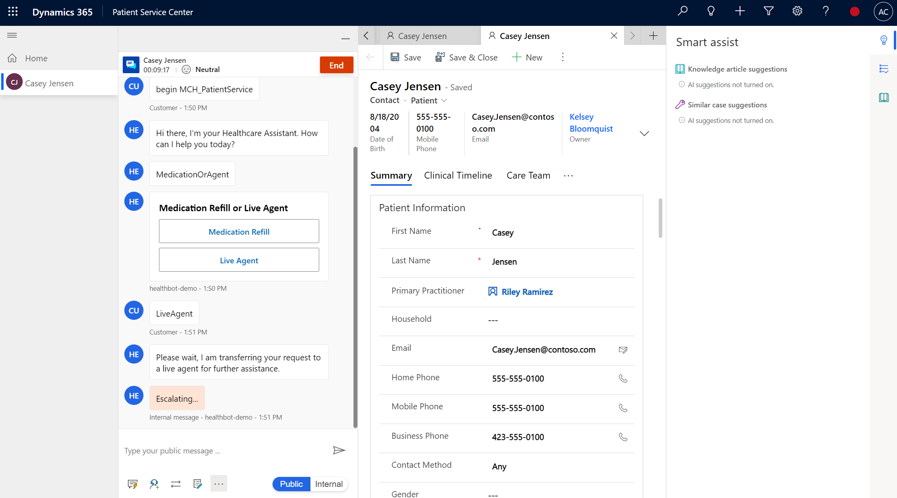](../media/124-escalated-sandbox.png#lightbox)

### Task: Assign the Knowledge Manager user role

In this task, you assign the necessary user role to create and view knowledge articles.

1. If you kept the **User Settings** page open from the previous exercise, go to the page, and then skip to the step after selecting **Manage Roles**.

1. Go to [Power Apps](https://make.powerapps.com/?azure-portal=true). Select the **gear icon** in the upper-right corner and then select **Advanced settings**.

    > [!div class="mx-imgBorder"]
    > [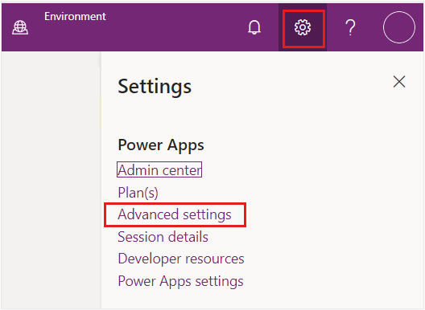](../media/advanced-settings.png#lightbox)

1. In **Dynamics 365**, select **Settings > Security**.

    > [!div class="mx-imgBorder"]
    > [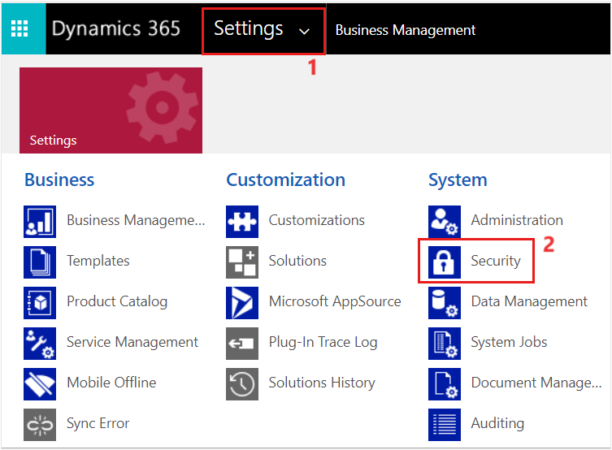](../media/security-settings.png#lightbox)

1. Under **Security**, select **Users**.

    > [!div class="mx-imgBorder"]
    > [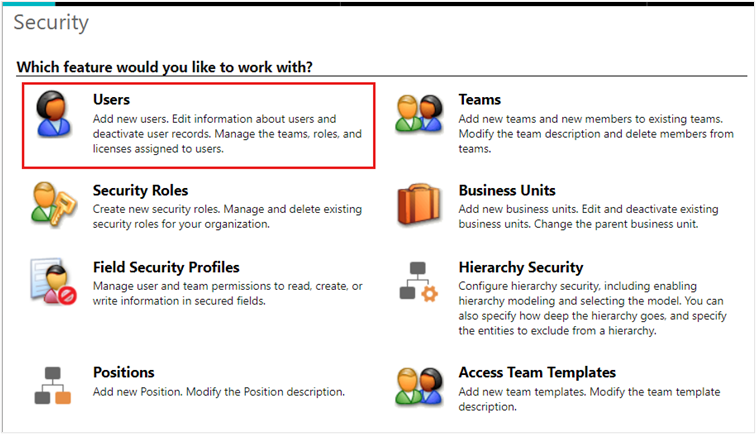](../media/security-users.png#lightbox)

1. Switch the **System Views** dropdown menu from **Omnichannel Users** to **Enabled Users** for the grid view so that your user shows in the list.

    > [!div class="mx-imgBorder"]
    > [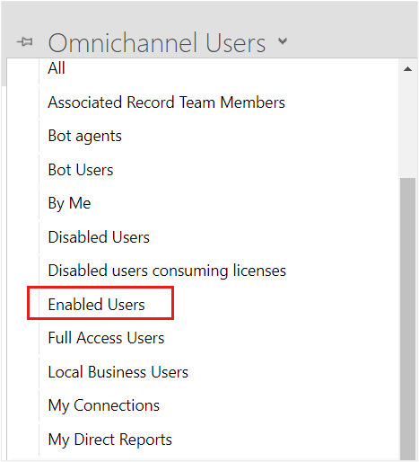](../media/enabled-users-sml.png#lightbox)

1. In the **Enabled Users** list, scroll and find your user. Alternatively, you can use the search option. Select your user and then select **Manage Roles** on the command bar.

    > [!div class="mx-imgBorder"]
    > [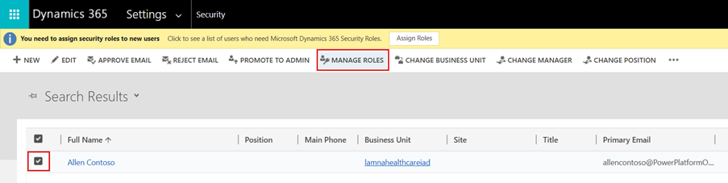](../media/manage-roles.png#lightbox)

1. Three roles that you can choose for [create/read permissions for knowledge articles](/dynamics365/customer-service/customer-service-hub-user-guide-knowledge-article#create-a-knowledge-article/?azure-portal=true#) are:

    - Knowledge Manager

    - Customer Service Manager

    - Customer Service Representative

   For this exercise, select the **Knowledge Manager** role.

    > [!div class="mx-imgBorder"]
    > 

1.	Ensure that you have the **System Administrator** role.

    > [!div class=”mx-imgBorder”]
    > [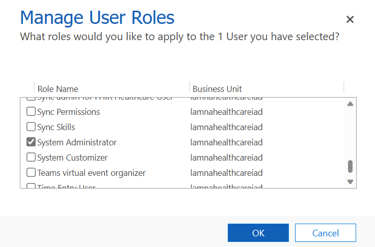](../media/62-system-administrator.png#lightbox)

1.	Select **OK** to close the **Manage User Roles** window and accept changes.

You now assigned the proper roles to create and read knowledge articles.

### Task: Create a knowledge article

In this task, you learn about the knowledge management settings that are available.

1. In [Power Apps](https://make.powerapps.com/?azure-portal=true), open the **Customer Service Hub** app and select the play button. 

    > [!div class="mx-imgBorder"]
    > [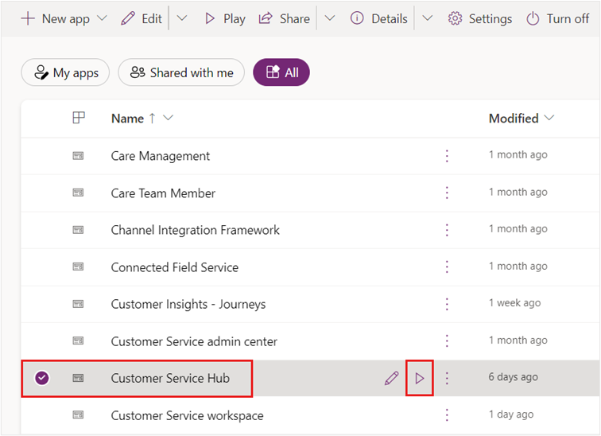](../media/98-customer-service-hub.png#lightbox)

1.  On the left navigation pane, select **Knowledge Articles**.  Select **+ New** on the command bar to add a new knowledge article.

    > [!div class="mx-imgBorder"]
    > [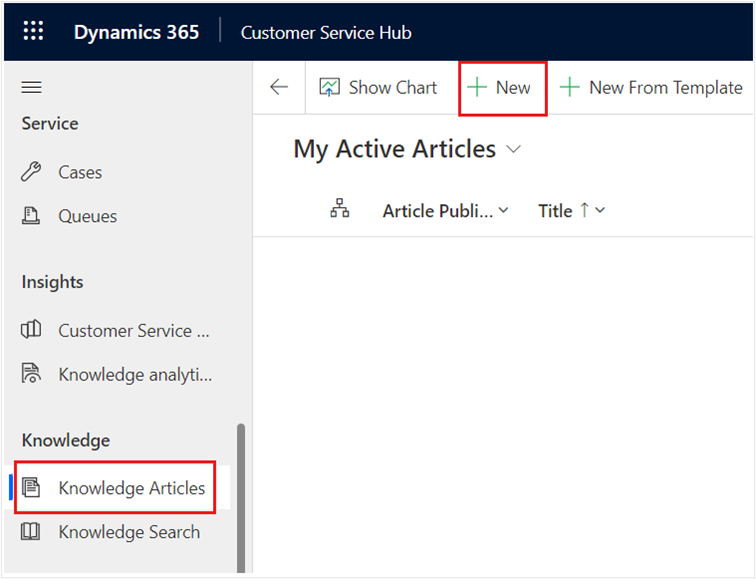](../media/106-new-command.png#lightbox)

1. In the **Article Content** section of the **New Knowledge Article**, specify the following details for a knowledge article on asthma and shortness of breath:

    - **Title** - Shortness of Breath

    - **Keywords** - Asthma, shortness of breath, trouble breathing, albuterol, inhaler

    - **Description** - Uncomfortable sensation or awareness of breathing or needing to breathe.

        > [!div class="mx-imgBorder"]
        > [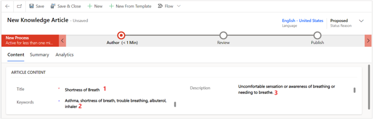](../media/108-article-content.png#lightbox)

1. Scroll down to the **Content** section under the **Article Content** area, copy and paste the following content for your knowledge article.

    **Common causes**

    Shortness of breath isn't always related to an underlying condition. It might be caused by:
    - Aerobic exercise
    - Intense physical activity
    - High altitude with lower oxygen levels
    - Poor cardiovascular fitness
    - Anxiety
    - Being obese
    - General weakness

    **Treatment**

    **Self-treatment:** Self-care steps that might be helpful in some less-serious cases:

    - Stop smoking
    - Avoid exposure to pollutants, allergens, and environmental toxins
    - Lose weight if overweight
    - Avoid exertion at elevations
    - Take slow, even breaths
    - When you breathe out, put your lips together, like slowly blowing out a candle (pursed lip breathing)

    **See a doctor if you notice:**
    - Chest pain or pressure
    - Inability to function

    **See a doctor immediately if you notice:**
    - Fever or a change in the amount, color, or thickness of sputum
    - Breathlessness doesn't go away after resting for 30 minutes
    - Swelling in the feet and ankles
    - Trouble breathing when you lie flat
    - High fever, chills, and cough
    - Wheezing
    - Worsening of preexisting shortness of breath

1. Select **Save**.

    > [!div class="mx-imgBorder"]
    > [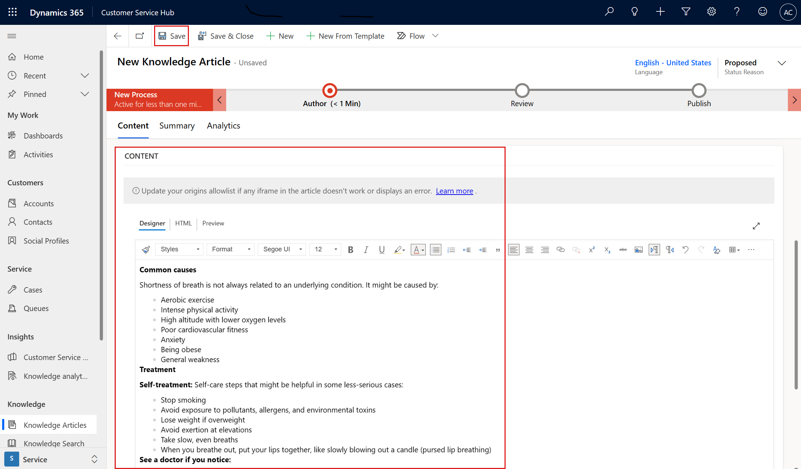](../media/110-select-save.png#lightbox)

1. The business process flow bar at the top of the form helps you to drive the article toward completion. On the business process bar, select **Author**. The business step options are displayed in a pop-up window.

    1. Add the **Article Subject** as **Default Subject**, which is the subject of the article to help with searches.
    
    1. Select the **Mark for Review** checkbox to show as **Completed**.

    1. Select **Next Stage** to mark the article as complete and ready for review.

    > [!div class="mx-imgBorder"]
    > [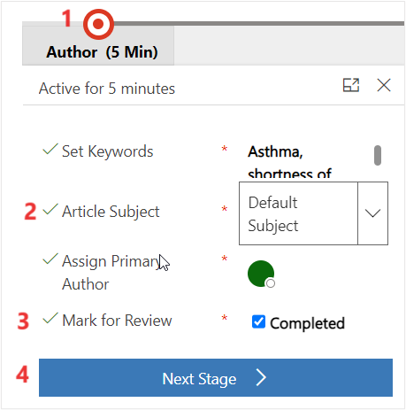](../media/111-select-author.png#lightbox)

1. The knowledge article is now in the **Review** stage of the business process flow. Select **Save & Close**.

   > [!div class="mx-imgBorder"]
   > [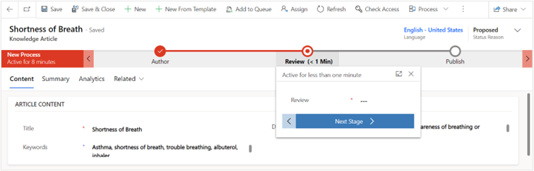](../media/113-business-process-flow.png#lightbox)

   The article is now in draft state and ready for review.

   > [!div class=”mx-imgBorder”]
   > 

You now successfully created a knowledge article titled **Shortness of Breath** and marked it for review.

### Task: Review and publish a knowledge article

Typically, to ensure accuracy of the knowledge article, someone else should review and approve it. However, for this training exercise, you mark the article as reviewed and approved instead. This task also requires the Knowledge Manager role or another role that can approve knowledge articles.

1. In **Customer Service Hub**, go to **Service > Dashboards** and then use the **System Dashboards** dropdown menu to select **My Knowledge Dashboard**.

    > [!div class="mx-imgBorder"]
    > [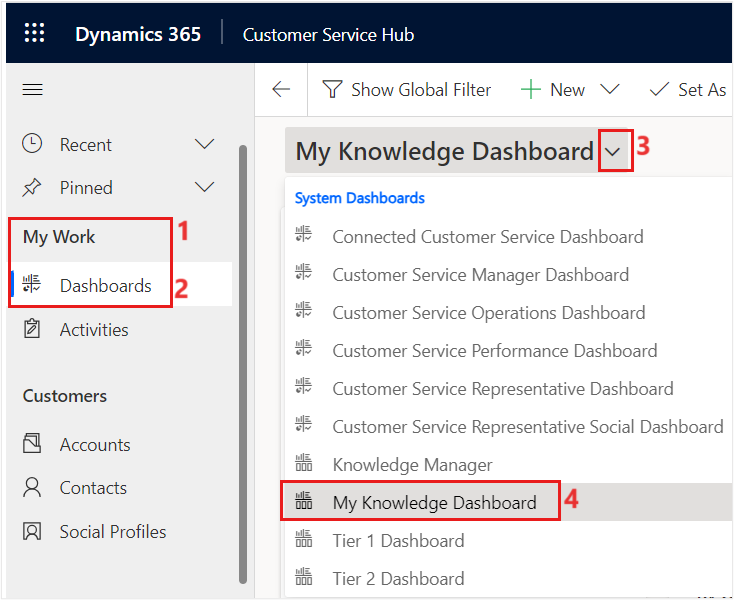](../media/114-knowledge-dashboard.png#lightbox)

1. Select the **Shortness of Breath** knowledge article in the **My Active Articles** stream.

    > [!div class="mx-imgBorder"]
    > [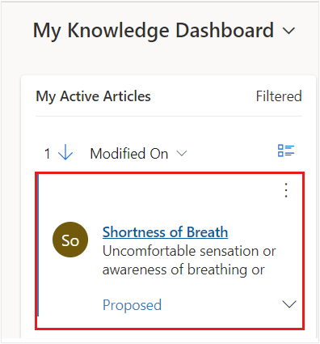](../media/115-active-articles.png#lightbox)

1. On the business process bar, in the **Review** stage and in the **Review** dropdown menu, select **Approved**.

    > [!div class="mx-imgBorder"]
    > [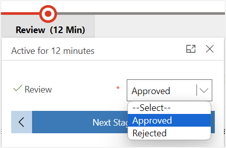](../media/116-review-stage.png#lightbox)

1. Select **OK** when prompted to **Confirm approval of article(s)**.

    > [!div class="mx-imgBorder"]
    > [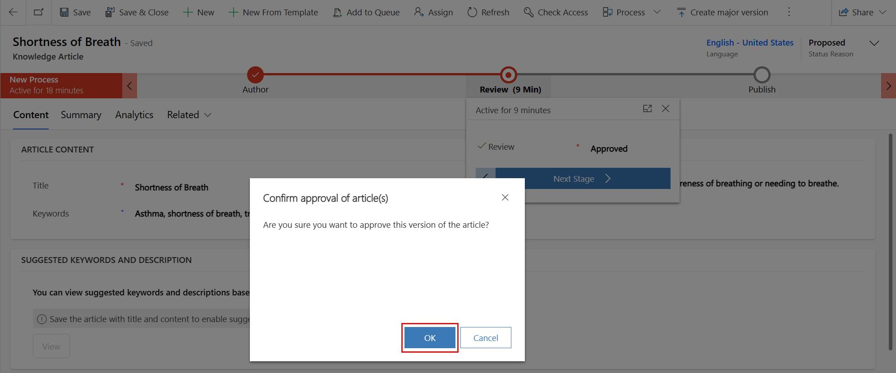](../media/117-confirm-approve.png#lightbox)

1. Select **Next Stage** to move to the **Publish** stage.

    > [!div class="mx-imgBorder"]
    > [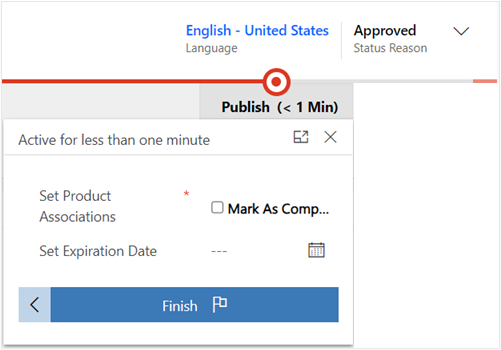](../media/118-next-publish-stage.png#lightbox)

1.	You should now be in the **Publish** stage and the **Status Reason** changes to **Approved**.

    > [!div class=”mx-imgBorder”]
    > [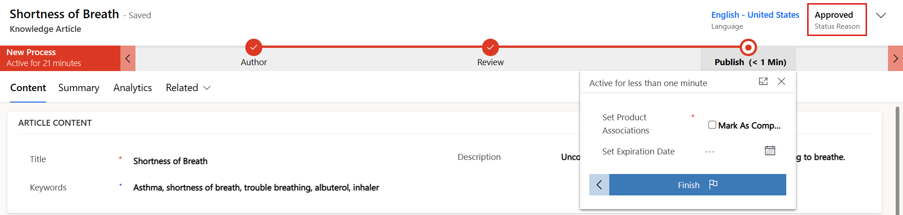](../media/118-next-publish-stage.png#lightbox)

You now successfully reviewed and approved the knowledge article. Next, you learn how to publish the knowledge article to be available during Patient Service Center calls.

### Task: Publish your knowledge article

In this task, you learn how to publish the knowledge article so that it's live and ready to be used.

1. In your **Shortness of Breath** knowledge article, select the **Publish** stage.

    1. For **Set Product Associated**, select **Completed**.

    1.  In the **Set Expiration Date** field, set the date for one year from now.

    1.  Select **Finish**.

    > [!div class="mx-imgBorder"]
    > [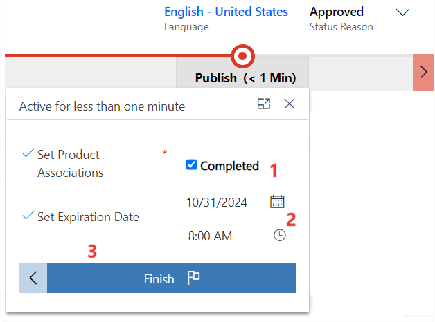](../media/120-finish.png#lightbox)

   After you select **Finish**, a panel will show to **Publish**.

1. Set **Expiration State** and **Expiration Status** to **Published**. Select **Publish**.

    > [!div class="mx-imgBorder"]
    > [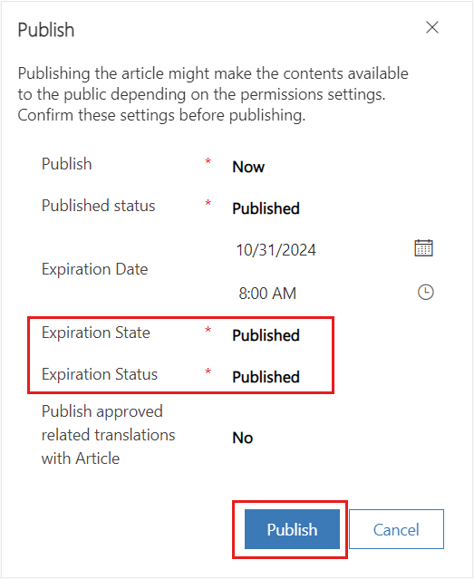](../media/121-completed-flow.png#lightbox)

   Now, the knowledge article is in a **Published** state.
    > [!div class=”mx-imgBorder”]
    > [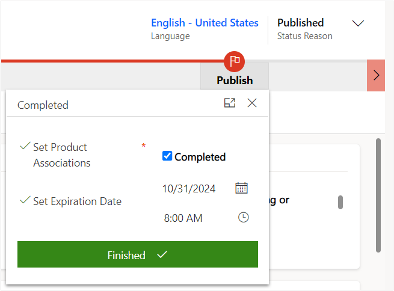](../media/123-publish-approved.png#lightbox)

You now successfully reviewed and published the knowledge article. You can view this knowledge article in Patient Service Center when you’re testing the final escalation.

You can accomplish numerous tasks with knowledge articles, and this module mentions only a small portion of capabilities. For more information about knowledge articles, see the following documentation:

- [Create and manage knowledge articles](/dynamics365/customer-service/customer-service-hub-user-guide-knowledge-article/?azure-portal=true#)

- [Search and share knowledge articles](/dynamics365/customer-service/search-knowledge-articles-csh?azure-portal=true#rue#)
