In this exercise, you test the end-to-end escalation experience that you set up for the Patient Service Center agent. This process starts from when the patient signs in to the portal website and continues with a Health Bot conversation. Then, it ends with an escalation to a human agent who provides proper care by using agent scripts and knowledge articles from Dynamics 365.

The following screen shows Patient Service Center after a patient call is escalated to a call agent. This exercise shows how the call agent can use the agent setup to give personalized experiences with proposed insights directly in the application.

> [!div class="mx-imgBorder"]
> 

### Task: Sign in to Healthcare Patient Portal and Patient Service Center

In this task, you sign in to Healthcare Patient Portal and Patient Service Center.

1. Go to [Power Apps](https://make.powerapps.com/?azure-portal=true) and open **Healthcare Patient Portal**.

1. Sign in to the Lamna Healthcare Patient Portal as **Casey Jensen** by using the credentials that you created.

    > [!div class="mx-imgBorder"]
    > [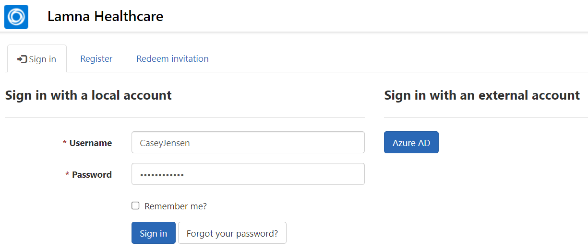](../media/125-local-account-sign.png#lightbox)

1. You should be directed to the home page. If you're on the profile page, select the Lamna Healthcare name/logo in the upper-left corner to go to the home page.

    > [!div class="mx-imgBorder"]
    > [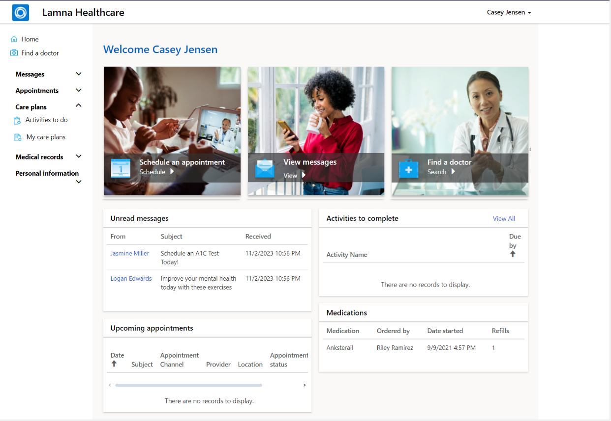](../media/126-lamna-homepage.png#lightbox)

1. Your patient is ready in Healthcare Patient Portal. Now, you ensure that an agent is available for the patient when the Health Bot needs to escalate.

    > [!NOTE]
    > Before opening Patient Service Center, make sure that you've already added the Omnichannel agent role to your user, as shown in the Azure Health Bot lab.

1. If you didn't assign the Omnichannel agent role in the Azure Health Bot lab, go to **Users** in Dynamics 365, select your user, select **Manage Roles**, assign the **Omnichannel agent** role, and then select **OK**. Changes might take 15 minutes to reflect properly.

    > [!div class="mx-imgBorder"]
    > [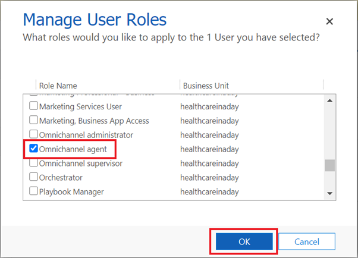](../media/127-manage-omnichannel-agent.png#lightbox)

1. Switch back to Power Apps Portal. Go to the **Apps** list in Power Apps and open the **Omnichannel for Customer Service** app.

1. In the **Omnichannel for Customer Service**, a loading screen displays that goes through percentages. This process ensures that the live agent status is captured properly.

1. If the loading screen doesn't appear and/or the presence indicator continuously spins or appears dimmed, then escalation into the Patient Service Center app from the Health Bot won't work properly. If so, refresh again, or close and reopen Patient Service Center until the loading screen appears. You might need to close all other apps or close the InPrivate or Incognito window and then sign in again.

    If you assigned the Omnichannel agent role, it might take up to 15 minutes to apply and for the presence to show for your user.

When your presence indicator is green, you're ready to accept patient escalations.

   > [!div class="mx-imgBorder"]
   > [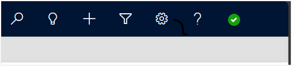](../media/130-presence-indicator.png#lightbox)

You successfully signed in as the patient and the live agent. Now, you can start the Health Bot conversation.

### Task: Patient escalates through Azure Health Bot to live agent

In this task, you experience the patient call escalation through the Azure Health Bot to a live agent.

1. Switch back to your Patient Portal. Select the Azure Health Bot **Let's Chat** widget in the lower-right corner of the portal.

    > [!div class="mx-imgBorder"]
    > [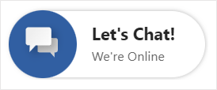](../media/132-chat-online.png#lightbox)

1. The Health Bot should go through the same conversation that you created in the Azure Health Bot lab. If the conversation doesn't start, check the following factors:

    a.  Make sure that you set the automatic welcome message in the Health Bot portal.

    b.  Verify the settings that you made in the Azure Health Bot lab (Microsoft Teams and human handoff enabled). Also, make sure that you added the widget snippet to the Patient Healthcare chat widget code in Portal Management.

1. Select the **Lamna Healthcare Support** button to start a support conversation.

    > [!div class="mx-imgBorder"]
    > [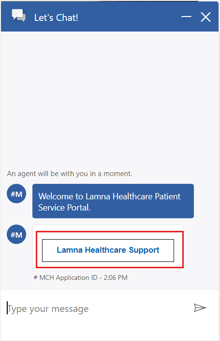](../media/133-chat-conversation.png#lightbox)

1. The Health Bot responds with options to refill a medication or escalate to a live agent. Select **Medication Refill** because Casey wants to refill the inhaler medication.

    > [!div class="mx-imgBorder"]
    > [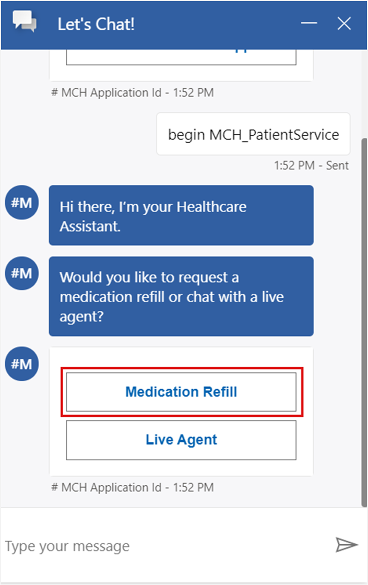](../media/134-health-bot-response.png#lightbox)

1. Fill in Casey Jensen's **name** and **email** information and then enter **Albuterol inhaler** in the **Medication Requested** field.

    > [!div class="mx-imgBorder"]
    > [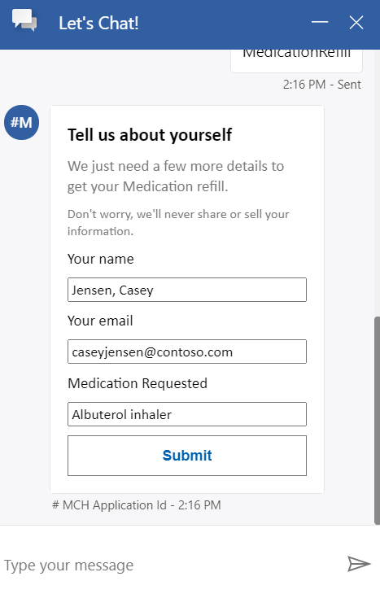](../media/135-medication-refill.png#lightbox)

1. Select **Submit**, and you receive a response that confirms your request.

    > [!div class="mx-imgBorder"]
    > [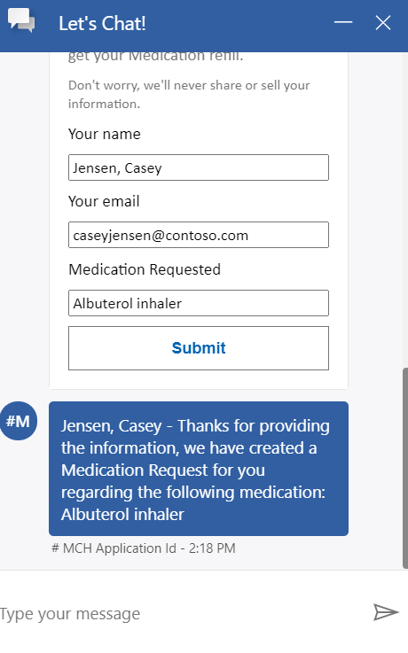](../media/136-response-confirmation.png#lightbox)

1. In the next steps, assume that Casey is out of medication refills. Therefore, you test the process of escalating to a live agent to refill Casey's medication another way.

1. **Close** the Azure Health Bot chat.

    > [!div class="mx-imgBorder"]
    > [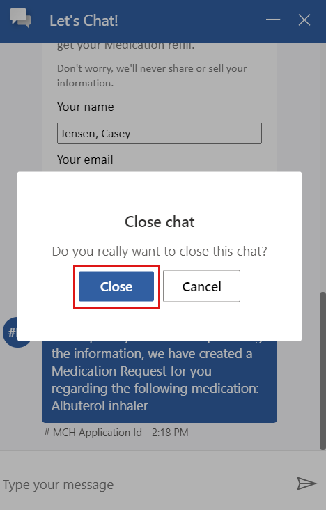](../media/137-close-chat.png#lightbox)

1. Select **Let's Chat** to open a new Health Bot conversation.

    > [!div class="mx-imgBorder"]
    > [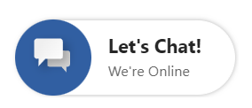](../media/138-chat-online.png#lightbox)

1. Select **Lamna Healthcare Support**.

    > [!div class="mx-imgBorder"]
    > [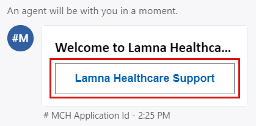](../media/139-welcome-lamna.png#lightbox)

1. Select **Live Agent** in the next prompt to escalate to an agent.

    > [!div class="mx-imgBorder"]
    > [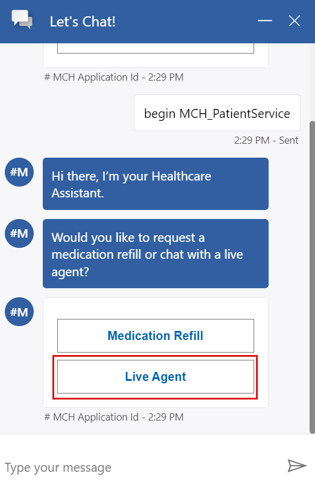](../media/140-live-agent.png#lightbox)

   The chat soon notifies you that **An agent will be with you in a moment**.

    > [!div class="mx-imgBorder"]
    > [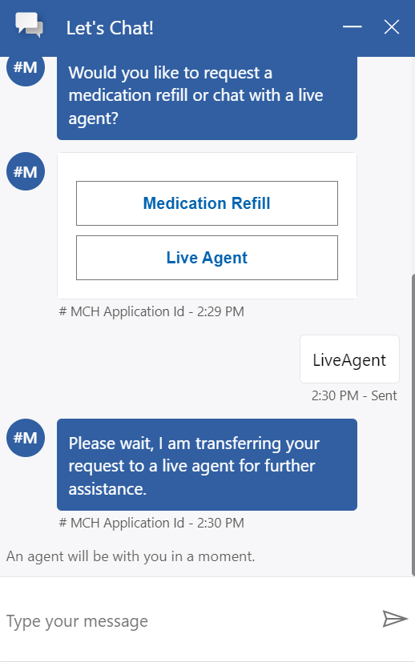](../media/141-agent-wait.png#lightbox)

1. Switch to the **Omnichannel for Customer Service** app so that you can accept the escalation as an agent.

   The upper-right corner shows a notification indicating that you have a **Chat request** from your user. 

1. Select **Accept** to start a conversation with the patient.

    > [!div class="mx-imgBorder"]
    > [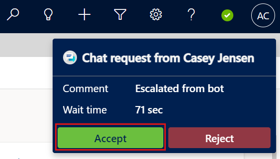](../media/143-accept-chat.png#lightbox)

1. The page should reload and show the patient record, active chat, and **Productivity** pane, as shown in the following screenshot. Your status should now show as red (busy).

    > [!div class="mx-imgBorder"]
    > [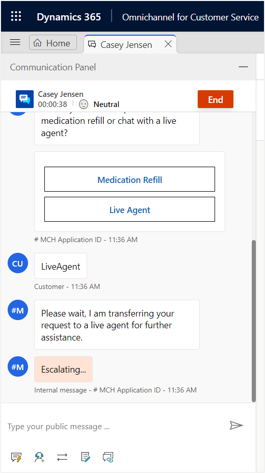](../media/144-red-busy.png#lightbox)

1. The chat is directly embedded in the window. Explore the command bar in the chat to try various options, such as adding a note that is associated with the patient.

    > [!div class="mx-imgBorder"]
    > [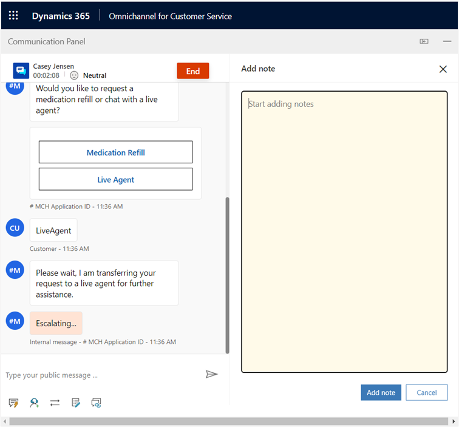](../media/145-quick-replies.png#lightbox)

1. Notice that the **patient sentiment analysis** in the chat indicates **Neutral**.

    > [!div class="mx-imgBorder"]
    > [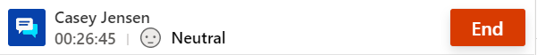](../media/147-neutral.png#lightbox)

1. Go to the **Lamna Healthcare Patient Portal**. Acting as Casey, type **Thank you very much!** in the chat.

    > [!div class="mx-imgBorder"]
    > [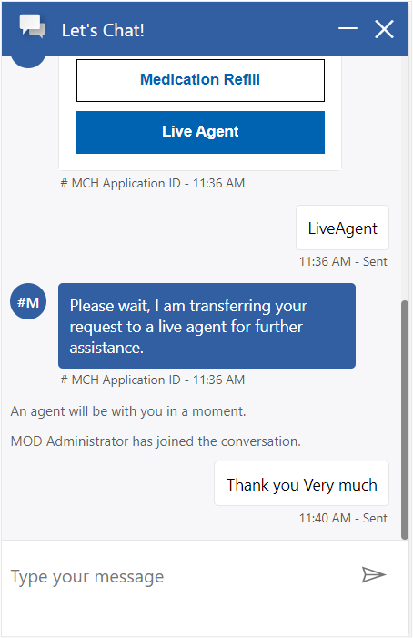](../media/148-patient-thank-you.png#lightbox)

1. Return to **Patient Service Center** and notice that the **patient sentiment analysis** changed from **Neutral** to **Slightly positive** from the patient feedback in the chat.

    > [!div class="mx-imgBorder"]
    > [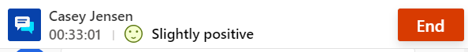](../media/149-slightly-positive.png#lightbox)

    > [!div class="mx-imgBorder"]
    > [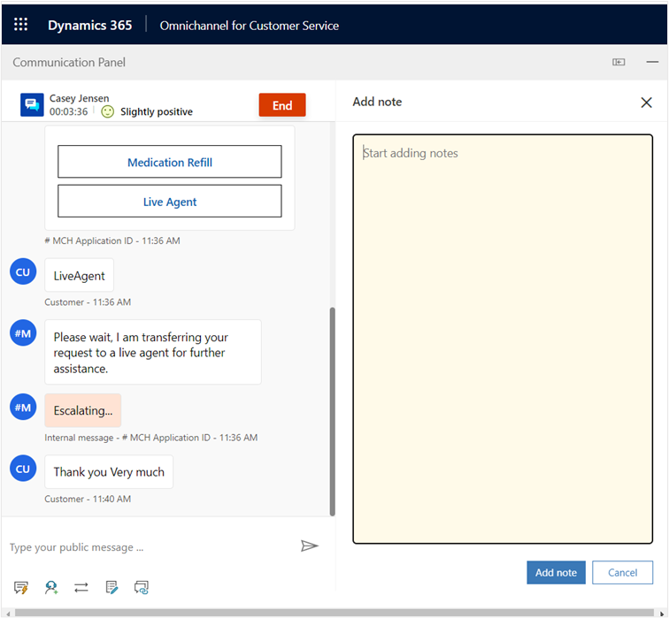](../media/150-slightly-positive-escalating.png#lightbox)

1. Go to the **Productivity** pane on the right side of the screen, which includes **Smart assist**, agent scripts, and knowledge articles. You can expand and collapse this panel as needed.

    > [!div class="mx-imgBorder"]
    > [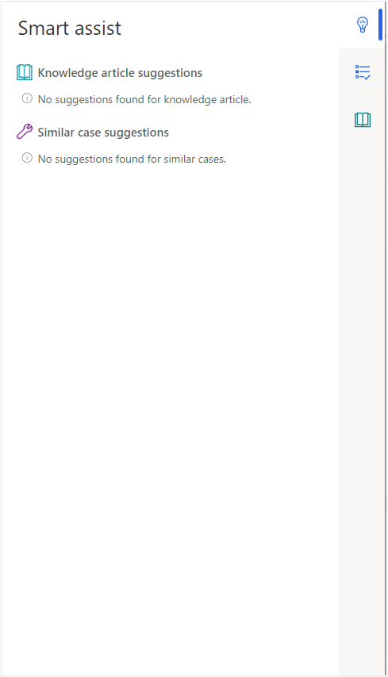](../media/151-productivity-pane.png#lightbox)

1. The **Smart assist** tab shows suggested articles and cases based off the chat discussion. Because you have not set up the **Smart assist** option, these articles won't show at this time. When this training is expanded, steps for this functionality will be added.

    > [!div class="mx-imgBorder"]
    > [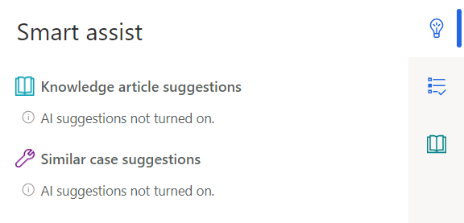](../media/152-smart-assist.png#lightbox)

1. Select the **Agent script** tab and complete the steps by selecting the button to the right of the step name. The text turns green, and a check mark appears to the left of the step name.

    > [!div class="mx-imgBorder"]
    > 

    > [!div class="mx-imgBorder"]
    > [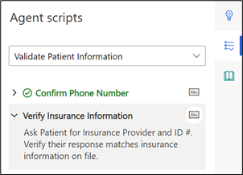](../media/154-verify-insurance.png#lightbox)

1. Go to the **Knowledge Article** tab and search for **breath** or **inhaler**. Notice that your article appears.

    > [!div class="mx-imgBorder"]
    > [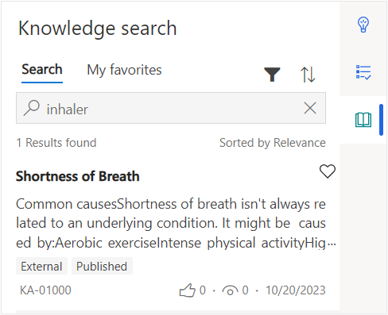](../media/155-knowledge-search.png#lightbox)

1. Select the knowledge article in the list to open in the larger tab.

    > [!div class="mx-imgBorder"]
    > [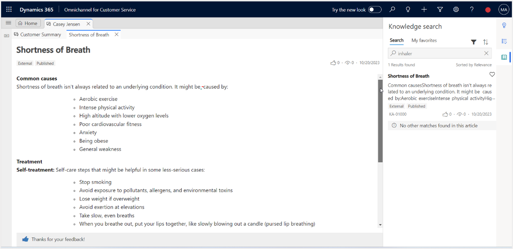](../media/156-select-article.png#lightbox)

1. When completed with the conversation, the agent can select **End** to stop the conversation.

    > [!div class="mx-imgBorder"]
    > [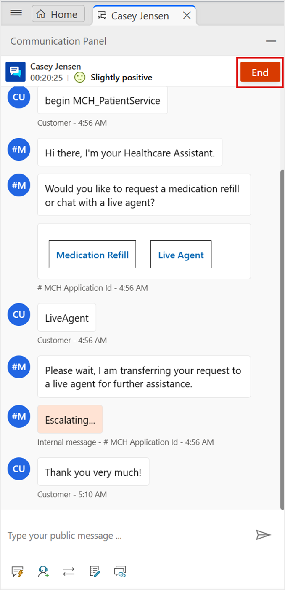](../media/159-end-conversation.png#lightbox)

1. **Close** the session.

1. After closing the session, you'll be directed to the Omnichannel Agent Dashboard and your status will turn green (available).

    > [!div class="mx-imgBorder"]
    > [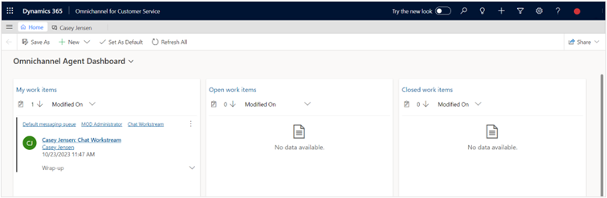](../media/161-green-status.png#lightbox)

You completed the full experience from signing in as a patient to the portal, conversing with the Health Bot, and escalating into Patient Service Center to navigate the features as a live agent.
