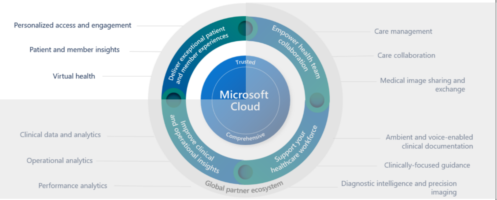
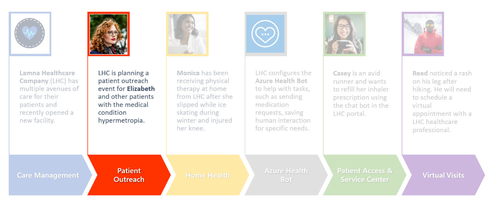

The **Patient Outreach** application in Microsoft Cloud for Healthcare allows healthcare providers to communicate with their communities and patients in a targeted, efficient way. Patient Outreach is a patient campaign management application that helps you organize and automate marketing and outreach to patients. The application allows you to orchestrate personalized journeys across patient touchpoints to strengthen relationships and increase patient retention and thus improving care.

Key capabilities of **Patient Outreach** include:

- **Patient segmentation** - Prebuilt patient segments are based on the industry standard Healthcare Effectiveness Data and Information Set (HEDIS) to provide baseline patient cohorts.

- **Patient engagement campaigns** - Create healthcare-specific email campaigns that use patient segments based on the HEDIS industry standard.

- **Event management** - Use provider and payer event management templates for event administration and registration.

- **Trigger-based journeys** - Allows journeys to initiate based on a condition and enables faster reactions to patient interactions and changes. Trigger journeys are based on real-world interactions such as checking in for an appointment or being discharged from the hospital.  

## Industry prioritized scenarios

Patient Outreach focuses on the **Enhance patient engagement** priority scenario by creating personalized communication based on patient insights.

> [!div class="mx-imgBorder"]
> 

## Healthcare story

This lab focuses on the healthcare story of Elizabeth Moore.

> [!div class="mx-imgBorder"]
> 

At an annual checkup earlier this year, Elizabeth is diagnosed with hypermetropia, a common eye condition in adults in which nearby objects are blurry. Lamna Healthcare Company has seen a recent influx of patients who want to be more educated on hypermetropia. Lamna decides to increase their patient outreach efforts by hosting a virtual marketing event.

In this module, you play the role of a Lamna Healthcare Company marketing administrator and use the Patient Outreach capabilities in Microsoft Cloud for Healthcare to walk through the following exercises:

1. Create a patient segment to group patients based off a similar characteristic.

1. Create a marketing email for outreach to patients in the defined segment.

1. Create a patient journey using the designer to send the marketing email to everyone in the patient segment.

1. Create a virtual marketing event to track the attendees and details of the event.

1. Create a trigger and then the patient journey using this trigger.  
