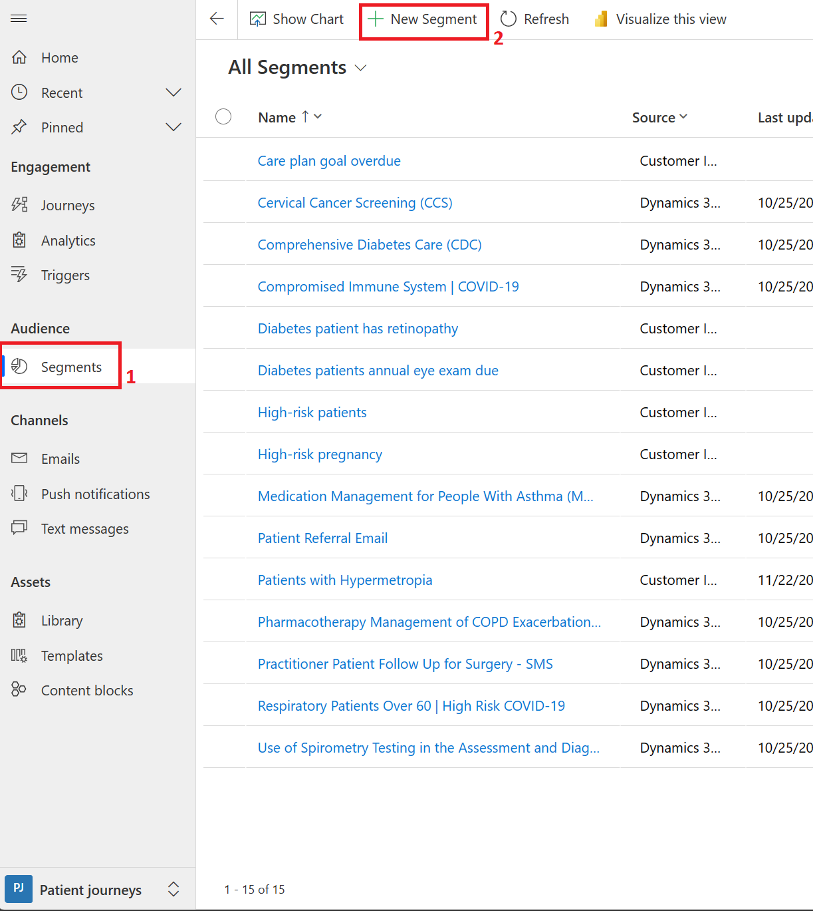
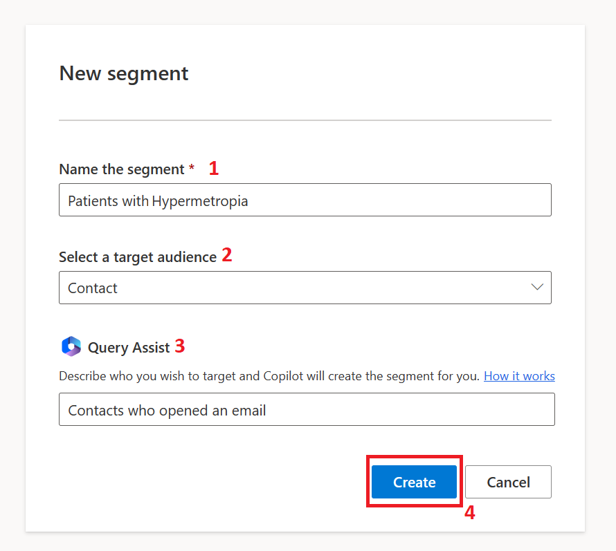
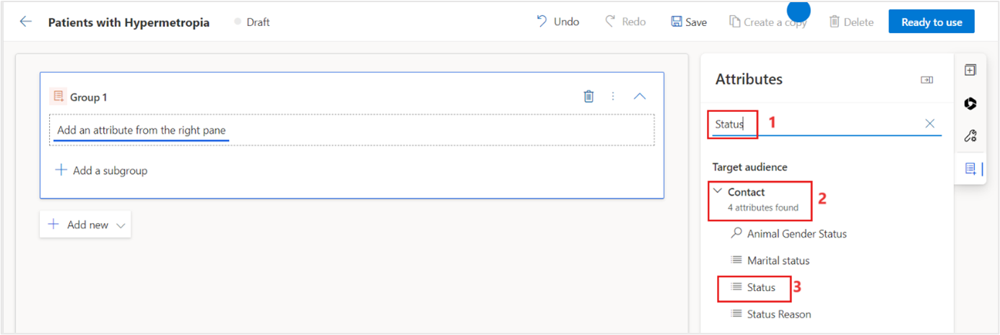
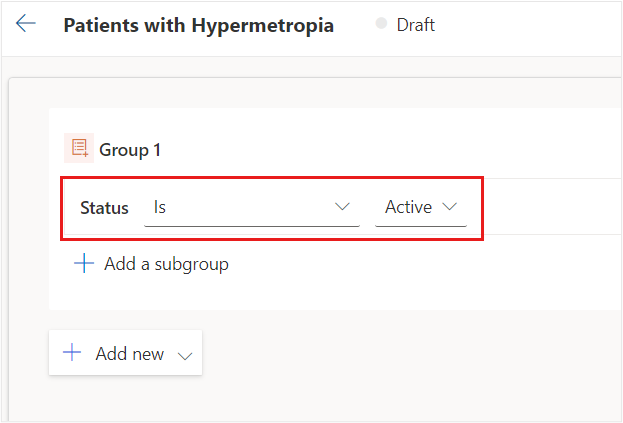
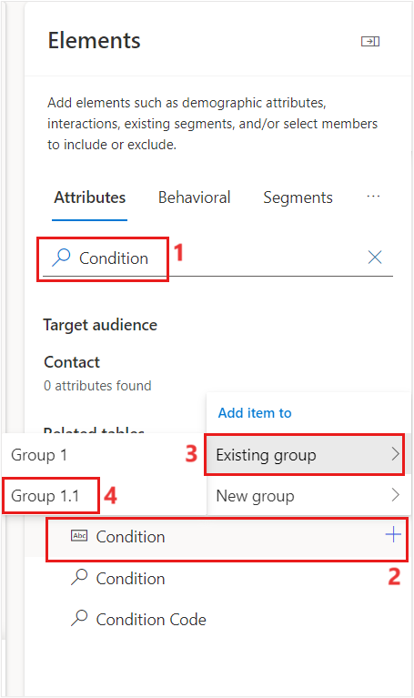
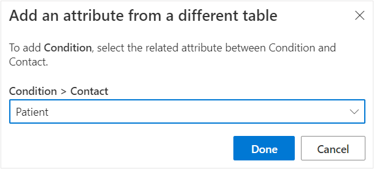
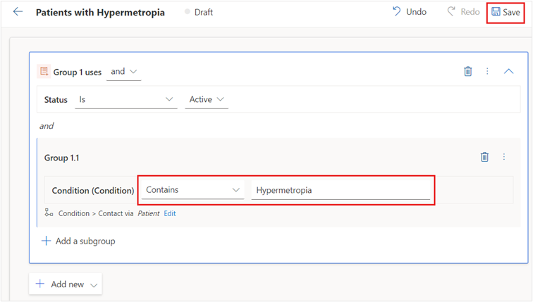
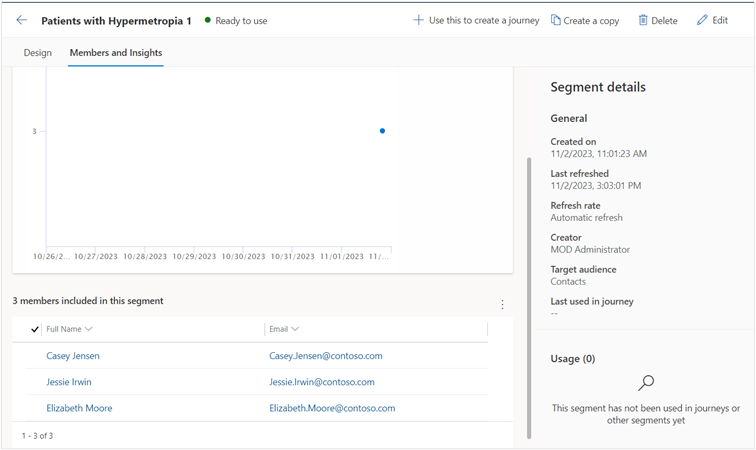

In this exercise, you create a patient segment by using the Patient Outreach app in Microsoft Cloud for Healthcare. You can use a **patient segment** to group patients into cohorts based on similar characteristics so that they can be better targeted with marketing communications. In this example, you create a patient segment for patients with hypermetropia (a vision condition in which nearby objects appear blurry).

## Task: Create patient segment

1. Go to [Power Apps](https://make.powerapps.com/?azure-portal=true).

1. On the left navigation pane, select **Apps**.

1. Select **Patient Outreach** app in the right pane and select the play button to launch the application.

1. Select the **Change area** dropdown in the lower-left corner and then select **Patient journeys**. 

1. On the left navigation pane, under **Audience**, select **Segments**.

1. Select **+ New Segment** to create a new patient segment.

    > [!div class="mx-imgBorder"]
    > 

1. On the **New Segment** page, enter the following information: 

    - **Name of the segment** - Patients with Hypermetropia
    
    - **Select a target audience** - Contact 

    - **Query Assist** - Contacts who opened an email

    > [!div class="mx-imgBorder"]
    > 

1. Select **Create**

1. Expand the arrow next to the **Add a new group** and select **Attribute group**.

1. On the right panel, search for Status under Attributes. In the result, expand **Contact** and select **Status**. Select the + button and add this attribute to the existing group. 

	> [!div class="mx-imgBorder"]
	> 

1. Select the operator as Is and Value as Active. 
    
    > [!div class="mx-imgBorder"]
    > 

1. Select **+ Add a subgroup**. 

1. On the right panel, search for **Condition**. In the results, select **Condition** under **Condition**. Select the + button and add this condition to the existing group and then select Group 1.1.
 
    > [!Note]
    > If you are unable to find the attribute, you can click on **Add a table** to add the **Condition** table and then select the condition attribute in the sub group. 

    > [!div class="mx-imgBorder"]
	> 

1. Select **Patient** under **Add an attribute** from a different table pop-up.
	
	> [!div class="mx-imgBorder"]
	> 

1. Select **Done**.

1. Enter the following condition details: 

    - **Operator** – Contains

    - **Value** – Hypermetropia
    
	> [!div class="mx-imgBorder"]
	> 

1.	At the upper right corner, select **Ready to use.**.
    The segment takes approximately 10-15 minutes to be used in journey.

    > [!NOTE]
    > You won't be able to use the new patient segment in a customer journey until it goes live.

1. Select the **Members and Insights** tab to view which patients added to the Dynamic segment. Notice Elizabeth Moore in the list, a recipient of our next marketing event outreach email.
1. 
    > [!div class="mx-imgBorder"]
    > 

You completed the steps to create a patient segment that can be used for patient outreach. This patient segment will be used in the tasks in the next exercise. 
