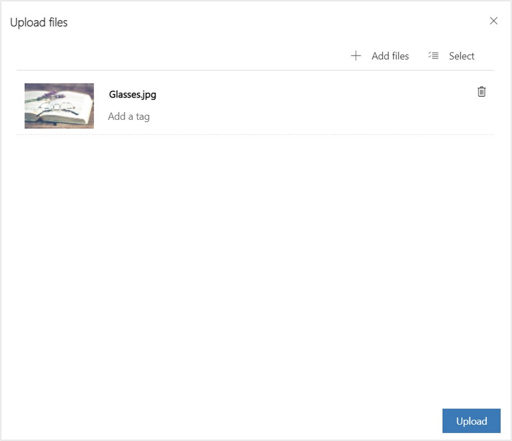

In this exercise, you create a marketing email that is used to reach out to the patient segment that you created in the previous exercise. Marketing emails help you directly communicate with patients who reside in a particular patient segment.

1. On the **Patient Outreach** portal, select the **Change area** dropdown in the lower-left corner and then select **Patient journeys**. 

1. On the left navigation pane, under **Channels**, select **Emails**.

1. Select **+ New** from the command bar. 

1. On the **Email Templates** page, select **Skip** because you create your own email.

1. In the **Design** page, enter the **Name** of the event as **Email Invitation - Healthy Eye Seminar Virtual Event**.

1. In the **From:** field, select **Choose a sender** and specify the following information:  

    1. In the **From name**, enter **Your Care Team at**. 

    1. For the **From email**, select personalization icon and select **Account name** and select **Contact**.  

    1. In the **Subject**, enter **Healthy Eye Virtual Seminar**

    > [!div class="mx-imgBorder"]
    > 

1. In the body of email, select the + button and select **Image** to add an image.

    > [!div class="mx-imgBorder"]
    > 

1. Select **Choose an image** and select **Upload to library**.

    > [!div class="mx-imgBorder"]
    > 

1. Select **Add files**.

    > [!div class="mx-imgBorder"]
    > 

1. Select the **Glasses.jpg** file that you downloaded. Select **Open**.

    > [!div class="mx-imgBorder"]
    > 

1. Select **Upload**.

    > [!div class="mx-imgBorder"]
    > 

1. Select the **Done** button.

    > [!div class="mx-imgBorder"]
    > 

	The image is now successfully uploaded. 

1. In the body of email, select the + button and select **Text** to the text.

1. Enter the text of the email as follows:

    December 18, 2023, 9:00 am to 1:00 pm

    Healthy Eye Seminar

    Hi, {{Firstname}} You're invited to Lamna Healthcare's Healthy Eye Virtual Event.
    
    Come join us at this virtual event.

    > [!div class="mx-imgBorder"]
    > 

    >[NOTE!]
    > To include any dynamic text, select Personalization in the text command bar, and then *New Dynamic text**, select the attribute in the **Choose and attribute** dropdown and select **Save**.  

1. Edit the footer text of the email so that it reads **©2023 Lamna Health Event**. 

    > [!div class="mx-imgBorder"]
    > 

1. On the command bar, select **Save**. 

1. Select **Preview and test** tab to preview the email. 

1. On the upper left corner, select **Ready to send**. The email is now live.

You completed the steps to create a marketing email that can be used for patient outreach. This marketing email will be used in the next exercise. 
