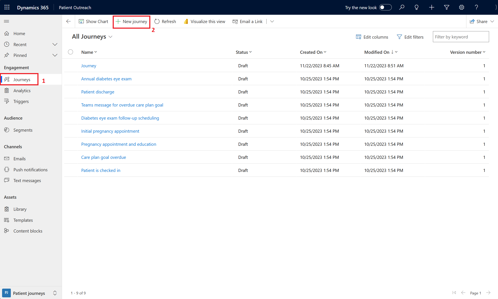
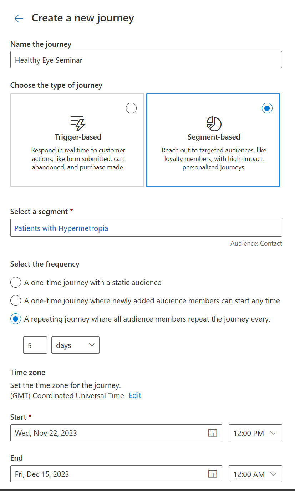
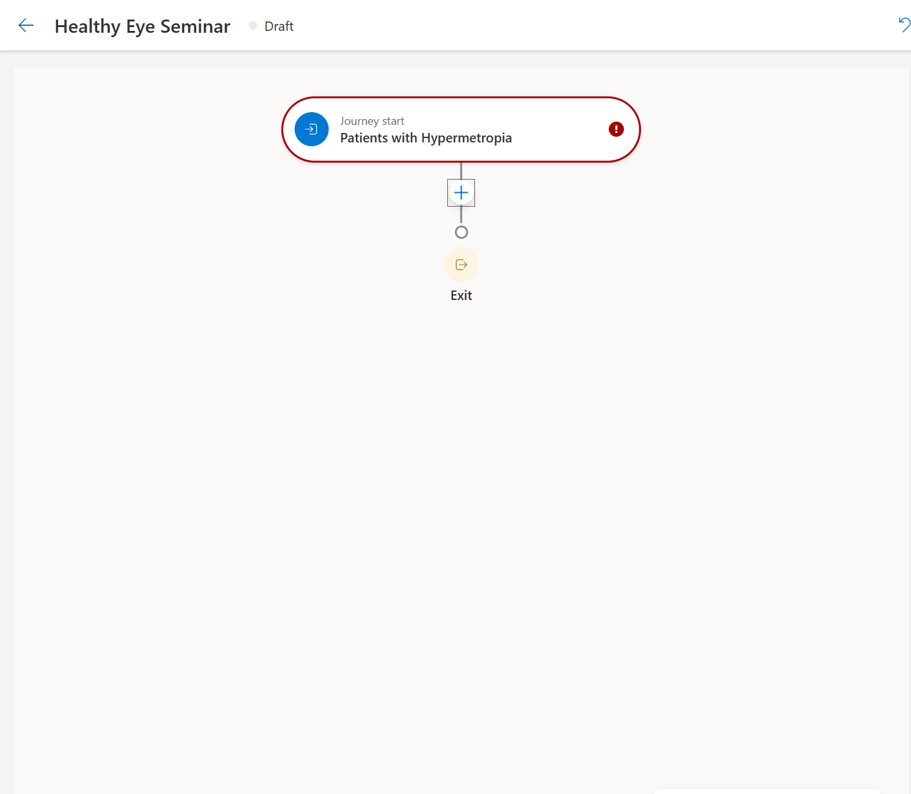
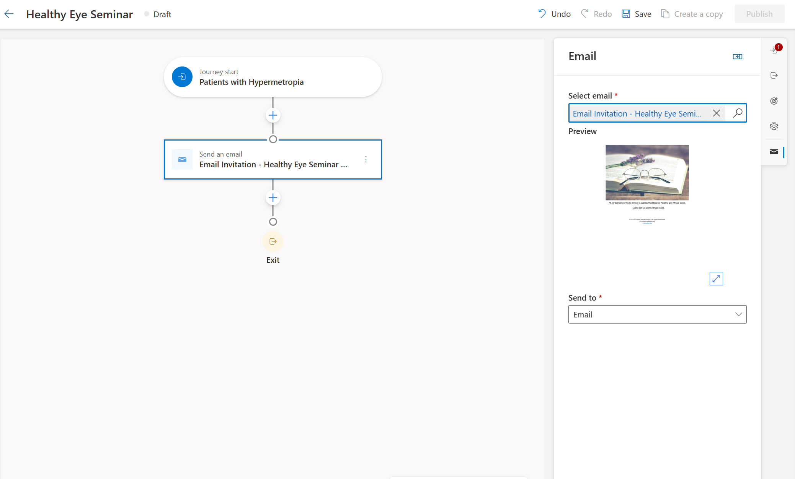

In this exercise, you create a patient journey for the patient segment that you created in the first exercise. A patient journey can expand your organization's patient outreach marketing capabilities by helping healthcare organizations guide the members of a selected segment through the communication process. It completes this action by using automated messaging, activity generation, interactive decision points, and more.

Now let’s make our own patient journey for patients with hypermetropia.

1. In the **Patient Outreach** app, in the lower-left corner select **Change area** dropdown and then select **Patient journeys**. 

1. On the left navigation pane, under **Engagement**, select **Journeys**. 

1. In the command toolbar, select **+ New journey** to create a new patient journey.

    > [!div class="mx-imgBorder"]
    > 

1. When prompted to choose to create journey with copilot, select **Skip and create from blank** because you'll create your own customer journey.

1. In the **Create a new journey**, enter the following information:

    - **Name the journey** - Healthy Eye Seminar
    
    - **Choose the type of journey** - Segment-based

    - **Select the segment** - search for the **Patients with Hypermetropia** segment that you created in the previous task and select it. 
    
    - **Select the frequency** - A repeating journey where all audience members repeat the journey every: '5' days.
    
    - **Start** - Select the start date.
    
    - **End** - Select the end date. 

    > [!div class="mx-imgBorder"]
    > 

1. Select **Create**.
 
1. In the designer view, select **+** and then select **Send an email** from the pop-up menu.

    > [!div class="mx-imgBorder"]
    > 

1. In the right panel, in the **Select email** field, select the **Email Invitation - Healthy Eye Seminar** marketing email that you created in the previous exercise.

    > [!div class="mx-imgBorder"]
    > 

1. Select **Save**.

1. Select **Publish**. Your journey is now ready to go live. 

1. After your patient journey starts, you'll be able to gather key metrics and insights from the record. This information becomes available at a time that is based on the date and time that you chose for the start of the customer journey. You can return to view the results later if they aren't yet available.

You created a patient journey that sends the invitation email to the Healthy Eye Seminar to members of the Patients with Hypermetropia segment. 
