In this exercise, you'll create a healthcare-focused, virtual marketing event that corresponds to the patient journey that you created in the previous exercise where you sent the Healthy Eye Seminar event invite to everyone in the patient segment. The **Marketing Event Management** feature helps you every step of the way, from initial planning and budgeting through promotion and publication, attendee registration, webinar broadcasting, final analytics, lead generation, and evaluation of ROI.

1. In the **Patient Outreach** application, in the lower-left corner select **Change area** dropdown and then select **Outbound marketing**. 

1. Select **Events** on the left navigation pane on the page.

	> [!div class="mx-imgBorder"]
	> [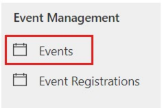](../media/events.png#lightbox)

1.  Select **+ New Event** on the command bar to create a new event.

	> [!div class="mx-imgBorder"]
	> [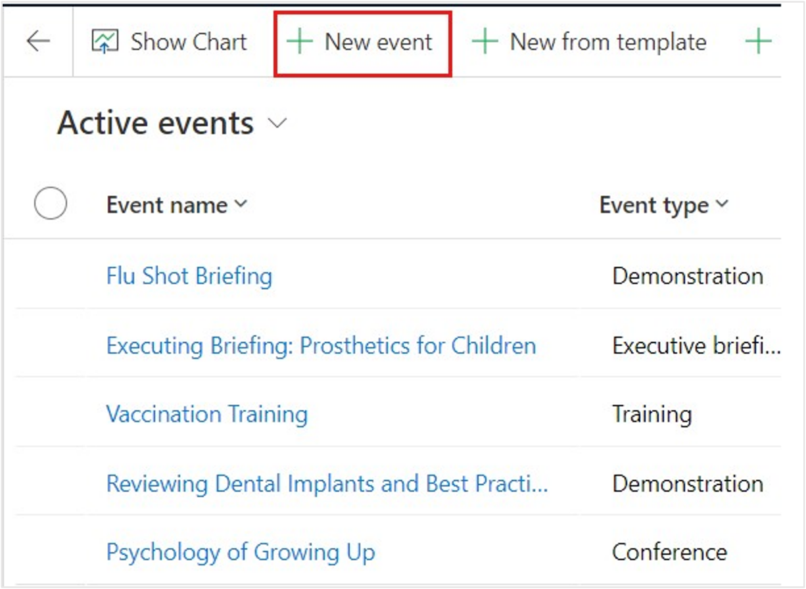](../media/new-event.png#lightbox)

1.  Enter details for the new event. Enter **Healthy Eye Seminar** in the **Event name** field and enter the same schedule details that you entered for the marketing email in the previous exercise. Make sure that you become familiar with the other fields on the forms as part of the **Preliminaries** event stage.

	> [!div class="mx-imgBorder"]
	> [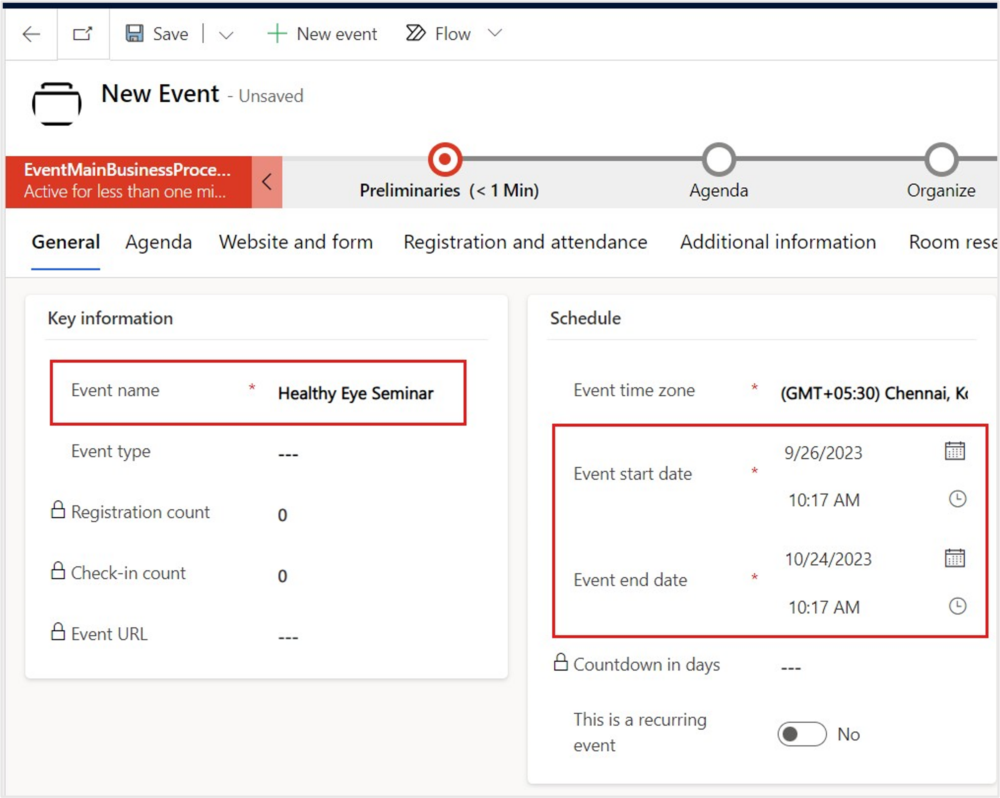](../media/schedule.png#lightbox)

1.  Select **Save**. 

1.  Because this event is virtual, in the **Stream This Event Online** section, change the **Do you want to stream this event** toggle to **Yes**.

	> [!div class="mx-imgBorder"]
	> [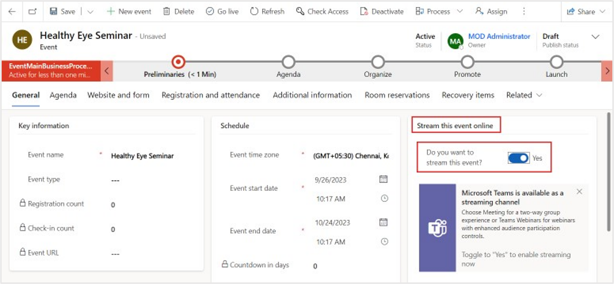](../media/stream.png#lightbox)

1.  In the Business Process Flow, select the first stage **Preliminaries**. In the flyout menu, select **Next Stage**.

	> [!div class="mx-imgBorder"]
	> [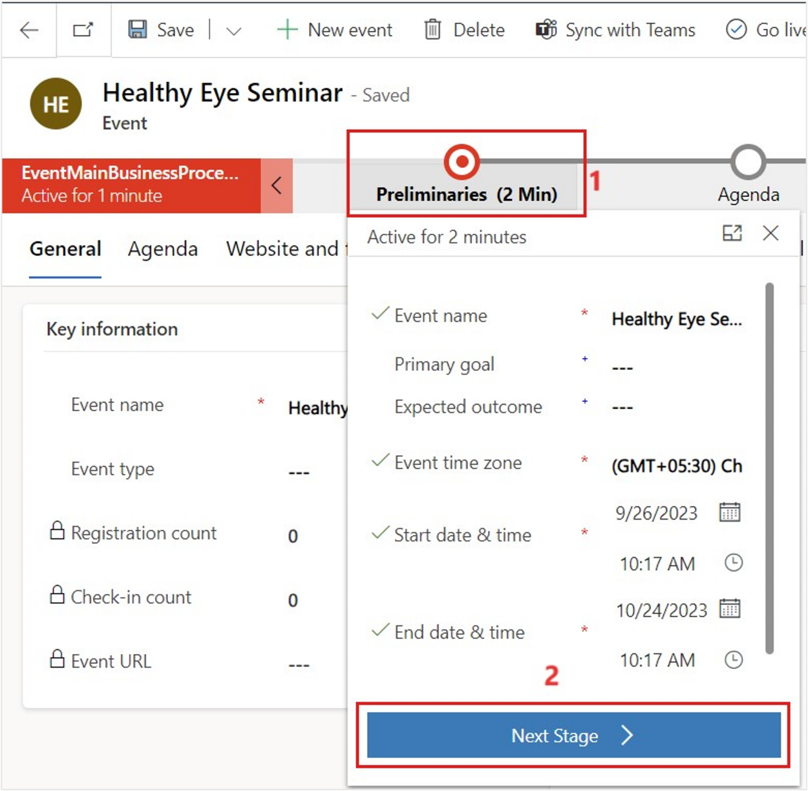](../media/next-stage.png#lightbox)

1.  Advance each stage in the business process flow until you reach the **Launch** stage. Observe the fields that are associated with each stage as you advance through them. Select **Next Stage** for **Launch** stage. Select **Finish** when you reach **Post Event** stage.

	> [!div class="mx-imgBorder"]
	> [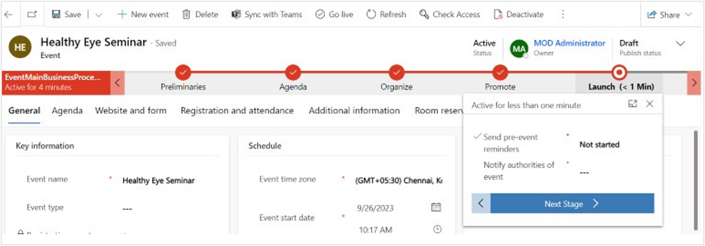](../media/launch.png#lightbox)

	> [!div class="mx-imgBorder"]
	> [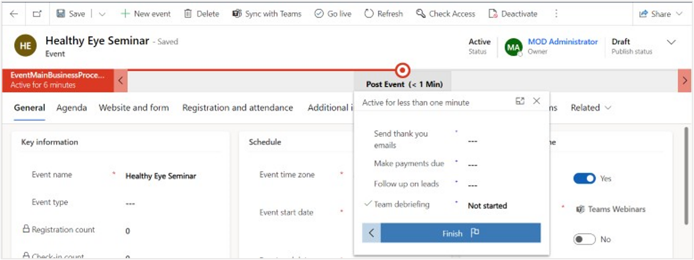](../media/finish.png#lightbox)

	> [!div class="mx-imgBorder"]
	> [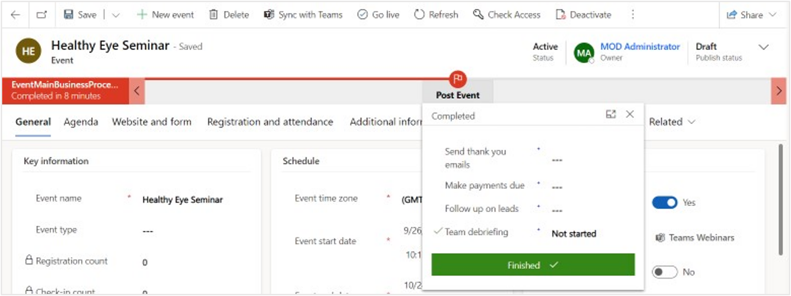](../media/finished.png#lightbox)

1.  Select **Go live** on the command bar. If you don’t see Go live available, select Save first.

	> [!div class="mx-imgBorder"]
	> [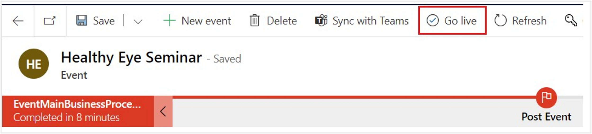](../media/go-live-command.png#lightbox)

	> [!div class="mx-imgBorder"]
	> [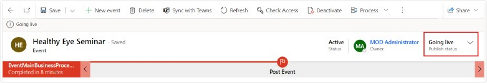](../media/going-live.png#lightbox)

	> [!div class="mx-imgBorder"]
	> [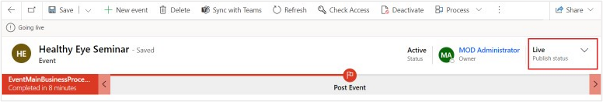](../media/live.png#lightbox)

1.  The Microsoft Teams meeting URL populates.

	> [!div class="mx-imgBorder"]
	> [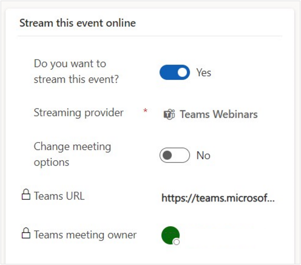](../media/teams.png#lightbox)

1. You can also choose to change the meeting options. Toggle to **Yes** to enable settings and more fields appear. These options allow you to make the recording available to attendees, enable meeting chat, allow reactions, and more.

	> [!div class="mx-imgBorder"]
	> [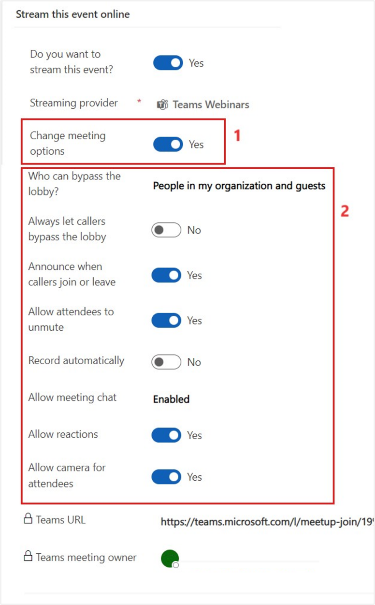](../media/event-details.png#lightbox)

You created a virtual marketing event for patients with hypermetropia by using Microsoft Cloud for Healthcare. For more information, see [Event planning and management overview](/dynamics365/marketing/event-management/?azure-portal=true).
