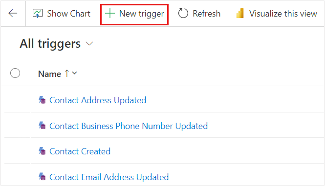
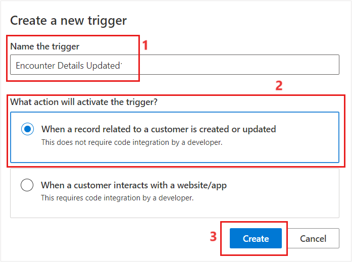
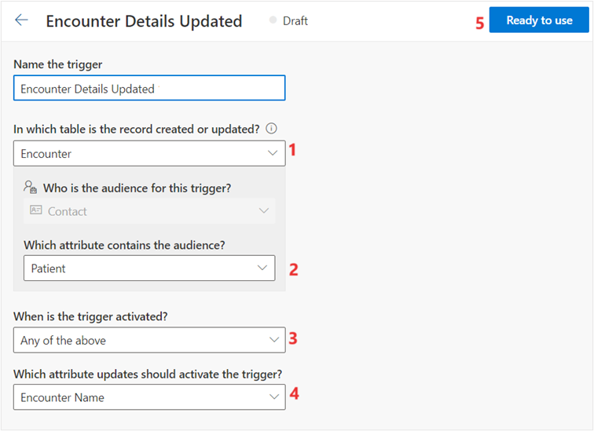
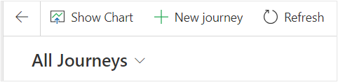
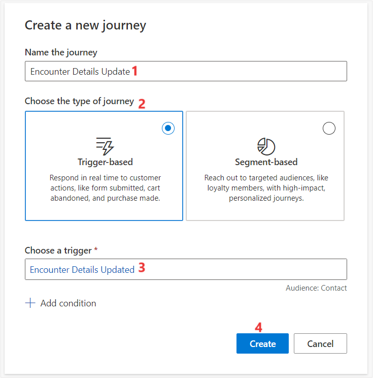
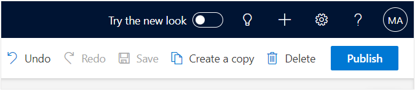
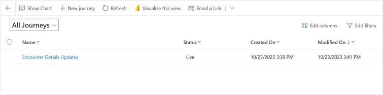

In this exercise, you'll create a patient trigger by using the Customer Insights – Journey app in Microsoft Cloud for Healthcare and use the patient trigger to create for the patient journey. 

## Task: Create a patient trigger

1. Switch back to [Power Apps](https://make.powerapps.com/) portal. Navigate to Apps on the left navigation pane and launch **Customer Insights – Journeys** app by selecting the play button.

1. On the **Customer Insights – Journeys** app, on the left-navigation pane, under **Engagement**, select **Triggers**.  

1. Select **+ New Trigger** on the command bar.

	> [!div class="mx-imgBorder"]
	> 

1. Enter details for the new trigger as follows: 

    - **Name the new trigger** - Encounter Details Updated.
    
    - **What action will activate the trigger?** - Select **When a record related to the customer is created or updated**.

	> [!div class="mx-imgBorder"]
	> 

1. Select **Create**.

   	> [!div class="mx-imgBorder"]
	> 

1. Enter the following details:

    - **In which table is the record created or updated?** – Search for Encounter and select the option from the list.
    
    - **Which attribute contains the audience?** – Patient
    
	- **When is the trigger activated?** – Any of the above

    - **Which attribute updates should activate the trigger?** – Encounter Name
    
   After the trigger is saved. It is now ready to use to set up the patient journey.

1. Select **Ready to use**.

	> [!div class="mx-imgBorder"]
	> 

## Task: Create a trigger-based patient journey

1. Select **Journeys** on the left navigation pane.

1. Select **+ New Journey** on the command bar.

	> [!div class="mx-imgBorder"]
	> 

1. Enter the following details for the new journey: 

    - **Name the new journey** - Encounter Details Updated.
    
    - **Choose the type of the journey** - Trigger-based. 

    - **Choose a trigger** – Select Encounter Details Updated. 

	> [!div class="mx-imgBorder"]
	> 

1. Select **Create**.

1. Select **Save** to save the journey.
  
1. Select **Publish** on the journey.

	> [!div class="mx-imgBorder"]
	> 

    The status of the journey now is Live.

	> [!div class="mx-imgBorder"]
	> 

