Microsoft Cloud for Retail capability relies on various components from Dynamics 365, Azure, and Microsoft 365. To use this capability, you’ll need to obtain the following trial licenses:

- Dynamics 365 Intelligent Order Management trial

- Microsoft 365 E5 trial

- Microsoft Cloud for Retail add-on

- Dynamics 365 Finance and Operations trial

## Task 1: Obtain a Dynamics 365 Intelligent Order Management trial

In this task, you'll add the necessary add-on to deploy and use the Intelligent Order Management app as part of the Intelligent Order Management lab.

1. Go to the [Microsoft 365 admin center](https://admin.microsoft.com/?azure-portal=true).

1. Go to **Billing > Purchase services**. Search for **Intelligent Order Management trial** in the search box and then select **Details**.

    > [!div class="mx-imgBorder"]
    > [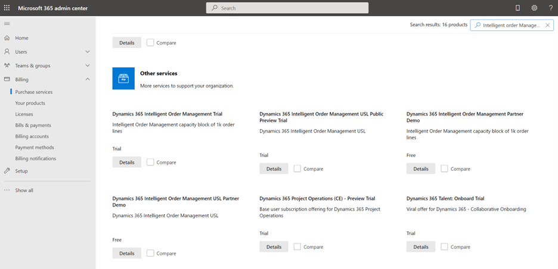](../media/search.png#lightbox)

1. Select **Start free trial**.

    > [!div class="mx-imgBorder"]
    > [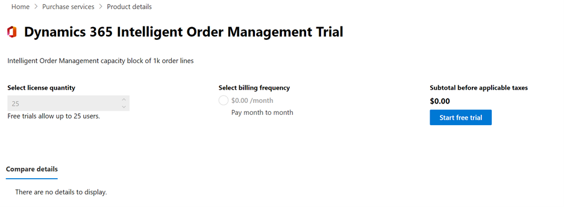](../media/start-trial-2.png#lightbox)

1. Select **Try now**.

    > [!div class=”mx-imgBorder”]
    > 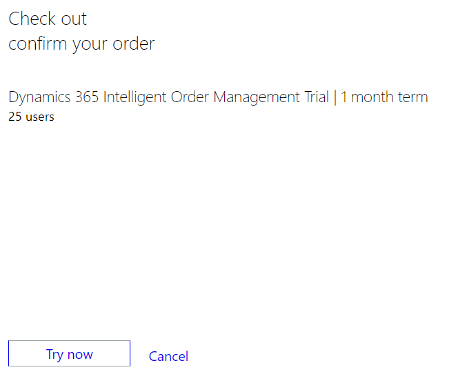

1. Select **Continue** to return to the admin center.

    > [!div class="mx-imgBorder"]
    > 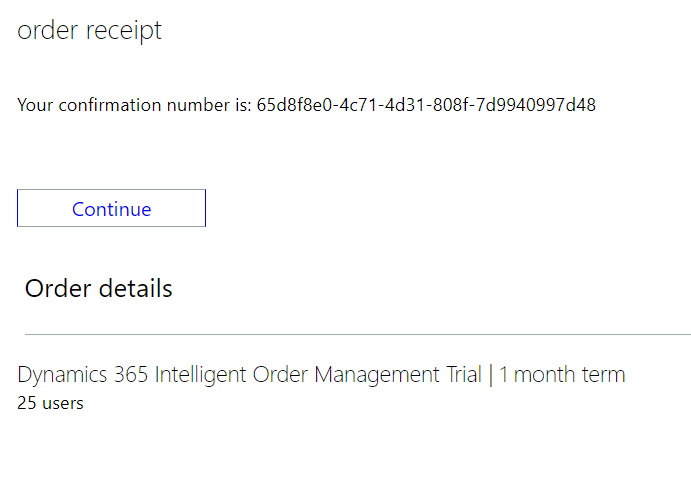

1. Assign the newly acquired Dynamics 365 Intelligent Order Management trial license to your user. Go to **Users > Active users**, select your user, and then select **Manage product licenses**.

    > [!div class="mx-imgBorder"]
    > 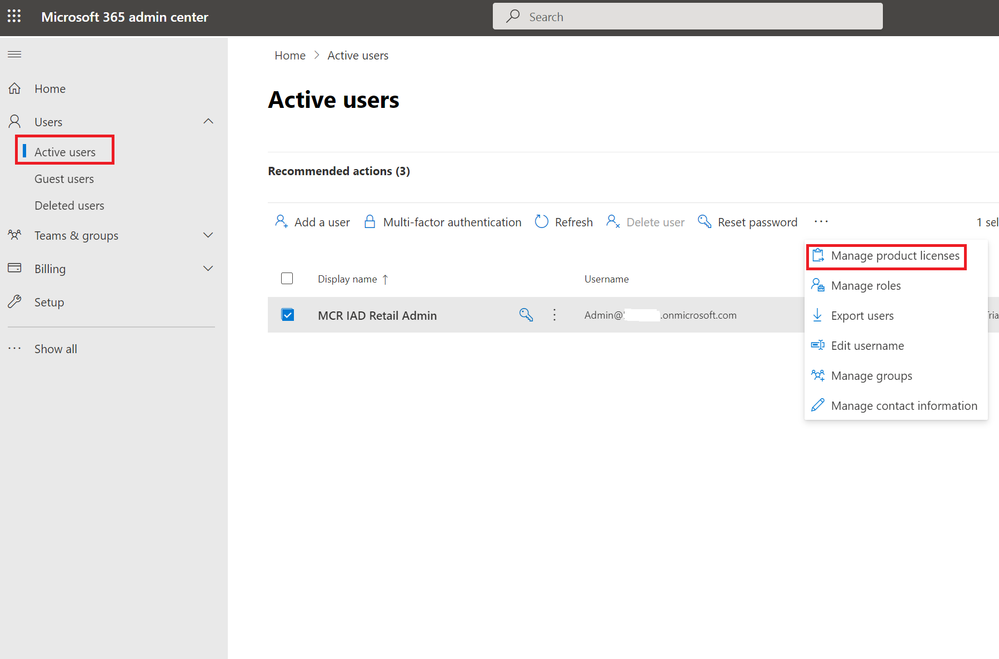

1. Select the **Dynamics 365 Intelligent Order Management vTrial** license checkbox and select **Save changes**.

    > [!div class="mx-imgBorder"]
    > 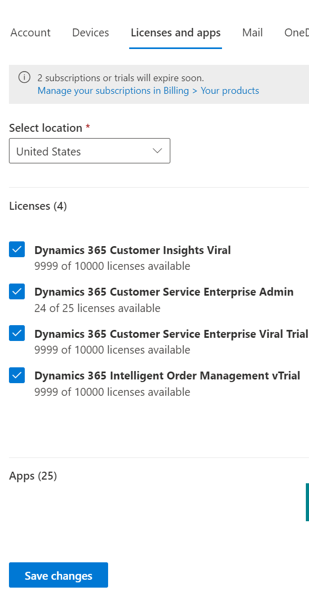

    > [!Important]
    > It might take up to 24 hours for Dynamics 365 Intelligent Order Management to become available in your Dynamics 365 apps after you’ve obtained the trial license.

## Task 2: Obtain a Microsoft 365 E5 trial

In this task, you'll add the necessary Microsoft 365 trial to use Outlook and Microsoft Teams in the later labs.

1. Go to the [Microsoft 365 admin center](https://admin.microsoft.com/?azure-portal=true).

1. Go to **Billing > Purchase services** and select Microsoft 365. Scroll down to Microsoft 365 E5 and then select **Details**. You can also use the search box.

    > [!div class="mx-imgBorder"]
    > 

1. Select **Start free trial**.

    > [!div class="mx-imgBorder"]
    > 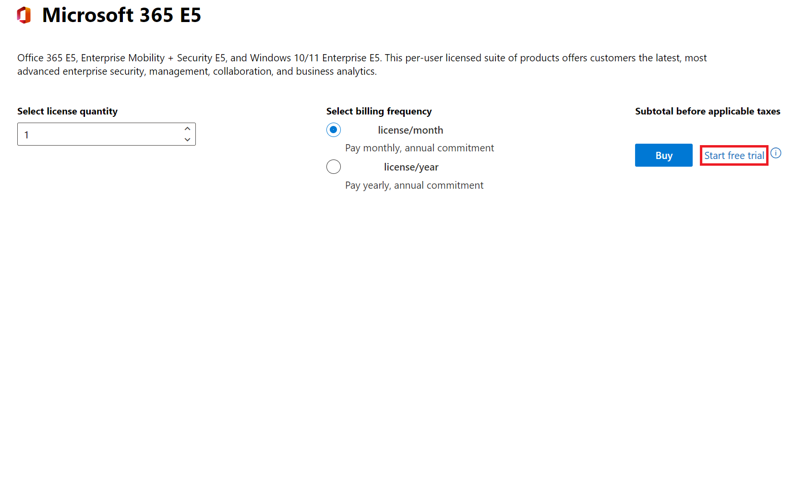

    > [!NOTE]
    > In this exercise Microsoft 365 E5 is chosen as it includes Microsoft Teams. However, in case you do not see an option to choose Microsoft 365 E5 in your region, you can choose alternatively Microsoft 365 business premium standard or alternative versions available that include license to Microsoft Teams.

1. Enter a **valid phone number** to prove that you're not a robot.

    > [!div class="mx-imgBorder"]
    > 

1. Select **Try now** to start your free trial.

    > [!div class="mx-imgBorder"]
    > 

1. Select **Continue** to return to the admin center.

    > [!div class="mx-imgBorder"]
    > 

1. Assign the newly acquired Microsoft 365 E5 trial license to your user. Go to **Users > Active users**, select your user, and then select **Manage product licenses**.

    > [!div class="mx-imgBorder"]
    > 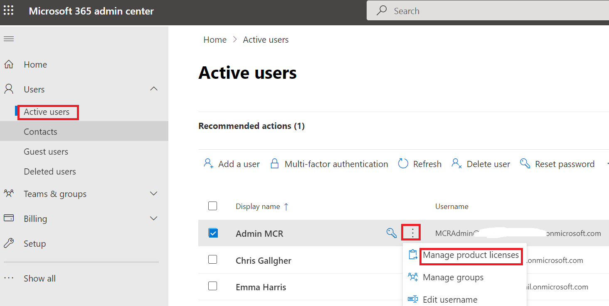

1. Select the **Microsoft 365 E5** license and then select **Save changes**.

    > [!div class="mx-imgBorder"]
    > 

## Task 3: Obtain a Microsoft Cloud for Retail trial license

In this task, you'll request and add the Microsoft Cloud for Retail add-on to deploy and use the capabilities that it provides.

1. To obtain a trial license for Microsoft Cloud for Retail, go to the following Microsoft form and fill out the required information: [Trial Request for Microsoft Cloud for Retail](https://aka.ms/MCRTrial/?azure-portal=true).

    > [!div class="mx-imgBorder"]
    > 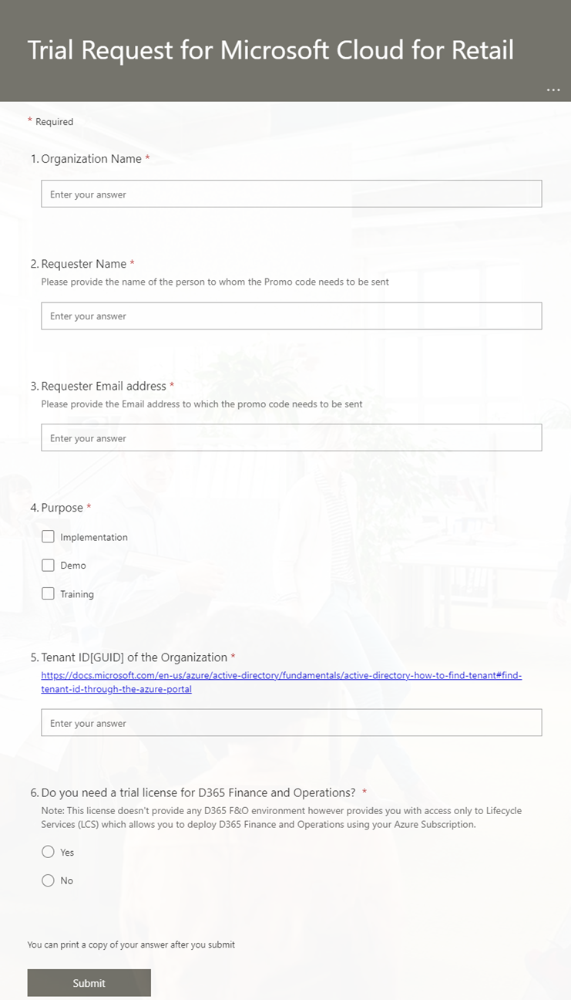

1. You'll receive an email with a URL that contains an offer code that you can use to claim a 30-day trial license for Microsoft Cloud for Retail. When you’ve received that email, copy the URL, open a new tab while signed in to your tenant, and then paste the URL.

    > [!div class="mx-imgBorder"]
    > 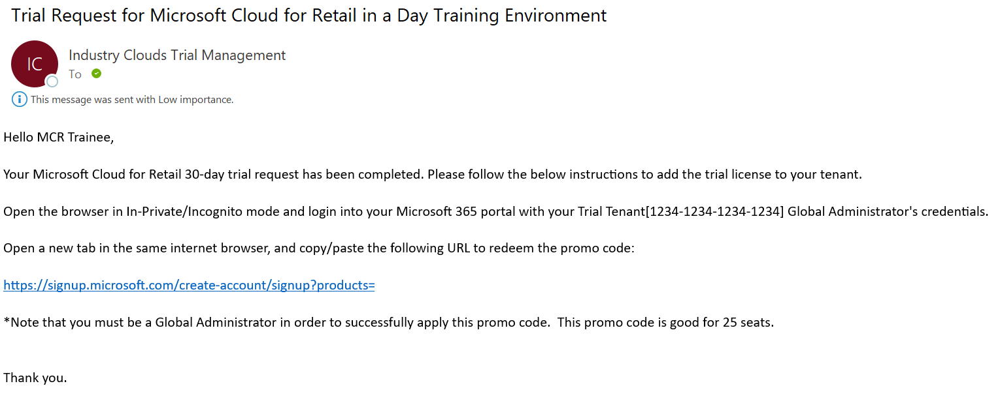

1. Enter the email address that’s associated with your tenant and then select **Next**.

    > [!div class="mx-imgBorder"]
    > 

1. Select **Sign in**.

1. Select **Try now**.

    > [!div class="mx-imgBorder"]
    > 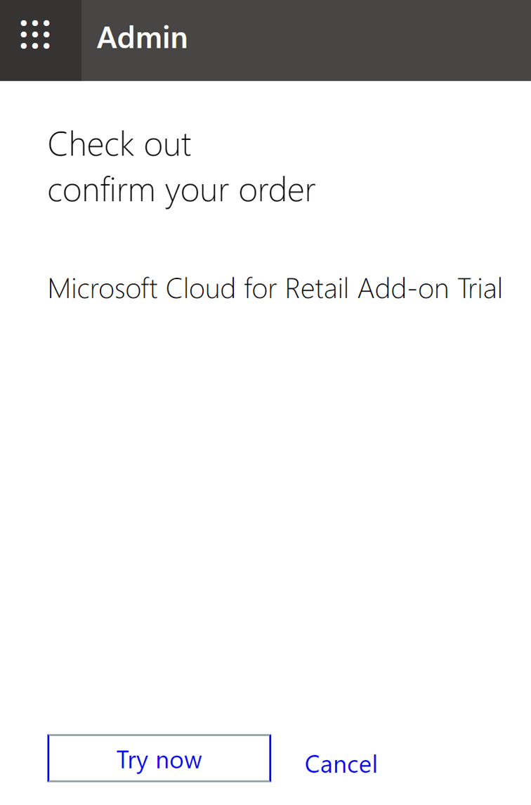

1. Select **Continue**.

    > [!div class="mx-imgBorder"]
    > 

## Task 4: Obtain and deploy Dynamics 365 Finance and Operations apps

If you have also requested for a Dynamics 365 Finance and Operations trial license then, in this task, we will obtain a trial license for Dynamics 365 Finance and Operations apps and create a new Dynamics 365 Finance and Operations and a linked Power Platform environment.

1. Copy and paste the URL from your email to add the Dynamics 365 Finance and Operations trial license in your tenant.

1. Sign in using the new Microsoft Entra ID credentials.

    > [!div class="mx-imgBorder"]
    > [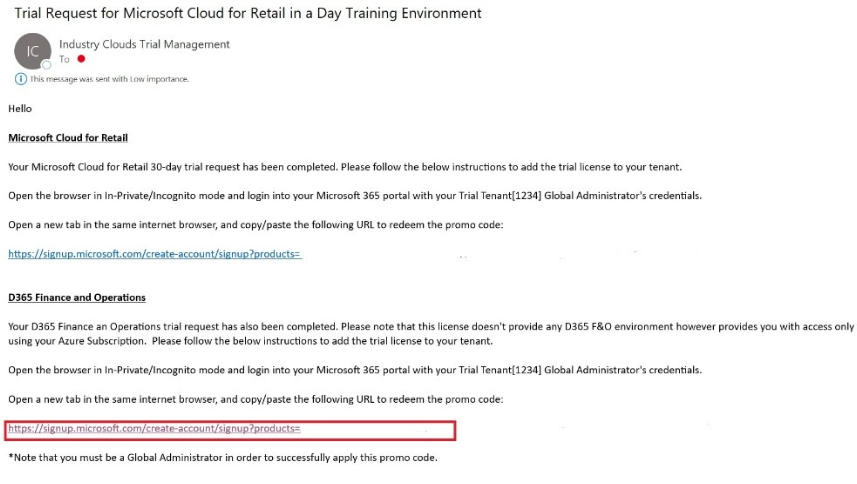](../media/trial-email.png#lightbox)

1. Select **Yes, add it to my account**.

    > [!div class="mx-imgBorder"]
    > 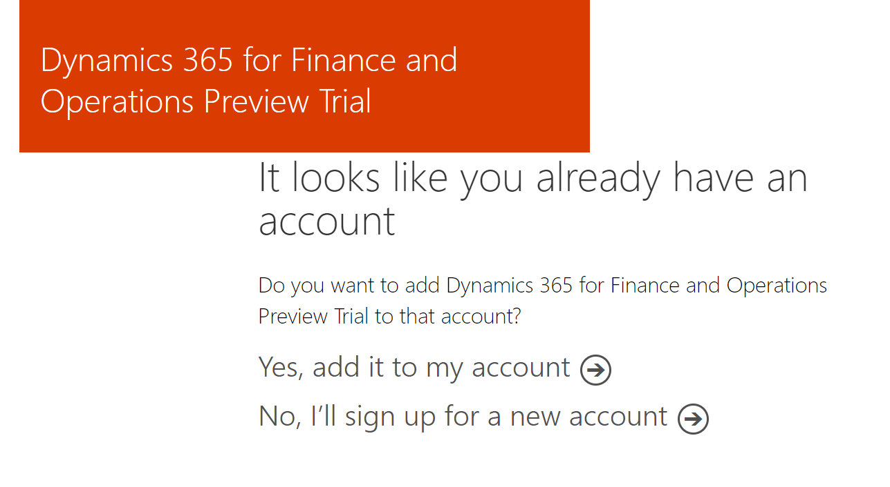

1. Confirm the order so that the trial license is applied to your tenant.

1. Sign in to [Lifecycle Services](https://lcs.dynamics.com/?azure-portal=true).

1. Select **+** on the screen to create a new project and then select **Migrate, create solutions, and learn**.

    > [!div class="mx-imgBorder"]
    > [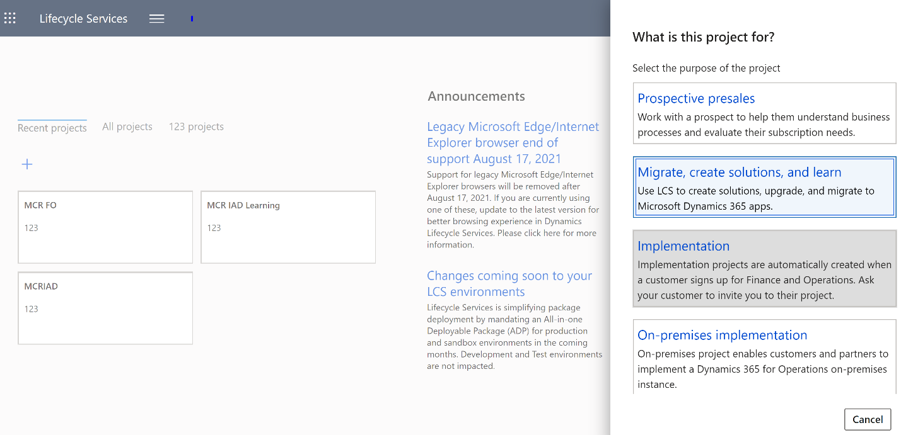](../media/migrate.png#lightbox)

1. Provide the project details as in the screenshot below:

    > [!div class="mx-imgBorder"]
    > 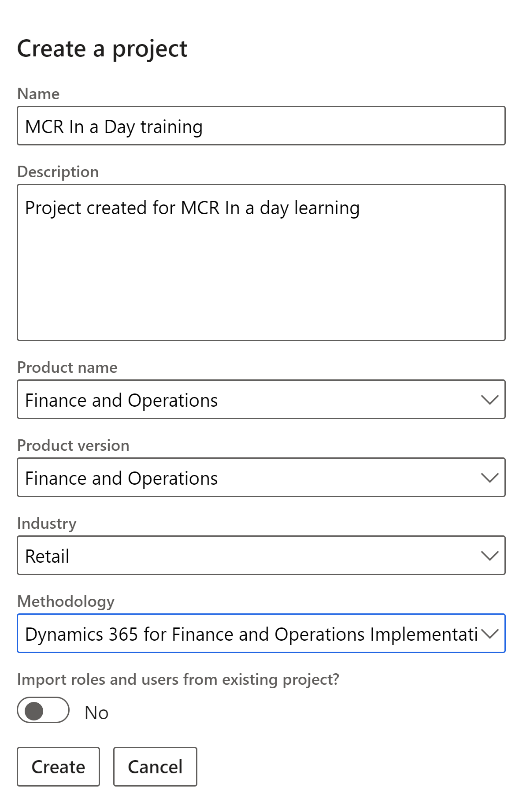

1. You should then be able to see your project.

    > [!div class="mx-imgBorder"]
    > 

1. Perform the steps mentioned in the link: [Complete the Azure Resource Manager onboarding process](/dynamics365/fin-ops-core/dev-itpro/deployment/arm-onboarding/?azure-portal=true).

1. Open your LCS Project and then select **+** to deploy a new environment.

    > [!div class="mx-imgBorder"]
    > 

1. Select the latest version of the environment (the version shown in the below screenshot is for illustration only) and then select **Next**.

    > [!div class="mx-imgBorder"]
    > 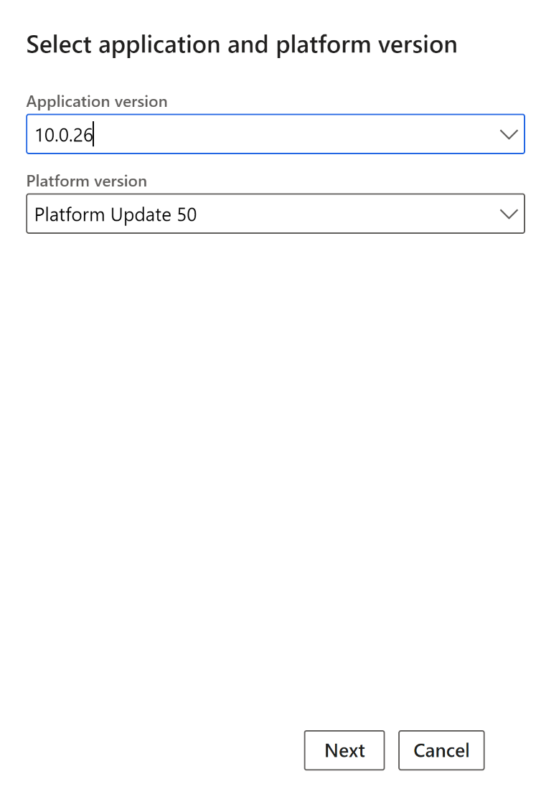

1. In the next step, select **DEMO** to create a demo environment.

    > [!div class="mx-imgBorder"]
    > [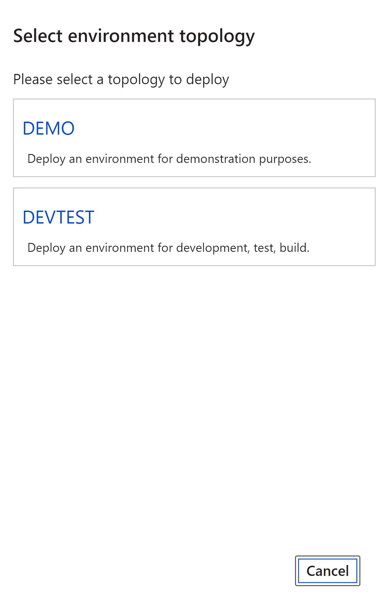](../media/demo.png#lightbox)

1. Provide an environment name, select the **Environment Size** as **E8 V3**, and then select **Advanced Settings**.

    > [!div class="mx-imgBorder"]
    > 

1. To enable dual write and create a connected Power Platform environment, in the Advanced Settings, select the **Power Platform Integration** tab, and provide the values as mentioned below:

    - **Configure Power Platform Environment**: Yes

    - **Power Platform template**: Dynamics 365 standard template

    - **Environment type**: SubscriptionBasedTrial

    > [!div class="mx-imgBorder"]
    > [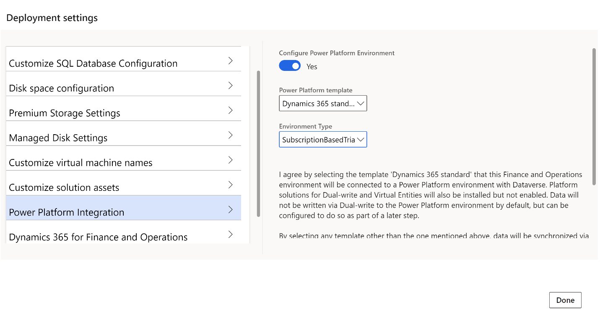](../media/deployment.png#lightbox)

1. Select the **Agree** checkbox and then select **Done**.

    > [!div class="mx-imgBorder"]
    > [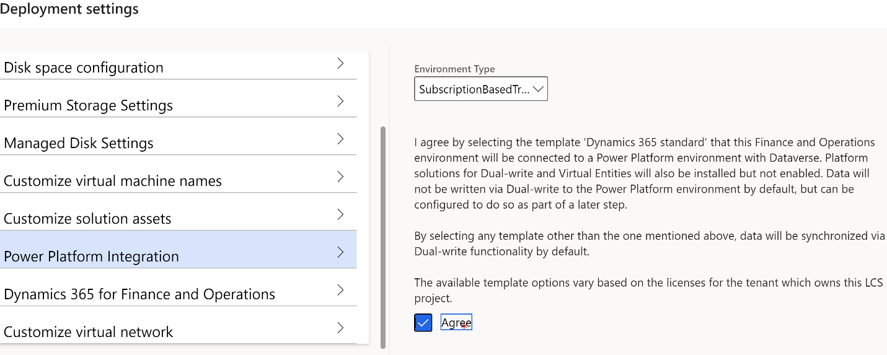](../media/deployment-2.png#lightbox)

1. Select **Deploy**. Lifecycle Services will then deploy a Dynamics 365 Finance and Operations Virtual Machine in the selected Azure subscription.

    > [!div class="mx-imgBorder"]
    > 

1. You will then notice that the environment deployment has been queued. The deployment might take four to eight hours.

    > [!div class="mx-imgBorder"]
    > [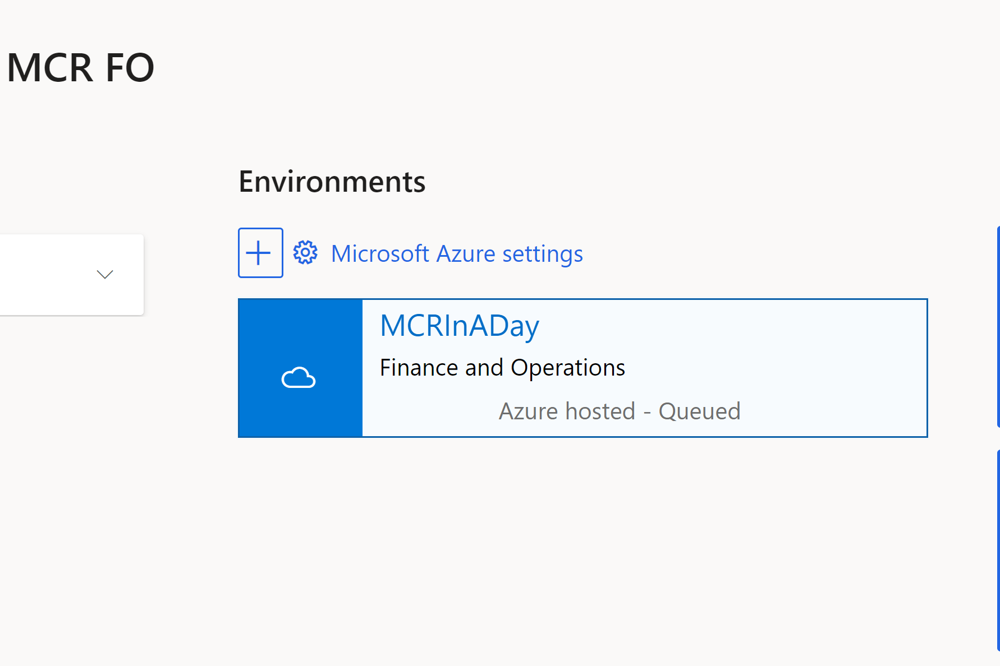](../media/deploy-environment.png#lightbox)

1. Turn off the Dynamics 365 Finance and Operations Virtual Machine when not in use to avoid consuming Azure credit. Follow the steps below to turn off the Dynamics 365 Finance and Operations environment:

    1. Select the environment in your Lifecycle Services project.

    1. Select the **Stop** button to turn off the environment.

    > [!div class="mx-imgBorder"]
    > 

## Task 5: Deploy Dynamics 365 apps

In this task, you'll install Dynamics 365 Intelligent Order Management on the newly created environment. These apps are required to do the Intelligent Order Management lab.

1. In the [Microsoft Power Platform admin center](https://admin.powerplatform.com/?azure-portal=true), expand **Resources** and go to **Dynamics 365 apps** to search for available apps at the tenant level.

    > [!div class="mx-imgBorder"]
    > 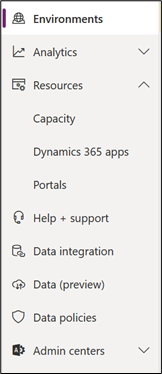

1. In the search bar in the upper right, search for **Dynamics 365 Intelligent Order Management Trial** and then select **Install**.

    > [!div class="mx-imgBorder"]
    > 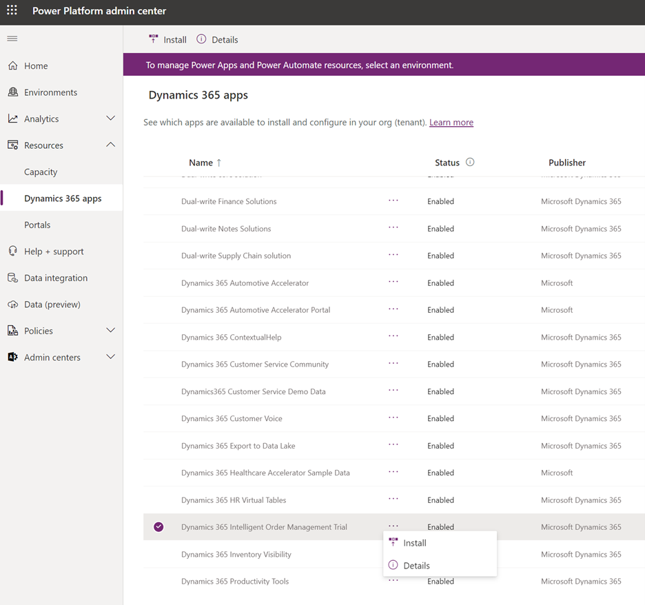

1. Select your newly created trial environment (the Power Platform connected trial environment) from the dropdown menu, agree to the terms, and select **Install**.

    > [!div class="mx-imgBorder"]
    > 

1. Return to **Dynamics 365 apps** under **Resources** and then search for **Customer Service**.

    > [!div class="mx-imgBorder"]
    > 

1. Select your newly created trial environment from the dropdown menu, agree to the terms, and then select **Install**.

    > [!div class="mx-imgBorder"]
    > 

1. Track your installations on your environment's Dynamics 365 apps page. These installations will take several hours to complete.

You successfully added the necessary trial licenses to your training environment. After they’ve finished installing, you can proceed to the next exercise to set up the remaining prerequisite applications and deploy Microsoft Cloud for Retail.
