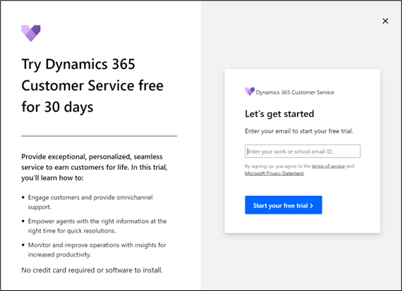
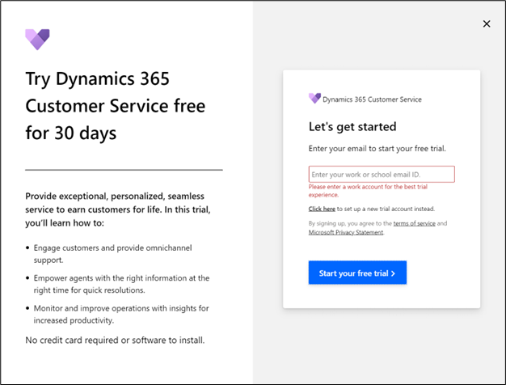
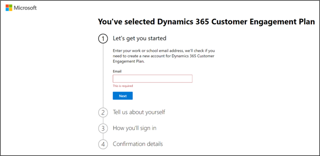
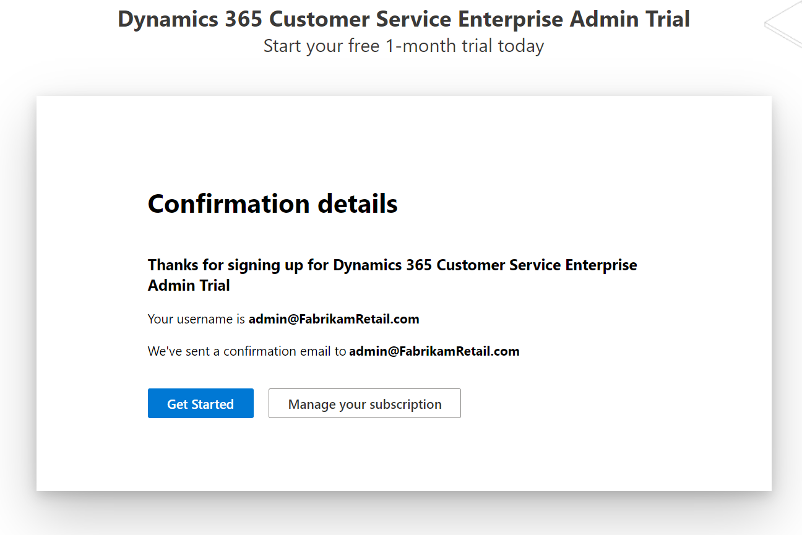

To experience Microsoft Cloud for Retail capabilities and complete this training, you’ll need to add a tenant and the prerequisite licenses.

In this exercise, you'll learn how to create a demo tenant. You can skip this exercise if you've already created a demo tenant and have added the trial licenses.

## Task: Create a Microsoft 365 tenant

In this task, you'll learn how to create a trial tenant along with the required Microsoft Dynamics 365 and Microsoft 365 trial licenses. You can skip this task if you already have a tenant.

1. Open an internet browser in In-Private or Incognito mode.

1. Go to [https://trials.dynamics.com](https://trials.dynamics.com/?azure-portal=true), scroll down, and then select **Try for free** in the **Dynamics 365 Customer Service** card.

    > [!div class="mx-imgBorder"]
    > 

1. A pop-up window will appear, asking you to enter your email to start your free trial. Leave the **Email ID** field blank and select **Start your free trial**.

    > [!div class="mx-imgBorder"]
    > 

1. An error will appear, asking you to provide a valid work or school email ID. Beneath the error, you can select a link to set up a new trial account instead. Select the **Click here to set up a new trial account instead** link.

    > [!div class="mx-imgBorder"]
    > 

1. A new account creation flow will display for Dynamics 365 Customer Engagement Plan. Get started by entering your email address.

    > [!div class="mx-imgBorder"]
    > 

1. If the email is already using other Microsoft services, you’ll receive the following warning:

    "Looks like you're already using *email* with another Microsoft service. Sign in to use this account with this trial, or create a new account."

    Select **Create a new account instead**.

    > [!div class="mx-imgBorder"]
    > 

1. After selecting **Create a new account instead**, you’ll be asked to provide more details. Provide the necessary information. Enter a valid phone number where you can receive a text message to validate the sign-up process.  

    > [!div class="mx-imgBorder"]
    > 

1. After the verification is complete, you can request a valid domain name.  Enter a username and password and then select **Next**.

    > [!div class="mx-imgBorder"]
    > 

Your Microsoft 365 tenant should be successfully created along with the Dynamics 365 Customer Engagement Plan license that includes a Power Apps license.

   > [!div class="mx-imgBorder"]
   > 

You have successfully set up your Dynamics 365 trial environment. Next, you’ll learn how to obtain the various trial licenses that are required for this training.
