In this exercise, you'll create a trial Microsoft Azure tenant. Then, you’ll set up a trial Dynamics 365 Customer Insights - Data environment to deploy the Retail churn model.

[Dynamics 365 Customer Insights - Data](/dynamics365/customer-service/introduction-customer-service-analytics/?azure-portal=true) is a part of Microsoft's customer data platform, which helps deliver personalized customer experiences. The platform's capabilities provide insights into who your customers are and how they engage with your platform. With Customer Insights, you can unify customer data across multiple sources to get a single view of customers.

-   [Audience insights](/dynamics365/customer-insights/audience-insights/overview/?azure-portal=true) help you transform your business into a customer-centric organization. Marketing, sales, and service professionals have the insights that they need to personalize experiences. Audience insights helps you connect data from transactional, behavioral, and observational sources to create a 360-degree customer view. Accordingly, you’ll experience faster results with a customer data platform that’s designed to deliver insights that you can act on.

-   [Retail channel churn predictive model](/dynamics365/industry/retail/retail-use-churn-prediction/?azure-portal=true) is a key feature of Unified customer profile. It uses an AI-based model to help omnichannel retailers use cross-channel data to assess the chance that a customer will churn, meaning that they’ll stop actively buying.

## Task 1: Create a Customer Insights environment

In this task, you'll create a new trial Customer Insights sandbox environment. To set up **Customer intelligence** correctly, you must first create a Customer Insights sandbox environment, and then connect it to your Microsoft Dataverse environment with no data sources specified. After you’re connected, you'll go through the [Solution Center](https://solutions.microsoft.com/?azure-portal=true) to deploy **Customer intelligence** from **Unified customer profile**, specifying the Customer Insights environment that you create in this task.

1.  Open an InPrivate or Incognito window and then go to [Customer Insights](https://dynamics.microsoft.com/ai/customer-insights/?azure-portal=true). Select the **Try for free** button.

	> [!div class="mx-imgBorder"]
	> [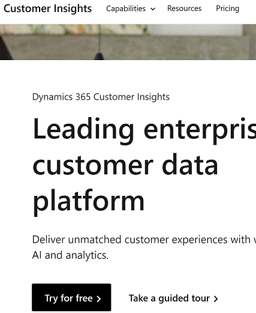](../media/customer-insights.png#lightbox)

1. Sign in with the account you've created in the training environment preparation module.

1. After sign-in, you'll have an option to choose your business. Choose Individual consumers (B-to-C)

	> [!div class="mx-imgBorder"]
	> [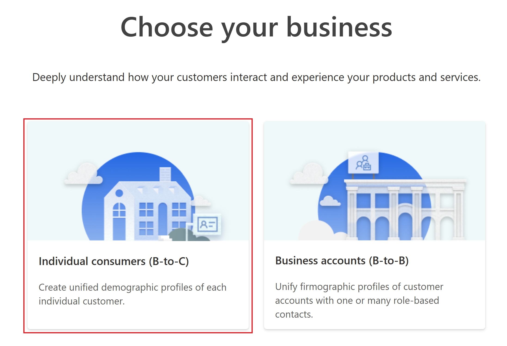](../media/audience-insights.png#lightbox)

1. In the upper-right corner of the screen, select on the **Create environment** button to create a new environment.

	> [!div class="mx-imgBorder"]
	> [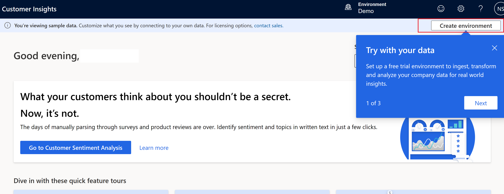](../media/new-environment.png#lightbox)

1.  Fill out the appropriate fields and then select **Next**.

    1.  **Name** - Retail Churn

    1.  **Choose your business** - Individual consumers (B-to-C)
    
    1.  **Type** - Trial

    1.  **Region** - United States 

	> [!div class="mx-imgBorder"]
	> [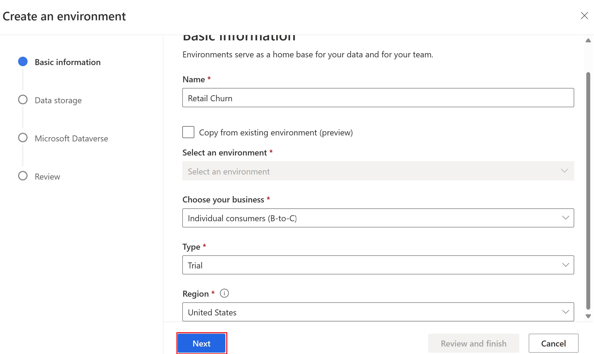](../media/environment-basic-information.png#lightbox)

1.  Select **Next** and again **Next**. In the **Microsoft Dataverse** section, select **Create a new Dataverse environment** and select **Next**.
 
	> [!div class="mx-imgBorder"]
	> [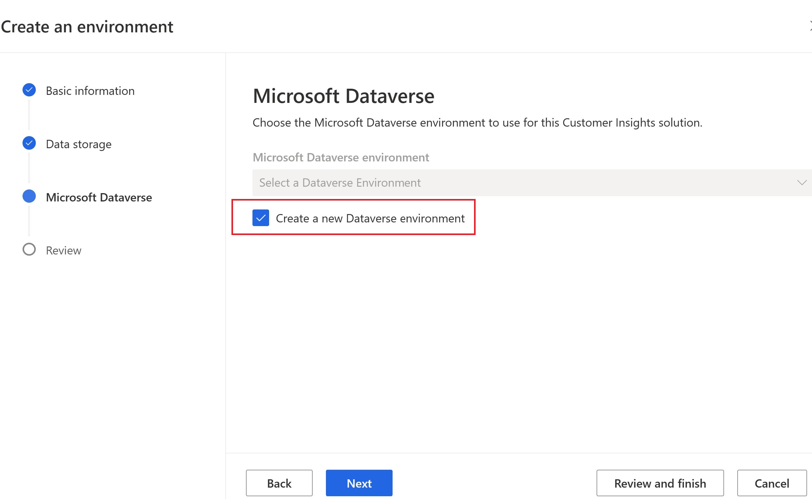](../media/review-finish.png#lightbox)

1.  In the **Review** section, select **Create**. 

	> [!div class="mx-imgBorder"]
	> [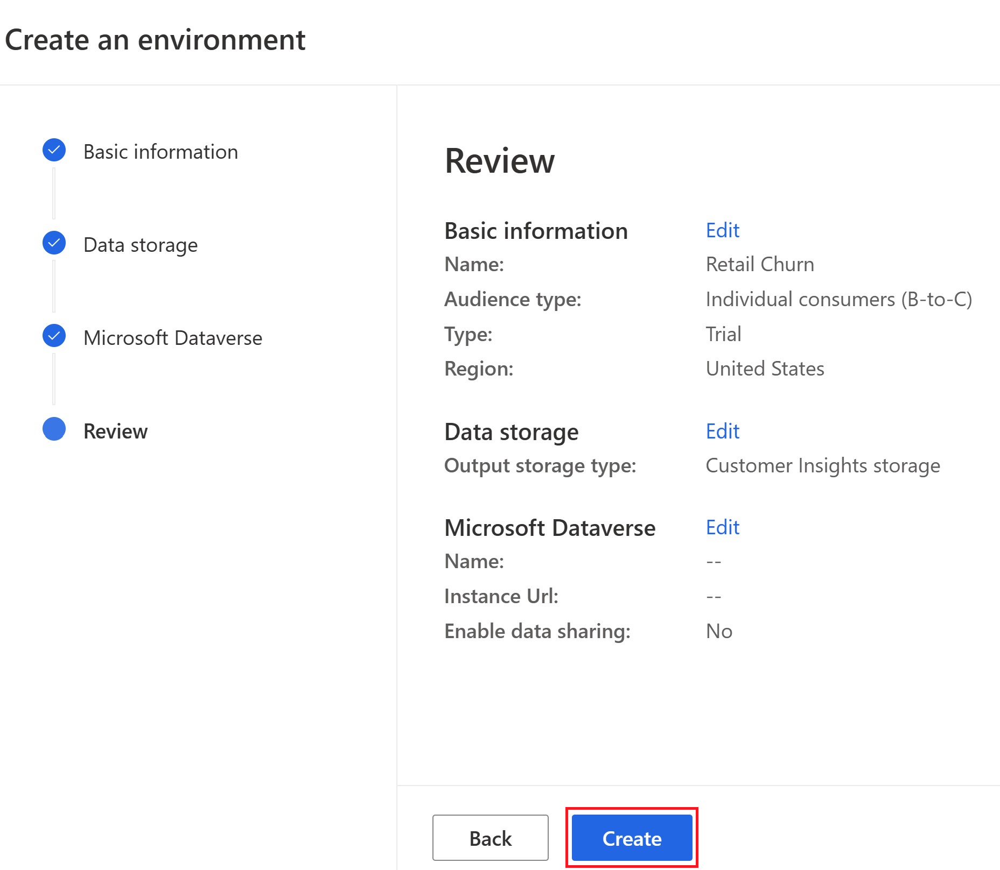](../media/create-message.png#lightbox)

    Wait for the environment to be created

    > [!div class="mx-imgBorder"]
	> [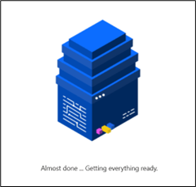](../media/environment-created.png#lightbox)

Congratulations, you’ve successfully created a Customer Insights environment.

## Task 2: Deploy the Retail channel churn model

To deploy the Retain Channel Churn Model, follow these steps:

1.  Open a new tab in your internet browser and go to the [Microsoft Cloud Solution Center](https://solutions.microsoft.com/?azure-portal=true).

1.  Expand **Retail** and go to **Unified customer profile**. 

	> [!div class="mx-imgBorder"]
	> [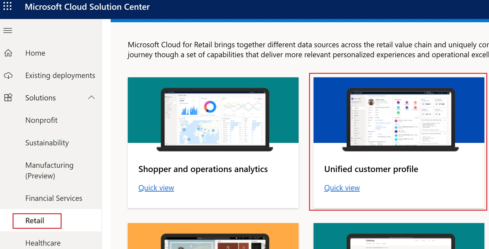](../media/unified-customer-profile.png#lightbox)

1. Select **Add** checkbox next to Retail channel churn model and then select **Deploy**.  

	> [!div class="mx-imgBorder"]
	> [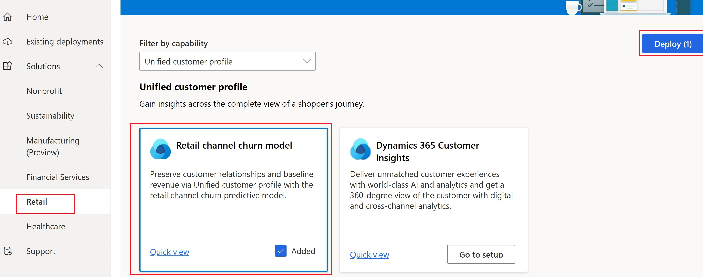](../media/customer-insights-environment.png#lightbox)

1. Select the **Customer Insights Environment** that you created in the previous task, provide a name for your deployment, and then agree to the **Terms of service**. Select **Next**.

	> [!div class="mx-imgBorder"]
	> 

1.  Select **Deploy** to deploy the Retail channel churn model to your Customer Insights environment.

	> [!div class="mx-imgBorder"]
	> [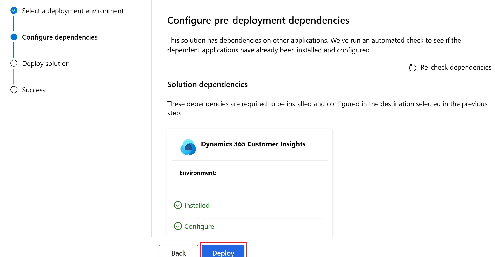](../media/deploy.png#lightbox)

    Deployment will take several minutes to complete. Once deployment is completed you'll receive an email notification.

	> [!div class="mx-imgBorder"]
	> [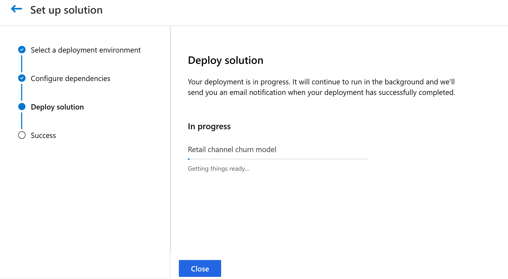](../media/deploy-status.png#lightbox)

1.  When the deployment process is complete, select **Close**.

	> [!div class="mx-imgBorder"]
	> [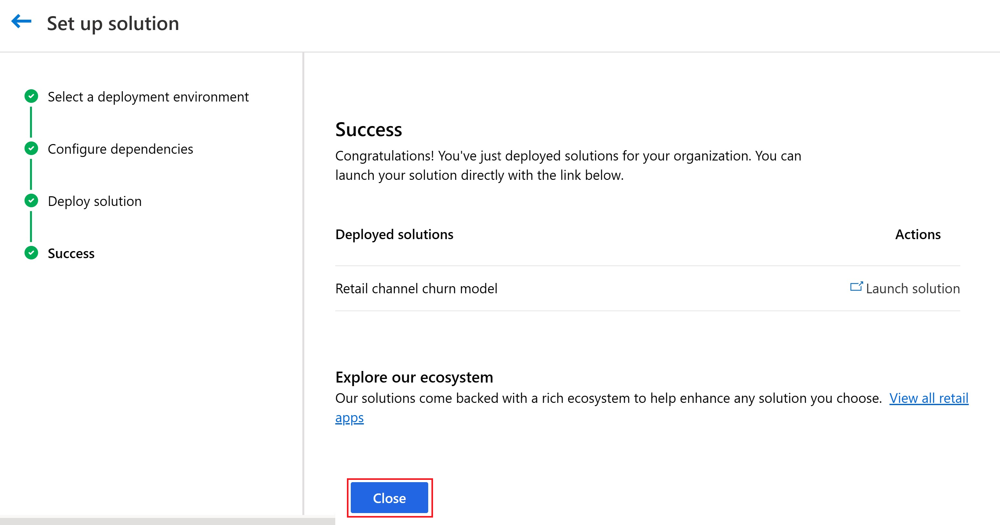](../media/close.png#lightbox)

Congratulations, you’ve successfully deployed the Retail channel churn model.
