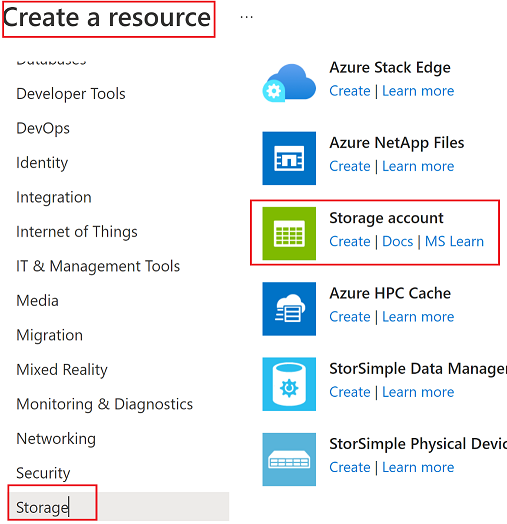
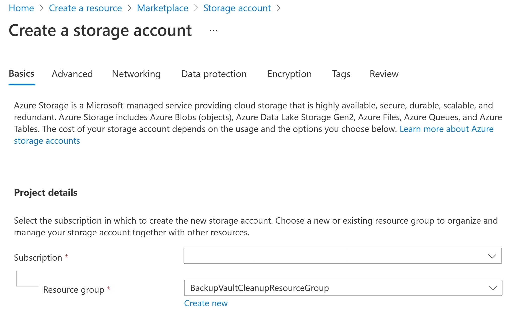
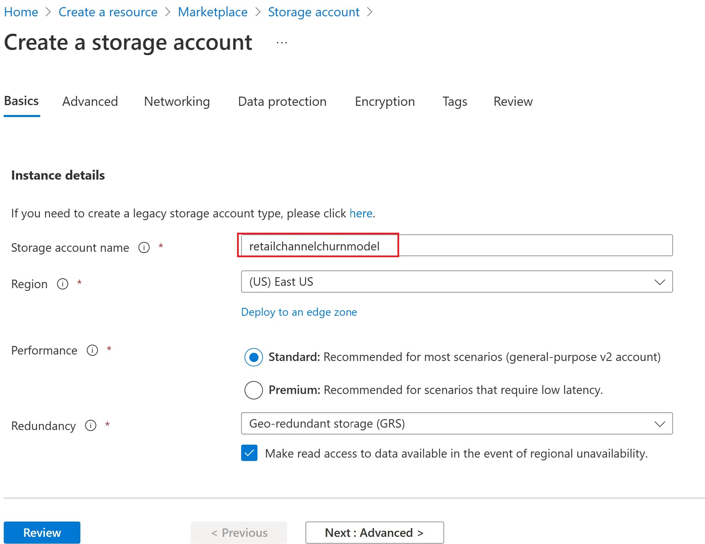
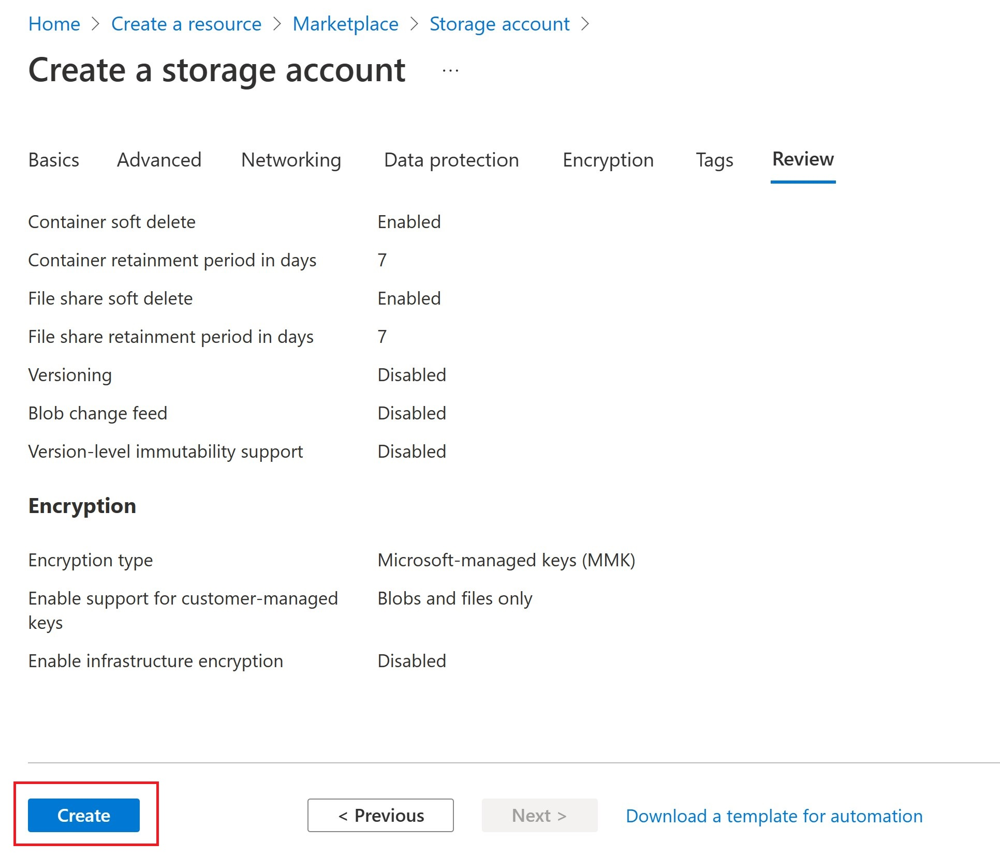
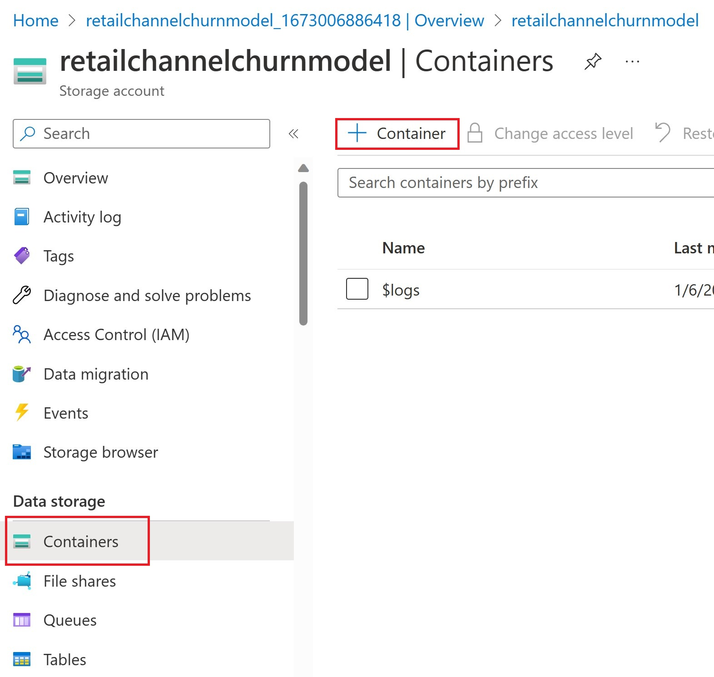
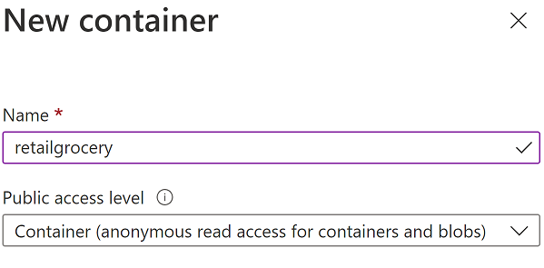
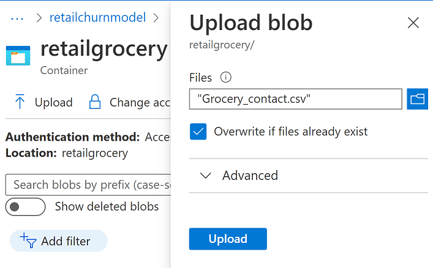
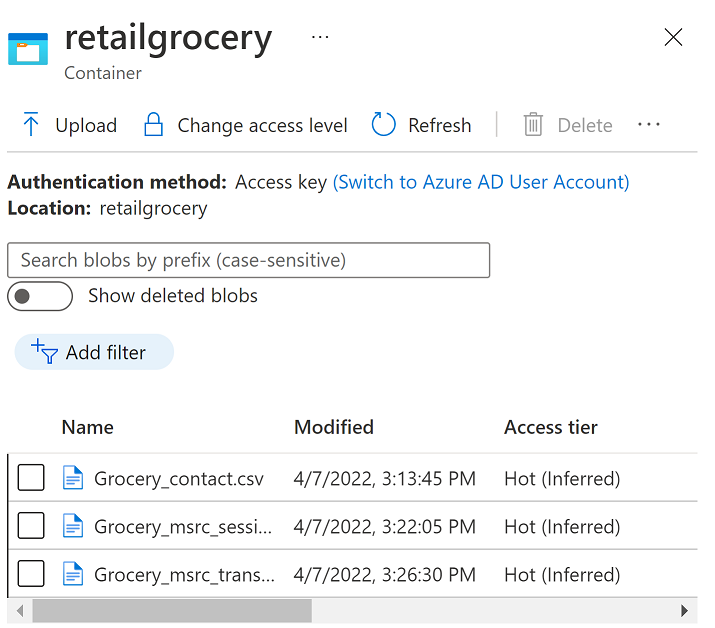

In this exercise, you'll create a storage account and a container. Further, you'll upload the sample data input files (stored in MS learn repository for this exercise) that will be used to generate data insights for the customer using the retail channel churn model.

## Task 1: Create storage account
To create a storage account, follow these steps:
1.  Go to [Microsoft Azure portal](https://ms.portal.azure.com/?azure-portal=true) and sign in with the credentials that you're using for the lab.

1.  Select **Create a resource** and then select **Storage account**.

	> [!div class="mx-imgBorder"]
	> 

1.  Select the subscription that you want to use for this lab. For the resource group, select **Create new** to create a new resource group.

	> [!div class="mx-imgBorder"]
	> 

1.  Provide a storage account name, such as **retailchannelchurnmodel**, and then select **Review**. (Note this storage account name because you’ll need it later in the exercise).

	> [!div class="mx-imgBorder"]
	> 

1. Once the validations are complete, select **Create**. 

	> [!div class="mx-imgBorder"]
	> 

## Task 2: Upload sample data input files to a container in a storage account

Follow these steps to upload sample data input files to a container in a storage account:
1.  After you’ve created the storage account, create a container in the storage account by selecting **+ Container**.

	> [!div class="mx-imgBorder"]
	> 

1.  In the **Name** dropdown menu, select **retailgrocery**, and in the **Public access level** dropdown menu, select **Container (anonymous read access for containers and blobs)**.

	> [!div class="mx-imgBorder"]
	> ]

1. Download [CSV grocery files](https://baglabspublic.azureedge.net/baglabspublic/grocery_csv_files.zip) and extract three CSV files to your local computer for use in the next step.
      
1. Upload all three files you downloaded in the previous step to the container: **Grocery_contact.csv**, **Grocery_msrc_session.csv**, and **Grocery_msrc_transaction.csv**.

	> [!div class="mx-imgBorder"]
	> 

1.  When the files have been uploaded to the blob, it will resemble the following screenshot.

	> [!div class="mx-imgBorder"]
	> 

**Congratulations**, you’ve successfully created a storage account and uploaded the sample data input files to the storage account.
